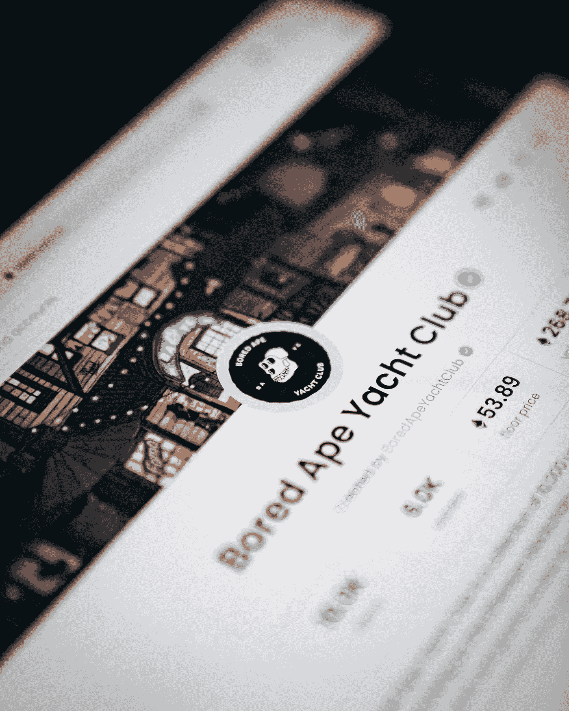

# 3 个步骤和 1 个简单的工具来创建我的第一个 NFT

> 原文：<https://medium.com/coinmonks/3-steps-and-1-simple-tool-to-create-my-first-nft-b831bcffc3bf?source=collection_archive---------11----------------------->

## 坎瓦比你想象的更有办法

Photo by [Dylan Calluy](https://unsplash.com/@dylancalluy?utm_source=medium&utm_medium=referral) on [Unsplash](https://unsplash.com?utm_source=medium&utm_medium=referral)

**免责声明 1:** *我没有创造这个 NFT 出售。我这样做是为了学习和娱乐。*

**免责声明 2:** *如果你已经知道如何创建一个钱包并将其链接到 OpenSea，请跳过前两节。*

你好，