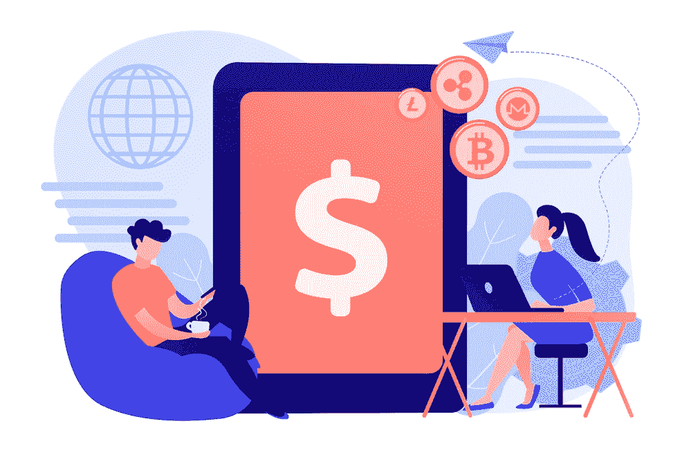

# 关于价值交换，你需要知道的 3 件令人惊讶的事情。

> 原文：<https://medium.com/coinmonks/3-surprising-things-you-need-to-know-about-valor-exchange-66da9f800033?source=collection_archive---------49----------------------->

Valor Exchange 是尼日利亚最可靠、最值得信赖的 p2p 加密交换平台。我们痴迷于让人们的加密货币更有价值。无论你是拉各斯街上的女商人还是美丽城市阿布贾的商业伙伴。在 [ValorExchange](https://account.valorexchange.com/) 有你的位置。但是，我们有一些事情要揭露。你看，我们知道一些你可能不知道的事情，我们想分享让你的生活更轻松的秘密。

你以前听说过加密货币。人们告诉你，你可以通过持有加密货币并在加密市场上卖出更高的价格来利用加密货币赚钱。但不幸的是，其中一些线人忘记提到加密货币非常不稳定。买蘸酱你可以赚钱，也可以损失几百万。

在这篇文章中，我们要告诉你的是，你可以使用加密货币，而不仅仅是一个快速致富的计划。

ValorExchange 上有如此多的加密货币的现实应用，你现在就需要看到。在本文中，我们将分享一些创造性的方法，让你可以在 [ValorExchange](https://account.valorexchange.com/login?pathname=/) 平台上免费使用你的加密货币。是的，我们说的是免费，所以不要惊讶。

**兑换:**有时候，感觉一个奈拉的价值一天天减少。如果你今天有 1000，在市场上你能用它买到的东西就更少了。那么，这对你在奈拉的毕生积蓄意味着什么？当你终于动用了你一直储存的现金，但你仍然无法支付你一直想要的东西时，会发生什么？

这就是通货膨胀的样子，Covid 恶化了它在尼日利亚的影响。有些人告诉你把奈拉换成美元，因为这种货币更强势，而且不会像奈拉那样快速贬值。这意味着你必须去银行创建一个户口。这将需要你填写表格，携带证件，找到有户口的担保人，并等待一段时间，让你的户口得到核实。做完这一切后，你需要打电话给你所有的朋友，找人买美元，或者去你当地的市场，在街上寻找货币兑换商。

有些东西我们知道你在 ValorExchange 上不知道。有一种叫做 USDT 的加密货币，实际上是美元的加密版本。我们不是在开玩笑！你看到的每一个 USDT，都有一张美钞被锁起来以保持 USDT 的价值。USDT 不像其他加密货币那样价格波动，你只需要一封电子邮件和一个电话号码就可以用你的奈拉兑换 USDT。我们告诉过你这是免费的，对吧？嗯，在 ValorExchange 上是免费的。

**转账:**您可以在 ValorExchange 上进行国内和国际转账，零费用、零限额。如果你有一个合作伙伴，孩子或你爱的人，你想寄钱给他们，无论是国内还是国际的，那么不要担心。你甚至不需要离开你的家，除了天气很热。

你只需要在 [ValorExchange](https://account.valorexchange.com/login?pathname=/) 上开两个账户，你就可以在这个平台上免费从尼日利亚向加纳、加拿大或世界任何地方汇款。不是魔法，是 ValorExchange！

**贸易:**不要害怕。您的 ValorExchange 账户是交易账户。这意味着你可以随时在账户中购买、出售或转移加密货币。我们不相信浪费你的时间，这对任何人都有好处吗？如果你想亲眼看看这个作品，那就不要再说了。创建一个[账户](https://account.valorexchange.com/)，启动你的流程，看看会发生什么。ValorExchange 快速、可靠且使用安全。

# 最后

我们知道一些你不知道的事情，我们想和你分享一切。加入我们的[电报社区](https://t.me/valorexchangecommunity)，获得最佳提示、奖金或赠品。今天就加入 ValorExchange，感受其中的不同。