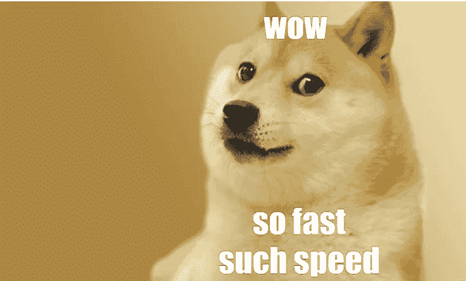

# 分散融资(DeFi)的 3 个要点

> 原文：<https://medium.com/coinmonks/3-takeaways-on-defi-983144103804?source=collection_archive---------41----------------------->

2 月是中国新年聚会的月份，也是 crypto 的迷你熊市。毫不奇怪，关于加密的讨论一次又一次地被提起。我喜欢它，因为我渴望分享我的 DeFi 经历。然而，我意识到，包括我自己在内的加密社区，一直处于我们自己的世界，因为 DeFi 对世界其他地方来说仍然是陌生的。

我在 DeFi 中最喜欢做的事情是试验 DeFi 应用程序(Dapps)。大多数 Dapps 就像传统的银行和交易所应用程序，为其用户提供金融服务。dapp 在区块链上运行，并使用加密货币进行交易，一些 dapp 甚至可以在没有任何个人或实体控制的情况下运行。

DeFi 就像是金融界的蛮荒之地，我没有资格评论安全风险。为了确保将风险降至最低，我尽量只使用锁定了高总价值的知名应用程序，并依赖 DeFi 安全和教育社区。我还注册了一个付费的加密俱乐部，以加速我的学习，并成为社区的一员，因为去西部荒野的旅程有时会很孤独。

以下是我的经历，我希望这能给你一些启发和鼓励，让你开始探索 DeFi，它可能没什么。

**1。风险与回报**

观察世界是如何进步的；我意识到自我保管资产的重要性。自我保管是加密如此强大的原因，因为它赋予资产所有权，而不会被任何人截取。这意味着对资产的独占访问和保护，使得资产所有权没有权限。

随着社会变得更加直言不讳，以及取消和唤醒文化的正常化，在现代民主世界中，意见分歧和冲突的可能性是不可避免的。冲突经常被无意识地推向极端，这可能会导致不便。把你所有的净资产放在由发行它的政府支持的法定货币上可能会有很大的风险。

撇开政治风险不谈，我们应该考虑银行风险。银行真的是无风险的，并保证保护你的钱吗？

银行风险的一些例子:

导致银行存款损失的网络钓鱼诈骗

紧急状态下银行设定的每日提款限额

银行大排长龙，自动取款机失灵

在低利率环境下，DeFi 有着巨大的激励，DeFi 目前正在让大量用户加入到加密潮流中来。如果传统金融(TradFi)失败了，DeFi 可以成为替代的金融体系。

**2。效率**

我最喜欢的 Dapps 之一是 Aave。Aave 是一个开源的非托管流动性协议，用于赚取存款和借贷资产的利息。它就像一个银行，允许你赚取存款利息，并随时借钱。获得 DeFi 贷款的唯一要求是能够提供加密资产作为抵押品，达到由 Aave 协议中的风险参数确定的要求水平。

幸运的是，或者不幸的是，我在探索 DeFi 的同时，正在安排一家实体银行的贷款。我有机会比较了通过 TradFi 和 DeFi 获得贷款的情况。有趣的事实是，银行的品牌使命是“人性化银行”。这更加巩固了“人类 vs 代码”的对比。

在传统银行安排贷款很麻烦。来来回回过了 2 个月，银行还没有批准我的申请。

另一方面，借用 Aave 不到 10 分钟，这取决于你与 Aave 互动的熟练程度。首先，您批准并将您的资产存入 Aave，然后您从 Aave 借入您选择的资产。瞧啊。不到 10 分钟你就有违约贷款了。

DeFi 中的大多数服务几乎可以立即完成。有了 DeFi 的这种产品，TradFi 面临着巨大的破坏。我已经很期待 Aave v3 了。

**3。机会均等**

DeFi loan 不会根据你的背景或就业状况来判断你的借款资格。DeFi 不像我们现有的财务系统那样进行任意评估。如果你有足够的资产抵押，你的违约贷款将被批准。

借贷可能只是与平等机会有关的一个例子。有一套金融服务，如保险、投资和交易，允许个人获得保险、获得资本和复合财富，而没有银行账户的人可能无法获得这些服务。

同样，在 TradFi 领域，机构投资者和合格投资者的待遇与普通投资者不同。机构投资者和合格投资者有机会参与普通投资者无法参与的产品和金融安排。然而，DeFi 正在通过创建一个更加开放和透明的金融系统来慢慢改变金融的未来。

从最近的世界事件中可以看出，互联网货币的叙述越来越强。我们不知道未来会发生什么，但 DeFi 确实是一个游戏改变者。

感谢阅读，敬请关注更多 DeFi 内容！

*作为我的新年决心的一部分，我将分享我的加密和 DeFi 经历，以讲述由我工作中的朋友们启发的更好的故事&。*

*免费加密&股票连同推荐启动你的旅程:*[*https://docs . Google . com/spreadsheets/d/1 f2bx-xkvmezorxdzqavgckina 1 PME _ uI9pa _ c4l 4-DM/edit？usp =分享*](https://docs.google.com/spreadsheets/d/1f2bX-xKvmEzOrxDZqAvgCkIna1pmE_uI9pa_C4l4-DM/edit?usp=sharing)

> 加入 Coinmonks [电报频道](https://t.me/coincodecap)和 [Youtube 频道](https://www.youtube.com/c/coinmonks/videos)了解加密交易和投资

# 另外，阅读

*   [用信用卡购买密码的 10 个最佳地点](https://coincodecap.com/buy-crypto-with-credit-card)
*   [最佳卡达诺钱包](https://coincodecap.com/best-cardano-wallets) | [Bingbon 副本交易](https://coincodecap.com/bingbon-copy-trading)
*   [印度最佳 P2P 加密交易所](https://coincodecap.com/p2p-crypto-exchanges-in-india) | [柴犬钱包](https://coincodecap.com/baby-shiba-inu-wallets)
*   [八大加密附属计划](https://coincodecap.com/crypto-affiliate-programs) | [eToro vs 比特币基地](https://coincodecap.com/etoro-vs-coinbase)
*   [最佳以太坊钱包](https://coincodecap.com/best-ethereum-wallets) | [电报上的加密货币机器人](https://coincodecap.com/telegram-crypto-bots)