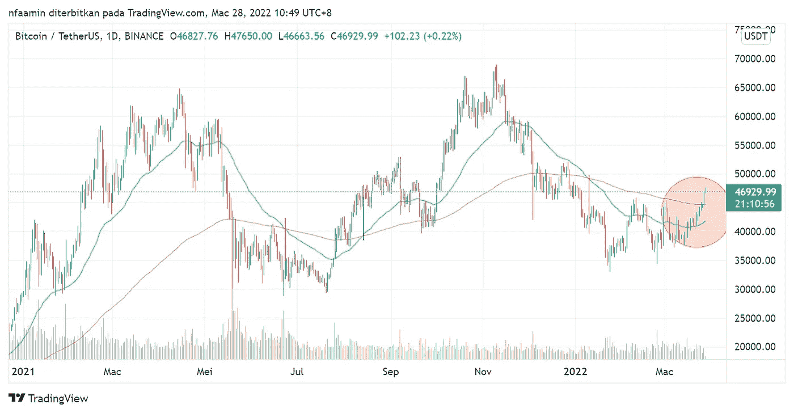

# 在交易中使用均线的 3 种方法(以 BTC 为例)

> 原文：<https://medium.com/coinmonks/3-ways-to-use-ema-in-trading-a9fb9e27bf56?source=collection_archive---------29----------------------->

Photo by [Behnam Norouzi](https://unsplash.com/@behy_studio?utm_source=unsplash&utm_medium=referral&utm_content=creditCopyText) on [Unsplash](https://unsplash.com/s/photos/crypto?utm_source=unsplash&utm_medium=referral&utm_content=creditCopyText)

如果可以的话，我想说均线是交易者最好的朋友。我从来没有听说过哪个交易者在他们的技术分析中不使用任何均线。

有很多方法可以使用它，这完全取决于你的交易风格。最好专注于真正适合自己的那几个，而不是过度分析图表。我总说技术分析太多会把自己搞糊涂。

请注意，这不是财务建议。这里分享的一切仅用于教育目的。在投资之前，你必须自己做研究。我不会对你的任何投资负责。

> 在今天的话题中，我将分享**在交易中使用指数移动平均线(EMA)** 的 3 种方法，以及对当前$BTC 周期分析的额外分析(你想看这部分)

1.  买卖信号
2.  支持和抵抗
3.  市场周期分析

但是首先，

**什么是 EMA？**

根据 Investopedia，*“指数移动平均线(EMA)是一种移动平均线(* [*MA*](https://www.investopedia.com/terms/m/movingaverage.asp) *)，它对最近的数据点赋予更大的权重和重要性。”*

与其他类型的均线相比，均线更平滑，更接近价格。

**常用 EMA**

1.  EMA 9
2.  EMA 20
3.  EMA 50
4.  EMA 100
5.  EMA 200

**常用的多个 EMA**

1.  1950 年 9 月 20 日
2.  均线 20/50/200
3.  EMA 50/200

使用的均线取决于交易风格。问问自己是不是在做波段交易？你在剥头皮吗？你是日内交易吗？多重均线最好用来减少噪音，避免假信号。我会在另一篇文章中详细讨论多重均线。

**EMA 的 3 种使用方法**

1.  ***买入&卖出信号***

总之， ***如果$向上穿越均线，买入。如果%向下穿过均线，卖出。在下面的图表中，我用均线 50 来说明如何用均线作为买卖信号。***

EMA 50 as buy & sell signal on BTC Daily chart

看起来容易，实际上并不容易。你有足够的信心用均线作为买入信号吗？最好用 RSI/MACD 或蜡烛线等其他指标来确认。多重确认更好避免假信号。

**2。支撑和阻力和**

均线也作为支撑和阻力，取决于它在图表中的位置。当**价格在均线**上方交易时，均线作为**支撑**。当价格在均线下方**交易时，均线作为**阻力****

EMA 50 as support and resistance on BTC Daily chart

***3。周期分析***

均线有助于表明硬币的周期。任何市场都有 4 个周期,即积累、上涨、分配和下跌。最好了解阶段，这样你就不会逆流而上。

**积累** —价格已经见底&不等。

**涨价**——价格上涨

**分销**——高峰期销售

**下降趋势** —价格下降

如此循环往复。

**均线如何帮助决定周期？**

为此，您将使用多个均线。更具体地说是 EMA50/200 对。我个人几乎总是用这双。

1.  **累积** — **$在底部**，在均线 50/200 的**区间交易。**
2.  **在**均线 50/200 上方标出—**。 **EMA 50 交叉上涨 EMA200** 。(回调时进场)**
3.  **分配** — $在**顶点**，**拉锯** EMA50。均线 50 开始到达**平台**并向下运行。
4.  **下跌趋势**——美元交易**低于** **EMA50/200。均线 50/200 向下。**

那么，了解周期阶段有什么帮助呢？

它帮助你了解趋势。趋势是你最好的朋友。永远不要和你最好的朋友作对。

在**积累**中，价格不会移动很多。最好是**避免在这个阶段进入**。在它表现出任何动作之前，你可能会被它卡住一段时间。

在**标记为**的阶段，**走长**。等待 EMA 线上的**拉回&进入**。**在均线**下方设置 3%的止损，并随着价格的上涨而上涨(**跟踪止损**)。

在**分配**阶段，进入任何位置都是有相当**风险的**。最好在加价阶段找到另一枚硬币。

在**下跌趋势**，**做空**如果你熟悉的话。我偏向做多，所以做空任何币都不是我的交易风格。

请注意，所有这些信息也可以在短时间内应用于日内交易或刷单。

**$BTC 现阶段分析**

我将指出几件事，让你决定$BTC 目前处于哪个阶段。

让我们来看看$BTC 目前的日线图。似乎 EMA50 和 EMA200 的价格都突破了。均线 50 也停止下跌，开始向上。

如果我们看到 EMA50 向上，并与 EMA200 交叉，那么上涨趋势即将到来。

> 现在，让我们看看价格历史。因为历史往往会重演，即使是在交易中。

$BTC previous price history

以前，$BTC 也有同样的情况。去年 8 月，BTC 突破了均线 50 和 200。$BTC 在上涨到历史最高点之前测试了两条均线的支撑。

**最好的进场区域——在均线上等待 BTC 的回调。**

**结论**

EMA 听起来看起来很简单，但是它是一个有用的指标。一旦你掌握了它，你就可以看到可能的支撑和阻力，或者只需简单浏览一下你的图表就可以看到买卖。你必须首先知道你的交易风格，找到最适合你的均线组合。

> 加入 Coinmonks [电报频道](https://t.me/coincodecap)和 [Youtube 频道](https://www.youtube.com/c/coinmonks/videos)了解加密交易和投资

# 另外，阅读

*   [3 商业评论](/coinmonks/3commas-review-an-excellent-crypto-trading-bot-2020-1313a58bec92) | [Pionex 评论](https://coincodecap.com/pionex-review-exchange-with-crypto-trading-bot) | [Coinrule 评论](/coinmonks/coinrule-review-2021-a-beginner-friendly-crypto-trading-bot-daf0504848ba)
*   [莱杰 vs Ngrave](/coinmonks/ledger-vs-ngrave-zero-7e40f0c1d694) | [莱杰 nano s vs x](/coinmonks/ledger-nano-s-vs-x-battery-hardware-price-storage-59a6663fe3b0) | [币安评论](/coinmonks/binance-review-ee10d3bf3b6e)
*   [Bybit Exchange 审查](/coinmonks/bybit-exchange-review-dbd570019b71) | [Bityard 审查](https://coincodecap.com/bityard-reivew) | [Jet-Bot 审查](https://coincodecap.com/jet-bot-review)
*   [3 commas vs crypto hopper](/coinmonks/3commas-vs-pionex-vs-cryptohopper-best-crypto-bot-6a98d2baa203)|[赚取加密利息](/coinmonks/earn-crypto-interest-b10b810fdda3)
*   最好的比特币[硬件钱包](/coinmonks/hardware-wallets-dfa1211730c6) | [BitBox02 回顾](/coinmonks/bitbox02-review-your-swiss-bitcoin-hardware-wallet-c36c88fff29)