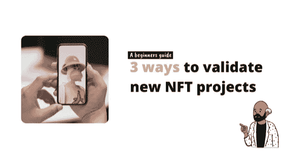

# 3 种方法来验证新的 NFT 项目，并避免这些骗子！

> 原文：<https://medium.com/coinmonks/3-ways-to-verify-new-nft-projects-and-avoid-those-scammers-8c44cc3ff82?source=collection_archive---------4----------------------->

## 日常人类指南

## 明智地选择你的 JPEGS 文件…

让我们来谈谈如何在 NFT 世界不被骗。

俗话说，哪里有钱赚，哪里就有麻烦。 现在，我真的不确定那是一句谚语还是我自己想出来的？尽管如此，它适用于本文。

2021 年(从早期看是 22 年)是 NFT 艺术大爆发的一年。

这让我想起了上世纪 90 年代末的互联网热潮，当时每个人和他们的狗都试图购买一个. com 域名，认为这会让他们成为亿万富翁。在这段时间里，成千上万的公司第一次出现在数字世界，试图向你推销一切。

人们很兴奋，资金在短时间内到处流动，每个人都认为自己将成为下一个互联网百万富翁。但是，泡沫破灭了，99%的公司消失了，只剩下少数我们今天知道的谷歌，易趣，雅虎(勉强支撑！)等。

我并不是说这将发生在 NFT 艺术界，但我也不是说它不会。我们这里肯定有类似的主题。现在市场很火爆，你可能想把你一生的积蓄都投入到一堆 jpegs 图片中，来给你的朋友留下深刻印象。然而，在这里缩小并评估更大的画面也是很好的。

在过去的 12 个月里，nft 对艺术的关注(记住，NFT 不仅仅是数字艺术，它不仅仅是与艺术相关的技术)已经成为一种另类投资资产。因此，自然地，我们中的更多人想要分一杯羹。

> 现在，NFT 的艺术竞技场就像是蛮荒的西部。就像网络热潮一样，我们到处都有项目冒出来，每个人都在出售自己能创造的任何视觉产品。

如果你正在进入这个领域，并想帮助自己不被骗(**此处声明:** *)不是财务建议，也不能保证你不会被骗！运用常识朋友们*)我们在对这个成长中的行业进行了几天的研究后，总结出了这些建议，它们可以帮助你。

***看看这个 3 步标准，帮你评估一个合法的项目*** ⬇️

# #1:品牌形象、社交媒体和社区

就像不把我们的钱花在那个电子商务网站上一样，它看起来像是 1998 年建立的，用来购买我们最新的咖啡。我们需要用同样怀疑的目光来评估 NFT 项目的品牌、社会存在和社区。

一些最简单的方法来评估你没有在看地毯拉手，这些方法包括:

## ***审核项目社交媒体账号***

我们想看看项目在哪里分享他们的信息，以建立他们的存在并与社区互动。

常见的有 Twitter，Insta，当然还有 mighty Discord。

在这些频道上，我们希望查看一些指标，如**账号年龄**(他们活跃了多长时间)**帖子数量**(我发现一个一天发几次帖子的人吸引了太多的关注)**谁在分享和参与他们的帖子？**(这些是真人还是他们购买的社交机器人大军？你通常可以看出每次一个帖子掉下来，是不是同一批人评论了同一篇文章。

## ***不和谐发现***

我们的下一站是自称的 NFT 和游戏社区之地。

许多项目使用 Discord 作为验证他们项目的地方，并建立社区来推销他们的工作和购买产品。在这里，我们可以做一个小小的发现，看看是否有任何东西引起了我们多疑的河马眼睛的警觉。

还是那句话，类似于社交渠道，我们要看帖子的量和质。**项目团队分享了什么？**高质量的内容还是关于“需要创造并成为这个改变生活的项目的一部分”的老一套信息？

也要关注社区互动。我们看到的是真人对话还是机器人对话？很多很多的机器人？

## ***观众***

好吧，到目前为止我还没有提到任何关于追随者的事情，但是我这么做是有原因的！

你看，通过购买所有平台上的假账户和机器人，可以很容易地操纵粉丝数。这并不是说它仍然不是一个有用的度量标准。我们只是需要谨慎对待表面价值的数字。

同上，做你的研究。窥探一下观众，看看表面之下是什么样的。

# #2:项目背后的团队是谁？

这个超级重要。

我的意思是，如果一个项目背后的人看起来不合法，那么他们的项目还有什么希望？

真正让我心烦的一件事是当团队隐藏在虚构的名字和虚拟角色后面的时候(我没有忘记大多数数字世界通常都是这样做的)。我不是说这是项目上的一个巨大的红色标记，但就个人而言，当你要求我为你的工作交出一大笔现金时，我喜欢透明。

我们想做的是更多地了解项目的创作者团队。他们是谁？他们以前做过什么？他们在你研究的项目中的任务是什么？

社交媒体再次成为你的侦探工具。 对团队做自己的研究。浏览 Twitterverse、LinkedIn 和任何你能找到的东西，了解更多关于他们的信息。

这不需要很长时间，并使您能够避免淘汰许多无用的项目，只是绝望地抓住你的现金，逃离现场。

另外，重要的一点是…

> ***警惕名人创立和代言的项目。*** 每个人都想在这个炙手可热的空间里快速赚钱，甚至那些可能对区块链世界一无所知或毫无兴趣的人(是的，我正在看着你奥兹·奥斯朋和你的秘密蝙蝠)。

仅仅因为你在屏幕上看到的某人支持一个项目，并不意味着它是合法的、好的或者当市场变冷时会继续存在。

所以，尽你所能保持理性，做你的研究，评估项目的基本原则，而不是有多少名人通过试图让你入股来赚快钱。

# #3:网站告诉我们什么？

现在，这更像是我们已经使用了 20 多年的经典验证方法，**确定供应商网站的范围。**

就像你在研究任何一家有业务往来的公司时一样，你会检查他们网站的外观和感觉。这(以及如今的社交媒体)是我们作为买家了解公司提供的产品和服务的橱窗。

*当我们谈论 NFT 艺术时，这里有一些我们想要寻找的东西:*

*   网站看起来像什么？它有一些专业的努力，还是一些奇怪的 tumblr 注入？
*   它会分享关于创始人和更广泛团队的信息吗？
*   它是否展示了一个充实的路线图，说明了该项目从现在起一年后要实现的目标？
*   它是否列出了项目的用例？有没有提到未来，那个任务和你有联系吗？
*   你喜欢这个产品吗？如果你把这看作是一种投资资产，可以快速赚钱，那就跳过这一步。然而，如果你是一个艺术收藏家，这个产品吸引你吗？

# 真实的谈话

即使你遵循了以上所有的方法，也并不意味着你就要有所收获或者要中大奖了。

就像任何热点市场一样，这也将会过去，许多人将会剩下一文不值的资产。很少一部分人会幸免于难，就像亚马逊和谷歌在 90 年代末的遭遇一样，所以要对自己真实一点。

无论如何，这是我对 NFT 艺术项目的 2 美分。希望这有所帮助，并在评论中分享你自己的想法。

# 更多来自我

[Crypto 如何在不到两年的时间里成为主流](https://medium.datadriveninvestor.com/how-crypto-went-mainstream-in-less-than-two-years-b492dabced19)

NFT 解释道:买不起整个 NFT？只买一个零件代替

# 重要的🚨

我不是财务顾问、心理学家或任何被认可的专业人士。因此，这不是财务建议，我没有资格或许可提供任何类似的东西。这些内容是一群来自人类同胞的想法，仅用于教育目的——仅此而已。

> 加入 Coinmonks [电报频道](https://t.me/coincodecap)和 [Youtube 频道](https://www.youtube.com/c/coinmonks/videos)了解加密交易和投资

# 另外，阅读

*   《XT.COM 评论》|
*   [SmithBot 评论](https://coincodecap.com/smithbot-review) | [4 款最佳免费开源交易机器人](https://coincodecap.com/free-open-source-trading-bots)
*   [比特币基地僵尸工具](/coinmonks/coinbase-bots-ac6359e897f3) | [AscendEX 审查](/coinmonks/ascendex-review-53e829cf75fa) | [OKEx 交易僵尸工具](/coinmonks/okex-trading-bots-234920f61e60)
*   [如何在印度购买比特币？](/coinmonks/buy-bitcoin-in-india-feb50ddfef94) | [瓦济克斯评论](/coinmonks/wazirx-review-5c811b074f5b)
*   [隐翅虫替代品](/coinmonks/cryptohopper-alternatives-d67287b16d27) | [HitBTC 审查](/coinmonks/hitbtc-review-c5143c5d53c2)
*   [CBET 评论](https://coincodecap.com/cbet-casino-review) | [库科恩 vs 比特币基地](https://coincodecap.com/kucoin-vs-coinbase)
*   [折叠 App 审核](https://coincodecap.com/fold-app-review) | [Kucoin 交易机器人](/coinmonks/kucoin-trading-bot-automate-your-trades-8cf0ca2138e0) | [Probit 审核](https://coincodecap.com/probit-review)
*   [如何匿名购买比特币](https://coincodecap.com/buy-bitcoin-anonymously) | [比特币现金钱包](https://coincodecap.com/bitcoin-cash-wallets)
*   [币安 vs FTX](https://coincodecap.com/binance-vs-ftx) | [最佳(SOL)索拉纳钱包](https://coincodecap.com/solana-wallets)