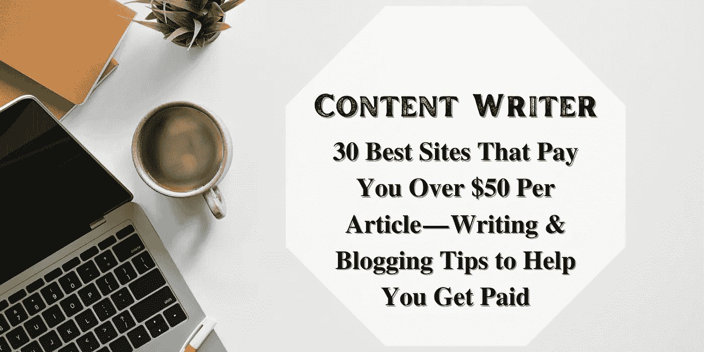
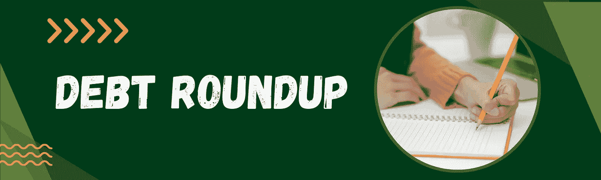
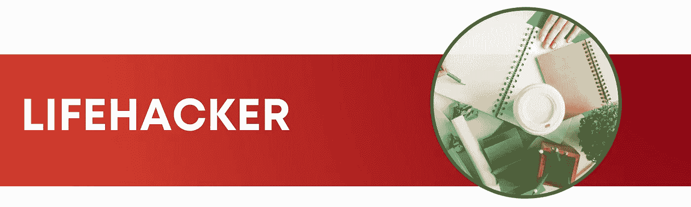

# 30 个最好的网站，每篇文章付给你超过 50 美元——写作和博客

> 原文：<https://medium.com/coinmonks/30-best-sites-that-pay-you-over-50-per-article-writing-blogging-9f5d0b1f3d42?source=collection_archive---------5----------------------->

## 30 个最好的网站，每篇文章付给你超过 50 美元——帮助你获得报酬的写作和博客技巧

你在寻找新的赚钱方法吗？写文章可以赚很多钱。事实上，很多人都以此为生。最棒的是，你不需要任何特殊技能或训练。你需要的只是一个好主意和努力工作的意愿。

30 Best Sites That Pay You Over $50 Per Article — Writing & Blogging Tips to Help You Get Paid

许多人都有一个梦想，那就是能够在家工作，通过写作赚钱。大多数人没有意识到的是，实际上有许多网站支付你每篇文章 50 多美元，有时甚至超过 100 美元！这是一个很好的方法，可以让你在按照自己的节奏工作的同时获得额外的收入。

# 记住这五个建议:

当你准备开始向网站推销文章想法时，记住几件事很重要。1).你需要确保你的推销是针对正确的出版物。

不要浪费时间向一个不发表相关文章的网站推销你的想法。2).不要向多个出版物推销同一个想法。这只会激怒编辑，不会让你有任何进展。3).确保你的推介写得很好，没有错别字。

## 1.开展研究:

Conduct Research

有很多网站会为你的写作付费，但并不是所有的网站都适合你。做一些研究，找到最适合你的风格和主题的。

## 2.遵循指南:

Follow The Guidelines

在提交任何文章之前，请仔细阅读每个网站的指南。这将有助于确保您的文章被接受，也有助于您了解每个网站正在寻找的文章类型。

## 3.协商您的价格:

Negotiate Your Rates

不要害怕协商你的价格。如果你在某个网站有良好的记录，你也许可以让他们为你的每篇文章支付更多的钱。

## 4.跟踪文章:

Keep Track Of Articles

一定要记录你提交的所有文章和你收到的付款。这将有助于你跟踪你的收入，也有助于你跟进任何逾期付款。

## 5.最后，不要放弃！

Finally, don’t give up!

靠写文章来建立一份固定的收入可能需要一些时间，但这是完全可能的。坚持下去，最终你会看到你想要的结果。

> 你最大的资产是你的赚钱能力。你最大的资源是你的时间。**布莱恩·特雷西**

你能赚多少钱取决于你的写作技巧，你的作品质量，以及对你文章的需求。

# 我已经为你做了调查

为了帮助你开始，我们收集了 30 个不同的网站，为你的写作付费。这个列表包括博客和非博客网站，所以每个人都有适合自己的东西。无论你是一个初学者还是一个有经验的作家，这个列表中的某个地方都非常适合你。

# 1.伟大主义者

Greatist — 30 Best Sites That Pay You Over $50 Per Article — Writing & Blogging Tips to Help You Get Paid

如果你是一个健康和健身博主，你可能听说过 [Greatist](https://greatist.com/) 。他们是一个致力于帮助人们过上更健康生活的网站，他们付给作者相当高的报酬——每篇文章超过 50 美元。

我个人从未为 Greatist 写过文章，但我知道有几个人写过，他们都说这是一次很棒的经历。编辑们非常乐于助人，有求必应，报酬肯定不错。

## 他们在找什么

Greatist 正在寻找属于以下三个类别之一的文章:

**健康生活:**这可以是任何东西，从锻炼技巧到健康食谱，再到关于精神健康的文章。

**爱情:**这一类是不言自明的。他们在寻找关于爱情和人际关系的文章。

**新闻&趋势:**这些是关于最新健康和健身趋势的文章。

## 如何提交文章

如果你对为 Greatist 写作感兴趣，你可以通过他们的提交表格提交一篇文章。他们确实要求你在开始为他们写作之前提交几份计划书，这样他们就能了解你的风格和你的能力。

一旦你提交了几个项目，他们批准了一个，你就可以开始写文章了。一旦完成，你将通过他们的系统提交，他们会看一看。

## 为什么是 Greatist？

如果你对健康和健身充满热情，Greatist 是一个很好的写作网站。工资很高，编辑也很帮忙。

# 2.Longreads

Longreads - 30 Best Sites That Pay You Over $50 Per Article — Writing & Blogging Tips to Help You Get Paid

如果你喜欢写作和博客，那么你一定会想去看看 [Longreads](https://longreads.com/) 。他们是一个网站，每篇文章付给作者超过 50 美元，他们总是在寻找新的内容。所以，如果你有话要说，为什么不为此获得报酬呢？

## 为什么 Longreads 是写作的好地方？

Longreads 是一个写作的好地方，因为他们付给作者很高的报酬。事实上，他们经常付给作者每篇文章 50 多美元。对于你喜欢做的事情来说，这是一大笔钱！

他们也总是在寻找新的内容，所以如果你有话要说，他们可能会有兴趣听。

## 如何入门 Longreads？

要开始阅读 Longreads，只需访问他们的网站并提交一份写作样本。一旦他们审查了你的样品，他们会让你知道你是否被接受。如果你是，那么你就可以开始写文章并获得报酬了！

## 为什么选择 Longreads？

如果你喜欢写作和写博客，那么你一定要看看 Longreads。他们是一个很棒的网站，给他们的作者很高的报酬，他们总是在寻找新的内容。所以，如果你有话要说，为什么不为此获得报酬呢？

# 3.Listverse

Listverse — 30 Best Sites That Pay You Over $50 Per Article — Writing & Blogging Tips to Help You Get Paid

Listverse 是一个为提交独特有趣列表的作者付费的网站。他们的目标是为读者提供尽可能好的内容，而且他们愿意花大价钱去得到它。

如果你是一个有创造力的思考者，有想出有趣列表的诀窍，那么 [Listverse](https://listverse.com/) 可能是你赚点外快的完美地方。

## Listverse 付多少钱？

Listverse 为每个被接受的提交支付 100 美元。如果你的单子特别好，他们甚至可能给你高达 200 美元的奖金。

## Listverse 接受什么样的列表？

Listverse 接受各种各样的列表，只要它们写得好、有趣。一些最受欢迎的话题包括历史、科学、流行文化和旅游。

要了解 Listverse 正在寻找的列表类型，请查看一些最受欢迎的文章:

*   关于语言相对论的 10 个令人难以置信的故事
*   过去的 10 个工程奇迹，今天无法建造
*   关于梦的 10 个令人难以置信的事实

## 如何向 Listverse 提交您的列表

如果你有一个你认为适合 Listverse 的列表的想法，去他们的提交页面。在那里，你会找到他们想要什么的详细解释，以及一个填写你的列表想法的表格。

如果你的想法被接受，你将被要求根据你的清单写一篇 1500 字的文章。一旦你的文章发表，你将通过贝宝收到 100 美元。

如果你正在寻找一个创造性的出口和一些额外的现金，Listverse 是一个很好的选择。他们的高报酬和广泛的可接受的话题，为名单制作人提供了一个获得报酬的好机会。

## 为什么是 Listverse？

Listverse 对于希望从工作中获得报酬的列表制作者来说是一个很好的选择。他们的高报酬和广泛的可接受的话题，为作家提供了一个额外赚钱的好机会。

# 4.盗版黑客

Copyhackers — 30 Best Sites That Pay You Over $50 Per Article — Writing & Blogging Tips to Help You Get Paid

Copyhackers 是一个为你写文章付费的网站。对于任何想通过在线写作赚钱的人来说，它们都是一个很好的资源。报酬非常好，他们为他们的作家提供了很多支持和资源。

[Copyhackers](https://copyhackers.com/) 对任何想通过在线写作赚钱的人来说都是一个伟大的网站。他们为他们的作家提供了很多支持和资源，报酬非常好。如果你正在寻找赚点外快的方法，Copyhackers 绝对值得一试。

## 复制黑客付多少钱？

Copyhackers 为你写的每篇文章支付 50 多美元。这是一个很大的比率，特别是对于一个为作者提供如此多支持和资源的网站来说。

文案黑客对文案没有具体要求，但确实更喜欢有文案经验的写手。对于任何想通过在线写作赚钱的人来说，Copyhackers 是一个很好的资源，所以如果你正在寻找一种赚点外快的方法，这绝对值得一试。

## 如何将你的名单提交给 Copyhackers？

如果你对为版权黑客写作感兴趣，第一步是提交你的想法清单。Copyhackers 总是在寻找新的有趣的想法，所以如果你有你认为合适的东西，不要犹豫提交它。

一旦你提交了名单，下一步就是等待盗版黑客的回复。他们将审阅您的列表，并决定是否有兴趣发布它。如果是的话，他们会寄给你一份合同和进一步的说明。

## 为什么是复制黑客？

对于任何想通过在线写作赚钱的人来说，Copyhackers 是一个很好的网站。他们为他们的作家提供了很多支持和资源，报酬非常好。如果你正在寻找赚点外快的方法，Copyhackers 绝对值得一试。

# 5.UX·布斯

UX Booth — 30 Best Sites That Pay You Over $50 Per Article — Writing & Blogging Tips to Help You Get Paid

用户体验(UX)是指一个人对使用特定产品、系统或服务的情绪和态度。它包括人机交互和产品所有权的实用、体验、情感、有意义和有价值的方面。此外，它还包括一个人对系统方面的看法，如实用性、易用性和效率。

UX 展台是为你在 UX 的文章付费的最好的网站之一。他们提供每篇文章 50 美元，你的文章必须至少 800 字长。他们也有一个伟大的 UX 专业人士社区，你可以联系。

所以，如果你是 UX 的专业人士或爱好者，去 UX 展位开始写作吧！

## UX·布斯付了多少钱？

UX·布斯每篇文章支付 50 美元。你的文章必须至少 800 字才能被考虑发表。

## 如何提交你的文章给 UX 展位？

如果你对为 UX·布斯写作感兴趣，第一步是提交你的文章想法。他们的网站上有一个提交表格，你可以用它来提交你的想法。

一旦你提交了你的文章想法，下一步就是等待 UX·布斯的回复。他们会审阅你的文章，并决定是否有兴趣发表。如果是的话，他们会寄给你一份合同和进一步的说明。

## 为什么为 UX·布斯写作？

对于任何想写 UX 的人来说，UX·布斯是一个很好的网站。他们为他们的作家提供了很多支持和资源，报酬非常好。如果你正在寻找赚点外快的方法，UX·布斯绝对值得一去。

# 6.破裂

Cracked — 30 Best Sites That Pay You Over $50 Per Article — Writing & Blogging Tips to Help You Get Paid

Cracked 是一个向作家支付每篇文章 50 美元或更多的网站。他们在寻找有趣话题的故事，尤其是那些 Cracked.com 独有的。

要为 Cracked 写作，你需要成为一个声音洪亮的讲故事高手。你应该能够向编辑推销你的故事，并且你应该能够自如地用喜剧风格写作。Cracked 也在寻找视频制作人和播客。

## 要求:

要为 Cracked 写作，你必须年满 18 岁。在编辑考虑你的写作职位之前，你需要向他们提交三份报告。

## 破解工资多少？

Cracked 每篇文章支付 50 多美元。出版后两周内通过 PayPal 付款。

## 如何提交你的文章给破解

要将您的文章提交给 Cracked，您需要首先创建一个用户帐户。一旦你创建了一个账户，你就可以通过网站把你的想法提交给编辑。

如果你有任何关于为 Cracked 写作的问题，你可以联系他们在 editor@cracked.com 的编辑团队。

## 为什么写破解

如果你想为 Cracked 写作，成为网站的粉丝会有所帮助。让自己熟悉他们发布的故事类型，并尝试提出与他们通常发布的故事类型相似的主题。

# 别忘了查看剩下的 24 个网站:

这是剩下的 24 个网站，你可以在那里找到高质量的写作演出，如果你正在寻找一份有报酬的作家工作，它们都是很好的起点。在我们继续之前— **请阅读下面的说明！**

互联网已经成为骗子和骗子的温床，他们想利用易受骗的人。如果你不小心，很容易陷入他们的阴谋。

这就是为什么知道不同类型的写作骗局是很重要的。知道要寻找什么，你就可以避免成为受害者。

最常见的写作骗局之一是“虚荣出版社”骗局。这是一家公司将提供出版你的书，但他们会向你收取预付款。他们也可能要求你购买一定数量的书。

另一种常见的写作骗局是“代理”骗局。这是有人会声称是一个文学代理人，并提出代表你。然而，他们通常会向你收取前期费用。

当心任何提前要钱的公司。这些通常都是骗局。

有许多合法的公司会为你的写作付钱。然而，重要的是要知道那里的骗局，这样你就不会被利用。

**让我们开始吧:**

# 7.写作生活

The Write Life — 30 Best Sites That Pay You Over $50 Per Article — Writing & Blogging Tips to Help You Get Paid

付款:每篇 100 美元

“写作生活”是一个致力于帮助作家提高写作技巧和找到有报酬工作的网站。他们接受各种主题的文章，包括商业、旅游、生活方式等等。

要了解他们在文章中寻找什么以及如何提交，请查看他们的提交指南。

# 8.便士囤积者

The Penny Hoarder — 30 Best Sites That Pay You Over $50 Per Article — Writing & Blogging Tips to Help You Get Paid

付款:每篇 75-100 美元

Penny 囤积者是一个很受欢迎的网站，涵盖了与个人理财和存钱相关的话题。他们在寻找提供实用技巧和建议的文章，比如存钱、赚钱、投资等。

如果你想为 Penny 囤积者写文章，你可以在这里提交你的观点。在提出你的想法之前，一定要仔细阅读他们的投稿指南。

# 9.斗牛士网络

Matador Network — 30 Best Sites That Pay You Over $50 Per Article — Writing & Blogging Tips to Help You Get Paid

付款:每篇 40-60 美元

斗牛士网络是一个涵盖旅游和生活方式内容的网站。他们接受各种主题的文章，包括旅游提示、目的地指南、个人故事等。

如果你有兴趣为斗牛士网络写作，看看他们的投稿指南。

# 10.名单之外

A List Apart — 30 Best Sites That Pay You Over $50 Per Article — Writing & Blogging Tips to Help You Get Paid

付款:每篇 200 美元

一个单独的列表是一个网站设计者和开发者。他们接受与网页设计和开发行业相关的各种主题的文章。

如果你想写一个单独的列表，你可以在这里提交你的想法。在提出你的想法之前，一定要仔细阅读他们的投稿指南。

# 11.写入路径

The Write Path — 30 Best Sites That Pay You Over $50 Per Article — Writing & Blogging Tips to Help You Get Paid

付款:每篇 50-100 美元

写作之路是一个为作家提供自由写作服务和课程的网站。他们也在寻找关于写作、自由职业和写作行业的文章。

如果你想为写作路径而写，可以在这里提交你的想法。在提出你的想法之前，一定要仔细阅读他们的投稿指南。

# 12.incomeschool.com

incomeschool.com — 30 Best Sites That Pay You Over $50 Per Article — Writing & Blogging Tips to Help You Get Paid

付款:每篇 75-100 美元

Income School 是一个提供如何在线赚钱的信息和资源的网站。他们在寻找关于网上赚钱的文章，包括技巧、诀窍和策略。

如果你想为收入学校写作，你可以在这里提交你的想法。在提出你的想法之前，一定要仔细阅读他们的投稿指南。

# 13.写作自由

Freedom with Writing — 30 Best Sites That Pay You Over $50 Per Article — Writing & Blogging Tips to Help You Get Paid

付款:每篇 50 美元

自由写作是一个涵盖写作行业并提供写作技巧、建议和资源的网站。他们在寻找关于写作的文章，包括自由写作、博客和出版。

如果你想用写作来为自由写作，你可以在这里提交你的想法。在提出你的想法之前，一定要仔细阅读他们的投稿指南。

# 14.基督教科学箴言报

The Christian Science Monitor — 30 Best Sites That Pay You Over $50 Per Article — Writing & Blogging Tips to Help You Get Paid

付款:每篇 200 美元

基督教科学箴言报是一个涵盖新闻、宗教和生活方式内容的网站。他们在寻找各种主题的文章，包括信仰、政治、文化等等。

如果你想为基督教科学箴言报写文章，你可以在这里提交你的想法。在提出你的想法之前，一定要仔细阅读他们的投稿指南。

# 15.平面设计学校博客

The Graphic Design School Blog — 30 Best Sites That Pay You Over $50 Per Article — Writing & Blogging Tips to Help You Get Paid

付款:每篇 50 美元

平面设计学校博客是一个提供平面设计课程和资源的网站。他们也在寻找关于平面设计、网页设计和商业设计的文章。

如果你想为平面设计学校博客写作，你可以在这里提交你的想法。在提出你的想法之前，一定要仔细阅读他们的投稿指南。

# 16.站点点

SitePoint — 30 Best Sites That Pay You Over $50 Per Article — Writing & Blogging Tips to Help You Get Paid

付款:每篇 100-150 美元

SitePoint 是一个涵盖网页设计和开发主题的网站。他们正在寻找与 web 行业相关的广泛主题的文章，包括编码、UX 设计、SEO 等等。

如果你想为 SitePoint 写作，你可以在这里提交你的想法。在提出你的想法之前，一定要仔细阅读他们的投稿指南。

# 17.洪基亚特

Hongkiat — 30 Best Sites That Pay You Over $50 Per Article — Writing & Blogging Tips to Help You Get Paid

付款:每篇 100-200 美元

Hongkiat 是一个涵盖设计和技术主题的网站。他们正在寻找与设计和技术行业相关的广泛主题的文章，包括教程、技巧和资源。

如果你想为 Hongkiat 写作，你可以在这里提交你的想法。在提出你的想法之前，一定要仔细阅读他们的投稿指南。

# 18.粉碎杂志

Smashing Magazine — 30 Best Sites That Pay You Over $50 Per Article — Writing & Blogging Tips to Help You Get Paid

付款:每篇 100-200 美元

Smashing Magazine 是一个涵盖网页设计和开发主题的网站。他们正在寻找与 web 行业相关的广泛主题的文章，包括编码、UX 设计、SEO 等等。

如果你想为 Smashing 杂志写作，你可以在这里提交你的想法。在提出你的想法之前，一定要仔细阅读他们的投稿指南。

# 19.一个可行的家

A Workable Home — 30 Best Sites That Pay You Over $50 Per Article — Writing & Blogging Tips to Help You Get Paid

付款:每篇 50-100 美元

一个可行的家是一个网站，提供在家工作的技巧和资源。他们也在寻找关于远程办公、自由职业和在家工作的文章。

如果你想写一个可行的家，你可以在这里提交你的想法。在提出你的想法之前，一定要仔细阅读他们的投稿指南。

# 20.你的理财专家

Your Money Geek — 30 Best Sites That Pay You Over $50 Per Article — Writing & Blogging Tips to Help You Get Paid

付款:每篇 50-100 美元

你的金钱极客是一个涵盖个人理财话题的网站。他们在寻找关于存钱、投资和个人理财的文章。

如果你想为你的金钱爱好者写作，你可以在这里提交你的想法。在提出你的想法之前，一定要仔细阅读他们的投稿指南。

# 21.债务综述

Debt RoundUp — 30 Best Sites That Pay You Over $50 Per Article — Writing & Blogging Tips to Help You Get Paid

付款:每篇 50-100 美元

债务综述是一个涵盖个人金融话题的网站。他们在寻找关于债务管理、信用卡和个人金融业务的文章。

如果你想写债务综述，你可以在这里提交你的想法。在提出你的想法之前，一定要仔细阅读他们的投稿指南。

# 22.生活黑客

Lifehacker — 30 Best Sites That Pay You Over $50 Per Article — Writing & Blogging Tips to Help You Get Paid

付款:每篇 100 美元

Lifehacker 是一个涵盖生产力技巧和资源的网站。他们也在寻找关于时间管理、组织和高效工作的文章。

如果你想为 Lifehacker 写作，你可以在这里提交你的想法。在提出你的想法之前，一定要仔细阅读他们的投稿指南。

# 23.MakeUseOf

MakeUseOf — 30 Best Sites That Pay You Over $50 Per Article — Writing & Blogging Tips to Help You Get Paid

付款:每篇 150-200 美元

MakeUseOf 是一个涵盖技术主题的网站。他们在寻找关于软件、应用和技术商业的文章。

如果你想为 MakeUseOf 写作，可以在这里提交你的想法。在提出你的想法之前，一定要仔细阅读他们的投稿指南。

# 24.便士囤积者

The Penny Hoarder — 30 Best Sites That Pay You Over $50 Per Article — Writing & Blogging Tips to Help You Get Paid

付款:每篇 75-100 美元

Penny 囤积者是一个涵盖个人理财话题的网站。他们在寻找关于存钱、投资和个人理财的文章。

如果你想为 Penny 囤积者写作，你可以在这里提交你的想法。在提出你的想法之前，一定要仔细阅读他们的投稿指南。

# 25.明智的面包

Wise Bread — 30 Best Sites That Pay You Over $50 Per Article — Writing & Blogging Tips to Help You Get Paid

付款:每篇 50-150 美元

Wise Bread 是一个涵盖个人理财话题的网站。他们在寻找关于存钱、投资和个人理财的文章。

如果你想为智慧面包写作，你可以在这里提交你的想法。在提出你的想法之前，一定要仔细阅读他们的投稿指南。

# 26.简单的美元

The Simple Dollar — 30 Best Sites That Pay You Over $50 Per Article — Writing & Blogging Tips to Help You Get Paid

付款:每篇 50-150 美元

Simple Dollar 是一个涵盖个人理财话题的网站。他们在寻找关于存钱、投资和个人理财的文章。

如果你想为简单的美元写作，你可以在这里提交你的想法。在提出你的想法之前，一定要仔细阅读他们的投稿指南。

# 27.金钱破坏者

Money Crashers — 30 Best Sites That Pay You Over $50 Per Article — Writing & Blogging Tips to Help You Get Paid

付款:每篇 50-100 美元

Money Crashers 是一个涵盖个人理财话题的网站。他们在寻找关于存钱、投资和个人理财的文章。

如果你想为金钱不速之客写作，你可以在这里提交你的想法。在提出你的想法之前，一定要仔细阅读他们的投稿指南。

# 28.投资者迷

Investor Junkie — 30 Best Sites That Pay You Over $50 Per Article — Writing & Blogging Tips to Help You Get Paid

付款:每篇 50-100 美元

投资者迷是一个涵盖投资和个人理财业务的网站。他们在找关于股票、债券和股票市场的文章。

如果你想为投资者写作，你可以在这里提交你的想法。在提出你的想法之前，一定要仔细阅读他们的投稿指南。

# 29.平衡

The Balance — 30 Best Sites That Pay You Over $50 Per Article — Writing & Blogging Tips to Help You Get Paid

付款:每篇 100 美元

The Balance 是一个涵盖个人理财话题的网站。他们在寻找关于存钱、投资和个人理财的文章。

如果你想为平衡而写，你可以在这里提交你的想法。在提出你的想法之前，一定要仔细阅读他们的投稿指南。

# 30.时代杂志

Time Magzine — 30 Best Sites That Pay You Over $50 Per Article — Writing & Blogging Tips to Help You Get Paid

如果你是一个写作爱好者，并且一直梦想看到自己的名字出现在报纸上，那么《时代》杂志绝对值得考虑。他们每篇文章的报酬超过 50 美元，虽然一开始看起来不多，但如果你每个月能写几篇文章的话，它肯定会增加。此外，这也是一个让你出名并建立你的投资组合的好方法。

如果你有兴趣为《时代》杂志写稿，那么一定要看看他们的投稿指南。他们很明确自己在寻找什么，所以在你提交文章之前，确保你的文章符合他们的所有要求是很重要的。但是，如果你认为你已经得到了它，那么不要犹豫，给它一个镜头！谁知道呢，你可能是他们的下一个大特写作家。

# 结论——30 个最好的网站，每篇文章能给你超过 50 美元的报酬——写作和博客

这个列表上的网站是一些为你的文章付费的最好的网站。他们都是有声望的网站，提供给他们的作者很多东西。如果你正在寻找赚外快的方法，我强烈建议你去看看这些网站。

写作是网上赚钱的好方法。这也是与世界分享你的知识和专长的好方法。如果你正在寻找一种方法来赚些外快，我希望这份 30 个最好的网站的列表能帮你找到最适合你的网站。

快乐写作！

> 加入 Coinmonks [电报频道](https://t.me/coincodecap)和 [Youtube 频道](https://www.youtube.com/c/coinmonks/videos)了解加密交易和投资

# 另外，阅读

*   [Bookmap 点评](https://coincodecap.com/bookmap-review-2021-best-trading-software) | [美国 5 大最佳加密交易所](https://coincodecap.com/crypto-exchange-usa)
*   最佳加密[硬件钱包](/coinmonks/hardware-wallets-dfa1211730c6) | [Bitbns 评论](/coinmonks/bitbns-review-38256a07e161)
*   [新加坡十大最佳加密交易所](https://coincodecap.com/crypto-exchange-in-singapore) | [购买 AXS](https://coincodecap.com/buy-axs-token)
*   [红狗赌场评论](https://coincodecap.com/red-dog-casino-review) | [Swyftx 评论](https://coincodecap.com/swyftx-review) | [CoinGate 评论](https://coincodecap.com/coingate-review)
*   [投资印度的最佳密码](https://coincodecap.com/best-crypto-to-invest-in-india-in-2021)|[WazirX P2P](https://coincodecap.com/wazirx-p2p)|[Hi Dollar Review](https://coincodecap.com/hi-dollar-review)