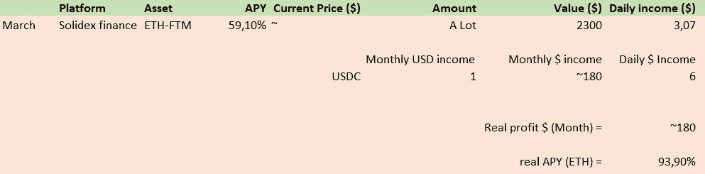
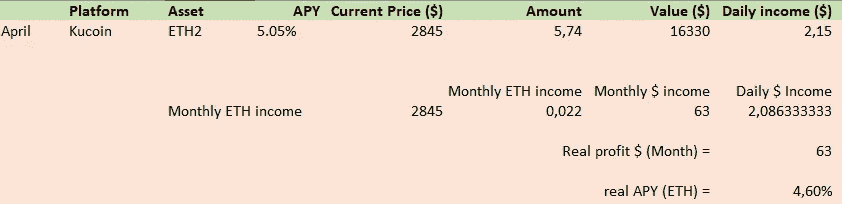
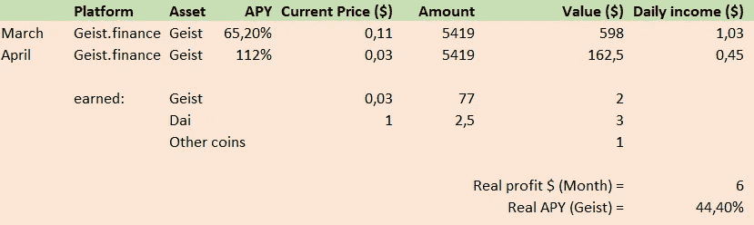
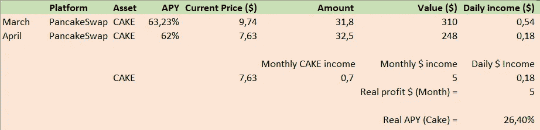
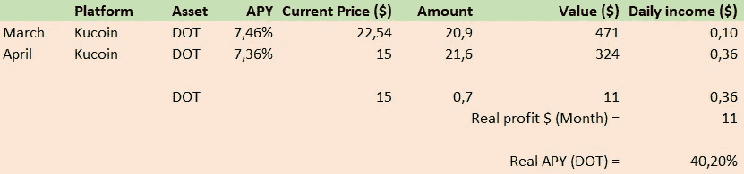
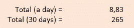

# 一个月 300 美元！我四月份的可持续被动收入流。

> 原文：<https://medium.com/coinmonks/300-a-month-my-sustainable-passive-income-streams-for-april-9d9c38621dff?source=collection_archive---------0----------------------->

## 我睡觉时创造金钱的方法。

# 介绍

嘿密码冒险家！又是新的一个月的开始，所以每个人都知道这意味着什么；重新审视我的被动收入流的表现！在这个月度系列中，我评估了我的被动收入流，并以一种非常不科学的方式观察了它们的表现。我所有的头寸都由具有实用性的可持续项目组成！因此，没有重标、庞氏骗局或其他不可持续的项目承诺好得难以置信的投资回报。

这个月我在列表中增加了一个新条目，虽然现在看它在一个月内的表现还为时过早，但我们已经可以看到一些非常好的结果了！此外，我将简要回顾我所有的立场，并给出一些背景，也许还有一些额外的值得一提的信息，当你想复制我的策略时，你必须知道！

如果你是密码新手，想在没有初始投资的情况下开始，读读[这个讲述零投资策略的故事](/coinmonks/6-ways-to-create-a-sustainable-passive-income-stream-today-15aab0863fad?source=user_profile---------0----------------------------)！

## 帮我选择下个月的投资！

由于我想以一种更好的方式让我的读者参与进来，而不仅仅是回应 DM 和评论，我想邀请他们为我选择下个月的被动收入投资！**我请你向我推荐一枚硬币或一个项目，我将投资 300 美元在最高票数的选项上！**

# 结果

我目前参与了 5 个值得一提的项目，利率在 5%到 200%之间。我的投资组合主要集中在以太坊，波尔卡多特，艾斯特金融，蛋糕，最近也在 ETH-FTM LP，我正试图获得尽可能多的可持续流动！在 crypto 中，你必须记住更高并不总是更好，因为高收益和快速 ROI 的承诺并不总是真实的。不管怎样，让我们来看看这个月的结果吧！

## ETH-FTM 流动性头寸

ETH-FTM pool on solidex finance.

本月的概述中的新内容是我在 Solidex finance 上开设的 ETH-FTM 流动性供应商职位！我对此非常兴奋，因为它看起来像一个中等风险的选择，有很大的回报！它支付约 60-100% APY 的固体和性代币作为奖励，这些代币可以出售或用于投票。可悲的是，FTM 遭受了巨大的打击，下跌非常严重，所以回报没有他们应该得到的那么高，但仅从赌注中获得这么高的投资回报率是非常罕见的，尤其是对这对组合来说！只投资你能错过的，但我绝对推荐这个池子！

## 以太币

ETH2 staking option

这个月，我把我的 ETH 策略改回了押赌注，原因如下；随着合并的到来，一旦股权证明生效，stETH 将可赎回 ETH。由于当前的 stETH/ETH 比率为负，您的以太坊将获得 6–8%的额外奖励！因为我不想冒险错过这个大好机会，所以我以折扣价赎回了我的 ETH。赌注的回报不高，但他们是一致的，每个月提供一大笔钱！我怀疑为 CELR 大桥提供流动性，因为那里的 APY 大约是 10-15 %,但是在合并发生后我可能会这么做！

## 精神

Rewards for staking on geist protocol

我很难过地说，geist 奖励和代币价格一直在倾销，我几乎损失了 90%的初始投资…是的，你不是唯一一个赔钱的人，不，我不知道有什么方法可以立即赚回来！投资农业代币是一个错误，我希望你已经从中吸取了教训，你不应该投资这种代币。他们提供最低限度的奖励，我基本上认为奖励已经没有了…

## 蛋糕

Staking cake on pancakeswap

本月薄饼交换的奖励低于往常，但幸运的是，这有一个明确的原因。Pancakeswap 更新了其池化和赌注功能，他们取消了灵活的赌注合同，因此奖励已经停止。取而代之的是，他们创造了一种选择，即持有一份灵活的或锁定的合约。因此，我把我的 32 蛋糕锁定了一年，现在我已经获得了未来几个月几乎 180%的回报。我们将会看到这将如何发展，但是我已经为下个月感到兴奋了！

## 点

Staking DOT on kucoin

上个月我在 kucoin 上下了点注，看来这个月的奖励已经飙升了。我在 30 天内赚了 0.7 个点，获利 11 美元。如果我自己这么说的话，DOT 的表现相当不错！你也想在库科恩身上下注吗？用[我的引荐](https://www.kucoin.com/ucenter/signup?rcode=1de5d)！

# 结论

Total income for April

四月份的总额是 265 美元，虽然我们看到了更好的月份，但我对结果非常满意！我们正处于一个仲冬熊市周期，crypto 一直在遭受打击。事实上，我们仍然能够用这些策略赚到近 300 美元，这向我表明，它们是未来潜力很大的优质投资！

欢迎在评论中或通过给我发电子邮件来建议项目、提问或与我展开讨论！

在这里阅读我上个月[的故事，了解三月份发生了什么！](/coinmonks/600-a-month-my-sustainable-passive-income-streams-for-march-db3c55e2b770)

**其他链接**

*   为了让我的故事对每个人都免费，请给我买杯咖啡吧！[https://ko-fi.com/igormd](https://ko-fi.com/igormd)
*   如果你想开始交易，可以考虑用我推荐的库币！https://www.kucoin.com/r/rf/1de5d
*   想成为页面上的特色吗？给我发邮件！

> 加入 Coinmonks [电报频道](https://t.me/coincodecap)和 [Youtube 频道](https://www.youtube.com/c/coinmonks/videos)了解加密交易和投资

# 另外，阅读

*   [BigONE 交易所评论](/coinmonks/bigone-exchange-review-64705d85a1d4) | [电网交易机器人](https://coincodecap.com/grid-trading)
*   [氹欞侊贸易评论](https://coincodecap.com/anny-trade-review) | [CoinSpot 评论](https://coincodecap.com/coinspot-review)
*   [新加坡十大最佳加密交易所](https://coincodecap.com/crypto-exchange-in-singapore) | [购买 AXS](https://coincodecap.com/buy-axs-token)
*   [投资印度的最佳加密软件](https://coincodecap.com/best-crypto-to-invest-in-india-in-2021) | [WazirX P2P](https://coincodecap.com/wazirx-p2p)
*   [7 个最佳零费用加密交易平台](https://coincodecap.com/zero-fee-crypto-exchanges)
*   [最佳网上赌场](https://coincodecap.com/best-online-casinos) | [期货交易机器人](/coinmonks/futures-trading-bots-5a282ccee3f5)