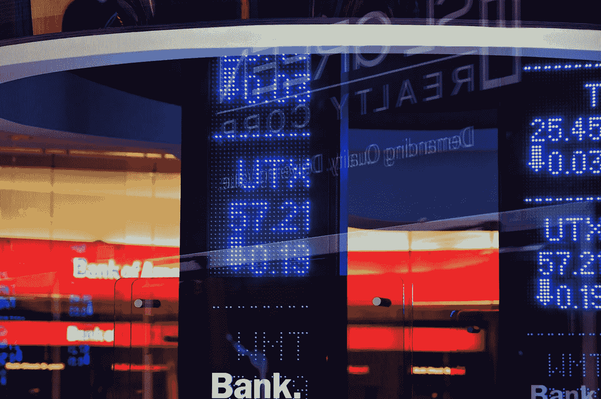

# 5 月 30 日:下周市场将会发生什么

> 原文：<https://medium.com/coinmonks/30th-may-what-to-expect-in-the-market-next-week-40a9f759c6ee?source=collection_archive---------38----------------------->

大家好，

大概最有趣的消息来自特斯拉，它是从美标和标普指数出来的。

特斯拉的股价最近大幅下跌，从 1200 跌至 700，即使近日有小幅技术性反弹，跌势仍将持续。

这些小幅上涨是由那些在股价下跌时迅速跳出来买入从而抬高股价的人造成的。

但他们往往没有意识到，这种增长不会持续太久。

当然，特斯拉的股价被高估了，即使已经减半，也将继续被高估。

每股利润 3 美元，当一股价值 1200 美元时，一个特斯拉投资者需要 400 年才能收回投资，现在他只需要 200 年。

然而，竞争的汽车公司提供更高的回报。比如对戴姆勒的一笔投资，8 年就有回报，加上戴姆勒分红，特斯拉没有，未来 10 年也不会。

真正的问题才刚刚开始，因为所有的投资和养老基金都从标准普尔出来了，他们现在不得不卖掉他们的特斯拉股票，那会进一步让公司的价格崩溃。

对于那些不知道的人来说，标准普尔是美国的指数，包含了在证券交易所上市的表现最好的 500 家公司。

特斯拉为什么会出这个指数？嗯，因为它不再是美国 500 强公司之一了。

这家公司如此强劲的崩溃给市场带来了小小的不安全感，并在短期内影响了市场，尽管情况已经很糟糕了。

正如我在上一集所说，股市连续 8 周的下跌已经过去了。这已经有 99 年没有发生过了。即使在 30 年代的大萧条时期，股市也没有连续 8 周下跌。

情况很困难，但各国政府从 2008 年的危机中明白，扼杀一个痛苦的经济并迫使它停止是不好的，因为它正在导致严重的衰退。所以这一次，他们在疫情期间让人们呆在房子里两年，并给他们提供奖励。

激励措施所需的资金显然印在了疫情上，现在我们都将为我们当时享受的舒适买单。

这场危机在俄罗斯入侵之前就开始了，但这更加速了事情的发展。俄罗斯实际上阻止了乌克兰的粮食出口，这将导致严重的粮食危机，富裕国家不太可能感受到。但给你一个概念，乌克兰的小麦出口每年为 4 亿人提供必要的热量。

非洲大部分地区几乎完全依赖这些进口，因为非洲不是小麦生产大洲。

这使得股票交易所的小麦价格飙升到天上的星星，很快小麦丰收就会到来。由于气候变化，一些国家已经宣布产量极低，欧洲最大的生产国乌克兰认为，只要恐怖主义国家俄罗斯继续像他们自 2 月以来所做的那样向他们投掷炸弹，它就没有足够的资源用于农业。

普京在乌克兰没有取得任何成就，除了摧毁生命、基础设施和窃取他所能获得的一切，就像几个世纪前民族国家所做的那样，但尽管如此，在他的痛苦中，他继续加深这一错误，似乎他成功地阻止了整个地球走上它曾经走过的美丽的进化之路。

当人类的愿望指向殖民其他星球和将人工智能融入我们的日常生活，以使我们的生活更轻松时，这个破坏游戏的人出现了。

似乎又有数十亿美元不得不被转用于武器，用这些武器我们可以摧毁我们迄今为止建造的一切。

为了不把讨论带到一个戏剧性的领域，让我们看看机会，因为生活是由不同的时刻组成的，你的职责是在每一个时刻采取对你最有利的行动。

在通货膨胀和不确定性的背景下，市场正在急剧崩溃。

股票下跌了 50%至 90%，比特币和以太坊下跌了 50%以上，加密市场的其余部分下跌了 90%。

这些机会既珍贵又难得。

现在明智投资的每一美元在下一个市场周期都将价值 10 美元。

我将向你简要介绍一下我在过去几天里获得的资产。我建议你考虑我的建议，但我绝不会因为你懒于做功课就让你抄袭我的投资。分析我的建议，但是要仔细考虑以下每种资产是否适合你。

投资方案看个人，看他的年龄，风险偏好，投的钱，每月主动收益，被动收益等因素。

因此，在过去的几天里，我们已经积累了比特币、以太坊、BNB、阿达、波尔卡多特、Egold、墨西哥，一些上市前阶段的新项目，甚至还有一点柴犬和 Doge 的乐趣。然后是戴姆勒和 Meta 的股票，在外汇市场上，我买了美元兑欧元，这个位置目前正在失去，但我认为趋势将继续对我有利。

在加密方面，这些是我积累的硬币，每掉一滴我就继续买，一次比一次多。

在证券交易所方面，它们不是我积累的唯一股票，根据机会，我每个月从 2-3 家公司购买股票。

至于外汇，我在过去的剪辑中解释了为什么我认为欧元兑美元将继续下跌，这就是为什么我开了这个头寸美元兑欧元。几天前，我以 1 比 30 的杠杆率建立了 10 万美元的头寸，当时趋势发生了逆转，目前我因杠杆率较高而下跌了不少，但我相信几天后美元兑欧元将继续升值。

你可以在我们的抖音账户上每天看到更多简短的解释性视频。

请在评论里告诉我，这段时间你在投资什么？

一旦欧洲央行开始加息，预期交易会反转，然后我会停止这个头寸，倒着玩。但在那之前，要等美元兑欧元的汇率过去，然后才回来。

记住，杠杆可以很快给你带来惊人的收益，也可以带来同样惊人和残酷的损失。如果你不太清楚自己在做什么，我不建议你使用这样的工具，而且当你开始时，使用尽可能小的杠杆，玩尽可能少的钱。

注意不要用你所有的投资资金去购买，因为市场继续下跌的可能性非常高。但是因为没有什么是 100%确定的，所以最好在秋季开始逐渐买入，以便选择尽可能低的平均买入时间。

因为没有人知道底部在哪里，我们不想冒被市场冷落的风险，所以我们应用 DCA。

我还建议，当一轮新的牛市开始时，你已经准备好从你现在正在进行的投资中退出的计划，也是基于 DCA，因为你不知道这次下跌的底部在哪里，你也不知道下一次增长的顶部在哪里。

我个人相信并希望下一轮牛市还很远，我们会有足够的时间积累一致性。

在接下来的几天里，一场奖金为 500 美元的比赛即将到来，所以请不要错过这个机会。请务必订阅我们的 YouTube 频道，以便在下一个比赛剪辑出现时收到通知。

我在我们的免费电报小组等你，那里已经有 200 多人了，你可以在那里找到任何与投资有关的问题的答案。

下次见，管好你的钱！

**|** [**网站**](https://www.b-successful.com/)**|**[**YouTube**](https://www.youtube.com/channel/UCWrfC_w5wVnrOr8jy0ICoDw)**|**[**推特**](https://twitter.com/BSuccessful_)**|**[**insta gram**](https://www.instagram.com/bsuccessful.crypto/)**|**[**电报**](https://t.me/+NQbP3V_iaKQwMDYy) **|** [**脸书**](https://www.facebook.com/Bsuccesful/?_rdc=2&_rdr)

> 加入 Coinmonks [电报频道](https://t.me/coincodecap)和 [Youtube 频道](https://www.youtube.com/c/coinmonks/videos)了解加密交易和投资

# 另外，阅读

*   【T43 商业评论 | [Pionex 评论](https://coincodecap.com/pionex-review-exchange-with-crypto-trading-bot) | [Coinrule 评论](/coinmonks/coinrule-review-2021-a-beginner-friendly-crypto-trading-bot-daf0504848ba)
*   [莱杰 vs n rave](/coinmonks/ledger-vs-ngrave-zero-7e40f0c1d694)|[莱杰 nano s vs x](/coinmonks/ledger-nano-s-vs-x-battery-hardware-price-storage-59a6663fe3b0) | [币安评论](/coinmonks/binance-review-ee10d3bf3b6e)
*   [Bybit Exchange 审查](/coinmonks/bybit-exchange-review-dbd570019b71) | [Bityard 审查](https://coincodecap.com/bityard-reivew) | [Jet-Bot 审查](https://coincodecap.com/jet-bot-review)
*   [3 commas vs crypto hopper](/coinmonks/3commas-vs-pionex-vs-cryptohopper-best-crypto-bot-6a98d2baa203)|[赚取加密利息](/coinmonks/earn-crypto-interest-b10b810fdda3)
*   最好的比特币[硬件钱包](/coinmonks/hardware-wallets-dfa1211730c6) | [BitBox02 回顾](/coinmonks/bitbox02-review-your-swiss-bitcoin-hardware-wallet-c36c88fff29)
*   [BlockFi vs 摄氏](/coinmonks/blockfi-vs-celsius-vs-hodlnaut-8a1cc8c26630) | [Hodlnaut 点评](/coinmonks/hodlnaut-review-best-way-to-hodl-is-to-earn-interest-on-your-bitcoin-6658a8c19edf) | [KuCoin 点评](https://coincodecap.com/kucoin-review)