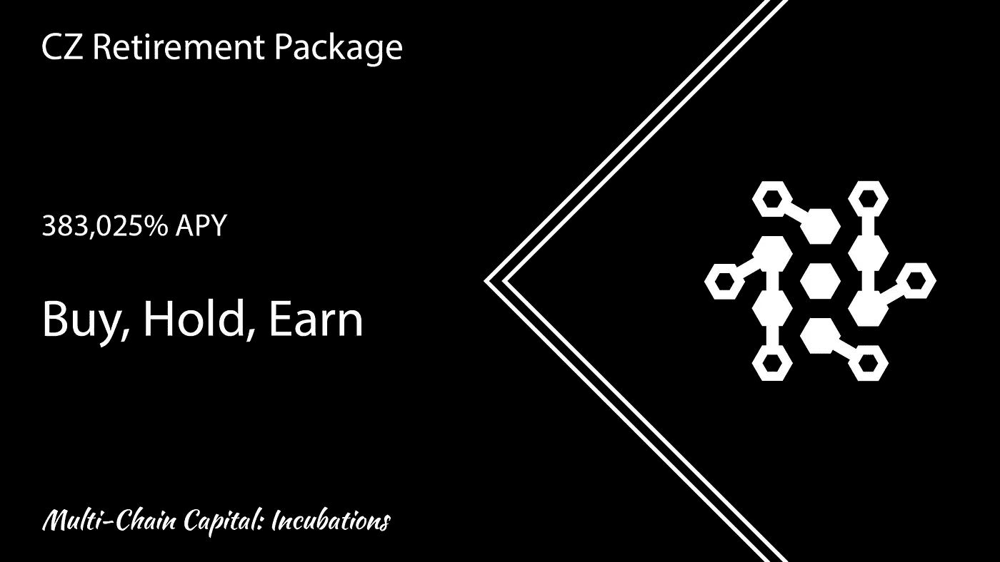

# 383，025% APY 长鹏赵“CZ”退休方案

> 原文：<https://medium.com/coinmonks/383-025-apy-changpeng-zhao-cz-retirement-package-dea35fbbf772?source=collection_archive---------13----------------------->

多链资本孵化自动赌注和自动复利协议，回报丰厚，目前部署在 4 个链 ETH、BSC、FTM、METIS 上。

 [## 多链资本:孵化

### 支持额外事业的项目，同时提供自动$MCC 回购。

孵化器.连锁.资本](https://incubations.mchain.capital/CZR) 

赵昌鹏“CZ”退休套餐(CZR)是前 12 个月的高额固定 APY。在第一个 12 个月之后，利率会在预定的长期利率周期内下降。$CZR 每 15 分钟或每天 96 次支付每个$CZR 令牌持有者，使其成为加密中最快的自动复合协议。

CZ 退休套餐的两个令人兴奋的功能首先是一个名为“火坑”的自动令牌燃烧系统，它可以防止循环供应失控并变得无法管理。火坑燃烧了所有$CZR 市场销售额的 1%,并在同一单个交易中燃烧。

其次是多链资本(MCC)回购。$CZR 是一个$MCC 孵化项目，它提供了为多节点奖励池自动回购 **$MCC** 的能力。

对于初学者来说,$CZR 是一个简单而安全的赌注项目——这个$CZR 代币会一直放在你的钱包里，所以不需要交到第三方或中央权威手中。你所需要做的就是买入并持有，因为你会自动从自己的钱包中获得奖励，所以根本没有更复杂的下注过程。

$CZR 使用自动下注功能，这是一个简单而先进的功能，称为**买入-持有-赚取。**。

**购买-持有-赢取** —只需购买并在您的钱包中持有$CZR 代币，您就可以赢取 rebase 奖励，作为直接存入您钱包的利息。您的代币将每 15 分钟增加**。**

**使用正的返基公式，$CZR 使得代币分配的支付与纪元返基奖励成正比成为可能，每 15 分钟纪元周期价值为您钱包中持有的$CZR 代币总数的 0.02355%。返利奖励在每个时期(15 分钟返利期)分配给所有 CZRholders。**

****这意味着，在不从钱包中取出代币的情况下，$CZR 持有者在第一年获得 383，025.80%的年复利。****

**为了保持可持续性和未来的增长，该合同使用了一个持有人与持续的复利永久。**

**每个利息周期长度为 15 分钟，被称为一个**时期**。**

**一年有 35，040 个纪元。**

****时段 1–35，040:** 每个时段 0.02355%**(前 12 个月)****

****历元 35041–52560:**每个历元 0.00211%**(接下来的 6 个月)****

****纪元 52561–245280:**每个纪元 0.00014%**(接下来的 6.5 年)****

****第 245，281 个时段:**每个时段 0.00002%**(永久，直到达到最大供应量)****

# ****交易费用解释****

****买入交易费用:****

**4% — LP … 6% — RKV … 3% —国库… 1% —火坑**

****卖出交易费用:****

**4% — LP … 6% — RKV … 5% —国库… 1% —火坑**

*   ****LP** —交易费用用于支持流动性池，确保 CZR 的抵押品价值不断增加。**
*   ****RFV** —交易费存储在 RFV 钱包中，帮助维持和支持正基础提供的赌注奖励。**
*   ****财政部** —交易费用直接进入财政部，财政部支持 RFV，为 CZR 提供营销预算，并为新产品开发提供资金。**
*   **火坑——所有 CZR 交易的 1%在火坑中被烧掉。交易越多，投入火中的就越多，导致火坑越来越大，通过自我实现的自动复利，这反过来减少了$CZR 的流通供应并保持了 Safuu 协议的稳定。**

**社区网站 CZR 金融已经创建，可通过以下链接访问。它包含了更多关于$CZR 项目的信息，在 4 个链上的每个链上购买$CZR 的链接和一个查看每个$CZR 图表的图表门户。**

** [## CZR

### 多链资本($MCC)项目正在开发“孵化器”，或令牌来养活整个$MCC 生态系统。请…

czr .金融](https://czr.finance/)** 

**如果这篇文章激起了你的兴趣，你会很高兴地知道会有更多类似的文章，你可以在 MCC 官方社区中找到更多的我——[https://t.me/mccOFFICIALtg](https://t.me/mccOFFICIALtg)**

> **加入 Coinmonks [电报频道](https://t.me/coincodecap)和 [Youtube 频道](https://www.youtube.com/c/coinmonks/videos)了解加密交易和投资**

# **另外，阅读**

*   **[十大最佳加密货币博客](https://coincodecap.com/best-cryptocurrency-blogs) | [YouHodler 评论](https://coincodecap.com/youhodler-review)**
*   **[AscendEx 保证金交易](https://coincodecap.com/ascendex-margin-trading) | [Bitfinex 赌注](https://coincodecap.com/bitfinex-staking)**
*   **[最好的卡达诺钱包](https://coincodecap.com/best-cardano-wallets) | [Bingbon 副本交易](https://coincodecap.com/bingbon-copy-trading)**
*   **[印度最佳 P2P 加密交易所](https://coincodecap.com/p2p-crypto-exchanges-in-india) | [柴犬钱包](https://coincodecap.com/baby-shiba-inu-wallets)**
*   **[8 大加密附属计划](https://coincodecap.com/crypto-affiliate-programs) | [eToro vs 比特币基地](https://coincodecap.com/etoro-vs-coinbase)**
*   **[最佳以太坊钱包](https://coincodecap.com/best-ethereum-wallets) | [电报上的加密货币机器人](https://coincodecap.com/telegram-crypto-bots)**