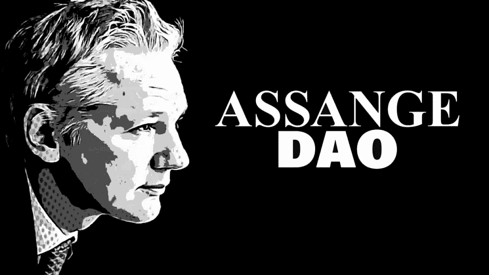

# 为朱利安·阿桑奇筹集的 3800 万美元被神秘引渡给匿名的俄罗斯黑客

> 原文：<https://medium.com/coinmonks/38m-in-ether-fundraised-for-julian-assange-mysteriously-extradited-to-anonymous-russian-hacker-275cf85962bf?source=collection_archive---------45----------------------->

伦敦——加密社区的成员为维基解密(Wikileaks)创始人朱利安·阿桑奇(Julian Assange)筹集了超过 3800 万美元，阿桑奇目前因多项指控被监禁在伦敦。

阿桑奇道是一个分散的自治组织，是一个由密码社区创建的筹款团体，他们接受以太坊，计划将出售所得的资金捐赠给阿桑奇的法律辩护。在 4 周的时间里，AssangeDao 筹集了 16，593 ETH(5，200 万美元)。

然而，社区论坛在周二得知网络犯罪分子破坏了阿桑奇道的安全系统，据报道超过 3000 万美元被盗后，感到心烦意乱。消息人士证实，这些资金是被一群俄罗斯黑客窃取的，但人们普遍认为这是否是筹款人的“恶作剧”，这是加密社区欺骗投资者和代币持有者的一种非常常见的策略。

朱利安·阿桑奇的兄弟加布里埃尔·希普顿也参与了这次筹款活动，他说正在进行调查以找回被盗的密码。在新闻发布会上，希普顿说，“俄国，如果你在听，我希望你能找到丢失的 15000 个醚。”

#讽刺

> 加入 Coinmonks [电报频道](https://t.me/coincodecap)和 [Youtube 频道](https://www.youtube.com/c/coinmonks/videos)了解加密交易和投资

# 另外，阅读

*   [密码本交易平台](/coinmonks/top-10-crypto-copy-trading-platforms-for-beginners-d0c37c7d698c) | [Coinmama 审核](/coinmonks/coinmama-review-ace5641bde6e)
*   [印度的加密交易所](/coinmonks/bitcoin-exchange-in-india-7f1fe79715c9) | [比特币储蓄账户](/coinmonks/bitcoin-savings-account-e65b13f92451)
*   [OKEx vs KuCoin](https://coincodecap.com/okex-kucoin) | [摄氏替代品](https://coincodecap.com/celsius-alternatives) | [如何购买 VeChain](https://coincodecap.com/buy-vechain)
*   [币安期货交易](https://coincodecap.com/binance-futures-trading)|[3 comas vs Mudrex vs eToro](https://coincodecap.com/mudrex-3commas-etoro)
*   [如何购买 Monero](https://coincodecap.com/buy-monero) | [IDEX 评论](https://coincodecap.com/idex-review) | [BitKan 交易机器人](https://coincodecap.com/bitkan-trading-bot)
*   [CoinDCX 评论](/coinmonks/coindcx-review-8444db3621a2) | [加密保证金交易交易所](https://coincodecap.com/crypto-margin-trading-exchanges)