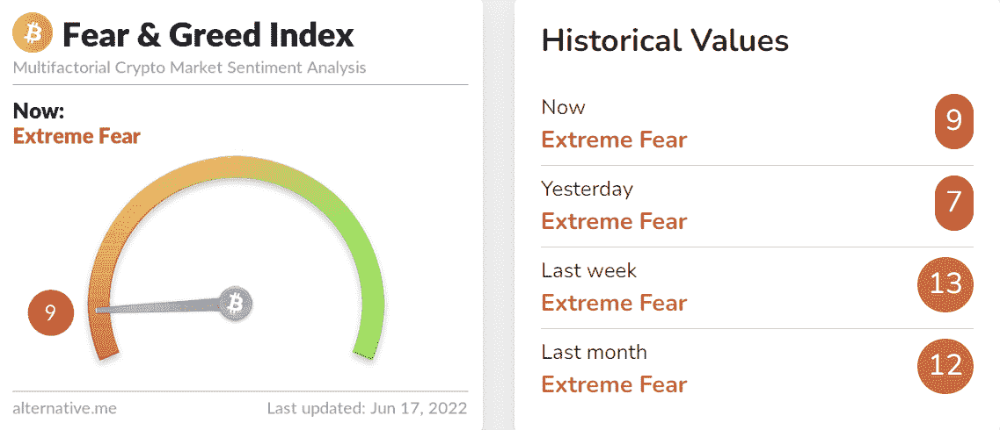
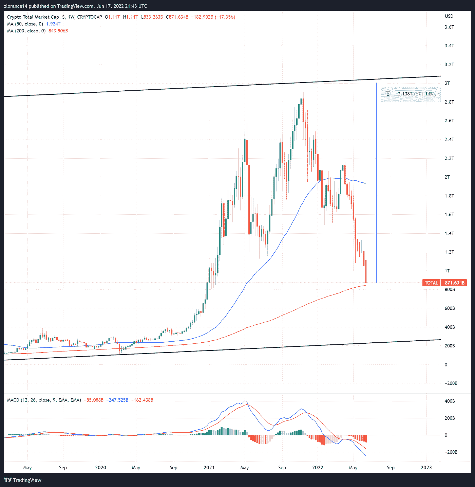
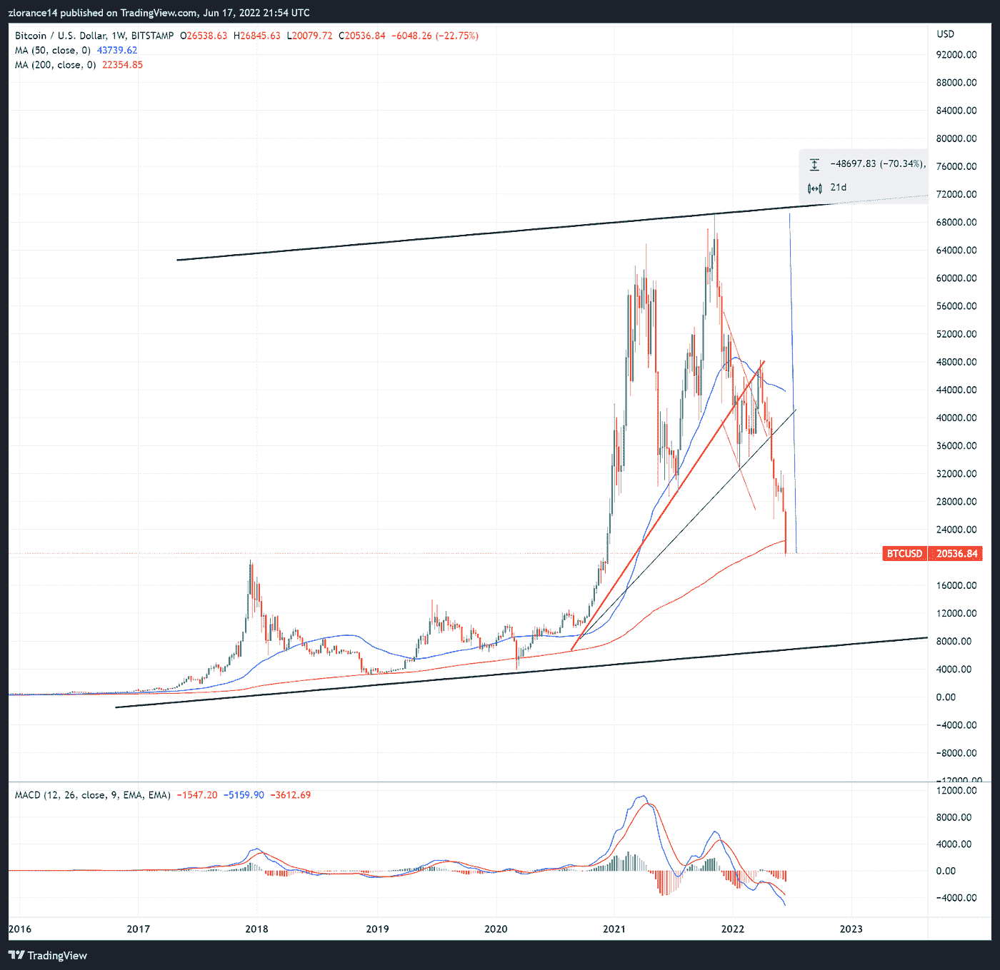
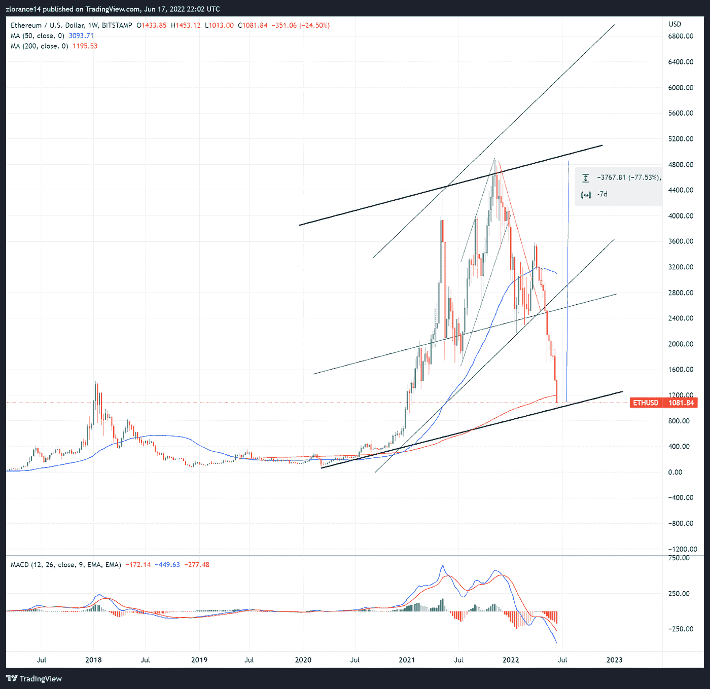
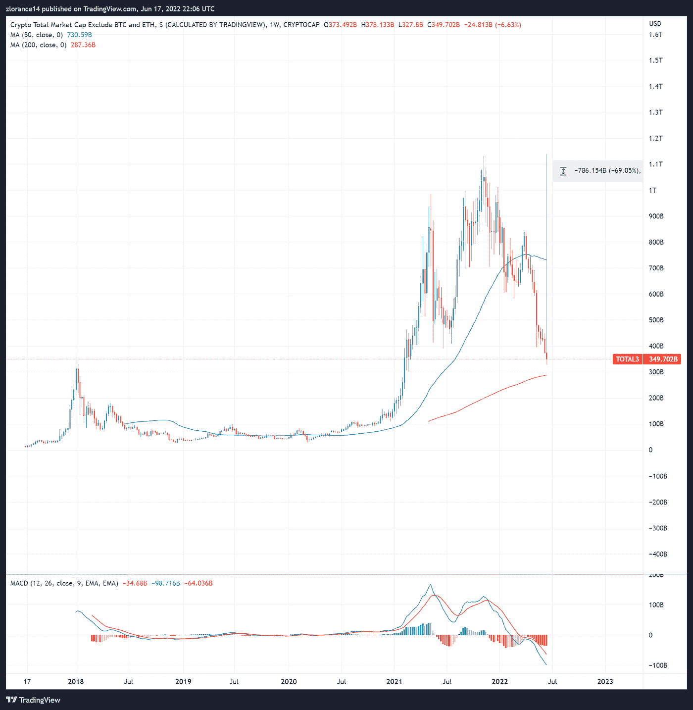
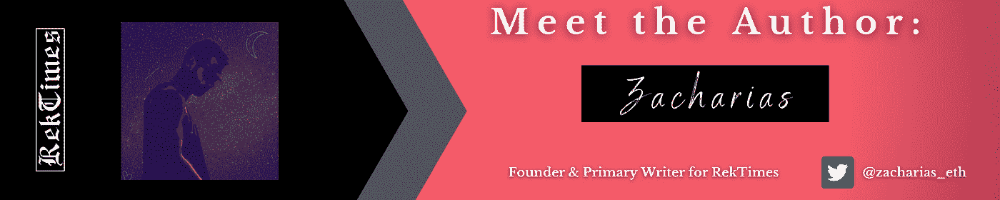

# 3AC 下降，市场在 2017 年徘徊不前| RTWM 1.37

> 原文：<https://medium.com/coinmonks/3ac-goes-down-market-teetering-at-2017-top-rtwm-1-37-26cbb1bc112b?source=collection_archive---------33----------------------->

# RekTimes 每周市场

***2022 年 6 月 17 日:*** 在市场大幅下跌 30%之后，加密经济已经进入全面衰退的危机模式，此后，该市场在 2017 年牛市顶部至少找到了一个暂时的支撑点。

然而，不仅仅是加密经济在挣扎，在大幅加息导致借贷成本越来越高，给其他资产类别带来巨大压力后，全球经济也在蹒跚前行，包括但不限于:

*   房屋
*   股票
*   商品
*   证券
*   加密货币和数字资产

在 crypto/web3 方面，有一些大公司现在正在公开努力应对这一显著的市场收缩。上周，我们概述了 Celsius 破产的细节。他们已经设法降低了比特币和其他令人印象深刻的 Maker & Aave 贷款资产的清算价格。

已经倒闭或正在苦苦挣扎的加密货币和 web3 公司列表如下:

*   三箭资本(3AC)
*   比特币基地
*   BlockFi
*   Terra Luna(技术上崩溃了两次)
*   摄氏温标

**要点——不要低估这场衰退，没有人是安全的**

**‘加密冬天’即将来临**

除了典型的零售市场清算和价格暴跌之外，一些被认为是最强大的 web3 也陷入了困境。紧接着比特币基地取消聘用和冻结招聘之后，他们宣布公司有 1，100 人(大约 18%)被解雇。加入比特币基地的还有 Celsius(严重资不抵债危机)和 BlockFi，这是另外两家为流动性而苦苦挣扎的加密“银行”。

这个周期中最大的市场冲击是 3AC——被认为是该领域最大的加密/web3 投资公司之一，在过去两年中，他们已经将资金投入到许多不同的 DeFi 和加密经济协议中。3AC 现在实际上已经资不抵债，这对整个加密市场来说是一个巨大的损失。

根据链上数据，3AC 至少是以下项目的主要持有人:

*   比特币(BTC)
*   以太坊
*   雪崩
*   Aave (AAVE)
*   特拉(露娜，UST)
*   茄属植物
*   近似协议(NEAR)

3AC 棺材上最大的钉子是 Terra 的崩溃。数据显示，当 UST 和露娜的代币价格暴跌时，3AC 损失了约 5 亿美元。一个价值 400 亿美元的加密生态系统的损失给整个加密经济带来了冲击波，现在才开始真正展示其丑陋的一面。

**接下来是什么？**

有一项协议无疑值得在此提及，那就是泰瑟控股公司(USDT)。回到 2021 年 11 月，RekTimes 对“FUD”和围绕 Tether 的指控进行了自己的调查和研究。

现在，我们完全有理由对 USDT 稳定币持怀疑态度。请记住——Tether 拒绝证实它是否得到了完全支持，甚至拒绝证实 USDT 的担保品有多少。值得注意的是，Tether 已经站出来，明确否认与 3AC 有任何风险敞口，并表示其与 Celsius 的持股“已清算，没有任何损失。”

Terra、Celsius 和 3AC 的创始人也发表了类似的声明，有时就在他们的公司彻底崩溃的前几天。到目前为止，Tether 已经提供了赎回服务，但同样，无法证实他们 100%支持 USDT。

*事实*——在过去的 48 小时里，围绕这一猜测，投资者已经从 USDT 撤出了数十亿美元。这正是问题所在。围绕 Tether 的猜测完全是由 Tether Holdings 本身推动的——为什么？

因为他们拒绝接受审计或核实他们的储备，没有人知道他们持有的 USDT 是否有任何支持。恐惧正在推动这个市场。如果人们觉得储备有可能与 USDT 的突出价值不匹配，这正是导致银行挤兑的原因。如果 Tether 使用部分准备金模式，在银行挤兑中，最后一个到金库的人什么也得不到。同样，这完全是由于 Tether Holdings 拒绝核实其储量。

强烈建议投资者离开 USDT，进入像 USDC 这样更安全、更可靠的市场。如果系绳没有真正的问题，这里应该有一个 1:1 的交换，以降低巨大的风险。这是一个显而易见的游戏。

我们的目标是帮助市场参与者不被 rekt——从公正的角度来看，我们认为离开 USDT 是最安全的做法，以避免任何不必要的风险敞口，因为我们无法核实他们的储备。

[请在这里阅读我们对系绳的调查了解更多信息。](https://www.publish0x.com/rektimes-crypto-blockchain-news/investigating-the-allegations-against-tether-usdt-implicatio-xlzedkp)

**延伸阅读 *—*** *在知道*

*   链环(link)发布新路线图，立桩([链环](https://blog.chain.link/chainlink-staking-roadmap/)
*   美国美联储加息 0.75% ( [雅虎](https://finance.yahoo.com/news/fed-fomc-monetary-policy-decision-june-2022-120337242.html))
*   2022 年 5 月，美国通货膨胀率继续上升，同比增长 8.6%

# 秘密经济与市场

对于所有人来说，过去的一周在加密经济中是绝对残酷的。随着该领域一些最著名的投资公司被迫抛售，价格在过去七天大幅下跌。硬币价格下跌了 20%到 40%。

市场情绪从 13 点急剧下降到 9 点，仍然处于“极度恐惧”的状态。

完整的恐惧和贪婪指数图表如下所示:

[恐惧&贪婪指数](https://alternative.me/crypto/fear-and-greed-index/)

**总市场**

过去一周，整个加密市场大幅下跌，每周跌至 200 WMA，总价值约为 8700 亿美元。这是一个巨大的损失，尽管实际上是由比特币&以太坊的“市场推动者”严重推动的。这是非常持久的长期支持，也是 RekTimes 几个月来一直关注的水平。

市场不能也不会跌破上一个周期峰值的说法，现在正受到考验。总加密市值比历史最高值下降了 71%以上。

**总加密市值******如下:****

****

****比特币(BTC)****

**比特币在过去的一周里受到了绝对的压制，下跌了 30%以上，实际上直接穿透了其 200 WMA 主要长期支持。这对比特币来说过于悲观，增加了 BTC 重返 2017 年高点约 19500 美元的可能性。**

**在这一点上有一个明显的逆转理由，但随着宏观环境日益恶化，这是一个需要高度风险承受能力的赌注。值得注意的是，比特币也从历史高点下跌了 70%，所以不管在这些水平上采取什么策略，比特币都相对便宜。**

****[**比特币/美元周线图**](https://www.tradingview.com/chart/PtQkJAD5/?symbol=BITSTAMP%3ABTCUSD) **如下:******

********

******以太坊(ETH)******

****以太坊经历了比比特币更糟糕的一周。比特币下跌了 38%，超过了比特币的跌幅。以太坊在这里很有意思，因为它不仅直接跌破了 200 WMA，达到了长期月度支持，而且远低于 2017 年的高点约 1376 美元。所以——在某种程度上，硬币不会贬值到低于之前市场峰值的说法已经在以太坊上被否定了。****

****这里重要的一点是以太坊目前处于或围绕着长期支持的主要领域。以太坊突破 1000 美元对市场来说绝对是灾难性的。ETH 从历史高点下跌了 77.5%。****

******[**以太币/美元周线图**](https://www.tradingview.com/chart/PtQkJAD5/?symbol=BITSTAMP%3AETHUSD) **如下图:********

********

******真实总替代币市场(不包括比特币、以太坊)******

****本周市场内最有趣的发现是真正的总替代硬币市场。与比特币和以太坊相比，替代币市场表现相当不错。Altcoins 的市值约为 3500 亿美元，比历史最高值下降了 69%。****

****到目前为止，替代硬币尚未达到 200 WMA，但替代硬币市场确实处于 2017 年的高点。****

****altcoins 内部很有可能出现更深层次的抛售，特别是如果比特币或以太坊出现某种形式的抛售阻力，或者全球经济没有复苏。****

******[**真实总替代币市值**](https://www.tradingview.com/chart/PtQkJAD5/?symbol=CRYPTOCAP%3ATOTAL3) **如下:********

****************

# ****市场分析****

****随着始于 2021 年 11 月的熊市随着全球经济环境的崩溃而继续恶化，市场在过去一周遭受重创。如果没有大规模的逆转，比特币在目前的水平上面临着深度崩溃的巨大风险。BTC 必须收复约 22，500 美元的水平，以保持以上的支持。否则，比特币有可能跌至 7，700 美元左右的月度趋势线。****

****以太坊是一个更有趣的设置，已经突破了 2017 年的高点，但仍高于支撑。ETH 未能保持目前的水平，我们无疑将自 2021 年 1 月以来首次看到三位数的 ETH(是的，只有 2021 年 1 月)。****

****虽然替代硬币的表现优于瑞士联邦理工学院和 BTC 大学的硬币，但几乎可以肯定的是，未来会有更多的痛苦。这些硬币有可能设法保持住估值，尽管不是所有的硬币都会这样。项目必须快速适应并解决主要问题，以便在一个没有耐心或流动性的市场中保持相关性。****

****在当前水平买入，中期来看很有可能获利，长期来看可能性很大。然而，在目前的情况下，这应该被认为是一个高风险的游戏。有理由相信，包括比特币和以太坊在内的多种资产可能会再下跌 50%以上。****

****请一如既往地对此分析持保留态度，并做好自己的尽职调查。这不是专业的理财建议。****

******即将更新的文章:******

****期待 RekTimes 在下周或七月的第一周发布一个重要的更新！****

*   ****RekTimes 每周市场 1.38—**6 月 24 日发布******
*   ****Q2 总结报告—**7 月 1 日发布******

*****长期项目*****

*   ****新兴的加密经济:加密经济和现实世界应用概述—**2022 年第三季度******
*   ****MOBI 考察—**2022 年第三季度******

********

******如果你喜欢这篇文章，请务必关注本页，我们会每周发布通知******

****[**在 Twitter 上关注作者**](https://twitter.com/zacharias_eth)****

****[**在 Twitter 上关注 rek times**](https://twitter.com/rektimes)****

****************

****[驼鹿&玛莎手工制品](https://www.publish0x.com/editPost/mooseandmarsha.com)****

********

> ****加入 Coinmonks [电报频道](https://t.me/coincodecap)和 [Youtube 频道](https://www.youtube.com/c/coinmonks/videos)了解加密交易和投资****

# ****另外，阅读****

*   ****[加密货币储蓄账户](/coinmonks/cryptocurrency-savings-accounts-be3bc0feffbf) | [加密交易机器人](https://coincodecap.com/best-crypto-trading-bots)****
*   ****[BigONE 交易所评论](/coinmonks/bigone-exchange-review-64705d85a1d4) | [CEX。IO 审查](https://coincodecap.com/cex-io-review) | [交换区审查](/coinmonks/swapzone-review-crypto-exchange-data-aggregator-e0ad78e55ed7)****
*   ****[最佳比特币保证金交易](/coinmonks/bitcoin-margin-trading-exchange-bcbfcbf7b8e3) | [比特币保证金交易](https://coincodecap.com/bityard-margin-trading)****
*   ****[加密保证金交易交易所](/coinmonks/crypto-margin-trading-exchanges-428b1f7ad108) | [赚取比特币](/coinmonks/earn-bitcoin-6e8bd3c592d9)****
*   ****[WazirX vs CoinDCX vs bit bns](/coinmonks/wazirx-vs-coindcx-vs-bitbns-149f4f19a2f1)|[block fi vs coin loan vs Nexo](/coinmonks/blockfi-vs-coinloan-vs-nexo-cb624635230d)****