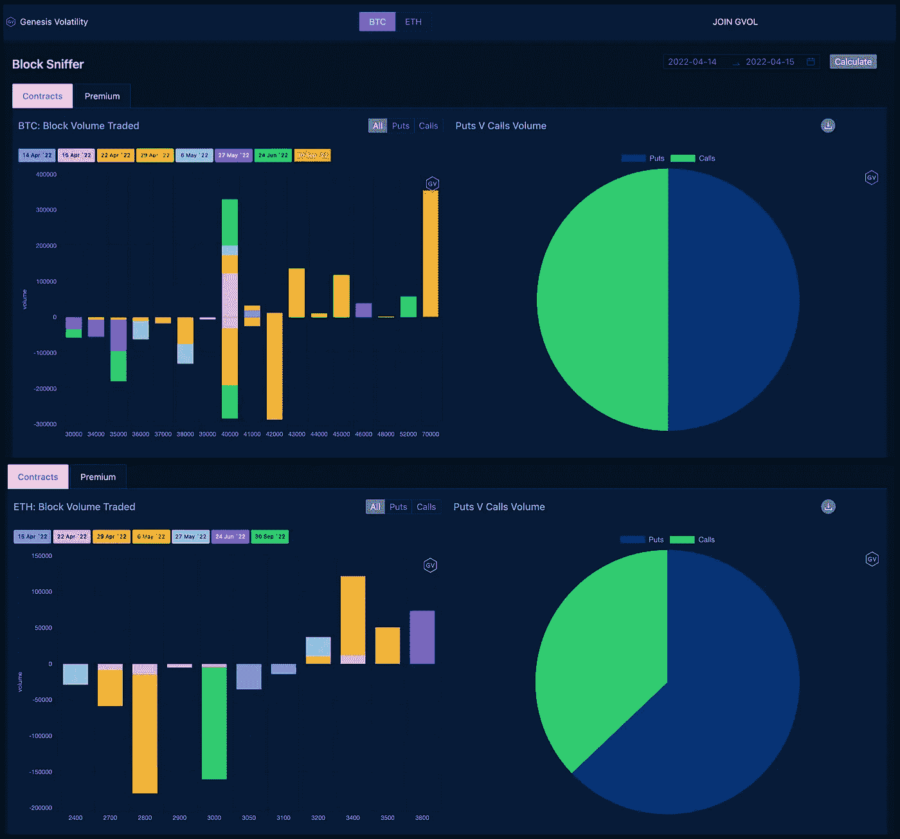

# 2012 年 4 月 14 日 BTC/ETH 选项更新

> 原文：<https://medium.com/coinmonks/4-14-22-btc-eth-options-update-dcea569baf03?source=collection_archive---------48----------------------->

BTC 看涨期权和看跌期权平分秋色，而 ETH 交易员则倾向于看跌期权。

通过[范式](https://www.linkedin.com/company/paradigmco/)的流量再次以 BTC 4 万美元罢工为中心，而 2012 年 9 月 30 日 BTC 7 万美元的电话很受欢迎。有趣的是，ITM BTC 2012 年 4 月 22 日的看跌期权也是如此。结构方面，对角线和复杂的多腿策略是最受欢迎的。

看看瑞士联邦理工学院，大部分资金流向了 OTM。交易最多的合约是 2800 & 3000 份看跌期权和 3400 份看涨期权。从结构上看，直接买入和卖出的速度超过了策略投资。

> 加入 Coinmonks [电报频道](https://t.me/coincodecap)和 [Youtube 频道](https://www.youtube.com/c/coinmonks/videos)了解加密交易和投资

# 另外，阅读

*   [Capital.com 评论](https://coincodecap.com/capital-com-review) | [香港的加密借贷平台](https://coincodecap.com/crypto-lending-hong-kong)
*   [如何在 Uniswap 上交换加密？](https://coincodecap.com/swap-crypto-on-uniswap) | [A-Ads 审查](https://coincodecap.com/a-ads-review)
*   [WazirX vs CoinDCX vs bit bns](/coinmonks/wazirx-vs-coindcx-vs-bitbns-149f4f19a2f1)|[block fi vs coin loan vs Nexo](/coinmonks/blockfi-vs-coinloan-vs-nexo-cb624635230d)
*   [本地比特币评论](/coinmonks/localbitcoins-review-6cc001c6ed56) | [加密货币储蓄账户](https://coincodecap.com/cryptocurrency-savings-accounts)
*   什么是融资融券交易