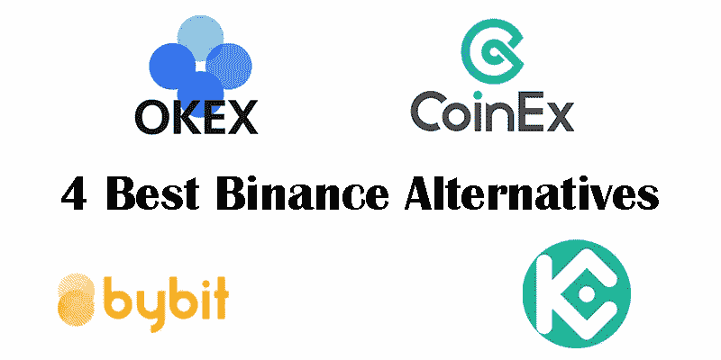
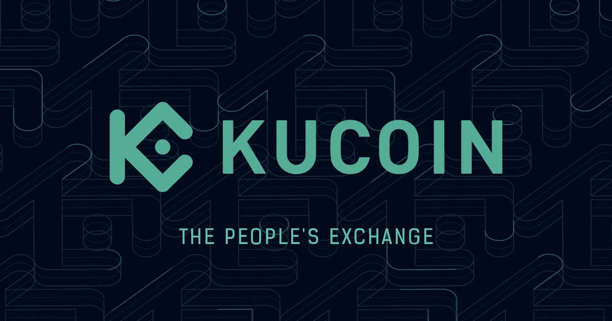
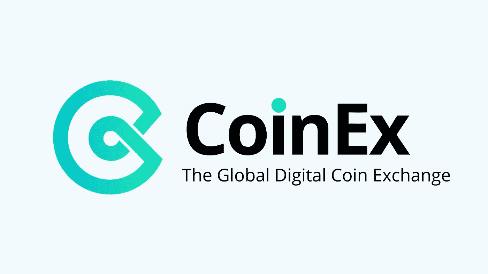
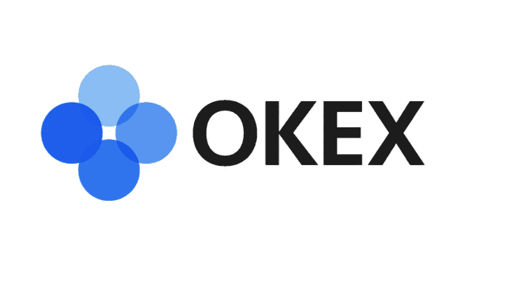
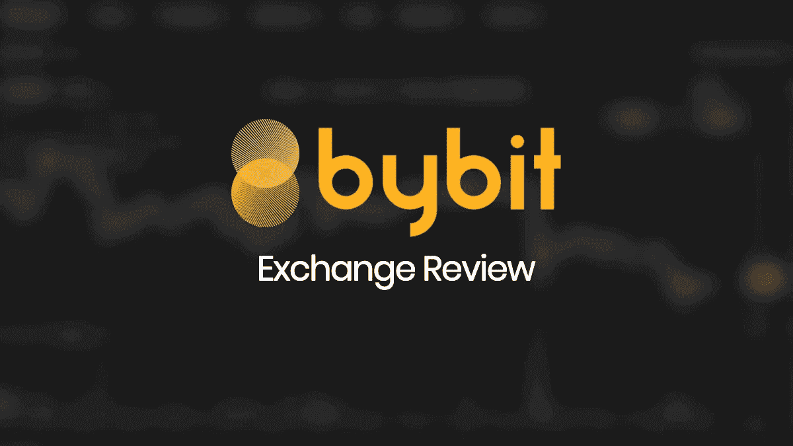

# 币安的 4 个最佳交易所选择

> 原文：<https://medium.com/coinmonks/4-best-exchanges-alternatives-for-binance-7b1dff886cb5?source=collection_archive---------52----------------------->

在这篇文章中，我向你介绍了世界上可以取代币安的 4 个最好的交易所。

1.库币交易所

Kucoin 是加密货币交易的理想、安全的交易所之一。该交易所已于 2017 年正式开始工作并上线，今天它已成为币安交易所的合适替代品。如果我们想推出一个安全先进的买卖货币的平台，你绝对应该熟悉一下库币交易所。在这个交易所里，交易着以太坊、比特币、Neo、塞隆、以及……等多种加密货币，种类超过 200 种。由于使用这种交易所非常容易，初学者也可以用它来进行交易。据统计，每四个人中就有一个人把库币换成了币安。有趣的是，这个交易所的大多数用户来自印度、越南、土耳其、西班牙和意大利。该交易所的交易量已达到约 7 亿笔，价值约 740 亿美元。

凭借其巨大的优势，库币交易所已成为币安的最佳替代方案之一。库币交易所的第一个优势是，它拥有来自世界 200 个不同国家的约 600 万活跃和聪明的用户，它是最繁忙的交易所之一，迄今已进行了数次交易。使用起来非常方便简单，同时也非常实用高效。交易 200 种不同类型的加密货币，其中最重要的是比特币、以太坊和 Neo。如果一个用户遇到一个特殊的问题，他可以在这个交流中提出他的问题并得到一个答案。这意味着一天 24 小时提供用户支持。库币交易所最重要也是最优越的一个特点就是收取的佣金金额低于其他交易所，这对用户来说特别重要。那些没有计算机系统的人也可以在手机的帮助下使用这个交易所来交易他们的加密货币。

2.CoinEx 交易所

CoinEx 交易所在全球 307 家知名交易所中排名第 45 位。

CoinEx 交易所在安全性方面已经能够给予用户极大的保障。此外，在 CoinEx 交易所工作和交易非常容易，即使是新手交易者也能够轻松地在其中交易他们的加密货币。您也可以在国际银行卡的帮助下交易您的加密货币。在 CoinEx 交易所，人们可以使用 Viawallet 钱包。所有交易都是一天 24 小时进行的，对其用户的支持是每天进行的。这些问题导致 CoinEx 交易所的用户和交易者越来越受欢迎。

3.Okex 交易所

使用币安交易所的加密货币交易商已经被禁止一段时间，不能使用这个交易所。这就是为什么每个用户都在寻找币安的替代品。Okex 交易所是一家声誉良好的、适合替代的交易所。选择这种货币的一个很重要的原因是，它已经支持 400 多种类型的货币。这个交易所的一个独特之处是有一个专业的网站和应用程序。为用户提供高安全性和高流动性交易的可能性。里亚尔兑换和结算专用钱包的存在是这种兑换的非凡便利之一。

在这个交易所里，可以交易比特币、以太坊、道奇、塞隆、……等 15 种著名的加密货币。从这个交易所的交易中获得的佣金只有 2%左右。在这个交流里，除了节假日每天早上 9 点到下午 5 点都可以回答。从外汇账户向银行账户转账所需的时间将在 24 至 48 小时内完成。

4.逐位交换

By-bit exchange 已经宣布拥有超过 160 万的活跃用户。在全球的交易所中，Bybit exchange 排名第二十。该交易所于 2018 年在英属维尔京群岛成立。如果我们想表达这种交换的最佳功能，我们必须说认证是可选的，用户可以在没有认证的情况下每天提取 2 个比特币。

这种交换中的身份验证是可选的，这一事实受到了许多用户的欢迎。能够在 Android 和 IOS 版本中安装该应用程序是 Bybit exchange 的优势之一。如果你把这种交流介绍给你的朋友和熟人，你可以享受有吸引力的折扣计划。这个交易所交易的硬币数量少，品种少。每天取款有限制，这让用户不高兴。

> 加入 Coinmonks [电报频道](https://t.me/coincodecap)和 [Youtube 频道](https://www.youtube.com/c/coinmonks/videos)了解加密交易和投资

# 另外，阅读

*   [币安期货交易](https://coincodecap.com/binance-futures-trading)|[3 commas vs Mudrex vs eToro](https://coincodecap.com/mudrex-3commas-etoro)
*   [如何购买 Monero](https://coincodecap.com/buy-monero) | [IDEX 评论](https://coincodecap.com/idex-review) | [BitKan 交易机器人](https://coincodecap.com/bitkan-trading-bot)
*   [尤霍德勒 vs 考尼洛 vs 霍德诺特](/coinmonks/youhodler-vs-coinloan-vs-hodlnaut-b1050acde55a) | [Cryptohopper vs 哈斯博特](https://coincodecap.com/cryptohopper-vs-haasbot)
*   [顶级付费加密货币和区块链课程](https://coincodecap.com/blockchain-courses)
*   [MXC 交易所评论](/coinmonks/mxc-exchange-review-3af0ec1cba8c) | [Pionex vs 币安](https://coincodecap.com/pionex-vs-binance) | [Pionex 套利机器人](https://coincodecap.com/pionex-arbitrage-bot)