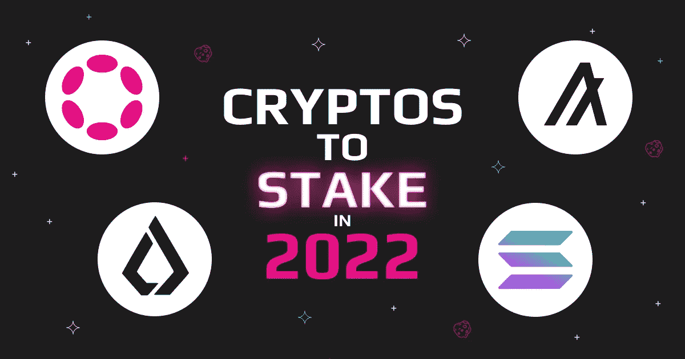
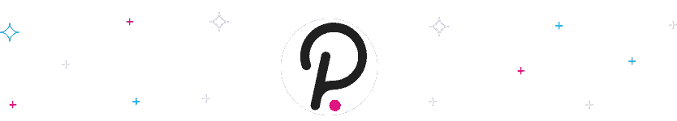

# 2022 年的赌注有 4 个:索拉纳，阿尔格兰德，波尔卡多特，利斯克

> 原文：<https://medium.com/coinmonks/4-cryptos-to-stake-in-2022-solana-algorand-polkadot-lisk-a9dcc1282df6?source=collection_archive---------19----------------------->

由于各种原因，越来越多的项目转向赌注证明算法来确认加密交易，可能很难找到什么加密是最好的赌注。有大量的参数需要随时保存，因此我们 Swapzone 决定筛选市场上的 PoS 硬币，并为您提供 4 种我们认为最值得您考虑的加密硬币。尽情享受吧！

# 在 Crypto 中，Staking 是什么意思？

赌注是一种确认或验证多种加密货币交易的方法，允许用户为其持有的货币赢得奖励。但是现在，在加密货币中，赌注是什么意思？

# 什么是加密货币赌注？

加密货币赌注将您的加密资产转移到区块链网络，以支持和验证交易。它与使用股权证明方法处理支付的加密货币兼容。与最初的[工作证明](https://en.wikipedia.org/wiki/Proof_of_work)范例相比，这是一个更加节能的选择。需要使用计算能力来解决数学问题的采矿设备来证明工作。

赌注是用你的加密货币赚取被动资金的一种很好的方式，尤其是因为一些加密货币为赌注支付很高的利率。在开始之前，了解加密赌注的工作原理是至关重要的。

# 加密货币赌注是如何运作的？

赌注是新的交易如何被添加到遵循[的](https://en.wikipedia.org/wiki/Proof_of_stake)概念的加密货币的区块链中。

我们以比特币为例。每当一个块被添加到网络中时，新的 BTC 被产生并作为赌注奖励支付给块的验证者。奖励几乎总是与玩家下注的硬币类型相同。另一方面，一些区块链使用不同形式的加密货币作为奖励。

要对加密货币下注，有问题的加密货币必须使用或遵循赌注证明模型。然后你可以决定你愿意下多少赌注。许多流行的加密货币交易所允许你这样做。

当你把你的硬币押上时，它们仍然是你的。你有效地把这些硬币投入到工作中，如果你想交换它们，你可以把它们拆下来。拆分过程可能需要一些时间，因为一些加密货币要求您在设定的时间内投入硬币。

# 最佳加密赌注

# 溶胶打桩

[Solana](https://solana.com/) (SOL)是一个基于区块链的创新合约平台，专为创建去中心化应用(dapps)而构建。索拉纳的土生土长的溶胶硬币是一种可交易的代币，可用于支付网络费用和促进网上交易。

作为验证者或委托赌注者参与网络的用户可以获得索拉纳赌注奖励。这些用户(验证者)负责处理事务并保持 Solana 网络的正常运行。SOL 持有者使用 Solana 钱包将他们的代币委托给赌注池运营商以获得赌注激励，这种人被称为委托赌注者。

验证器必须运行和维护一个验证节点(称为“集群”)，需要正常运行时间和满足特定规范的硬件。Slashing 是 Solana 使用的一种技术，用于防止验证器恶意操作或表现不佳。验证者可以向委托者收取佣金，以帮助支付运营集群的成本。

## 索拉纳跑马圈地有多赚钱？

Solana staking 与其他著名的 PoS 区块链不同，它采用了一种历史证明(PoH)共识技术来标记时间戳。Solana 通过混合 PoS 和 PoH 实现了令人难以置信的 400 毫秒的阻塞时间。

索尔的年通货膨胀率从 8%开始，但现在每年下降 15%，直到达到 1.5%

# ALGO 立桩

algrand(ALGO)旨在解决区块链如今面临的三大挑战:安全性、可扩展性和可用性。Algorand 支持智能合约，并使用基于拜占庭共识的纯利害关系证明(PPoS)协议。有了这个共识，网络就把它的安全和大多数人的诚实联系在一起了。每个用户对新区块选择的影响与其在系统中的股份(令牌数量)成正比。用户被随机和秘密地选择来提议区块并对区块提议进行投票。阿尔格兰德让少数人不可能做出任何不诚实的行为，因此多数人的任何欺骗行为都是愚蠢的。只要三分之二的多数人是诚实的，协议就是健壮的。

## 阿尔格兰德赌注有多有利可图？

在 algorand 定位中，开始定位几乎不需要任何操作。你只需要 1 ALGO 的最低余额。一旦领取了您的奖励，它们将直接添加到您的全球余额中。阿尔格兰德网络也以其速度著称。因此，交易很快。

# 点标桩

[Polkadot](https://polkadot.network/) (DOT)是一种区块链互操作性协议，它将许多链联合成一个网络，允许它们之间同时进行交易处理和数据交换。

Polkadot 提出了一种非概率利害关系证明(NPoS)共识机制，允许用户通过验证或提名来获得赌注奖励。验证者负责验证 Polkadot 网络上的事务，而提名者保证验证者遵守规则。

对于提名者来说，对 staking DOT 没有最低要求，也不需要运行一个节点或者使用特定的硬件。

另一方面，作为验证者赚取赌注奖励有点困难。成为验证者所需的总点数各不相同，但通常需要 350 左右才能开始。验证器必须额外运行一个节点，这通常需要启动一个 Linux 云服务器。

在一个新时代或 24 小时周期的开始，点赌注的奖励开始累积。在每个时代结束时，您可以领取上一个时代的奖励。通常，验证者或提名者将要求赌注奖励，导致所有支出立即分配给其他人。验证者和提名者都可以使用 Polkadot JS 钱包或分类帐来申请赌注奖励。

## 波尔卡多特跑马圈地有多赚钱？

提名者的盈利能力由验证者决定。验证者可以征收赌注奖励佣金，该佣金可以随时更改。此外，在每个电子逆向拍卖结束时，只支付每个验证人的前 256 名提名人。提名者平均分享赌注奖励，而不考虑与验证者下注的点的总量。

尽管奖励会因 era 点数的不同而有很大差异，但所有验证者都会平均分配奖金。每一个纪元，纪元积分都会因在区块链上完成特定的有益任务而获得，例如为副链区块做出有效的断言。验证者可以通过接收 DOT 用户的提示获得额外的奖励。验证者得到 100%的小费，小费被用来激励验证者优先处理特定的交易。

# 利斯克打桩

Lisk 是一种加密货币，旨在充当分散应用程序(dapps)的平台，这些程序在运行相同软件的计算机网络上运行。

另一方面，Lisk 允许开发人员使用“[侧链](https://www.coindesk.com/learn/an-introduction-to-sidechains/)”构建定制的 dapps 和加密货币，侧链是在 Lisk 网络内运行的独立区块链。这些侧链与 Lisk 区块链相连，可以根据 Lisk dapps 的需求进行定制。

开发者可以使用该项目的软件开发工具包、代码库和 coin，LSK，因为这些区块链可以与 Lisk 互操作。

LSK 是为区块链号提供动力的加密货币。它被用来支付关键操作的费用，并对软件规则的修改提案进行投票。

Lisk 采用了一种被称为委托利益证明的共识技术来保护其区块链并维护其分布式计算机同步网络(DPoS)。

为了确定运行该程序的机器可以在 Lisk 区块链上构建下一个模块，DPoS 使用了一种实时投票方法。这意味着任何拥有 LSK 的人都可以为网络的运行做出贡献。

# 如何以最优惠的汇率兑换这些硬币？

获得这些硬币的最佳利率取决于你选择的赌注平台。这是因为您必须信任平台来保护您的令牌的安全，并遵守赌注协议的规则。 [Swapzone](https://swapzone.io/) 是最易访问和用户友好的平台之一，可获得最有利可图的加密货币交易！