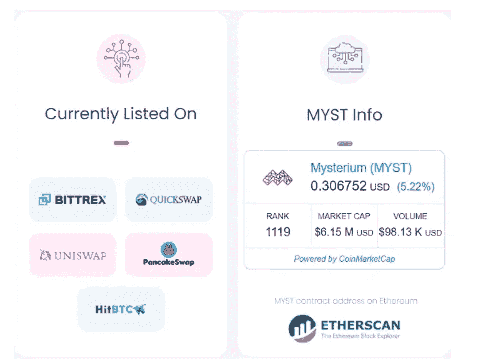

# 4 个免费的应用程序来赚取你的互联网连接货币化的被动收入！

> 原文：<https://medium.com/coinmonks/4-free-apps-to-earn-passive-income-by-monetizing-your-internet-connection-7e671f0d1376?source=collection_archive---------2----------------------->

你家里有超过 30Mbps 的网速吗？您是否知道，除了 4K 视频流或通过互联网下载大型应用程序需要大量带宽之外，大部分互联网带宽实际上都超出了您的日常浏览需求？这种多余的带宽实际上可以货币化，以产生被动收入，虽然这本身并不是一个令人印象深刻的数额，但随着时间的推移，可以增加相当大的数额，一旦建立正确的方式，可以轻松产生被动收入来源。在这篇文章中，我们将探索这方面的最佳选择，利用你已经拥有的设备，从你现有的互联网连接中赚取稳定而可观的被动收入。

# 蜂蜜增益

我一直最喜欢的， [Honeygain](https://r.honeygain.me/CYBER577DD) 是一款简单易用、设置好就一劳永逸的软件，可以在后台为我赚取被动收入。这是一个免费的应用程序，几乎可以在任何移动或桌面设备上工作，通过安全地共享您的多余互联网带宽来传输公共可用的网络数据，这对寻求提高广告排名、比较价格和防止广告欺诈的企业至关重要，从而为您赚取被动现金流；所有这些都不会损害您的数据安全性。

本质上来说，Honeygain 允许你通过把你的设备变成一个网络网关(住宅代理)来将你未使用的互联网流量货币化。每有 10MB 的互联网流量通过您的网络，您将获得 1 个 Honeygain 积分；10GB 的数据可为您赢得价值 1 美元的 Honeygain 积分。一旦你的收入达到 20 美元，你将有资格以贝宝或 BTC 的形式兑现。

2022 年 1 月，Honeygain 与远程工作平台 JumpTask 合作，提供了在 JumpTask 网络的原生代币 JMPT (Jump Token)中赚取的选项，该代币提供了几个实际优势，如限时额外获得 50%的奖金，较低的支付门槛(基本上你可以随时向你的 Trust/ Metamask 钱包提现，每笔交易的汽油费低至 0.1 美元)，以及以加密货币代币形式赚取的能力，这有可能提高价格，从而增加收入。

通过在 Honeygain 上分享您的互联网连接，每月可赚取高达 184 美元！

但是请注意，可变因素会影响你的最终收入，如下所示。

您可以参加每日幸运彩池抽奖活动，每天只需在您的桌面或移动设备上查看 Honeygain 应用程序，就有机会赢得高达 10，000 英镑的额外积分(10 美元)!

要开始您的 Honeygain 冒险，只需在此注册[即可免费获得价值 5 美元的 Honeygain 积分，然后在您的笔记本电脑/移动设备上安装该应用程序。登录 app，准备被动赚！通过选择以 JumpToken (JMPT)支付，获得额外 50%的收入。](https://r.honeygain.me/CYBER577DD)

我使用 [Honeygain](https://r.honeygain.me/CYBER577DD) 有过非常愉快的经历。自从两个月前开始使用这个应用程序以来，我已经获得了相当可观的被动收入，因为除了配置和安装的初始阶段之外，我投入了很少的精力；并且实际上已经以 JumpToken 的形式退出了相当多的次数，目前每枚硬币价值约 2.2 美元。

想了解更多关于 Honeygain 的信息，请查看我之前的文章:

 [## 如何通过 Honeygain 每月被动赚取高达 184 美元:综述

### 我一直是被动收入的支持者，正在寻找用加密货币赚取被动现金流的方法…

medium.com](/coinmonks/how-to-passively-earn-up-to-184-with-honeygain-a-review-5b71adac0fb2)  [## 在 Honeygain 上获得最大收益的技巧:一个轻松的被动收入应用程序！

### Honeygain 是我最喜欢的被动收入来源之一——一个简单的、设置好一次就忘的被动收入来源

medium.com](/coinmonks/tips-to-maximize-earnings-on-honeygain-an-effortless-passive-income-app-15f9793bb423) 

# IPRoyal 卒

I[PRoyal paons](https://iproyal.com/pawns?r=532906)是一个类似的平台，允许您通过将未使用的带宽共享给第三方实体，用于广告验证、软件测试、内容分发、市场研究和社交媒体管理等目的，从而将您的互联网货币化。

每分享 1GB 的数据，用户将获得 0.2 美元的报酬，在最理想的情况下，每月可能获得 132 美元的收入！然而话又说回来，收入是可变的，可能会受到几个因素的影响，如您的位置，IP 地址和互联网速度。

可以通过 BTC、贝宝或虚拟礼品卡的形式申请支出，最低支出金额为 5 美元。

要开始使用 IPRoyal 卒，请在此注册[获得 1 美元奖金，并在您的电脑/移动设备上安装该应用程序，立即开始赢取奖金！](https://iproyal.com/pawns?r=532906)

# peer 2 利润

Peer2Profit 是另一款流行的互联网分享应用，它允许你通过分享剩余带宽来赚钱。

收入是通过将您的互联网流量导向广告商、IT 代理、营销和分析公司而产生的，这些公司将带宽用于合法目的，如干净和安全的广告。

Peer2Profit 支持多种支付方式，每种方式都有不同的支付限额，如下所示。

要开始，请在此注册[，下载并在您的电脑/移动设备上运行该应用程序，立即开始赚钱！](https://p2pr.me/164388119761fba2ed0531f)

# 神秘物质

Mysterium 网络是一个点对点带宽市场，支持网络即服务解决方案。你可以在你的智能设备上运行一个节点，然后将你连接到网络上，在这个节点上，你可以以 MYST (Mysterium)的形式获得收入，作为回报，你可以为网络的用户和客户提供 VPN 或代理服务，访问开放的互联网和安全的通信线路。

想了解更多关于神秘网络的信息，请点击官方网站[这里](https://www.mysterium.network/nodes)。

# 安全问题

当你想到出租未使用的互联网带宽时，你肯定会想到一个非常合理的担忧，那就是隐私和安全问题。上述平台通常承诺确保您的数据的安全和隐私，确保您的互联网流量仅由他们信任的合作伙伴用于概述的透明目的；否则永远不会访问您设备的存储器。除了绝对必要之外，这些应用程序从不收集任何个人数据。例如，Honeygain 有非常严格的[隐私政策](https://www.honeygain.com/privacy-policy/)，基于最新的国际隐私法规，如 GDPR 和 CCPA。

# 最后的想法

随着技术和区块链的出现，有无数种方法可以在网上获得被动收入，其中以上是随着时间的推移在后台被动积累少量财富的好主意。其中， [Honeygain](https://r.honeygain.me/CYBER577DD) 是迄今为止我最喜欢的应用，因为我发现它是最用户友好和最赚钱的平台。事实上，我已经在我的电脑上安装了上述所有应用程序，让它们同时运行，同时仍然能够为我的在线需求保持无缝的互联网体验！你有什么想法？欢迎在下面留下你的评论！

*一如既往，这不是财务建议！而只是我投资过的，觉得值得分享的投资平台。在投资前做好自己的研究，不要存你输不起的钱。下面有什么问题可以随时问我。*

*如果您喜欢这篇文章，* [*关注&订阅*](/@cybery) *！*

*查看以下值得信赖的平台！*

*🎁*[*honey gain*](https://r.honeygain.me/CYBER577DD)*一款被动收入 app，从你未使用的互联网带宽中赚钱。* [*免费获得 5 美元*](https://r.honeygain.me/CYBER577DD) *，无需投资。*

*🎁* [*蛋糕 Defi*](https://cakedefi.com/?ref=677920) *一站式投资平台，以高达 100%的年利率烘焙被动现金流！* [*在 DFI 用 50 美元存款获得 50 美元奖金*](https://cakedefi.com/?ref=677920) *。*

*🎁*[*Nexo*](https://nexo.io/ref/hce5cfdt5o?src=web-link)*一家先进的受监管数字资产机构，提供即时加密贷款，资产年利率高达 12%，在 200 多个司法管辖区提供 40 多种法定货币的服务。* [*用 100 美元存款获得 25 美元*](https://nexo.io/ref/hce5cfdt5o?src=web-link) 奖金*。*

*🎁* [*摄氏度*](https://celsiusnetwork.app.link/174094633e) *一个金融科技平台，提供带息储蓄账户、借贷以及用数字和法定资产进行支付。* [*在 BTC 用 400 美元存款获得 50 美元奖金*](https://celsiusnetwork.app.link/174094633e) *。*

*🎁*[*Hodlnaut*](https://www.hodlnaut.com/join/RTbHxuJMX)*一个强大的加密借贷平台，从你闲置的加密货币中产生被动现金流，年利率高达 9.4%。* [*在 USDC 存款 1000 美元可获得 30 美元*](https://www.hodlnaut.com/join/RTbHxuJMX) *奖金，存款 1500 美元可获得 50 美元。*

*🎁*[*cabial*](https://invite.cabital.com/7P3UFW)*赚取高达 6%的加密利率，无需疯狂。* [*用 200 美元存款获得 20 美元奖金*](https://invite.cabital.com/7P3UFW) *！*

*🎁*[*BlockFi*](https://blockfi.com/?ref=a16e37fd)*一种加密货币交易所和钱包。* [*用 100 美元存款获得 10 美元*](https://blockfi.com/?ref=a16e37fd) *奖金。*

*🎁*[*Kucoin*](https://www.kucoin.com/r/af/rJH29LZ)*一个庞大的加密货币交易所，提供有趣的产品，如赌注、自由交易机器人和比特币云挖掘服务。*

*🎁* [*火币*](https://www.huobi.com/en-us/topic/double-invite/register/?invite_code=5t5jb) *一个提供多样化产品、免费空投和交易机器人的加密货币交易所。*

*🎁*[*MEXC*](https://www.mexc.com/en-US/register?inviteCode=mexc-1NAJC)*一个持有 MX 代币的加密货币交易所，有着有趣的列表和频繁的空投。*

*🎁*[*Crypto.com*](https://read.cash/@TraderFX/10-tips-to-maximize-earnings-on-honeygain-an-effortless-free-passive-income-app-68535728#bad-link)*一家位于新加坡的加密货币交易所。* [*得到 25 美元*](https://crypto.com/app/fcbsjmf5pb) *在 CRO 赌赢一张红宝石牌。*

*针对马来西亚投资者*

*🎁*[*Luno*](https://www.luno.com/invite/EDXG2X)*在 BTC 用 100 林吉特购买 BTC 获得 25 林吉特的奖金！*

*🎁* [*斯塔沙威*](https://www.stashaway.my/referrals/kenleel9jx) *获得 6 个月免费投资！*

*🎁Wahed code 'KENLIE1' RM10 注册奖金*

*🎁Capbay P2P 代码' 8879c6' RM100 注册奖金*

*与我连接* [*中*](https://cybery.medium.com/)*|*[*read . cash*](https://read.cash/r/TraderFX)*|*[*Youtube*](https://www.youtube.com/c/SmartInvestingChannel)*|*[*Twitter*](https://twitter.com/cybertraderfx)*|*[*Linktree*](https://linktr.ee/trader.fx)

加入 Coinmonks [电报频道](https://t.me/coincodecap)和 [Youtube 频道](https://www.youtube.com/c/coinmonks/videos)了解加密交易和投资

# 另外，阅读

*   [Bookmap 评论](https://coincodecap.com/bookmap-review-2021-best-trading-software) | [美国 5 大最佳加密交易所](https://coincodecap.com/crypto-exchange-usa)
*   最佳加密[硬件钱包](/coinmonks/hardware-wallets-dfa1211730c6) | [Bitbns 评论](/coinmonks/bitbns-review-38256a07e161)
*   [新加坡十大最佳加密交易所](https://coincodecap.com/crypto-exchange-in-singapore) | [购买 AXS](https://coincodecap.com/buy-axs-token)
*   [红狗赌场评论](https://coincodecap.com/red-dog-casino-review) | [Swyftx 评论](https://coincodecap.com/swyftx-review) | [CoinGate 评论](https://coincodecap.com/coingate-review)
*   [投资印度的最佳密码](https://coincodecap.com/best-crypto-to-invest-in-india-in-2021)|[WazirX P2P](https://coincodecap.com/wazirx-p2p)|[Hi Dollar Review](https://coincodecap.com/hi-dollar-review)