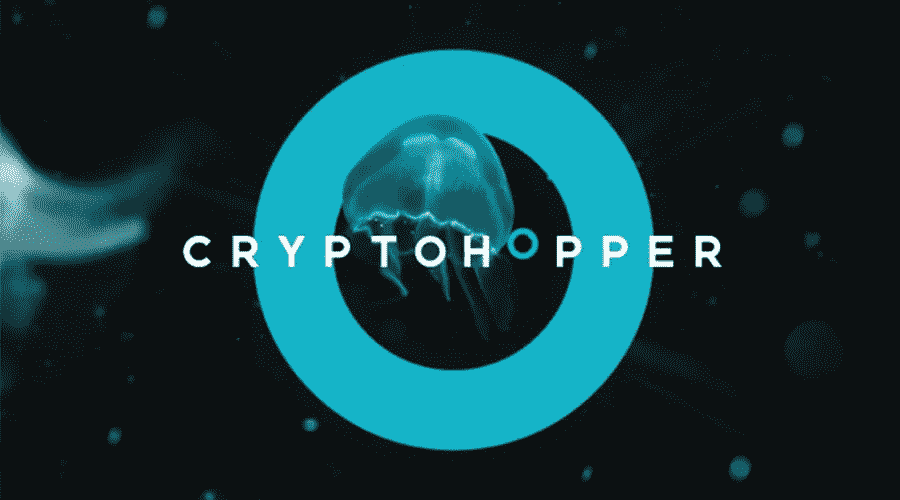

# 4 有利可图的加密交易机器人

> 原文：<https://medium.com/coinmonks/4-profitable-crypto-trading-bot-988db3b2a445?source=collection_archive---------19----------------------->

在这篇文章中，我将介绍最好的加密货币交易机器人。如果你想在你的加密交易中使用交易机器人，请和我一起直到这篇文章结束。

4 profitable crypto trading bot

1-π介子

[***Pionex***](https://www.pionex.com/en-US) 交易机器人是最好的加密货币交易机器人之一。你可以一天 24 小时检查你的所有交易，而无需不断审查加密货币市场。

关于 Pionex 最重要的几点:

*   为小投资者提供 12 个免费的交易所机器人
*   与巨大的交易量相比，交易费用的成本非常低。
*   Pionex 交易机器人允许用户在最好的时间以最好的价格购买，并在正确的时间以正确的价格出售。
*   使用服务的费用:免费
*   活跃于交易所:币安、火币环球和 Pionex。

2-取消验证

[***Dealerify***](https://dealerify.io/)平台不是一个 bot，而是一个在线平台，在加密货币交易领域不需要任何机器人和分析工具。这个平台可以被称为智能交易平台，它允许你同时复制交易、自动交易和管理多个账户，并准确地告诉你在你选择的交易平台上下单。

Dealerify copytrading 平台是最好的加密货币交易工具之一，允许用户轻松管理市场风险。用户也可以选择一个更适合自己交易方式的策略。

关于 Dealerify 的事情是，通过提供交易信号方面的广泛服务，你有权选择哪一个是最好的。在这个平台上提供服务的另一点是，你可以从免费计划中受益，如果你认为合适，可以提供订阅。

关于 Dealerify 最重要的几点:

*   简单的用户界面
*   呈现不同的策略
*   根据用户需求在利润和风险之间进行选择的能力
*   能够访问以前的数据来测试和检验策略
*   为用户提供个人和技术分析的可能性。
*   业绩报告的现实呈现
*   活跃于交易所:币安、OKEX、Kucoin 和 Bybit

3-隐跳虫

[***Cryptohopper***](https://www.cryptohopper.com/)Trader 机器人是世界上最好的加密货币交易机器人之一，它允许用户通过单个账户管理他们所有的加密货币账户。

关于 Cryptohopper 最重要的几点:

*   为用户提供个人和技术分析的可能性。
*   可以访问机器人的不同模式和策略。
*   用户帐户保护是使用特殊说明完成的。
*   可以私下保护所有用户数据。
*   提供与 iOS 和 Android 操作系统兼容的应用
*   及时提交执行情况报告
*   活跃于交易所:币安、Bitfinex、US us、比特币基地 Pro、Bittrex、HitBTC、Bivavo、北海巨妖、Huobi、OKEx、KuCoin 和 Poloniex。

4- Mudrex

易策略创业的另一款加密货币交易机器人是[***mud rex***机器人。Mudrex 帮助用户识别有利可图和有利可图的投资。](https://mudrex.com/)

*   根据用户需求在利润和风险之间进行选择的能力
*   能够访问以前的数据来测试和检验策略
*   使用服务的费用:免费
*   活跃于交易所:币安、比特币基地专业、OKEX、BitMEX、Deribit 和 Bybit

> 加入 Coinmonks [电报频道](https://t.me/coincodecap)和 [Youtube 频道](https://www.youtube.com/c/coinmonks/videos)了解加密交易和投资

# 另外，阅读

*   [八大加密附属计划](https://coincodecap.com/crypto-affiliate-programs) | [eToro vs 比特币基地](https://coincodecap.com/etoro-vs-coinbase)
*   [最佳以太坊钱包](https://coincodecap.com/best-ethereum-wallets) | [电报上的加密货币机器人](https://coincodecap.com/telegram-crypto-bots)
*   [交易杠杆代币的最佳交易所](https://coincodecap.com/leveraged-token-exchanges) | [购买 HTZ 代币](https://coincodecap.com/how-to-buy-htz-token)
*   [5 大最佳社交交易平台](https://coincodecap.com/best-social-trading-platforms) | [瓦济克斯 NFT 印度](https://coincodecap.com/wazirx-nft-india)
*   [10 本关于加密的最佳书籍](https://coincodecap.com/best-crypto-books) | [英国 5 个最佳加密机器人](https://coincodecap.com/uk-trading-bots)