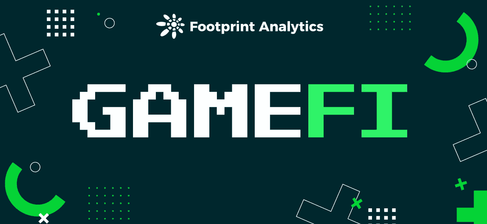
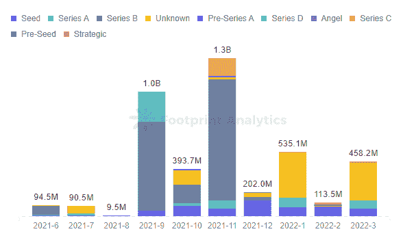
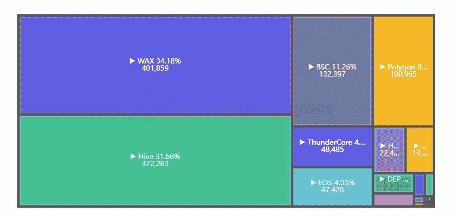
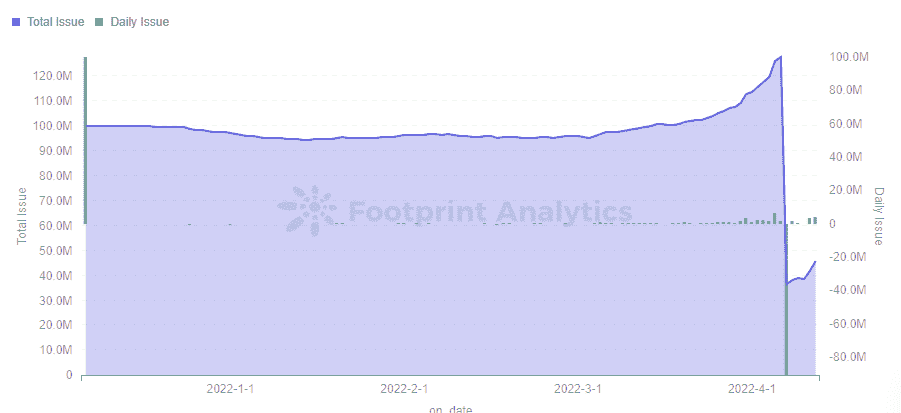
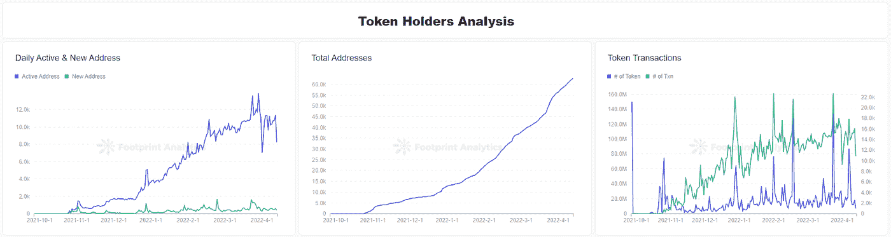
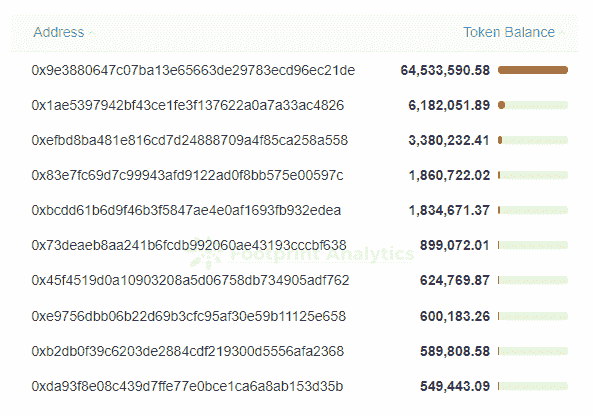
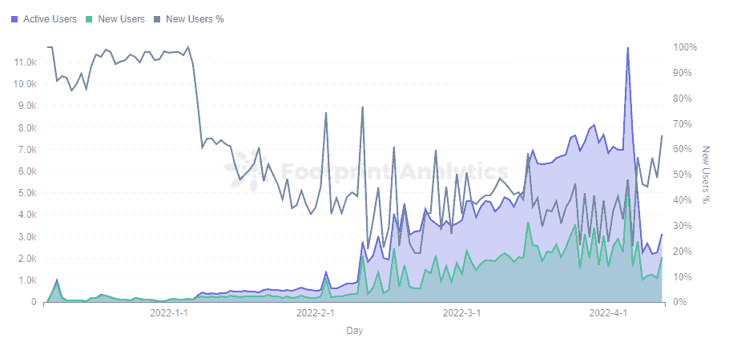
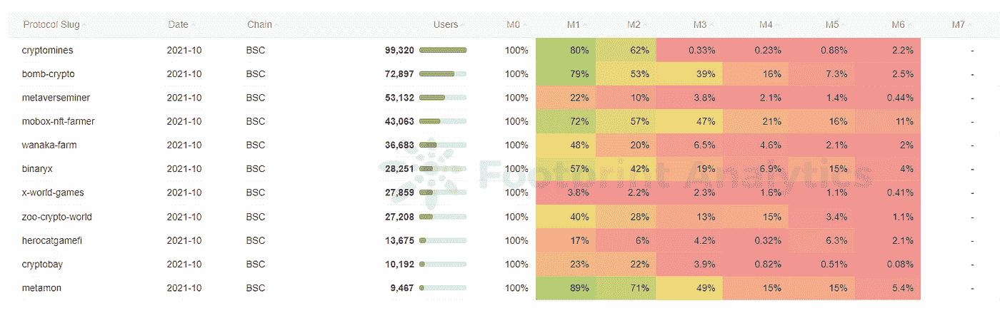

# 投资 GameFi 项目前要问的 4 个问题

> 原文：<https://medium.com/coinmonks/4-questions-to-ask-before-investing-in-a-gamefi-project-f65f9bdb9598?source=collection_archive---------22----------------------->

选择正确的 GameFi 项目并不容易，玩家在投资前必须研究 4 件事。

2022 年 4 月

数据来源:[足迹分析](https://www.footprint.network/?channel=ENG-236)

[2022 年的 GameFi](https://www.footprint.network/guest/dashboard/dashboard-for-game-fi-industry-fp-f7d88ee8-9341-49ae-b497-088bee7ec038?date=past60days&channel=ENG-236#secret=2E95108712AF5CB1949BCFBB804F139C) 延续了去年的受欢迎程度，根据[足迹分析](https://www.footprint.network/?channel=ENG-236)的数据，截至 4 月份，超过 1400 个 GameFi 项目遍布 35 家[连锁店](https://www.footprint.network/guest/dashboard/chain-overview-fp-35dfdf0f-5c59-4504-9907-7374eae92981?date_filter=past90days&channel=ENG-236#secret=727B0EE190659200095FB5F4868DD0EB)。虽然用户数量仍远不及传统游戏，但这些项目在 3 月份吸引了超过 100 万新用户。

GameFi 是游戏赚钱的核心，作为用户，他们不仅享受游戏，还关心游戏带来的收入。因此，一个新的 GameFi 用户在选择项目时应该知道以下四件事。

# 1.团队背景

一个有技术能力的团队可以让项目更加安全，并在不断变化的区块链世界中不断发展。

因此，需要寻找的是有传统游戏背景的团队。这确保了一定程度的质量，因为以前的游戏操作经验。

但是作为 GameFi 项目，游戏的经济模型也是至关重要的，拥有金融背景也可以帮助设计一个好的模型。

接受注资是一定程度的资本认可。获得更多知名 VC 投资或多轮融资都在体现项目的潜力。

*Footprint Analytics — Monthly Amount of GameFi Projects Funded*

游戏的愿景和路线图的完成情况也能看出团队对未来是有明确的定位和明确的方向还是一个只想赚快钱的庞氏骗局。

# 2.游戏设计

除了传统的游戏性方面，区块链游戏需要将 GameFi 元素整合到他们的设计中。将传统游戏系统复制到区块链上可能并不容易。

这种“副本”的一个例子是《被解放的上帝》，它与炉石非常相似，以至于玩家抱怨付费玩一个类似的游戏而没有更多创新。

更符合区块链本土特色的项目将能够获得长久性。移植 NFT 或 DeFi 项目的玩法，整合起来会更有效率，因为 GameFi 的核心是交易和代币经济的设计。

创新也是一个重要考虑因素。市场上充满了游戏脚本，项目可以购买一个现有的代码并修改 UI 来启动一个新游戏。唯一让一款游戏脱颖而出的就是创新，比如 Axie Infinity 不断激发玩家互动的创新育种体系。

游戏设置的门槛对玩家来说也很重要。以太坊上仍然有大量的游戏，但高昂的燃气费和缓慢的交易速度正在赶走许多玩家。相反，玩家聚集在交易成本较低的链上，如 WAX、Hive 和 BSC。

*Footprint Analytics — Market Share of Gamers*

作为 GameFi 的组成部分，一些程序使用 NFT 作为玩家进入的“门票”。玩家应该仔细辨别支付的“门票”是快速赚钱的手段，还是为自己创造价值的 NFT。

虽然对玩家来说似乎不太相关，但游戏的盈利模式——利润如何分配到团队的口袋里——也很重要。

你要寻找的是表明长期项目的盈利模式，而不是暗示团队快速获利的模式。

例如，Starshark 烧掉了团队从发射中分配的所有收入，共计 9143 万海洋，表明团队是在寻找令牌的稳定性，而不是中饱私囊。

# 3.令牌组学

顾名思义，GameFi 一半是游戏，一半是金融，令牌组学是游戏的骨架。除了 NFT 奖金之外，玩家获得收入的最常见方式是通过代币。

有单令牌和多令牌游戏，后者越来越受欢迎。游戏一般包括治理令牌和游戏内令牌。

多令牌模式允许项目更灵活地调整经济模式，因为游戏的次级令牌(游戏内令牌)可以承受更多的抛售压力，并稳定初级令牌(治理令牌)的价格。

代币发行数量、发行机制、归属期和效用都是代币未来的关键指标。

关于玩家用于输入和输出的令牌，有很多需要学习的地方。根据项目的设置，玩家支付的 NFT 入门代币可能是 stablecoin 或 ETH/BNB 这样的主流代币，也可能是项目发行的代币。用户挖掘的大多数令牌都是项目发布的令牌。

使用主流代币进入项目是一种常用的模式，玩家的进入成本是固定的，但获得的收入受代币价格的影响很大。对于使用项目发行的令牌的游戏来说，使用相同的令牌进行输入输出可以保证用户有固定的回报周期，但可能会给玩家带来 FOMO 情绪。

因此，稳定代币价格非常重要，项目通常会设置烧钱机制来控制供需，通过增加代币的效用来减少抛售压力。比如 [StarSharks](https://www.footprint.network/guest/dashboard/Tokenomics-of-(Token)-fp-aa971726-d7a8-4963-8001-a83a4222741e?token_name=starsharks-sea&channel=EN-236) 设置了无数的销毁方式来控制发布的海总数。

*Footprint Analytics — StarSharks Token SEA‘s Daily & Total Issue*

# 4.用户数据

用户数据包括代币持有者的用户简档和游戏中的用户行为数据。

代币持有者的数据可以结合代币组学进行分析。代币市场的活跃反映在每日新的和活跃的地址上。分散式游戏的 Token DG 呈现出相对稳定的新增和活跃地址趋势。然而，频繁的交易也反映了一个事实，即由于该项目的参赛费用是在 ETH 支付的可穿戴 NFT，玩家更有可能铸造和出售。

*Footprint Analytics — ICE Token Holders Analysis*

鲸鱼的运动也会影响代币价格的波动。集中抛售甚至可能造成代币闪崩，所以要时刻关注鲸鱼，防止玩家成为最终接盘者。

分散游戏的代币 ICE 的第一个持有地址是 Uniswap 上的池，它代表了总发行量的 46%,在市场上还没有完全流通。但这也保证了 DEX 的池深，稳定了掉期价格。

*Footprint Analytics — Top10 Address of ICE Token Balance*

参与游戏的用户数据更为重要，大多数项目都是依靠新用户带动老用户的收入，一旦没有新玩家加入项目就会迅速陷入死亡螺旋。项目的任何更新都会得到用户数量的直接正面或负面反馈。

例如，StarSharks 在 4 月初取消了其租赁市场，导致参与游戏的门槛迅速上升，新用户[和活跃用户](https://www.footprint.network/guest/dashboard/Address-Analysis-of-GameFi-Project-fp-77828d1e-35bc-4b6c-90e9-7777e7c6902d?gamefi_name=starsharks&channel=EN-236)数量直线下降。

*Footprint Analytics — StarSharks Daily Users*

一个[留存](https://www.footprint.network/guest/dashboard/Project-User-Retention-Comparison-fp-ba8887fb-dfd6-4961-90dd-9600bed294bd?chain=BSC&month_of_table_1=2021-10&month_of_table_2=2021-11&month_of_table_3=2021-12&channel=EN-236)高的项目，说明这个项目对玩家的粘性更大。BSC 上的 Bomb Crypto 和 Mobox 虽然没有精彩的游戏画面和丰富的可玩性，但是用户留存表现突出，而这两个项目也是目前 P2E 玩家的聚集地。

*Footprint Analytics — Project User Retention Comparison ( 2021–10 )*

# 摘要

选择合适的 GameFi 项目进行投资并不是一件容易的事情。用户需要研究数据、团队和游戏的令牌组学。在区块链的世界里没有不劳而获的事情，所以多做功课以获得更多的回报。

这篇文章由[足迹分析](https://www.footprint.network/?channel=ENG-236)社区提供。

Footprint 社区是一个世界各地的数据和加密爱好者相互帮助了解和获得关于 Web3、元宇宙、DeFi、GameFi 或区块链新兴世界任何其他领域的见解的地方。在这里，你会发现活跃的、不同的声音相互支持，推动着社区向前发展。