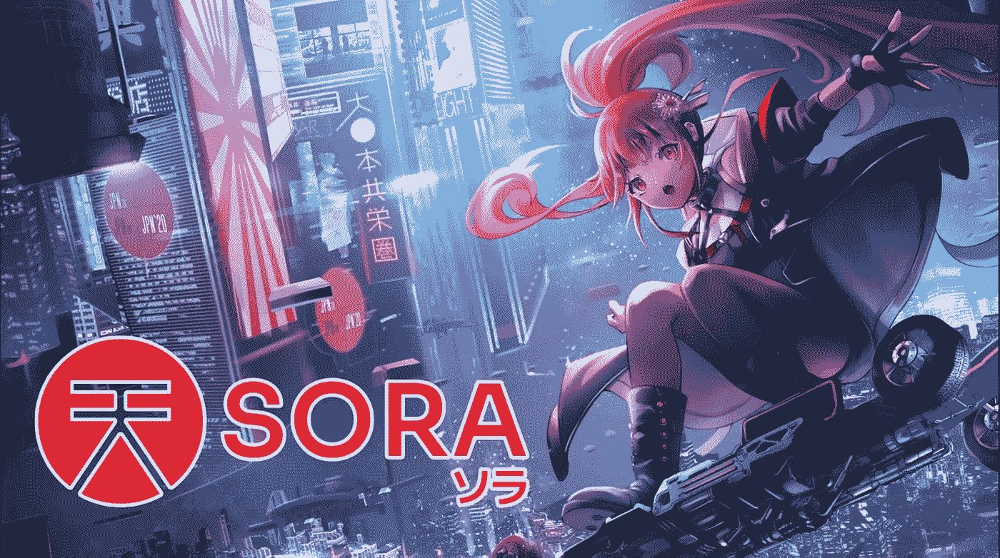
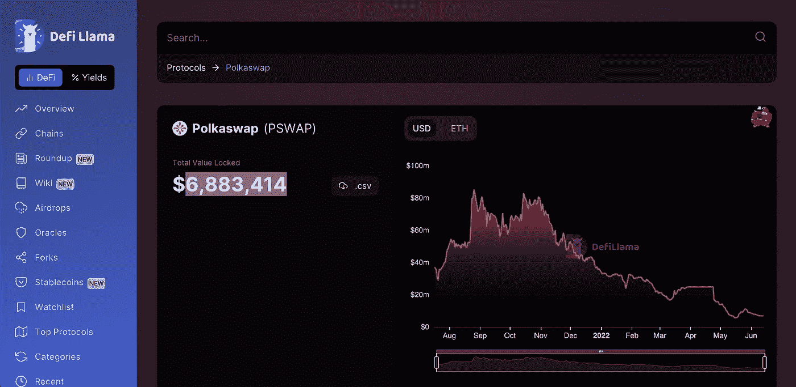
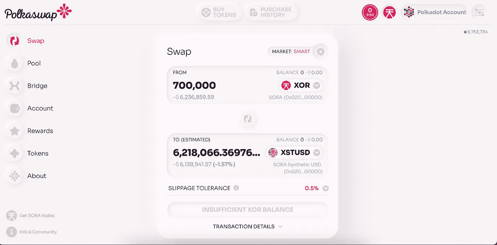
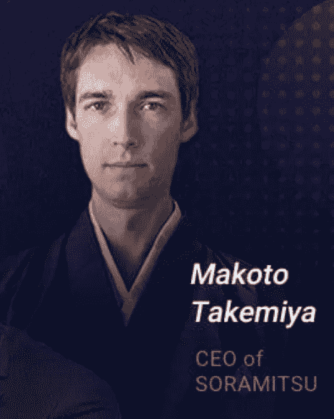

# SORA 将成为加密货币副链驱动力的 4 个原因

> 原文：<https://medium.com/coinmonks/4-reasons-soramitsu-will-be-a-driving-force-in-the-parachain-of-cryptocurrency-488d6b01f872?source=collection_archive---------15----------------------->

## Makoto Takemiya 首席执行官兼联合创始人创建了 SORA(XOR ),这是 Polkadot 生态系统的治理令牌。他于 2013 年通过比特币进入加密货币领域，并于 2014 年作为共识算法的开发人员在 NXT 工作。2016 年，Takemiya 决定创办自己的企业 Soramitsu。我认为 SORA 将成为 Polkadot/Kusama 十大项目的 4 个原因如下:

Soramitsu Takemiya

# **1。Polkadot 生态系统的可扩展性:**

> Makoto 总是在大规模使用和服务 crypto 时看到 crypto 的更大图景。如果你试图将当前的加密用户群推广到整个全球人口，从简单的数学角度来看，你会发现单个网络是无法扩展的。Polkadot 的目标是通过建立一个框架来解决可扩展性问题，许多不同的网络可以聚集在一起，它们可以各自专注于自己的小领域，四处移动资产，甚至可能共享虚拟机空间等东西。因此，Takemiya 选择了 Polkadot 生态系统，因为他看到了其网络的未来潜力。
> 
> Soramitsu 和他的公司正在创造一种分散的方式，让世界各地的人们聚集在一起，进行一些民主监督，以及如何创造新的代币。你如何在一个经济体中分配它们，这就是为什么它被称为分散的？经济系统非常酷。在 Makoto 看来，他认为他在社区可以带来的未来的时刻的硬币将是实现真正可扩展性的最简单的方法，这在理论上可以扩展到包括地球上的每个人。

# **2。波尔卡 wap (PSWAP):**

> **Polkaswap(PSWAP)** 是一个跨链的交换平台，作为 SORA 生态系统中的主要转移和交换。在我看来，与 uni swap 类似，其可扩展性和现场交易功能是跨链 DEX 的领先前沿，许多人将使用该产品并为其提供流动性。
> 
> 在当前时间；*2022 年 6 月 13 日，下午 2:13*。波尔卡斯瓦普的 TVL 坐拥[$**6883414**](https://defillama.com/protocol/polkaswap)**总稀释估值**13300776**。考虑到自 2 月中旬俄乌战争爆发以来，市场一直很糟糕，这是件好事。[2 月 1 日*XOR 交易价为 **$98.95***](https://www.coingecko.com/en/coins/sora) *，PSWAP 交易价为。 **$0.019** 二月。现在 XOR 的交易价格是 9.52 美元，PSWAP 的交易价格是 0.00133 美元。目前，从 132 天的交易来看，XOR 的市盈率是 10 倍，PSWAP 的市盈率是 14.28 倍。***
> 
> ***对于 132 的持有和等待来说，这是一笔令人敬畏的伟大投资。在这个市场上，随着战争的持续，资产可能会变得更加不稳定。这是一个购买和持有有价值资产的好机会，如果配置得当，这种资产可以提供金融财富。***

******

# *****3。XSTUSD:Stablecoin*****

> ***XSTUSD 是 polkaswap 生态系统上的第一个源合成稳定点之一，它的功能类似于 Luna Stablecoin。有了这个功能，投资者可以烧 XOR 来接收 XSTUSD，并获得可能的最佳汇率，因为黑脸田鸡的无限造币。Makoto 早在 2018 年就提出了这个想法，现在正在努力，并在今年 2022 年建成。通过使用这种方法，投资者基本上有助于稳定和减少 XOR 的供应，同时以 XST 的形式接收美元。***

******

***1.57% Slippage Tolerance on $6.2 million trade is Extremely Good.***

> ***在我看来，这是黑脸田鸡生态系统的一个辉煌的组成部分。致力于看到 XOR 的积极进步和潜力的人将利用这一机会，通过这样做以 XST 的形式获得相同金额的 1:1 等值美元；这将通过减少 XOR 的供应来增加和稳定价格。***

# *****4。雅典的治理模式/体系*****

> ***Makoto Takemiya 采用了雅典民主的模式。目前，黑脸田鸡正处于其年轻的婴儿生态系统，基质治理作为一种功能被广泛采用，就像草间弥生或波尔卡多特一样，人们可以通过二次投票锁定令牌来获得更多的信念。在未来，他希望将 SORA 转变为一个多州治理管道，通过多个阶段随机选择董事和负责人，最终提供最公平和最诚实的方式来促进人们管理 SORA。***

******

> ***这种方法被称为****抽中，人们在这里抽中就好像是一种抽奖式的选择。在我看来，这是 SORA 最吸引我的一个诚实和公平的生态系统。老实说，当硬币在 2020 年 5 月 11 日以 0.085 美元推出时，我错过了公平的推出和潜力。根据硬币壁虎在 2021 年 4 月 6 日的数据，它达到了 981.83 美元的高点。对于任何在低点买入，在高点卖出的人来说，这是 11，550%的投资回报率，我相信很少有人会这样做。*******

## *****这是我认为 Soramitsu 将成为在 Polkadot/草间弥生网络上工作的加密货币生态系统的一个非凡项目的主要原因。Makoto Takemiya 设计了一个出色的生态系统，它的功能是让投资者和所有者变得更加民主化。*****

## *****Makoto 一直认识到加密的更大前景，特别是在大规模使用和服务加密货币方面为公众服务的时候。此时此刻，如果你相信 SORA 生态系统的话，这是一个以这个便宜的价格购买这个令牌并开始 DCA 的绝佳机会。我会密切关注这个项目。*****

**********

*****[**NAMASTE**](https://sora.org/)*****

> *****加入 Coinmonks [电报频道](https://t.me/coincodecap)和 [Youtube 频道](https://www.youtube.com/c/coinmonks/videos)了解加密交易和投资*****

# *****另外，阅读*****

*   *****[分散交易所](https://coincodecap.com/what-are-decentralized-exchanges) | [比特 FIP](https://coincodecap.com/bitbns-fip) | [宾邦评论](https://coincodecap.com/bingbon-review)*****
*   *****[用信用卡购买密码的 10 个最佳地点](https://coincodecap.com/buy-crypto-with-credit-card)*****
*   *****[加拿大最佳加密交易机器人](https://coincodecap.com/5-best-crypto-trading-bots-in-canada) | [比特 vs 币安](https://coincodecap.com/bybit-binance-moonxbt)*****
*   *****[阿联酋 5 大最佳加密交易所](https://coincodecap.com/best-crypto-exchanges-in-uae) | [SimpleSwap 评论](https://coincodecap.com/simpleswap-review)*****
*   *****购买 Dogecoin 的 7 种最佳方式 | [ZebPay 评论](https://coincodecap.com/zebpay-review)*****
*   *****[最佳期货交易信号](https://coincodecap.com/futures-trading-signals) | [流动性交易回顾](https://coincodecap.com/liquid-exchange-review)*****