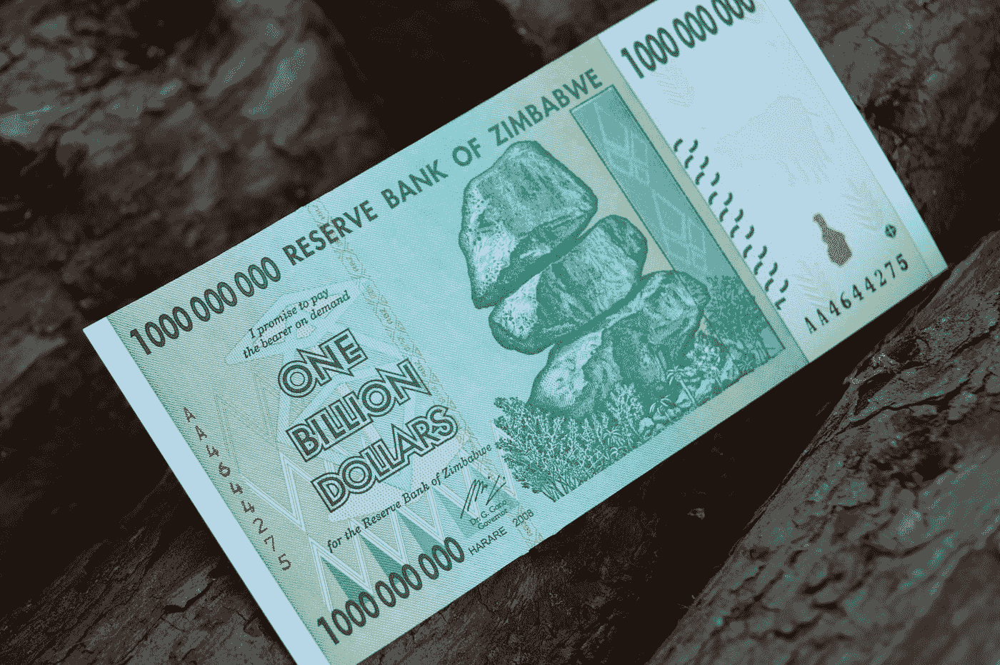

# 货币贬值的 4 个原因。

> 原文：<https://medium.com/coinmonks/4-reasons-why-money-is-depreciating-28d41b9c805c?source=collection_archive---------28----------------------->

Photo by [Sharon McCutcheon](https://unsplash.com/@sharonmccutcheon?utm_source=medium&utm_medium=referral) on [Unsplash](https://unsplash.com?utm_source=medium&utm_medium=referral)

*为什么货币会贬值？*

为什么我们持有的货币购买力在下降？我们做错了什么吗？为什么我们需要持有超过 1.5 倍的资金来购买我们一直能够购买的东西？

首先，我们需要了解货币贬值意味着什么，是什么原因导致货币贬值，货币贬值时会发生什么

**目录**

-货币贬值是什么意思？

——什么原因导致货币贬值？

-货币贬值会怎样？

-折旧对企业有好处吗？

在上一篇文章中，我们讨论了钱为什么有价值？在那里我们了解了钱的价值背后的主要因素。如果你还没有读过它，并且很想读，请在这里阅读；[https://medium . com/coin monks/why-money-value-at-all-89ca 658 DD 080](/coinmonks/why-is-money-valuable-at-all-89ca658dd080)

这就把我们带回了主题，为什么货币会贬值？从上一篇文章中，我们了解到需求和供给是金钱有价值的原因。这些也是货币贬值的原因。此外，通货膨胀和国家政策也是货币贬值的原因。

Photo by [Алекс Арцибашев](https://unsplash.com/@lxrcbsv?utm_source=medium&utm_medium=referral) on [Unsplash](https://unsplash.com?utm_source=medium&utm_medium=referral)

**货币贬值是什么意思？**

众所周知，货币是任何一种被普遍接受用来交换商品和服务的物品，也可以用来清偿债务、支付账单等。由于钱的用途，这赋予了钱价值。在某些时候，物品/货币的价值会因为一些因素或情况而受到影响，使得货币的价值贬值或升值。当价值下降时，这意味着货币的购买力下降，需要更多的货币来满足同样数量或类型的公共事业。例如，要将 A 国的货币兑换成 B 国的货币，需要 1:1 的兑换比率。当 B 国的货币贬值时——这个比率相对于 B 国发生变化，比方说比率变成 2:1。这意味着 B 国的货币价值减少了一半。

据[in2013dollars.com](http://www.in2013dollars.com.)说，从 1922 年到 2022 年超过 100 年。1922 年的 100 美元现在值 1720.89 美元；在这里，有 1，620.89 美元的增长，这意味着美元已经失去了 94%的价值。还有，考虑到 1922 年的 100，现在价值 6054.65，英镑已经贬值 98%。

这些货币贬值的原因是什么？

**什么原因导致贬值？**

一些因素造成贬值；这可能是政府诱导的贬值，也可能是在国内进行的经济活动。

下面我们突出货币贬值的因素。

1)量化宽松(QE):量化宽松(QE)，通俗地说就是央行向普通大众释放货币/现金。

-他们怎么做到的？

-它如何影响经济？

中央银行购买金融资产，如政府债券和其他证券。它通过印刷钞票来实现购买证券的过程。当中央银行购买这些证券时，它把钱给政府和出售这些证券的公司，这些钱被出售方用于经济中。这自动降低了利率，因此鼓励当地企业和个人借钱/寻找资金来源，这增加了国家的货币/现金供应。央行拥有国债和抵押贷款支持证券，因此央行购买或交换印刷的货币来购买国债。与此同时，这为当地银行发放贷款提供了现金，并鼓励人们贷款，因为利率已经下降。

对经济有什么影响？

量化宽松旨在提振国家经济；人们被鼓励通过降低利率来借款和为他们的企业提供资金。通过商业部门的所有活动，如果做得好，国家的经济会得到改善。我们的出口可以高于进口。我们可以有更多的制造企业，国家的研发产业将得到加强。然而，尽管量化宽松的主要目的是提振国家经济，但它往往会导致混乱；这是因为必须计算适当的货币供应量。如果计算达不到预期值，量化宽松的目的就没有达到。同样，假设货币供应超过了需求；流通中的货币太多了。如果货币供应超过需求，这将导致货币贬值，经济状况可能恶化。
在过去的几年里，美国、英国和瑞士等国家实施了量化宽松政策，作为其应对金融危机的货币政策的一部分，这可能有助于提振经济，但从长远来看，它会带来通货膨胀，而且是以缓慢的速度发生的。
根据[investopedia.com](https://investopedia.com/)的说法，量化宽松意味着；是一种非常规货币政策，中央银行从公开市场购买长期证券，以增加货币供应，鼓励贷款和投资。购买这些证券为经济增加了新的资金，并通过抬高固定收益证券来降低利率。它还扩大了央行的资产负债表。”

2)通货膨胀:这是一种商品和服务价格随着时间的推移而上涨的经济状况。为了便于理解，这里有一个例子，如果一个购物袋在 2015 年的价格是 100 美元，那么同样的一包在 2022 年的价格是 157.20 美元。那一包的价格上涨了 57.2%；现在，我们可以说通货膨胀影响了包的价格。在一个结构严谨的意义上，通货膨胀是由于货币价值的下跌和上涨而导致的商品和服务价格的普遍上涨。几个因素可以导致通货膨胀，但我们将讨论其中的两个因素。第一种是当一种产品的总需求超过供给时，由于太多的货币追逐该产品。当一个国家的货币供应量增加时，就会引起对某种产品或服务的更多需求，直到供应不能满足需求为止。因此发生了通货膨胀；这种类型的膨胀叫做。需求拉动型通货膨胀。此外，当生产成本、工资成本、原材料成本和劳动力成本增加时，当所有这些价格上涨时，通货膨胀就会发生；这种类型的膨胀叫做。成本推动的通货膨胀，因此货币的购买力(价值)下降。

3)进口激增:进出口活动与一种货币的价值有很大关系；当 A 国进口一种产品时，它从 B 国购买，我们可以说出口国变得更加繁荣，我们可以说出口国获得了一些货币或外币。这自然会使进口国对另一国的经济做出贡献。有了这个简单的解释，我们可以同意，一个国家的经济可以改善的唯一途径是当他们的出口大于进口。例如，当一个国家，即 A 国，从另一个国家 B 进口的比率。这意味着该国向 B 国提供财政能力，而 A 国向 B 国或任何其他国家的出口不足以抵消进口的增加。这意味着 A 国通过其进口对其他国家的贡献大于它从其他国家获得的贡献或收益，使它们的贸易活动对经济不利。当贸易平衡出现时，进口多出口少的国家将不得不平衡与其他国家的贸易；通过这种方式，他们的货币贬值了。

4)当中央银行降低利率时，这符合第一点。当央行降低利率时，虽然该国人民被鼓励借贷，但往往会排斥外国投资，因为低利率意味着投资者在投资该国资产时获得的利息更低。因此，由于外国在该国的直接投资减少，该国货币贬值。

让我们看看上面读到的一些术语；股份、股票、债券、国库券和证券对于资产的意义。

股份:股份是公司所有权的一个单位；它是最小的单位，最小的部分，公司所有权的微小百分比。

股票:股票是公司所有权的总单位。它包括一家公司的股本可以分割的全部股份。它也是整个公司股份的一个部分(但不是小或分钟)单位。

债券:债券是一种证券形式，其中债券发行人(委托人)欠持有人(持有人)一笔债务，并有义务在到期时偿还，通常根据商定的条款支付利息。

证券:在金融领域，证券是一种可交易的资产。它可以是股份、股票，也可以是债券。

国库:这是一个国家的资金、收入和财政财富。

Photo by [Rob](https://unsplash.com/@rrrob_?utm_source=medium&utm_medium=referral) on [Unsplash](https://unsplash.com?utm_source=medium&utm_medium=referral)

**货币贬值会发生什么？**

已经确定了货币贬值的原因。探讨货币贬值对经济的影响很重要。一国货币贬值的影响总结如下:

1)进口成本高。:由于一个国家的货币贬值。将货物和产品进口到该国的成本将高于正常水平。价格的飙升是因为进口的比率急剧上升，以至于进口在国内创造了比需求更多的供给。此外，汇率也发生了变化。进口国将支付更多以平衡贸易或汇率比率，从而将汇率保持在有利的水平。

2)恶性通货膨胀发生:虽然通货膨胀会导致国家货币的价值下降，但如果管理不当，就会发生进一步的通货膨胀，恶性通货膨胀就会在国家经济中出现。这使得该国的购买力大幅下降，并导致经济崩溃。因为购买力已经贬值，随着时间的推移，进口设备的成本显著增加。这影响了该国的生产，减少了生产，导致该国的产品供应减少。当这种情况发生时，供应将无法与需求平衡。正因为如此，资源变得有限而昂贵。

3)失业:货币贬值的影响迫使企业降低生产成本、劳动力和工资。当这种情况发生时，被解雇的人数将急剧上升，因为这些企业无法应付工资和劳动力成本。该国的外国投资趋于下降，这导致该国的高失业率。

4)出口变得更便宜:货币贬值的一个好处是它鼓励出口。这是因为出口的成本会更实惠。其他国家的人或组织也将被鼓励从这个国家进口，因为在高购买力的国家，商品、产品和服务的价格变得更便宜。这是一个好处，因为当一个国家专注于出口时，它可以帮助提高货币价值，稳定经济。

这可以通过详细的计划策略来实现。虽然该国的生产成本增加，但在该国开展的一些活动可能会得到政府的补贴和支持。像农业这样的活动可以帮助提高货币的价值，政府的必要支持可以促进农产品产量的增加。这种农产品可以从这个国家出口。

Photo by [Annie Spratt](https://unsplash.com/@anniespratt?utm_source=medium&utm_medium=referral) on [Unsplash](https://unsplash.com?utm_source=medium&utm_medium=referral)

折旧对企业有好处吗？

如前所述，贬值会导致国家经济的衰退。然而，问题是，它如何影响企业，影响到什么程度？

一般来说，当货币贬值时，当地企业往往要么破产，要么降低劳动力成本。然而，在该国经营出口业务的公司往往营业额较高，因为该国政府通过各种激励措施鼓励出口。它给国家带来的好处数不胜数。通过这些活动，政府可以从出口税和农业活动中获得一些收入。

一个国家的货币贬值通常被认为是一个国家的不利经济状况。然而，它可以作为一种工具来纠正一个国家的进口增长，特别是当进口增长率高于出口增长率时。随着时间的推移，当一个国家在没有计划的策略下贬值其货币时。通常很难回到以前的值。

> 加入 Coinmonks [电报频道](https://t.me/coincodecap)和 [Youtube 频道](https://www.youtube.com/c/coinmonks/videos)了解加密交易和投资

# 另外，阅读

*   [5 款最佳加密交易终端](https://coincodecap.com/crypto-trading-terminals) | [最佳 DeFi 应用](https://coincodecap.com/best-defi-apps)
*   [比特币基地 vs 瓦济克斯](https://coincodecap.com/coinbase-vs-wazirx) | [比特鲁点评](https://coincodecap.com/bitrue-review) | [波洛涅克斯 vs 比特克斯](https://coincodecap.com/poloniex-vs-bittrex)
*   [德国最佳加密交易所](https://coincodecap.com/crypto-exchanges-in-germany) | [Arbitrum:第二层解决方案](https://coincodecap.com/arbitrum)
*   [币安交易机器人](/coinmonks/binance-trading-bots-d0d57bb62c4c) | [OKEx 评论](/coinmonks/okex-review-6b369304110f) | [Atani 评论](https://coincodecap.com/atani-review)
*   [最佳加密交易信号电报](/coinmonks/best-crypto-signals-telegram-5785cdbc4b2b) | [MoonXBT 评论](/coinmonks/moonxbt-review-6e4ab26d037)
*   如何在 Bitbns 上购买柴犬(SHIB)币？ | [买弗洛基](https://coincodecap.com/buy-floki-inu-token)
*   [CoinFLEX 评论](https://coincodecap.com/coinflex-review) | [AEX 交易所评论](https://coincodecap.com/aex-exchange-review) | [UPbit 评论](https://coincodecap.com/upbit-review)