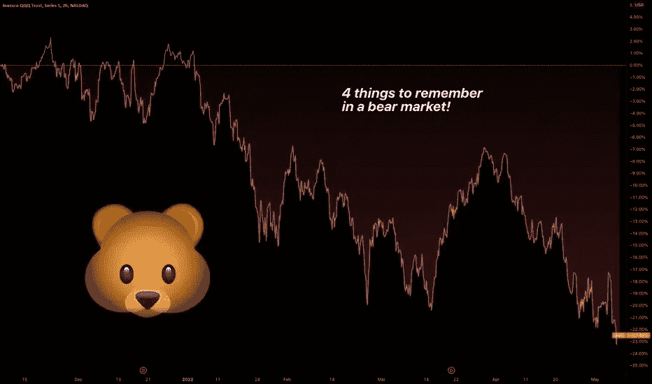

# 熊市中要记住的 4 件事

> 原文：<https://medium.com/coinmonks/4-things-to-remember-in-a-bear-market-c977582ace93?source=collection_archive---------45----------------------->

唷，多好的一周。资产全线下跌，纳斯达克正式结束了本周的熊市。对于密码交易员来说，[比特币](https://www.tradingview.com/symbols/BTCUSD/)、[以太坊](https://www.tradingview.com/symbols/ETHUSD/)和其他一些密码资产已经被削减了一半，甚至更多。尽管 T4 标准普尔 500 指数仅从高点下跌了 13-14%，但只有 25%的上市股票高于 200 天移动平均线。可以肯定地说，在经历了过去两年我们所看到的几乎所有事物的大规模牛市之后，我们现在正式进入了熊市。

# 因为这可能是我们社区中许多人经历的第一次熊市，我们认为发布一个关于熊市需要记住的关键事情的小指南会有所帮助，以帮助人们驾驭这一新的市场机制。

# 让我们跳进来吧！

# 1.波动性让你的头寸在损益方面感觉更大💥

# 熊市通常会比牛市带来更大的资产价格波动。在过去的 20 天里，我们看到这些指数的平均每日波动约为 3%，远高于 2021 年约 0.9%的连续 20 天平均水平。在同样的资金量下，平均范围的增加意味着以美元计算，你的损益波动可能比“正常”要大得多。2020 年 3 月， [S & P 500](https://www.tradingview.com/symbols/SPX/) 日均幅度超过 5%！

# 记住这一点很重要，因为损益会对交易者心理产生巨大的影响。许多专业基金经理和对冲基金控制这一因素，减少风险敞口，以保持每日投资组合波动率接近他们的目标。一些基金被授权这样做。虽然你可以自由地按照你的交易计划做你想做的事情，但这是一个关键的期望！期待比平常更大的动作。

# 2.)熊市平均持续约 2 年📉

# 2 年这个数字主要指的是股市熊市平均持续的时间。到目前为止，平均熊市持续了大约 9 个月。相比之下，在股票方面，牛市平均持续时间超过 6 年。因此，尽管熊市往往比股市上涨快得多，但它们也往往更令人难忘。

# 最近，熊市越来越短——2020 年的上一次熊市仅仅持续了几个月。一些人将此归因于美联储越来越多的介入，而另一些人则经常声称，我们在 21 世纪享有的更好的通信基础设施使信息能够更快地定价。虽然趋势肯定是越来越短的熊市，但熊市持续的时间往往比人们预期的要长。相应调整预期！

# 3.)现金是一种立场💵

# 虽然美元[通货膨胀](https://www.tradingview.com/ideas/fundamental/)目前很高，约为 7-10%(取决于你看到的数字)，但一美元的购买力每天都不会发生太大变化。一股[间谍](https://www.tradingview.com/symbols/AMEX-SPY/)的购买力每天变化更快，最近，它失去购买力的速度更快。对于熊市来说，要记住的最重要的事情是活下去是最重要的事情。只要不炸，还能活着改天再战。逃离表现不佳的资产以获取现金是一种选择。

# 这种情况最近一直在发生。如果你看看主要的资产类别，你会发现人们似乎都在转向现金。债券、股票、[黄金](https://www.tradingview.com/symbols/COMEX-GC1!/)、密码——这些都被出售以换取现金。在“规避风险”的环境中，通常保守的投资者会从股票等风险资产转向国债等“更安全”的资产。也就是说，随着美联储加息和通货膨胀高涨，人们似乎跳过了债券 3%的收益率，转而选择现金的完全灵活性。对冲的另一个选择是卖出你认为表现不佳的空头资产，或者买入你投资组合中的看跌期权(如果有的话)。在期权市场可以直接看到睡个好觉的价格。

# 4.)抄底很难🎣

# 虽然作为交易者，我们的工作是寻找具有正预期价值的机会，但抄底在历史上一直非常具有挑战性。在 2020 年的崩盘中，许多著名的对冲基金在崩盘前对冲不足，在崩盘后对冲过度。实际上，世界上一些最聪明的人在选择可能的底部时做得很差。

# 除非你有一个非常长期的战略，允许资本随着时间的推移持续部署( [DCA](https://www.tradingview.com/symbols/FWB-DCA/) )，否则试图在下跌趋势的市场中寻找底部可能是一个非常低的 bat 比率%策略。

# 好吧。就是这样。熊市新手要记住的 4 件事。正如我们提到的，在更困难的市场中最重要的事情是活下去！🐻

# 祝你一周愉快！😄

> 加入 Coinmonks [电报频道](https://t.me/coincodecap)和 [Youtube 频道](https://www.youtube.com/c/coinmonks/videos)了解加密交易和投资

# 另外，阅读

*   [CoinDCX 评论](/coinmonks/coindcx-review-8444db3621a2) | [加密保证金交易交易所](https://coincodecap.com/crypto-margin-trading-exchanges)
*   [红狗赌场评论](https://coincodecap.com/red-dog-casino-review) | [Swyftx 评论](https://coincodecap.com/swyftx-review) | [CoinGate 评论](https://coincodecap.com/coingate-review)
*   [Bookmap 评论](https://coincodecap.com/bookmap-review-2021-best-trading-software) | [美国 5 大最佳加密交易所](https://coincodecap.com/crypto-exchange-usa)
*   [如何在 FTX 交易所交易期货](https://coincodecap.com/ftx-futures-trading) | [OKEx vs 币安](https://coincodecap.com/okex-vs-binance)
*   [CoinLoan 评论](https://coincodecap.com/coinloan-review) | [YouHodler 评论](/coinmonks/youhodler-4-easy-ways-to-make-money-98969b9689f2) | [BlockFi 评论](https://coincodecap.com/blockfi-review)
*   [XT.COM 评论](https://coincodecap.com/profittradingapp-for-binance) | [币安评论](https://coincodecap.com/xt-com-review)