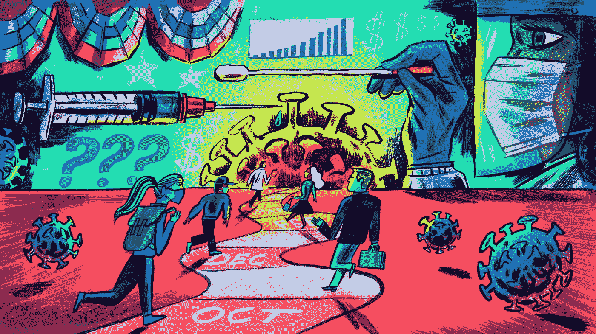

# 4 个小贴士让你在危机时刻不会失去你的财富

> 原文：<https://medium.com/coinmonks/4-tips-so-you-do-not-lose-your-fortune-in-a-time-of-crisis-957c2e29e33a?source=collection_archive---------45----------------------->

# 在危机时刻保持冷静和学习如何投资的四个关键

俄罗斯入侵乌克兰的最新消息导致市场大幅波动，专家们被建议在当前时机进行投资时比以往任何时候都要谨慎。我们正在讨论的四个事实有助于在这种情况下保持冷静，不要做出草率的决定:

投资股票市场在短期内充满危险，但从长期来看风险较小

基于近 100 年的美国股票市场行为数据，我们发现，如果只投资一个月，我们将在平均通胀基础上损失约 40%的资本，这是我们分析的 1153 个月中的 460 个月所发生的情况。

然而，如果投资持续的时间更长，结果会变得更积极。例如，在这 12 个月中，资本可能损失了不到 30%。值得注意的是，对于股票市场来说，这一年的时间并不短。相比之下，五年后，这一数字降至 23%。10 年后的 14%。我们的分析不包括基于通货膨胀的股票市场遭受损失的 20 年时间。

的确，你不能完全排除长期亏损的可能性。但是，很少。

相比之下，虽然流动资金看起来更安全，但贬值的可能性是因为更大的通货膨胀。上一次克服对通货膨胀的批评是在 2006 年 2 月至 2011 年 2 月的五年中，但目前我们不认为这一趋势会改变。

**大多数年份的下降幅度超过 10%，但长期表现强劲。**

上周周四，全球股市从峰值下跌了 10%，周五有所回升，但本周早些时候再次下跌。

这可能看起来像 10%的比率明显减少，但它们是普遍存在的。在过去的 50 年中，美国市场至少有 28 年下跌了 10%。过去十年包括 2012 年、2015 年、2016 年、2018 年和 2020 年。

尽管路上有这些障碍，美国股票市场的价值在过去的 50 年里平均每年增长 11%。因此，在证券市场上，投资者应该为了长期回报而承受短期风险。

**在大幅下跌后卖出股票可能会让投资者付出将股票分配到退休账户的代价。**

虽然市场到目前为止没有过度下跌，但可以排除更多的波动，而且风险是无害的。如果发生这种情况，你可能会很想卖掉股票，加快赚钱的速度。

然而，我们的分析表明，从历史上看，这可能是投资者做出的最糟糕的财务决策。这样做当然意味着需要很长时间来弥补损失。

例如，在大萧条的前 25%崩溃后，那些在 1929 年转换成现金的投资者，直到 1963 年才以同样的价值收回他们的钱。相反，如果投资者继续留在市场上，他们可以在 1945 年初收回资金。值得注意的是，在这场危机中，股市最终下跌了 80%以上。因此，转移到现金可能会避免崩溃阶段最严重的损失，但后来证明这是迄今为止最糟糕的长期战略。

同样，那些在 2001 年在科技公司倒闭危机中暴跌 25%后转换成现金的投资者看到，到今天为止，他们还没有从投资组合损失中完全恢复过来。

简而言之，它退出了市场，在大幅下跌后使用流动现金从长期来看是投资组合的负回报。

股票市场的不确定性达到了最高水平，并且好于预期。

最近，俄罗斯和乌克兰之间的紧张局势升级，导致股市的“恐惧指标”Fix 指数上涨。固定价格衡量交易者对未来 30 天标准普尔 500 波动的预期。

因此，该指数在过去几天上升至 32，远高于 1990 年以来的平均水平，为 19，远高于今年年初的水平 17。因此，不难想象在事件发生后的未来几天，这一指标会升至最高水平。

但是，它是历史的而不是出售的时间。最容易接受的投资者会经历最不稳定的时期，将不确定性降到最高点，以获得更好的回报。事实上，当 Fix 指数在 28.7 和 33.5 之间时，平均而言，12 个月的标准普尔 500 平均回报率超过 15%。超过 33.5 时超过 26%。

我们还研究了策略的变化，即出售股票(S & P 决策 500)并在每次进入 Fix 这一上部时切换到日常流动资金，然后在价格再次下跌时返回投资股票。自 1991 年以来，继续投资股票的策略的最差表现可能是每年 2.3%的利润率(7.6%比 9.9%，不包括费用和账户成本)。

这笔投资是 1990 年 1 月投资在投资组合中的 100 美元。持续的疲软等于为改变策略而选择的投资组合中 100 美元的投资价值。

与所有投资一样，过去发生的事情不一定是未来会发生的事情的证据，但历史指出，恐惧达到顶峰的时期，如我们目前目睹的时期，比股票投资的预期要好。

> 加入 Coinmonks [电报频道](https://t.me/coincodecap)和 [Youtube 频道](https://www.youtube.com/c/coinmonks/videos)了解加密交易和投资

# 另外，阅读

*   [创造并出售你的第一个 NFT](https://coincodecap.com/create-nft) | [密码交易机器人](https://coincodecap.com/best-crypto-trading-bots)
*   [如何在 CoinDCX 上购买柴犬(SHIB)币？](https://coincodecap.com/buy-shiba-coindcx)
*   [CBET 评论](https://coincodecap.com/cbet-casino-review) | [库科恩 vs 比特币基地](https://coincodecap.com/kucoin-vs-coinbase) | [拜比特 vs 比特币基地](https://coincodecap.com/bybit-vs-coinbase)
*   [折叠 App 回顾](https://coincodecap.com/fold-app-review) | [LocalBitcoins 回顾](/coinmonks/localbitcoins-review-6cc001c6ed56) | [Bybit vs 币安](https://coincodecap.com/bybit-binance-moonxbt)
*   [加密保证金交易交易所](/coinmonks/crypto-margin-trading-exchanges-428b1f7ad108) | [赚取比特币](/coinmonks/earn-bitcoin-6e8bd3c592d9) | [Mudrex 投资](https://coincodecap.com/mudrex-invest-review-the-best-way-to-invest-in-crypto)
*   [WazirX vs CoinDCX vs bit bns](/coinmonks/wazirx-vs-coindcx-vs-bitbns-149f4f19a2f1)|[block fi vs coin loan vs Nexo](/coinmonks/blockfi-vs-coinloan-vs-nexo-cb624635230d)