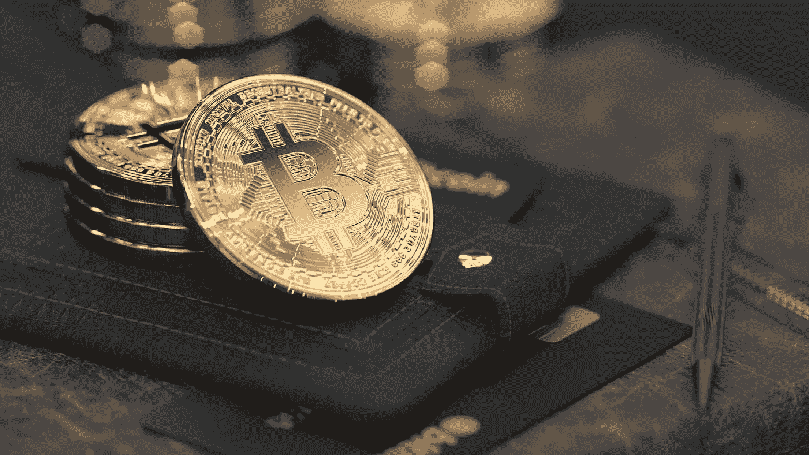

# 每个密码交易员都应该有 4 个钱包。

> 原文：<https://medium.com/coinmonks/4-wallets-every-crypto-trader-should-have-ef40624a11d7?source=collection_archive---------35----------------------->

Source: Unsplash.com

比特币网络的区块链技术极其安全。然而，一些比特币钱包并不像其他的那样安全。要储存比特币并进行交易，你需要一个钱包。没有理由把自己局限在一种钱包里。强烈建议拥有多个账户，因为如果小偷或黑客获得了你的比特币钱包，他们可以将你的所有资金提取到他们自己的账户中。

请记住，因为区块链创建了不可变的记录，你不能编辑，如果发生这种情况，你将无法恢复你的比特币。

> **参见:** [**你可能正在与加密上瘾做斗争的 10 个迹象。**](https://wire.insiderfinance.io/10-signs-you-might-be-struggling-with-crypto-addiction-d14206302936)

**不同类型的钱包**

**1。兑换钱包**

如果你使用比特币进行交易，大多数加密货币交易所都会为你提供一个在线钱包来保存你的比特币。这些真的很容易使用，因为你所需要做的就是连接到互联网，使用你的在线钱包进行交易。它们也被称为在线钱包。

在线钱包是“热门钱包”，这意味着你可以立即使用它们进行比特币交易。如果你有互联网连接，你可以在世界任何地方访问你的在线钱包。问题是小偷和黑客也可以这么做。

比特币交易所提供的在线钱包的另一个问题是，如果你的账户因任何原因被暂停，交易所可以阻止你访问你的钱包。如果他们永久关闭你的帐户，你将失去一切。

**2。桌面钱包**

桌面钱包的工作方式更像是安装在笔记本电脑或台式电脑上的软件。这是一个中等安全等级的钱包。如果您断开计算机与互联网的连接，黑客将无法访问您的桌面钱包。然而，一旦你重新连接，你就会变得脆弱。

黑客访问你的桌面钱包比访问 exchange 钱包要困难得多。然而，这是可能的。如果您的计算机变得不可用，并且您没有备份桌面钱包，您将会丢失所有数据。

> **另见:** [**5 玩赚游戏，将在 Q2 2022 炸掉。**](/coinmonks/5-play-to-earn-games-that-will-blow-up-in-q2-2022-33585b1e2a7e)

**3。纸质钱包**

你的比特币钱包是一张纸，上面有你所有的私钥信息。你可能会认为用纸片来保存你的比特币信息并不真正符合现代技术，但这实际上是一种极其安全的存储比特币的方式。

目前还没有记录在案的网络窃贼窃取文件的事件，将来也不太可能有。纸钱包最困难的方面是决定把纸放在哪里，这样别人就找不到了。如果你有大量的比特币，可以考虑保险箱或保管箱。

**4。硬件钱包**

最昂贵的选择是硬件钱包，通常是一个 u 盘，你可以随身携带。这些是目前最安全的比特币钱包，如果你打算做长期投资者，强烈建议你购买一个。

当你想进行比特币交易时，你必须将硬件钱包插入电脑。完成交易后，取出硬件钱包并安全存放。

> 加入 Coinmonks [电报频道](https://t.me/coincodecap)和 [Youtube 频道](https://www.youtube.com/c/coinmonks/videos)了解加密交易和投资