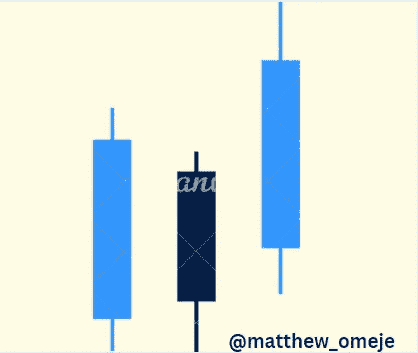

# 掌握密码交易和投资心理的 4 种方法

> 原文：<https://medium.com/coinmonks/4-ways-to-master-your-crypto-trading-and-investing-psychology-4b049326af26?source=collection_archive---------18----------------------->

在 2021 年 4 月加密市场下跌期间，我在试图回购下跌的期货市场时损失了 80%的投资组合。那时，我还不明白心理学在交易和投资中的作用。

也许，你现在就在那个点上，你感觉你的世界正在撕裂。我去过那里，所以我理解。但是你可能不知道你的心理在把你拖进泥沼中起了主要作用。你还不如在没有那种经历的情况下读这篇文章。你可能很主动，想要避免它。那很好。

相信我，我得到了教训。我会告诉你如何不掉进这个陷阱，不像我一样遭受情感上的痛苦。但是，如果你已经陷入了陷阱，这篇文章可能有助于挽救你剩余的投资组合。

## 市场周期性波动

有两个市场周期——熊市和牛市。

牛市期间，图表打印连续的绿色蜡烛，价格不断升值。但在熊市期间，价格持续暴跌。

市场永远不会上涨或下跌。它忽上忽下。如果你了解这种趋势，你就能在市场上冲浪而不会被淹死。

你需要明白，在加密市场有几个参与者——鲸鱼、做市商、机构、散户和投资者等。像你我这样的散户交易者无法显著影响价格，因为我们没有足够的财力，但做市商可以，因为他们有大量的资金。

因此，你在市场上的工作不是智胜大玩家。你只需要明白市场周期处于哪个点，并随着它流动。在下跌的市场中卖出，在上涨的市场中买入。

有了对市场周期的这种理解，你就会被说服在熊市中持有一枚硬币。

## 只拿你能承受的损失去冒险

很可能，这不是你第一次听到这句话。如果你想改变你的游戏，你应该考虑一下。

如果你经常查看你的图表，一旦有人说价格下跌，你就会恐慌，这是你在市场上大量投资的迹象。

为了交易你能承受的损失，用你资本的一小部分去冒险。不要把你所有的资金都投入加密，那太不稳定了。

另一种只拿你能承受的损失冒险的方法是使用止损。你要明白，交易是一种概率。这是一个扔很多硬币的游戏。结果不会总是产生一个头，有时也会出现一个尾。止损将帮助你降低风险。这样你就永远有购买力坚持更长时间。

同样，为了管理你的风险，你可以运用平均成本技术。如果你觉得熊市很容易变成牛市，不要用你所有的资金一口气买光你的特殊硬币。价格持续走低怎么办？

你应该把基金分成三份，在每次市场大幅波动时买入，直到资金用完。这样你就能以一个平均价格入场，这将给你带来更好的投资回报。

## 抓住每一个机会不会让你变得富有

目前加密货币市场上有超过 10，000 种硬币和代币。为了分散投资而全部买入只会损害你的投资组合。Altcoins 与比特币高度相关。因此，认为你买的硬币越多，你赚更多钱的机会就越大的想法是错误的。

一旦比特币开始暴跌，它们都会跟着下跌，你的投资组合也是如此。你应该只挑选几个硬币，然后集中注意力。专注是加密投资和交易的关键。

## 总是获利

交易和投资的本质都是为了盈利。

在你买入一种加密货币之前，确定你的进场和出场，并记下它或设定价格单。

如果你在开始前不这样做，你会被诱惑让市场运行，即使你能看到它对你不利。

当市场达到你的止盈点时，不要调整它来赚取更多的利润。贪婪会很快扼杀投资组合。我曾经对市场有一种静态的心态，从而计算未实现的利润。问题是这产生了一个不切实际的期望，阻止了我获利，即使我知道市场会对我不利。

## 结论

对于成功的交易和投资之旅，心理学的作用怎么强调都不为过。提出的观点，如果有效应用，即使是新手交易者或投资者也能获得巨大的收益。

如果你喜欢这篇文章，请关注我以获取更多有用的内容。

> 加入 Coinmonks [电报频道](https://t.me/coincodecap)和 [Youtube 频道](https://www.youtube.com/c/coinmonks/videos)了解加密交易和投资

# 另外，阅读

*   [密码交易机器人](/coinmonks/crypto-trading-bot-c2ffce8acb2a) | [OKEx vs 币安](https://coincodecap.com/okex-vs-binance)
*   [币安 vs FTX](https://coincodecap.com/binance-vs-ftx) | [最佳(SOL)索拉纳钱包](https://coincodecap.com/solana-wallets)
*   [如何在 Uniswap 上交换加密？](https://coincodecap.com/swap-crypto-on-uniswap) | [A-Ads 审查](https://coincodecap.com/a-ads-review)
*   [加密货币储蓄账户](/coinmonks/cryptocurrency-savings-accounts-be3bc0feffbf) | [YoBit 审核](/coinmonks/yobit-review-175464162c62)
*   [Botsfolio vs nap bots vs Mudrex](/coinmonks/botsfolio-vs-napbots-vs-mudrex-c81344970c02)|[gate . io 交流回顾](/coinmonks/gate-io-exchange-review-61bf87b7078f)
*   [CoinFLEX 评论](https://coincodecap.com/coinflex-review) | [AEX 交易所评论](https://coincodecap.com/aex-exchange-review) | [UPbit 评论](https://coincodecap.com/upbit-review)