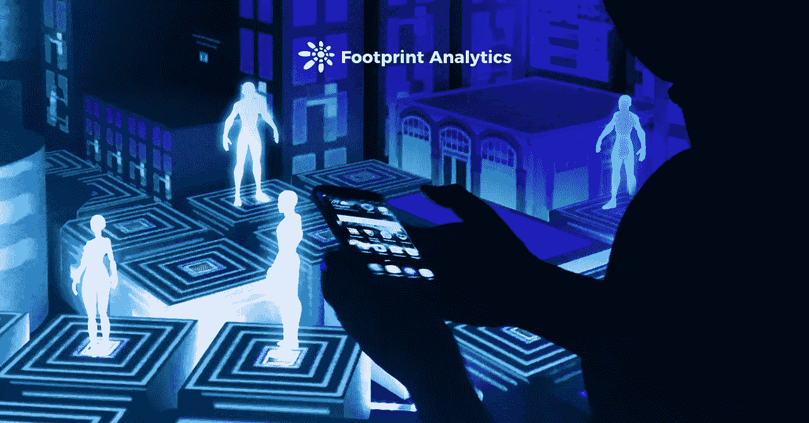
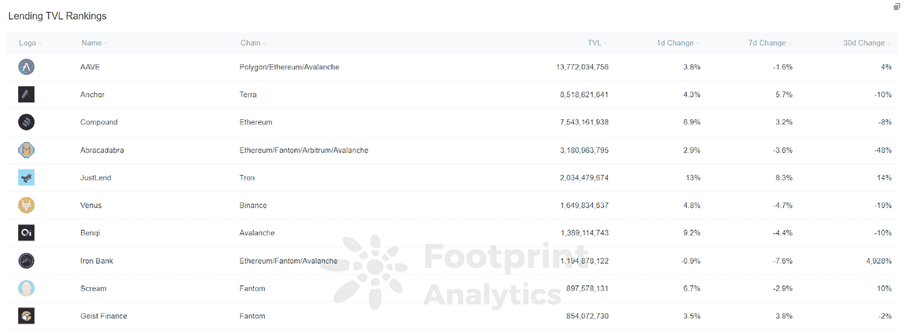
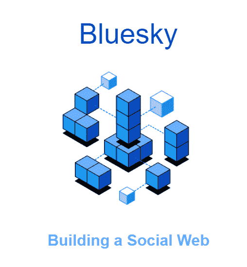
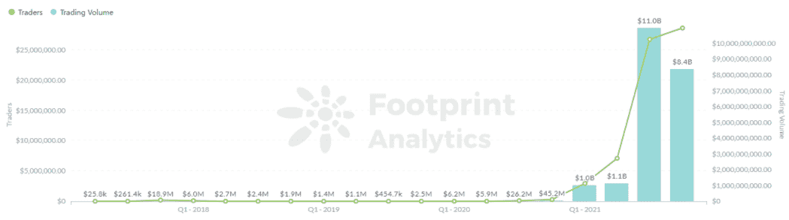

# Web3 将改变互联网的 4 种方式

> 原文：<https://medium.com/coinmonks/4-ways-web3-will-change-the-internet-4a3c78b7e6d7?source=collection_archive---------42----------------------->

最近，脸书、Youtube 和 Reddit 等顶级媒体平台宣布了与 Web3 相关的消息和举措。例如， [YouTube 为“Youtube Web3”发布了一个总监级别的职位](https://www.linkedin.com/jobs/view/2914766176/?refId=61ae26ba-b376-446b-9d9f-36bdd0c35f20&trk=flagship3_job_home_savedjobs)，要求有 15 年的经验，并了解加密货币、区块链、共识机制、NFTs 和其他 Web3 技术。

Web3 指的是建立在区块链基础设施上的互联网的新版本，具有分散的使用权。以下是你需要知道的。

**1。社交媒体将去中心化**

最近几个月见证了 Web3 社交平台的崛起，来自 Web2 的互联网巨头和来自科技巨头的高管纷纷拥抱 Web3。

Twitter Spaces 数据科学家主管朱利安·盖拉德、YouTube 游戏主管瑞安·怀亚特和 Twitter 联合创始人杰克·多西都离开了科技巨头，加入了 Web3 世界。

与此同时，Web3 社交平台表现尤为突出。

2 月 8 日， [DeFi 借贷巨头 Aave](https://www.footprint.network/guest/dashboard/overview-of-lending-fp-609e2517-e02c-4ce9-af59-2b7eae7fc423?channel=u-DBc983) 推出了其 Web3 社交媒体平台 Lens Protocol。同一天，Web3 社交平台 SO-COL (Social Collectables)宣布完成了 175 万美元的种子轮融资。

2 月 15 日，拥有 1 亿用户的印度社交平台 Chingari 整合了原生令牌，开发了一个 Web3 社交网络。

*Footprint Analytics — Aave is the top-ranked lending platform by TVL.*

**2。用户数据和语音将受到保护**

Web3 的精神是去中心化。用户可以控制自己的数据。

传统社交平台需要用户信息来创建账户。在 web 3.0 中，人们使用加密钱包，但不是他们的真实信息。这些数据库极易遭到破坏，从而允许数据被利用。举例来说，脸书已经发生了几次数据泄露事件。

在 Web3 中，用户数据存储在区块链上。它具有防篡改的特性。基于 Polkadot 的协议 social.network 在链上存储数据，确保个人数据得到保护。

Web2 的另一个问题是审查。科技巨头能够根据他们的服务条款轻松审查内容。许多 Web3 的支持者想象了一个这是不可能的世界。

Twitter 的创始人杰克·多西在 2019 年 12 月资助了分散媒体 Bluesky，旨在通过允许人们选择自己喜欢的推荐算法，从而决定用户自己看到什么，来抵制注意力经济。

在 Bluesky 上，内容可以永久免费保留，没有中央权力机构可以删除它，真正使数据成为你自己的。

**3。人们会为 JPEGs 付费**

Web2 不仅仅是在与区块链的新项目竞争。这些拥有庞大用户群的传统平台也很有可能在 Web3 中扮演重要角色。

像 NFTs 这样的数字资产是 Web3 的核心。Twitter 将在 2022 年的第一个月推出 NFT 个人资料功能，允许用户在他们的 Twitter 个人资料中显示他们的 NFT。Twitter 的主要竞争对手 Meta 也致力于允许用户在脸书和 Instagram 上销售 NFT。

*Footprint Analytics: Quarterly Trading Volume and Traders Before 2022*

2021 年，当 [NFT 爆发](https://www.footprint.network/guest/chart/nft-traders-trading-volume-before-2022-fp-c03737bd-8733-448d-b570-930156cde719?channel=u-DBc983)的时候，NFT 交易的累计数量从不到 130 万到 6540 万。这是 50 倍的增长，但与社交平台的用户相比仍有很大差距。

**4。创作者将拥有更多控制权**

在 Web2 平台上，用户是内容的生产者，网站通常是用户创建的。该平台还利用大数据进行精准营销。这与 web3 去中心化、开放和透明的愿景相悖，在 web 3 中，用户可以从他们的创作中获得收入，而区块链技术在很大程度上减少了抄袭和内容所有权不明确的情况。

由 Aave 推出的 Web3 社交媒体镜头协议(Web3 social media Lens Protocol)让内容创作者设定追随他们的条件，例如付费。此外，创作者还可以设定内容的范围和使用条件，让内容真正归创作者所有。

# 摘要

区块链技术的发展和 Web3 时代的来临已经成为越来越明显的趋势。去中心化的互联网是一场革命，随之而来的 Web3 时代可能会在金融、社交等方方面面重塑我们的生活方式。

**什么是足迹分析**

足迹分析是一个一体化的分析平台，用于可视化区块链数据和发现见解。它清理和整合链上数据，因此任何经验水平的用户都可以快速开始研究令牌，项目和协议。凭借一千多个仪表板模板和一个拖放界面，任何人都可以在几分钟内构建自己的定制图表。发掘区块链数据，利用足迹进行更明智的投资。

*足迹网址:*[*https://www . Footprint . network*](https://www.footprint.network/)

*不和:*[*https://discord.gg/3HYaR6USM7*](https://discord.gg/3HYaR6USM7)

*推特:*[【https://twitter.com/Footprint_DeFi】T21](https://twitter.com/Footprint_DeFi)

*电报:*[https://t.me/joinchat/4-ocuURAr2thODFh](https://t.me/joinchat/4-ocuURAr2thODFh)

*Youtube:*[*https://www.youtube.com/channel/UCKwZbKyuhWveetGhZcNtSTg*](https://www.youtube.com/channel/UCKwZbKyuhWveetGhZcNtSTg)

> 加入 Coinmonks [电报频道](https://t.me/coincodecap)和 [Youtube 频道](https://www.youtube.com/c/coinmonks/videos)了解加密交易和投资

# 另外，阅读

*   [XT.COM 评论](https://coincodecap.com/profittradingapp-for-binance)币安评论 |
*   [SmithBot 评论](https://coincodecap.com/smithbot-review) | [4 款最佳免费开源交易机器人](https://coincodecap.com/free-open-source-trading-bots)
*   [比特币基地僵尸程序](/coinmonks/coinbase-bots-ac6359e897f3) | [AscendEX 审查](/coinmonks/ascendex-review-53e829cf75fa) | [OKEx 交易僵尸程序](/coinmonks/okex-trading-bots-234920f61e60)
*   [如何在印度购买比特币？](/coinmonks/buy-bitcoin-in-india-feb50ddfef94) | [WazirX 评论](/coinmonks/wazirx-review-5c811b074f5b)
*   [隐料斗替代品](/coinmonks/cryptohopper-alternatives-d67287b16d27) | [HitBTC 审查](/coinmonks/hitbtc-review-c5143c5d53c2)
*   [CBET 评论](https://coincodecap.com/cbet-casino-review) | [库科恩 vs 比特币基地](https://coincodecap.com/kucoin-vs-coinbase)
*   [折叠 App 审核](https://coincodecap.com/fold-app-review) | [Kucoin 交易机器人](/coinmonks/kucoin-trading-bot-automate-your-trades-8cf0ca2138e0) | [Probit 审核](https://coincodecap.com/probit-review)
*   [如何匿名购买比特币](https://coincodecap.com/buy-bitcoin-anonymously) | [比特币现金钱包](https://coincodecap.com/bitcoin-cash-wallets)
*   [币安 vs FTX](https://coincodecap.com/binance-vs-ftx) | [最佳(SOL)索拉纳钱包](https://coincodecap.com/solana-wallets)
*   [比诺莫评论](https://coincodecap.com/binomo-review) | [斯多葛派 vs 3Commas vs TradeSanta](https://coincodecap.com/stoic-vs-3commas-vs-tradesanta)