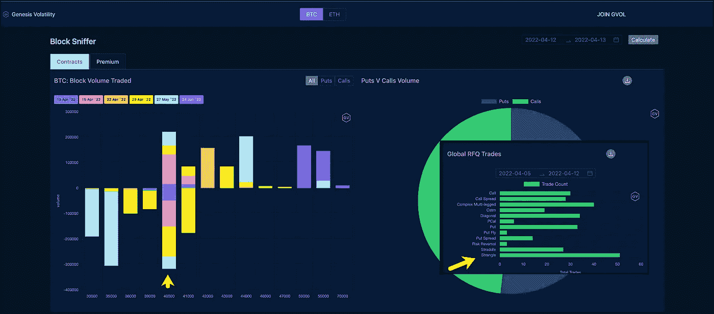

# 4 万美元赢得了(BTC 期权)日

> 原文：<https://medium.com/coinmonks/40k-won-the-btc-options-day-aa4a19b0bdbb?source=collection_archive---------69----------------------->

交易者喜欢大整数，40k 是 BTC 今天在 T1 的最佳时机。场外交易市场对 4 万英镑到期清单的看涨和看跌期权颇为青睐。有趣的是，在 40k 附近有如此多的活动，交易在看涨和看跌之间分布相对均匀，你会认为当天的结构是跨市场的，但交易最多的是扼杀。

毫无疑问，市场上弥漫着一种“我不知道”的感觉。CPI 超过了预期，严重打击了市场信心。我们还可能面临税收抛售压力。

尽管午后有所攀升，但短期成交量几乎全天下跌。长期卷保持得相当好。

> 加入 Coinmonks [电报频道](https://t.me/coincodecap)和 [Youtube 频道](https://www.youtube.com/c/coinmonks/videos)了解加密交易和投资

# 另外，阅读

*   [币安 vs FTX](https://coincodecap.com/binance-vs-ftx) | [最佳(SOL)索拉纳钱包](https://coincodecap.com/solana-wallets)
*   [比诺莫评论](https://coincodecap.com/binomo-review) | [斯多葛派 vs 3Commas vs TradeSanta](https://coincodecap.com/stoic-vs-3commas-vs-tradesanta)
*   [Capital.com 评论](https://coincodecap.com/capital-com-review) | [香港的加密借贷平台](https://coincodecap.com/crypto-lending-hong-kong)
*   [如何在 Uniswap 上交换加密？](https://coincodecap.com/swap-crypto-on-uniswap) | [A-Ads 评论](https://coincodecap.com/a-ads-review)
*   [WazirX vs CoinDCX vs bit bns](/coinmonks/wazirx-vs-coindcx-vs-bitbns-149f4f19a2f1)|[block fi vs coin loan vs Nexo](/coinmonks/blockfi-vs-coinloan-vs-nexo-cb624635230d)