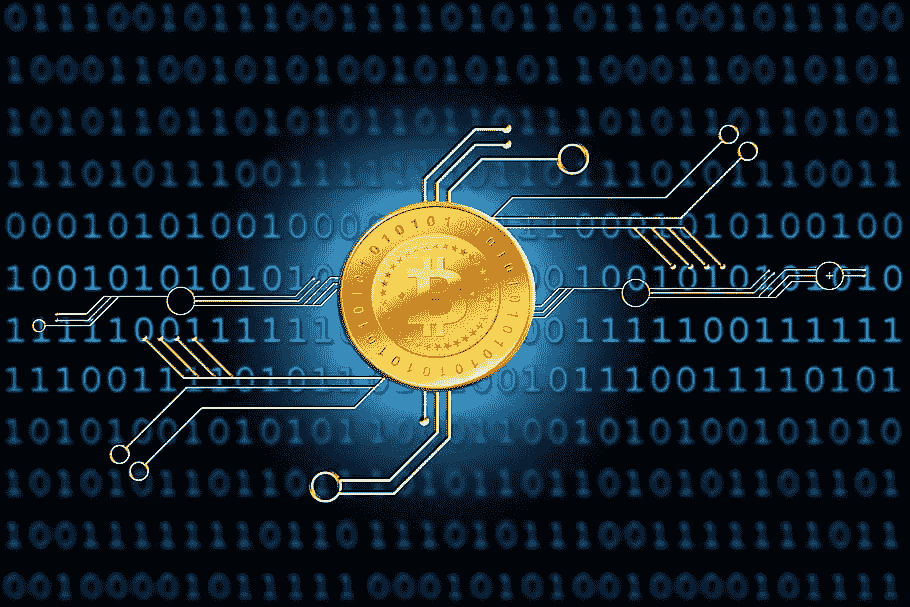

# 加密货币的 5 大优势:你需要知道的一切

> 原文：<https://medium.com/coinmonks/5-advantages-of-cryptocurrency-all-you-need-to-know-31ff238e26c0?source=collection_archive---------47----------------------->

**Cryptocurrency**

[***加密货币***](https://rebrand.ly/crypto-earning) 如果你正在寻找不同的东西，它是现金和信用卡的绝佳替代品。这种货币现在在世界各地广泛使用。许多企业已经接受比特币支付，就像接受现金一样。

**比特币**是使用最广泛的加密货币之一，这解释了为什么这么多个人投资于它。多亏了区块链，你可以在没有任何安全问题的情况下进行交易。在本文中，我们将回顾加密货币的一些最重要的好处。

## 轻松交易

**Cryptocurrency Easy Transactions**

如果你**定期与法律代表或经纪人**接触，你可能会意识到他们对每笔交易收取高额交易费。除此之外，还有很多文书工作、佣金和经纪服务需要**支付。**

另一方面，当你使用加密货币时，你可以省去所有的**中介**。您的所有交易都将通过安全的网络进行。每一笔交易都是完全**透明**，没有任何隐性成本。

## 资产转移

**Asset Transfers**

将比特币所有权从一个人转移到另一个人身上很简单。所有的生态系统都建立在区块链 T21 的顶部。因此，您可以在安全的环境中开展所有业务。

比特币的优势在于，它允许你将第三方权限纳入**未来交易**。如果你有这种货币，你可以毫无困难地转移资产。

## 机密交易

**Confidential Transactions**

每一笔交易，无论是现金交易还是信用卡交易，都会被记录下来。这些记录也由您开户的银行保存。每次你进行交易，你的银行都会记录下来。即使你经营一家企业，你的银行也知道你账户里的钱数。从隐私的角度来看，这是不方便的。

比特币的美妙之处在于，每笔交易都与其他交易截然不同。每笔交易都有一套必须解决的条款。有一种推的思想，作为数据共享的基础。除了您授权的内容之外，不会与接收者共享任何内容。因此，您的隐私和身份将得到**完全保护**。

## 低交易费用

**Low Transaction Fee**

如果你看一下你的**银行对账单**，你会注意到银行已经对你迄今为止所做的每一笔交易收取了交易费。如果你每天进行大量交易，银行手续费的总额将会相当**昂贵**。

然而，在比特币的例子中，交易成本非常便宜(T4)。但是，如果您聘请第三方来维护您的加密货币钱包，您可能需要为这项服务付费。然而，这些费用远远低于传统银行收取的费用。

## 内心的宁静

**Peace Of Mind**

你可以满怀信心地通过互联网发送比特币。事实上，只要你能上网，任何人都可以使用这项服务。你只需要对比特币网络有一个基本的了解就可以开始了。总之，这些只是采用比特币的几个最重要的好处。

如今，加密货币风靡一时。 **BTC365** 是一个你可以了解更多关于 **BTC 365 体育**的网站。

## [**毫不知情用加密货币赚钱**](https://rebrand.ly/crypto-earning)

> 加入 Coinmonks [电报频道](https://t.me/coincodecap)和 [Youtube 频道](https://www.youtube.com/c/coinmonks/videos)了解加密交易和投资

# 另外，阅读

*   [OKEx vs KuCoin](https://coincodecap.com/okex-kucoin) | [摄氏替代品](https://coincodecap.com/celsius-alternatives) | [如何购买 VeChain](https://coincodecap.com/buy-vechain)
*   [币安期货交易](https://coincodecap.com/binance-futures-trading)|[3 commas vs Mudrex vs eToro](https://coincodecap.com/mudrex-3commas-etoro)
*   [如何购买 Monero](https://coincodecap.com/buy-monero) | [IDEX 评论](https://coincodecap.com/idex-review) | [BitKan 交易机器人](https://coincodecap.com/bitkan-trading-bot)
*   [CoinDCX 评论](/coinmonks/coindcx-review-8444db3621a2) | [加密保证金交易交易所](https://coincodecap.com/crypto-margin-trading-exchanges)
*   [红狗赌场评论](https://coincodecap.com/red-dog-casino-review) | [Swyftx 评论](https://coincodecap.com/swyftx-review) | [CoinGate 评论](https://coincodecap.com/coingate-review)