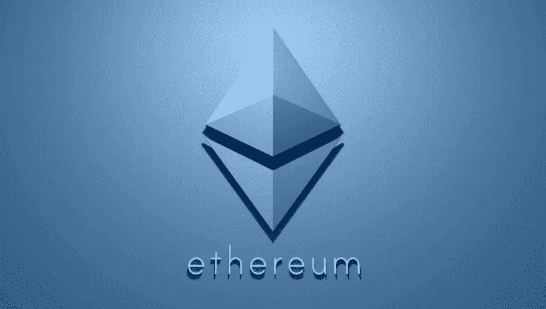
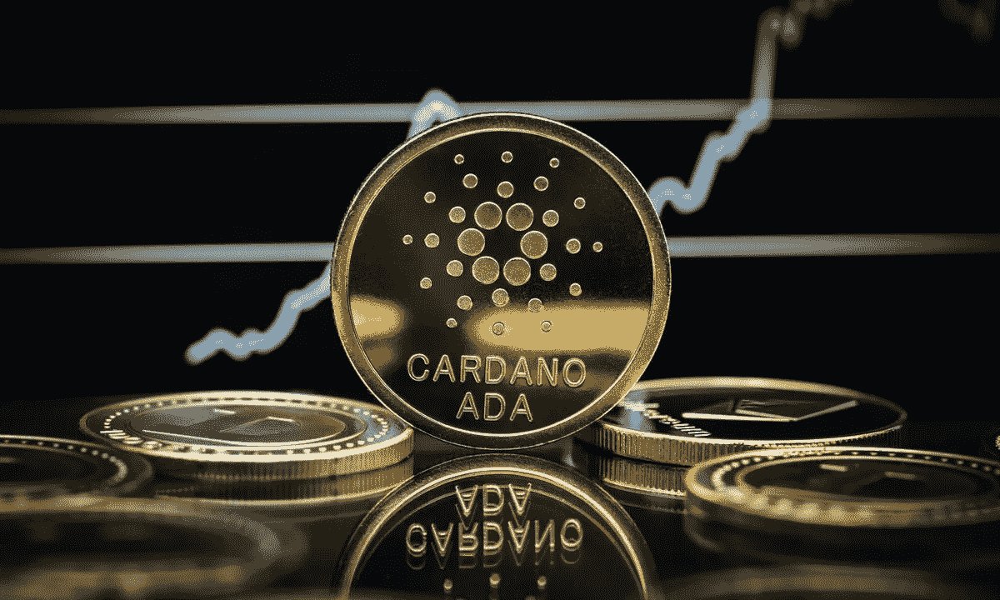
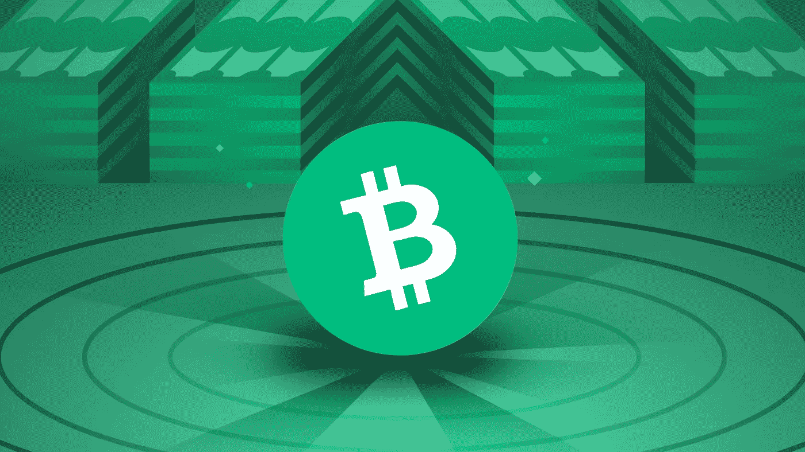
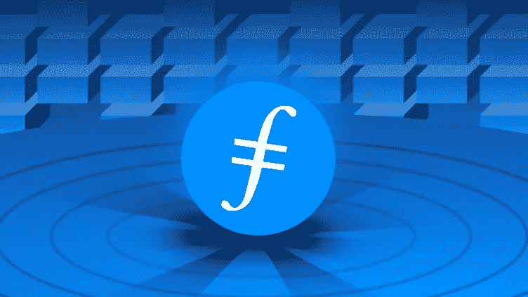

# 2022 年投资的 5 个最佳替代币

> 原文：<https://medium.com/coinmonks/5-best-cryptocurrency-to-invest-in-2022-than-btc-fd5c7cb1f7da?source=collection_archive---------19----------------------->

如果你和我一样是投资者或买家，正在寻找可靠的替代币，那么这篇文章就是为你准备的。

在这篇文章中，我将为您盘点 2022 年值得投资的 5 种加密货币。

# **1。乙醚(ETH)**

Image from Forbes

在我的备选名单中，黄金排在第一位。以太坊是一个具有智能合约功能的去中心化、开源的区块链。它允许分散式应用程序(Dapp)在没有第三方停机、欺诈、操纵或干预风险的情况下运行。以太坊的目标是建立一套去中心化的金融产品，世界上任何人都可以自由访问，无论国籍、种族或信仰如何。

以太坊应用程序由加密令牌 ether 提供支持。以太网(ETH)用于导航以太坊网络，主要受到希望在以太坊网络上构建并运行应用程序的开发人员以及希望用 ETH 购买其他数字货币的投资者的追捧。以太坊成立于 2015 年，是市值仅次于比特币的第二大加密货币，但距离成为“阿尔法加密货币”还有很长的路要走。

2020 年 12 月，以太坊的共识机制开始了向工作证明(PoW)到利益证明(PoS)的过渡。这一变化旨在降低以太坊的网络能耗，允许更快的交易，并创造一个更通缩的经济环境。

以太坊带给我们的惊喜不仅仅是币价的提升，更是对密码世界的探索和发现。

# **2。卡尔达诺(阿达)**

Image from PYMNTS

ardano (ADA)是一种由工程师、数学家和加密专业人员使用基于研究的方法开发的“Ouroboros 股份证明”加密货币。以太坊的五个创始成员之一查尔斯·霍金森是该项目的创始人之一。他离开了以太坊，并最终帮助建造了卡尔达诺。

卡尔达诺区块链是由卡尔达诺团队通过广泛的测试和同行评议研究开发的。项目研究人员已经发表了 120 多篇关于区块链技术的研究论文，涵盖了广泛的问题。

由于这种具有挑战性的方法，Cardano 似乎从其 POS 同行以及其他主要加密货币中脱颖而出。不过，卡尔达诺还处于初级阶段。虽然在 PoS 开发方面已经超越以太坊，但是在 DeFi 应用方面还有很长的路要走。

Cardano 的目标是通过交付类似以太坊的 DeFi 产品，并为区块链互操作性、选民欺诈和法律合同跟踪提供解决方案，成为世界级的金融操作系统。

2021 年阿达风头正劲。虽然被炒作成“超越以太坊”，但它的生态和以太坊还是有很大差距。

# **3。比特币现金(BCH)**

Image from Binance Acadamy

B itcoin Cash 是最初比特币最早也是最成功的硬分叉之一，在 altcoin 世界中有着重要的历史。比特币领域的分裂是由其发展中社区和采矿社区之间的分歧造成的。由于数字货币的去中心化性质，对相关代币或货币的基础代码的根本改变需要广泛的共识。

当各个群体无法达成共识时，数字货币被拆分，原链保持其原始代码不变，新链作为之前硬币的新版本开始，充满代码变化。

BCH 创建于 2017 年 8 月。可伸缩性问题是导致 BCH 诞生的争论的核心。比特币网络的区块大小限制为 1 兆字节(MB)，而 BCH 的区块大小限制已经增加到 8MB。这个想法是，较大的块可以承载更多的事务，从而提高事务速度。

在大多数情况下，BCH 价格与比特币正相关:当比特币上涨时，BCH 也会上涨。

# **4。波尔卡多(圆点)**

Image from Binance Acadamy

olkadot (DOT)是一种独特的 PoS 加密货币，旨在提供区块链之间的互操作性。它的协议旨在连接有权限的&无权限的区块链和 oracles，以允许系统在同一屋檐下协同工作。Polkadot 的核心组件是它的中继链，它允许不同网络的互操作性。它还允许将副链及其本机令牌用于特定的用例。

与以太坊不同，Polkadot 允许开发人员设计他们的区块链，同时受益于 Polkadot 链提供的安全性。

在通常情况下，开发人员可以使用以太坊创建新的区块链，但他们必须实现安全机制，这可能会使较小的项目容易受到攻击，因为区块链越大，越安全。共享安全是 Polkadot 最大的特点之一。

加文·伍德是波尔卡多特的创造者，他也是以太坊项目的其他主要创始人之一。

Polkadot 提出了一个前沿的跨链解决方案，从 mainnet 启动到并行槽拍卖。Polkadot 为区块链安全问题提供了独特的解决方案，具有长期价值。

# **5。Filecoin (FIL)**

Image from Binance Acadamy

F ilecoin (FIL)是一种分散存储领域的加密货币。作为世界上最大的分布式存储系统，Filecoin 提供了一套先进的存储技术。在 Filecoin 网络中，世界上任何人都可以贡献存储空间。要在 Filecoin 这样的大型去中心化网络中维护信任，需要有一种方法在网络本身中建立信任。Filecoin 通过复制证明(PoRep)和时空证明(PoSt)进行验证。一种验证机制，使存储在 Filecoin 链上的数据变得安全和加密。

此外，Filecoin 还拥有加密货币行业最稳健的阵容:IPFS 诞生于 Protocol Labs 协议实验室；其核心团队来自斯坦福大学、麻省理工学院、哈佛大学等世界知名大学和来自 Google、IBM、Oracle Inc 等全球科技公司的近百名人才。它还获得了红杉资本、DCG 集团、斯坦福大学基金会和 Y Combinator 等实体的风险投资。

早在 2017 年，Filecoin 雄心勃勃的分布式存储愿景和技术路线图就获得了无数资本和技术机构的认可，成为全球最大的 ICO 项目。

有人把 Filecoin 称为存储领域的“比特币”。其价值在 2021 年不到一周内增长了 10 倍。虽然这在很大程度上是一个投资泡沫，但这并不否认它在分布式存储领域的独角兽地位。它目前的价格极低，是投资的好机会。

# 结论

加密货币带给我们的不仅仅是金钱利益，还创造了分散的项目，为我们的日常活动提供了创新的方法，如金融、游戏和组织。因此，寻找有前景的项目将是做出正确的加密货币投资选择的关键。

在上述加密货币中，Filecoin 的增长空间最大，原因有二:Filecoin 处于项目开发初期，增长空间较大；数据存储的市场需求可以加速 IPFS 的实施，其治理令牌是 Filecoin。在 LuckyHash 押 Filecoin 现在产生 90%的 APY。

此外，**您可以通过订阅 LuckyHash 储蓄账户**:[&lang = en 分享 8 万美元的 3 月投资节奖池。](https://m.luckyhash.com/stakingevent?code=031DA6&lang=en.)在获得利息的基础上，额外奖励最多 100 美元。

你可以在我的推荐链接下注册一个账号**领取 5 doge coin**:
[&lang = en](https://m.luckyhash.com/createAcc?invitationCode=031DA6&lang=en)

有关活动的更多详情

 [## 在三月份获得最佳 LuckyHash 投资交易，分享 80，000 美元奖金池

### LuckyHash 推出 3 月投资专享活动(3 月 16 日提供)，在该活动中，您可以分享 80，000…

medium.com](/coinlucky/get-the-best-luckyhash-investment-deals-in-march-and-share-the-80-000-usd-prize-pool-65506188aa59) 

> 加入 Coinmonks [电报频道](https://t.me/coincodecap)和 [Youtube 频道](https://www.youtube.com/c/coinmonks/videos)了解加密交易和投资

# 另外，阅读

*   [币安 vs FTX](https://coincodecap.com/binance-vs-ftx) | [最佳(SOL)索拉纳钱包](https://coincodecap.com/solana-wallets)
*   [如何在 Uniswap 上交换加密？](https://coincodecap.com/swap-crypto-on-uniswap) | [A-Ads 评论](https://coincodecap.com/a-ads-review)
*   [加密货币储蓄账户](/coinmonks/cryptocurrency-savings-accounts-be3bc0feffbf) | [YoBit 审核](/coinmonks/yobit-review-175464162c62)
*   [Botsfolio vs nap bots vs Mudrex](/coinmonks/botsfolio-vs-napbots-vs-mudrex-c81344970c02)|[gate . io 交流回顾](/coinmonks/gate-io-exchange-review-61bf87b7078f)
*   [CoinFLEX 评论](https://coincodecap.com/coinflex-review) | [AEX 交易所评论](https://coincodecap.com/aex-exchange-review) | [UPbit 评论](https://coincodecap.com/upbit-review)
*   [AscendEx 保证金交易](https://coincodecap.com/ascendex-margin-trading) | [Bitfinex 赌注](https://coincodecap.com/bitfinex-staking) | [bitFlyer 审核](https://coincodecap.com/bitflyer-review)