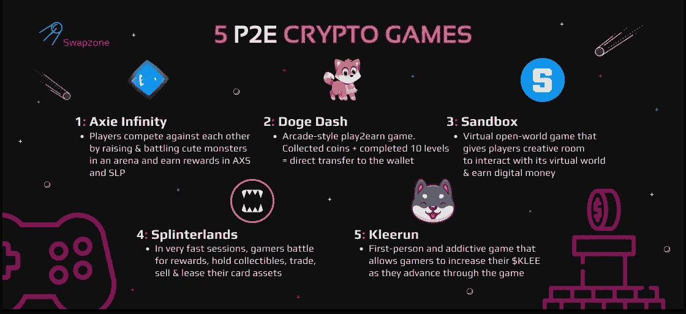
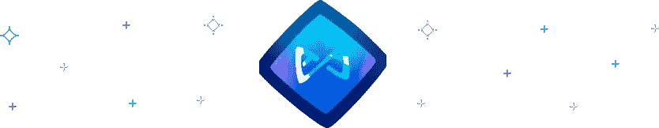
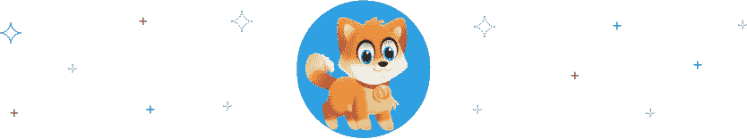
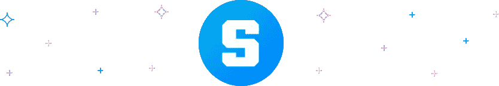
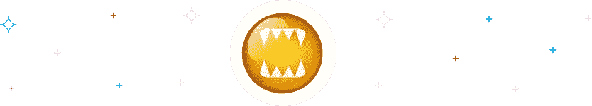
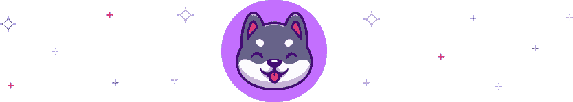

# 5 个最好的 2 赢项目:玩游戏赚密码

> 原文：<https://medium.com/coinmonks/5-best-play-2-earn-projects-earn-crypto-playing-games-48bf58b9495?source=collection_archive---------4----------------------->

在过去的十年中，全球游戏产业已经扩展到包括有可能彻底改变游戏和玩家财务的新技术。在这篇文章中，我们做了一个激动人心的游戏，为初学者和更有经验的玩家赢得加密游戏列表。这些赚取加密游戏结合了高品质的游戏性、深思熟虑的机制和游戏玩家的下一级游戏体验。

# 什么是赢得密码游戏的游戏？

一个游戏赚取加密游戏是任何游戏，是建立在区块链技术，并允许用户赚取加密，而发挥或使用其任何服务。这种游戏的想法吸引了许多密码爱好者，因为它允许玩家在娱乐的同时赢得游戏并产生新的收入来源。

play2earn 加密游戏的另一个重要组成部分是，它让用户拥有某些游戏内资产的所有权。这些资产的范围从虚拟土地、NFT、特殊皮肤和游戏中的角色到游戏环境中有用的工具。

安全自动做市商和区块链 play to earn 加密游戏(以元宇宙、NFTs 和游戏内加密令牌为特征)的出现正在改变游戏玩家与移动和桌面游戏的互动方式。然而，随着“玩到赚”的加密游戏空间以前所未有的速度增长，越来越难以跟上最新的热潮或任何新的发展。

# 玩赚取密码游戏机制

游戏的运行依赖于区块链技术和加密货币。值得注意的是，Play to earn 由游戏开发商、内容创作者和游戏玩家组成的生态系统组成，他们都从使用游戏平台中受益。这一特征与依赖于玩家和游戏开发者之间的单向交易的传统游戏形成对比。

此外,“玩赚游戏”由几个游戏内任务组成，例如赢得挑战、任务、解决社区问题等等。通常，这些任务会得到代币奖励。玩家可以很容易地在区块链上交易这些代币。

# 玩游戏赚取加密游戏列表

数百个游戏争夺你的注意力，很难找到一个符合你兴趣的。因此，经过几个小时的激烈游戏后，我们挑选了以下五款 play2earn 游戏，希望能引起您的兴趣:

# Axie 无限游戏

由越南工作室 Sky Mavis 于 2018 年 3 月推出的 [Axie Infinity](https://axieinfinity.com/) 目前在 playtoearn.net 最受欢迎的区块链游戏排行榜上名列榜首。Axie Infinity 位于以太坊区块链，连接着世界各地的玩家。他们可以通过在竞技场中饲养和战斗可爱的怪物来相互竞争。成功的玩家在游戏的原生 Axie Infinity 碎片(AXS)和光滑的爱情药水(SLP)中获得奖励。专用的 Axie 市场允许销售两种本地密码。Axie Infinity 游戏可在 Android、Apple 和 Windows 上使用。

# AXS 硬币

无限轴碎片或 [AXS 硬币](https://swapzone.io/currencies/axie-infinity)是无限轴宇宙的主要象征。AXS 硬币是一种 ERC 20 代币，允许持有者从玩游戏中获得奖励。此外，它允许游戏玩家参与关于 Axie Infinity 宇宙的关键治理投票。

# Axie Infinity 怎么玩？

Axie Infinity 的玩法类似于口袋妖怪。为了在 Axie 宇宙中竞争，玩家需要一个由三个可爱的 Axie 怪物组成的团队，与他们战斗以获得奖励。没有资金购买 Axie 的游戏玩家可以申请 Axie 奖学金计划。在那里，他们可以从经理(现在拥有 axis 的年长玩家)那里借用不同的 axis，从他们的奖金中抽取一小部分。

# Doge Dash 游戏

由获得格莱美提名的保罗·卡斯林领导的 [Doge Dash](https://dogedash.com/) 游戏项目，由不断扩大的游戏、NFT、商品、赌注等生态系统组成。Doge Dash 是币安智能链上的一款街机风格 play2earn 游戏。Doge Dash 游戏玩家的目标是在十个难度越来越高、节奏越来越快的关卡中收集硬币。玩家在平台、怪物和僵尸出没的城市之间奔跑。因此，成功的玩家在到达狗屋时完成游戏，并获得 Doge Dash token 形式的奖励。

# DogeDash 硬币

[DOGEDASH 币](https://swapzone.io/currencies/doge-dash)是游戏的原生代币。Doge Dash 硬币可以用来购买游戏中的生命，也可以通过奖励的形式获得。每笔交易都有 5%的税。3%作为通货紧缩措施烧掉，2%留给游戏开发商作为自我维持的营销基金。

# DogeDash 怎么玩？

Doge Dash 很容易玩。它的游戏玩法类似于游戏商店里的其他免费游戏。玩家可以选择 3 种难度设置。奖励范围在“精英”模式下高达 10，000 个硬币，在“轻松”模式下低至 1，000 个硬币。

# 沙盒游戏

作为一款仅在 2012 年推出的手机游戏，[沙盒游戏](https://www.sandbox.game/en/)在过去几年中已经发展成为区块链最受欢迎的 play2earn 游戏之一。沙盒游戏是一个虚拟的开放世界游戏，给玩家创造空间，自由地与虚拟世界互动。在探索的过程中，玩家获得乐趣并赚取数字货币。此外，沙盒游戏允许其用户创建、购买、销售和交换数字物品。这些物品可能对他们或游戏专用市场上的其他玩家有用。

# 沙币

[沙币](https://swapzone.io/currencies/sand)是为沙盒生态系统提供动力的重要令牌。它充当数字资产、治理令牌和沙盒游戏的游戏内货币。沙盒玩家可以使用沙币购买沙盒虚拟世界中的资产和土地。

# 沙盒怎么玩？

游戏玩法类似于模拟人生和《我的世界》，沙盒游戏要求玩家为自己设定目标。通常被称为软件玩具或非游戏，玩家可以以任何他们认为合适的方式与虚拟开放世界互动。然而，要开始玩沙盒游戏，初学者需要至少投入 100 美元的 ETH 和沙币。这将让他们进入虚拟世界。

# 夹板地游戏

《T4》游戏结合了区块链新一代卡牌游戏中的魔法和混乱。在持续时间不超过几分钟的快速游戏中，玩家可以在世界任何地方争夺奖励、持有收藏品或交易、出售和租赁他们的卡资产。此外，玩家收集的不同卡片可以在第三方市场交易，如 [Opensea](https://opensea.io/) 、 [MonsterMarket](https://monstermarket.io/) 等等。

# SPS 硬币

[SPS 硬币](https://swapzone.io/currencies/splintershards)是夹板地游戏的原生游戏内代币。根据 Splinterland 的白皮书，币安智能链区块链上安全的硬币总供应量将固定在 30 亿枚 SPS 令牌。

# 怎么玩夹板地？

Splinterlands 的玩法类似炉石。夹板地中的卡片提供了各种特性、效果和能力，可以在比赛中与其他玩家一起战斗。玩家需要创建一个档案，并连接一个元面具钱包，然后才能与对手竞争或访问夹板世界中的其他服务。此外，要想在战场上取得胜利，新手必须了解一些纸牌的基本原理，你可以在他们的网站上了解更多。

# 克莱伦游戏

于 2021 年推出的, [Kleerun](https://kleerun.game/) 已经被行业巨头描述为 GameFI 行业的未来。这是一个互动的，第一人称的，令人上瘾的游戏，有一个玩到赚的功能，允许玩家在游戏中增加他们的$KLEE。玩家还可以交易个人头像、NFT(代表不动产)和其他游戏内商品。这些功能中的每一个都会产生少量的交易费用，这些费用按比例归持有者所有。因此，费用增加了他们在$KLEE 流动性池中的贡献。

# 克利硬币

[克里硬币](https://swapzone.io/currencies/kleekai)于 2021 年 5 月 11 日在区块链以太坊推出。它是 Kleerun 游戏中的本地货币。持有是克利硬币的一个基本功能，因为它使 AMM 智能合同和回报有限合伙人投资者。

# 克莱伦怎么玩？

克利伦游戏有一个简单的自由运行的游戏。游戏玩家控制一只可爱的狗沿着一条路跑，同时避开障碍物，并试图赚取尽可能多的硬币。然而，为了进入游戏，玩家必须在他们的 Metamask 钱包中持有至少 1000 亿美元的 KLEE 令牌(价值约 23 美元)。

# Play2Earn Cryptos exchange:在哪里和如何进行？

准备好玩游戏赚密码了吗？前往 [Swapzone 的](https://swapzone.io/)互动交流页面获取您选择的加密游戏的原生代币，开始您的旅程。我们易于使用的互换交易使初学者和专家可以轻松地购买 play2earn 硬币，并通过简单的步骤将其转移到他们的 Metamask 钱包中。以下是如何使用 Swapzone 购买 play2earn 加密硬币的指南:

1.  请访问 Swapzone 网站。
2.  选择合适的配对(例如 BTC 对 DOGEDASH)。
3.  输入您想要兑换 DOGEDASH 的 BTC 金额，聚合器将为您找到最划算的交易。
4.  点击***‘兑换’****按钮，并输入您要将 DOGEDASH 币发送到的地址。*
5.  *使用生成的 BTC 地址发送您的 BTC 存款。*
6.  *点击 ***【继续交易】*** 。你可以留下一个你选择的网站进行交换过程的评论。*
7.  *等待存款处理完毕，DOGEDASH 硬币兑换完成。*

> *加入 Coinmonks [电报频道](https://t.me/coincodecap)和 [Youtube 频道](https://www.youtube.com/c/coinmonks/videos)了解加密交易和投资*

# *另外，阅读*

*   *[OKEx vs KuCoin](https://coincodecap.com/okex-kucoin) | [摄氏替代品](https://coincodecap.com/celsius-alternatives) | [如何购买 VeChain](https://coincodecap.com/buy-vechain)*
*   *[币安期货交易](https://coincodecap.com/binance-futures-trading)|[3 comas vs Mudrex vs eToro](https://coincodecap.com/mudrex-3commas-etoro)*
*   *[如何购买 Monero](https://coincodecap.com/buy-monero) | [IDEX 评论](https://coincodecap.com/idex-review) | [BitKan 交易机器人](https://coincodecap.com/bitkan-trading-bot)*
*   *[CoinDCX 评论](/coinmonks/coindcx-review-8444db3621a2) | [加密保证金交易交易所](https://coincodecap.com/crypto-margin-trading-exchanges)*
*   *[红狗赌场评论](https://coincodecap.com/red-dog-casino-review) | [Swyftx 评论](https://coincodecap.com/swyftx-review) | [CoinGate 评论](https://coincodecap.com/coingate-review)*
*   *[Bookmap 评论](https://coincodecap.com/bookmap-review-2021-best-trading-software) | [美国 5 大最佳加密交易所](https://coincodecap.com/crypto-exchange-usa)*