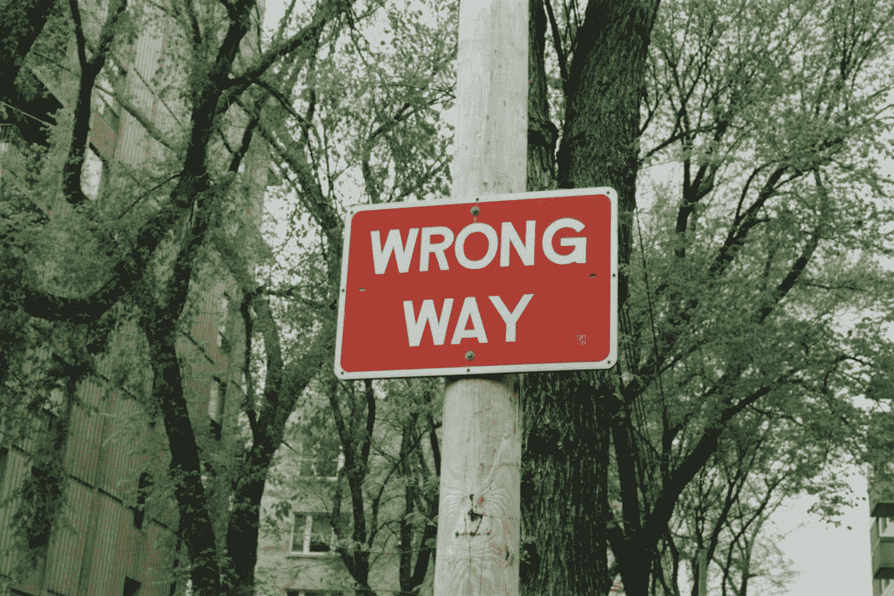
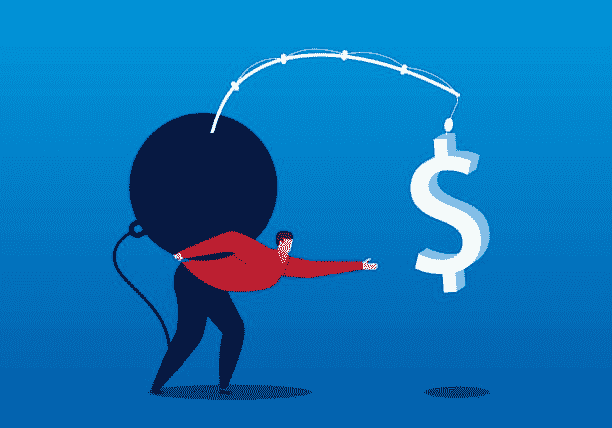
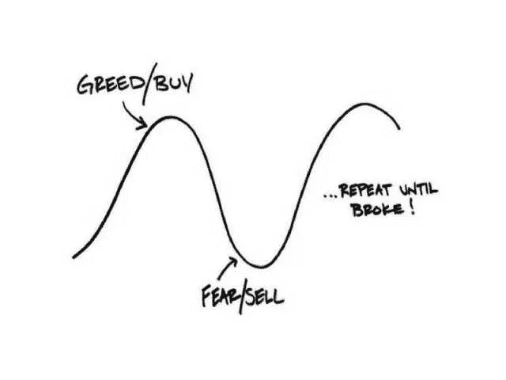
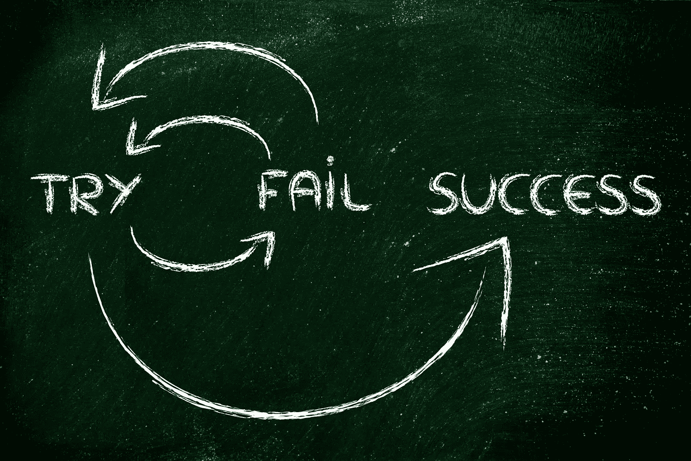

# 定义初学者会犯的 5 个错误以及如何避免它们

> 原文：<https://medium.com/coinmonks/5-common-beginner-mistakes-when-investing-in-defi-4d9e8f13ad67?source=collection_archive---------10----------------------->

## 充分利用 DeFi

## 如果你想保住你的钱，就要避免这些错误

Photo by [Randy Laybourne](https://unsplash.com/@randylaybourne?utm_source=medium&utm_medium=referral) on [Unsplash](https://unsplash.com?utm_source=medium&utm_medium=referral)

毫无疑问，DeFi 可以让你的生活变得更好。但是如果你做的不对，它也会变得更糟。

正如我喜欢说的，没有其他行业能给你加密所能给你的自由和机会，但是它要求责任作为回报。这就是为什么避免可能让你赔钱的错误是至关重要的。

也就是说，这里是初学者在第一次进入 DeFi 生态系统时经常犯的五个错误。

> 我自己经历了惨痛的教训。好消息是，你可以利用我的错误，这样你就不必重蹈覆辙。

# 错误 1:追逐高收益

在看到过去几年的巨大收益和爆炸性增长后，包括我在内的 DeFi 用户已经被宠坏了。

5%的 APY 已经不够了。我们希望有 20%、50%，甚至超过 100%的人会考虑投资一个平台或一个代币。具有讽刺意味的是，你应该反其道而行之，对这些收益率持保留态度。

钱不会长在树上，高收益需要有一些收入来源来维持。否则，只有两种可能:要么是通过排放融资的恶性通胀，要么是庞氏骗局。

无论是哪种情况，都不会持续太久，你的钱损失的风险远远大于回报。不幸的是，这就是大多数高产量 DeFi 平台的情况。

> 解释这一点的最好例子是 UST 和锚协议。20%的 APY 是没有根据的，必须不断得到外部储备的支持。这种超常的收益率导致存款增长超出了任何可能的可持续性。大家都知道大家同时撤资发生了什么。

请注意，这并不意味着 DeFi 的所有高收益投资都是骗局。

相反，这意味着你不应该乍一看就相信高收益，你必须研究项目，并试图确定其收入来源，以证明这些收益是合理的。**问问你自己:钱从哪里来？**如果你找不到答案，那就别想了。

# 错误 2:不获利

贪婪存在于我们每个人的心中，很容易让它控制我们的决定。当我们打了一个好电话，赚了一大笔钱时，我们对自己想的第一件事是:“如果我做了一次，我还能再做一次。”

虽然这是真的，但这不是一个聪明的玩法。

不获利很像“追逐胡萝卜”的比喻。你做了很好的投资。钱就在你面前，等着你去拿，但你一直往后推，追逐它，以为你能赚更多。

你继续朝着胡萝卜前进。它非常接近，所以你*知道*你最终会得到它。但是你没有看到，当你继续前进时，胡萝卜离你越来越远。你一直这样做，直到最后，有人来拿走它。

停下来。剪断线，拿走胡萝卜。如果你确定你能赚更多，那么也许只是其中的一小部分来继续追逐剩下的。设定目标，并在实现目标时确保你的收入。这是确保最终实现正平衡的最佳方式。

# 错误 3:跟随大众

秘密社区是非常热情的，有时是有毒的。有些人在一个特定的硬币或项目上投入了太多，这使得他们在任何批评他们的人面前表现得像个偏执狂。他们可以非常，非常直言不讳。

也就是说，当一个项目启动时，经常会在 Twitter、Reddit 和其他社交媒体上看到成百上千的帖子，谈论这个项目有多棒。

这是 FOMO 开始发挥作用的时候。

当你开始看到那种关于一个你不知道的代币的出版物时，你立刻会觉得你正在错过你生命中的机会。这导致不加思考就贸然投资。那就是你失败的时候。

客观地看，关于加密有两个不可否认的事实:

*   一个项目或令牌受欢迎并不意味着它也是好的。
*   大多数加密投资者不知道他们在做什么。

当你记住这两点时，你会发现忽略噪音、专注于信号是多么容易。

事实上，你从深入的项目研究中得出的结论比成千上万其他投资者的意见更有价值。倾听他人了解新项目是好的，但千万不要盲目投资。

# 错误 4:购买 rip

由于许多加密投资者因为其他人说的话而屈服于 FOMO，许多其他人在看到价格飙升时也屈服了。

> 朋友，我恐怕要告诉你，如果你想买的硬币已经涨了 100 倍，你很有可能会迟到。

当然，硬币可能会继续上涨，你可能会回到这篇文章，准备好让我为让你错过机会而受到惩罚。我也去过那里。如果是这样的话，让我告诉你:不值得冒这个险。

购买 rips 是让 FOMO 控制你的决定的另一种形式，除非你非常幸运，否则不会有好结果。

和往常一样，你可以通过自己的研究很容易地避免这个错误。如果你想交易，花几周、几个月或任何时间学习技术分析，你会更好。

另一方面，如果你是一个 DeFi 用户，花点时间仔细阅读白皮书和基础知识，看看你想买的项目从长远来看是否可行。

> 我怎么强调这一点都不为过:无数项目经历了令人难以置信的牛市，仅仅几周后就抹去了所有收益，再也没有恢复。安全月、SHIB、月神、AXS、欧姆和时间只是几个例子。

# 错误 5:不承担损失

这篇文章是关于常见错误的。它们很常见，因为很容易做，所以如果你最终做了，不要自责。犯错是人之常情，这并不可耻。这是一个普遍规律，因此，它适用于加密投资。

> 然而，如果你犯了这些错误，有一件事是不可原谅的:没有从中吸取教训。

做出错误的决定无疑是学习做出正确决定的最好方法。但要做到这一点，你需要谦虚，承认你搞砸了。要做到这一点，你需要在这个过程中失去一些东西——在这种情况下，你的血汗钱。不然你不会在意。

我从第一手经验中知道这一点。

你投资错了代币。你相信了骗子的谎言。你让 FOMO 接管了。这发生在我们每个人身上。是的，这很糟糕，是的，这不公平。这就是你的生活。

所以，走 L！承担责任，追溯你的步骤，试着指出你做错的每一件事。**我向你保证**，如果你这么做了，你就再也不会犯那些错误了。这就是你如何积累经验，成为更好、更成功的投资者。

# 就是这样！

感谢阅读到最后。我真心希望这篇文章能帮助你保持警惕，避免犯这些错误。

我犯了无数次这样的错误——有时候我还是会犯。希望通过告诉你这些，你不会。

然而，如果你这样做了，请记住:除了傲慢和不承担责任之外，一切都是可以原谅的。否则，你会一直被同一块石头绊倒。

# TL；博士:

1.  追逐高收益。
2.  不获利。
3.  跟随大众。
4.  购买 rips。
5.  不承担损失。

## 你喜欢这个故事吗？

我很高兴你这么做了！我叫桑蒂。我喜欢并写作视频游戏、加密货币和流行文化。如果你想阅读更多这样的内容，可以考虑关注我的 [**中**](https://santiagoschw.medium.com/) 和 [**推特**](https://twitter.com/SantiagoSchw_) 。我真的很感激！

## 如果你喜欢这个，我打赌你会喜欢…

 [## 分散金融将改变你(和每个人)的生活

### 我们终于可以创建我们自己的金融系统，一个真正有效的系统

medium.com](/crypto-universe/decentralized-finance-will-change-your-and-everyones-life-145c142496b4)  [## 这个简单的技巧将为你在寻找加密宝石时节省大量的时间和金钱

### 它将只需要你几秒钟，并帮助你区分真正的宝石从现金攫取骗局。

medium.com](/crypto-universe/this-simple-trick-will-save-you-lots-of-time-and-money-when-looking-for-crypto-gems-4110b07a3bdc)  [## 不要谷歌加密货币！

### 使用谷歌寻找加密项目会导致你破产

medium.com](/coinmonks/dont-google-cryptocurrencies-200e8d60f2aa) 

> 加入 Coinmonks [电报频道](https://t.me/coincodecap)和 [Youtube 频道](https://www.youtube.com/c/coinmonks/videos)了解加密交易和投资

# 另外，阅读

*   [加拿大最佳加密交易机器人](https://coincodecap.com/5-best-crypto-trading-bots-in-canada) | [Bybit vs 币安](https://coincodecap.com/bybit-binance-moonxbt)
*   [阿联酋 5 大最佳加密交易所](https://coincodecap.com/best-crypto-exchanges-in-uae) | [SimpleSwap 评论](https://coincodecap.com/simpleswap-review)
*   [购买 Dogecoin 的 7 种最佳方式](https://coincodecap.com/ways-to-buy-dogecoin) | [ZebPay 评论](https://coincodecap.com/zebpay-review)
*   [最佳期货交易信号](https://coincodecap.com/futures-trading-signals) | [流动性交易所评论](https://coincodecap.com/liquid-exchange-review)
*   [火币的加密交易信号](https://coincodecap.com/huobi-crypto-trading-signals) | [Swapzone 审查](/coinmonks/swapzone-review-crypto-exchange-data-aggregator-e0ad78e55ed7)
*   最佳[密码交易机器人](https://coincodecap.com/best-crypto-trading-bots) | [购买索拉纳](https://coincodecap.com/buy-solana) | [矩阵导出评论](https://coincodecap.com/matrixport-review)