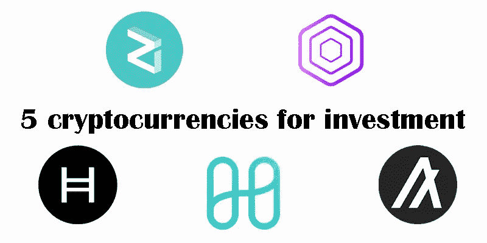
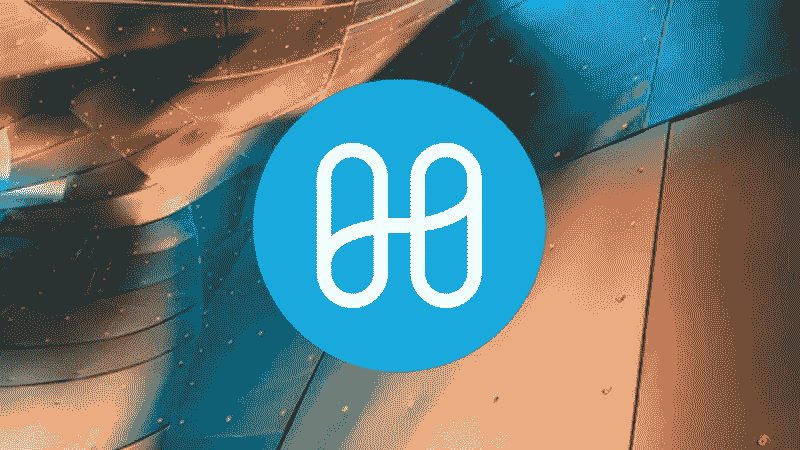
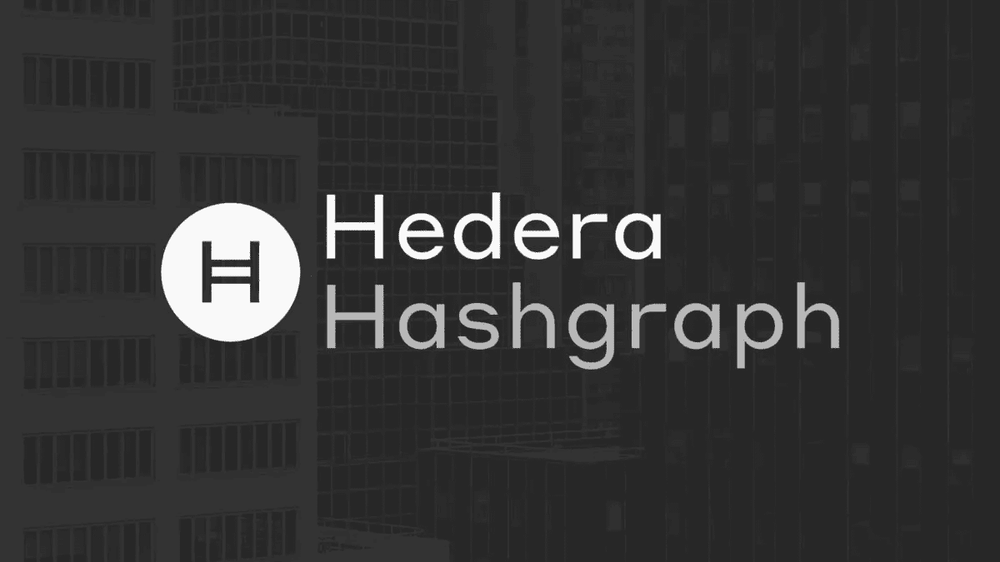
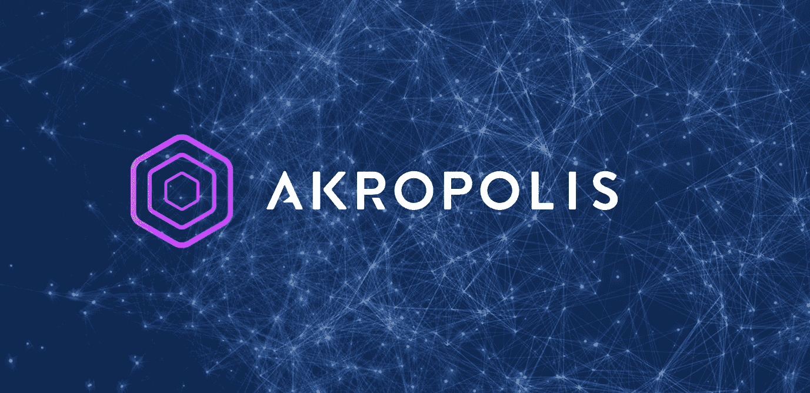
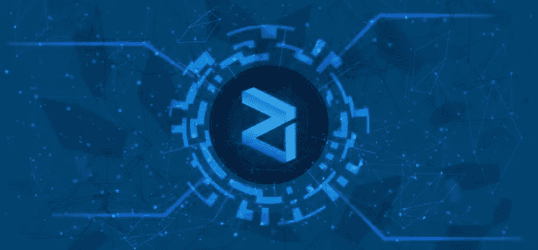
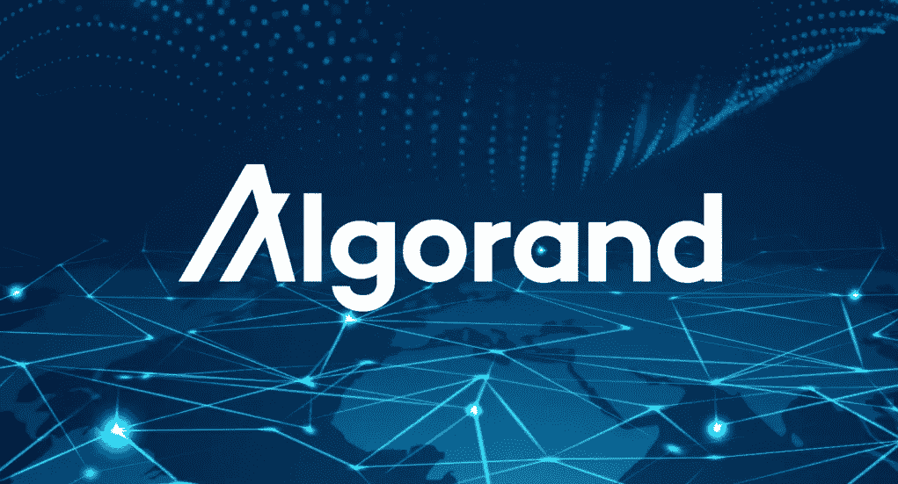

# 5 种用于长期投资的加密货币

> 原文：<https://medium.com/coinmonks/5-cryptocurrencies-for-long-term-investment-c3872554c191?source=collection_archive---------2----------------------->

2022 年 crypto 市场开始震荡下滑，目前这一趋势仍在继续。有些人甚至宣布密码市场的冬天到来了。
加密货币市场的总价值目前约为 1.7 万亿美元，但总市值仅在 20 天前才达到 2 万亿美元。在加密领域，长期投资似乎是目前最赚钱的工作，了解一些倾向于投资最佳加密货币的货币可能会有所帮助。

1-和谐(一)

Harmony 是一个区块链平台，旨在促进 dApps 或分散应用程序的创建和使用。这个项目的目标是通过关注随机模式分裂来彻底改变创建块的过程，这显著减少了节点验证时间。谐波网络中的节点和验证是随机分配和重新分配的，这保证了验证过程并确保了节点保护。根据 Harmony 网站，该项目旨在 2021 年底前引入交叉合同和连锁基础设施。和谐是一个与未来宏伟计划相关的好项目。它具有良好的长期前景。

二维哈希图(hbar)

Headra Hashgraf 通常被称为“互联网信任层”。它是一个公共网络，允许企业和个人构建分散式应用程序(dApps)。这种货币旨在解决旧加密货币的一些问题，如性能缓慢或不稳定。hashtag consensus 机制非常高效，吞吐量超过每秒 10，000 个事务。Hedra Hashgraf 完全有可能在 2022 年爆发。

3-阿克罗波利斯

Akropolis 是一个基于以太坊(DeFi)的去中心化金融协议，旨在提供一个独立的生态系统来增长和存储用户的财富。AkropolisOS 系列产品为分散的独立盈利组织的发展提供了一个框架，并为无担保贷款提供了一个平台。AKRO 是一个 ERC-20 令牌，用于在所有卫城产品中引导网络。

专家认为钱包投资者 AKRO 是一项很好的长期投资，并预测这种加密货币的价格将在短短一年内翻一番。鉴于 AKRO 是一个非常有前途的平台的政府标志，它有可能成为下一个爆发的加密货币。

4-齐利卡

Zilliqa 是一个未经许可的区块链，旨在提供非常高的吞吐量，因此每秒可以执行数千个事务。这个项目的目标是通过使用分片作为第二层可伸缩性解决方案来解决加密行业的老问题，即可伸缩性。Zilliqa 可以用来创建分散的应用程序。该 ZIL 平台的本地令牌用于促进智能合约的建立以及网络中交易的处理。

Zilliqa 有非常雄心勃勃的计划。它旨在成为大型企业在游戏、广告和许多其他数字基础设施中使用的首选网络。其团队将 Visa 和 Mastercard 列为 Zilliqa 的潜在竞争对手。它很有可能成为下一个爆发的加密货币。

5-阿尔戈兰特(阿尔戈)

Algorand 是一种总部位于区块链的加密货币，旨在为其用户提供最高标准的安全性、可扩展性和去中心化。阿尔格兰德区块链支持智能合约的操作，并使用一种被称为“股份净证明”的共识算法。我们认为 Algorand 有机会在 2022 年爆发的主要原因之一是因为它的团队专注于环境友好。随着时间的推移，环境问题在所有行业都变得越来越普遍，这无疑对加密货币市场产生了影响。最初为环境可持续性而创造的硬币和代币(如 ALGO)优于以太坊(Ethereum)等加密货币，后者必须进行变革以符合新标准。