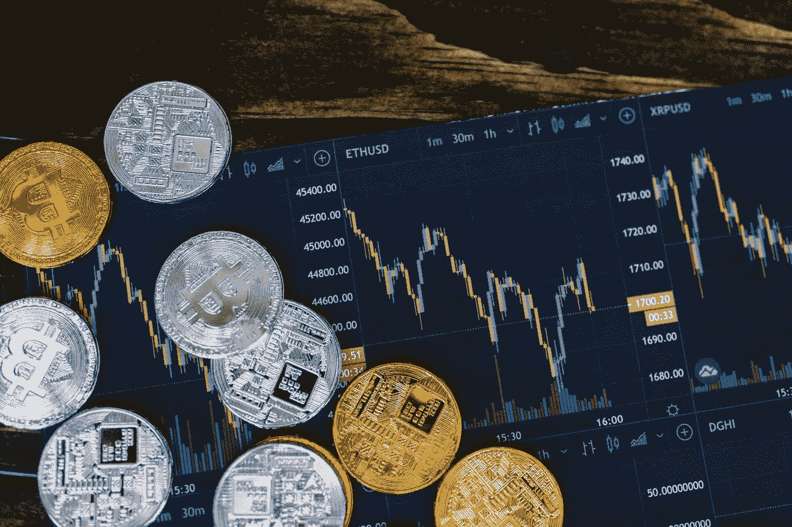

# 在当前熊市中最大化的 5 种加密货币

> 原文：<https://medium.com/coinmonks/5-cryptocurrencies-to-maximise-in-the-current-bear-market-835fb7bce78c?source=collection_archive---------0----------------------->

Photo by [RODNAE Productions](https://www.pexels.com/@rodnae-prod?utm_content=attributionCopyText&utm_medium=referral&utm_source=pexels) from [Pexels](https://www.pexels.com/photo/close-up-shot-of-silver-and-gold-round-coins-8370752/?utm_content=attributionCopyText&utm_medium=referral&utm_source=pexels)

最近几周，加密货币值经历了艰难的几周。几个月前经历了大幅价格波动的硬币和代币的价值逐渐但稳定地下降，有些现在已经下降到 10 月份的水平。

可以理解，一些投资者对此感到紧张，但糟糕的时光不会永远停留。

在市场反转的预期下，[现在可以购买加密货币了。](https://asedeyhotnaija.com/market-cap-for-cryptos/)

市场一直受到抛售的困扰，比特币(BTC 对美元)位居前列。

由于投资者获利回吐，比特币的价格在此前三个月下跌了约 2 万美元。

市场的其余部分像往常一样被负面趋势推低。

Altcoins 无法逃脱比特币的影响，比特币占据了该行业整体市场份额的大约一半。

无论从哪种方式、形态或形式来看，比特币的衰落都不意味着它变得不那么受欢迎。

交易活动正在增加，因为新投资者寻求利用低价，而老投资者试图以低价增加他们的投资组合。

毫无疑问，cryptos 的价值预计将很快上升。

为了最大限度地利用许多人认为不可避免的转机，最好买什么样的密码？

> 另外，请看:[你不太了解的 5 种迷因币](https://www.sammaiyaki.com/5-meme-coins-you-didnt-know-much-about-86f85d76c244?source=user_profile---------0-------------------------------)

# 1.涟漪(XRP)

不幸的是，Ripple 的问题持续了异常长的一段时间。

美国证券交易委员会(SEC)目前正与一家公司卷入一场激烈的法律战。

另一方面，这些法律问题似乎只是 XRP 定价之路上的一个小插曲。

在过去的 14 个月里，人民币已经显示出它能够保持在水面上。

当这个案子结束时，它将为销售的激增做好准备。

电汇已经存在，而且不会消失。每天都有数百万美元跨越国界。

正因为如此，Ripple 已经成长为一个庞大的网络。有了 Ripple 和 XRP，人们可以避免将资金转移到海外的巨额成本。

2018 年初，Ripple 的服务非常受欢迎，XRP 的价格升至 3 美元以上的历史新高。

然而，它的成功也招致了美国政府的愤怒。

SEC 2020 年对 Ripple 的诉讼让这些估值回到了现实，但 XRP 并没有死。

很难说如果这场法律战没有持续到 2021 年，XRP 币还能赚多少钱。

因此，SEC 对 Ripple 的诉讼可能最终会在 2022 年结束，给 XRP 更多发展的自由。

> 另外，请看:[2022 年你不能错过的 5 个密码](https://www.sammaiyaki.com/5-cryptos-you-cant-afford-to-miss-in-2022-bcf75944d2c0?source=user_profile---------1-------------------------------)

# 2.以太坊

不管市场环境如何，以太坊始终是一项不错的投资。

如果您正在寻找世界上最受欢迎的第一层区块链网络，这就是它。

它的平台是成千上万 DApps 的家园。

而其 3850 亿美元的市值仅次于比特币。

几乎在任何时候，ETH 都是一个好的投资，但现在，由于目前的市场状况，它比正常情况好得多。

现在买入暴跌的股票几乎肯定会在未来几个月获利，当然，还有反弹的可能。

更强烈的购买以太坊(ETH)的动机将在 2022 年中期到来。

从未有过像以太坊合并这样意义重大的网络更新。

一次大改造预计将是最令人期待的。除了引入分片之外，网络将从工作证明转变为利益证明。

作为这一系列升级的结果，以太坊用户将看到天然气价格的大幅下降和可扩展性的大幅提高。

一段时间以来，网络一直在为合并做准备。

到 2020 年 12 月底，信标链将被激活，与以太坊的主网络链并行运行，并将所有传入的更新存储在那里。

根据开发者的说法，以太坊 2.0 网络将于 2022 年 6 月完成，此前从 2021 年秋季开始进行了大量的额外改进和准备工作。

因为这是该网络迄今为止最重大的更新，人们对它的成功寄予厚望。

对期待已久的翻新工程的投资可能会带来丰厚的回报。

> 另外，请看:[2022 年 5 种虚拟房地产代币将升值](https://blog.cryptostars.is/5-virtual-real-estate-to-grow-in-value-in-2022-46f25b5f14bb?source=user_profile---------2-------------------------------)

# 3.分散土地(法力)

尽管目前市场混乱，人们对密码世界仍然很感兴趣。

科技巨头对更全面嵌入虚拟现实的社交媒体环境的持续驱动使元宇宙一直是一个热点问题(VR)。

因此，鉴于目前的市场状况，现在可能是投资分散之地法力令牌的好时机。

以元宇宙为中心的加密货币 MANA 的市场估值为 52 亿美元，在分散的分散土地上，每月用户人数超过 30 万人。

此外，它早于中央集权和地方分权的元对比。

元平台的地平线世界元宇宙区于 2017 年推出，在此之前于 2017 年推出。(FB)。

正是各种各样的可能性使得分散土地对用户如此有吸引力。

游戏、购物、结识新朋友，一应俱全。

然而，它通过确保新的联盟和元宇宙第一更进一步。

十月，分散式的元宇宙活动，第一次元宇宙音乐节，被广泛讨论。

包括电子舞曲音乐家 Deadmau5 在内的这次活动向公众展示了数字化真实世界体验的可能性。

在此之前，苏富比在平台上开设了一个展览空间，这有助于它在成立之前就成为一个家喻户晓的品牌。

新的合作一直在形成，该平台现在正在呈现与著名的澳大利亚网球公开赛的互动体验。

> 另请参见:[Twitter 上流行的 3 种替代硬币](/coinmonks/3-altcoins-that-are-trending-on-twitter-83a294c0d767?source=user_profile---------3-------------------------------)

# 4.通量(通量)

这里有一些小项目，但这种情况不会持续太久。

虽然投机的嗡嗡声可能推动了硬币的一些收益，但它也是一种提高硬币基本价值的产品，使其成为 Web 3.0 发展的明智赌注。

其社交媒体粉丝群正在迅速扩大，并渴望来自世界各地的投资者了解该网络，这一事实也不会造成伤害。

亚马逊(Amazon)和 Alphabet 等网络服务套件并不是消费者的唯一选择，但它们也不是唯一可用的选择。

FluxOS 操作系统用于在区块链网络上运行分散的网络服务。

任何人、任何组织或任何企业都可以使用 FluxOS 运行他们的应用程序、托管服务器和管理 oracles。

FluxOS 是开源的。

此外，该网络声称可以提供最快的速度，不管用户在哪里，也不管现在是什么时间。

将其他用户与服务链接起来的 FluxNodes 用户操作节点被用来做到这一点。协议根据节点在地理上的接近程度来分接节点；这保证了在世界各地运行的 FluxNodes 的快速运行。

一个名为 Zelcore 的本地钱包，以及通过并行开采在其他区块链开采通量的能力是采用通量的进一步奖励。

它具有作为 Web 3.0 加密货币的巨大潜力，为区块链带来了许多亚马逊网络服务的服务。

随着 Web 3.0 革命持续到 2022 年，Flux 预计会越来越受欢迎。

> 此外，请参见:[2022 年获得巨额收益的 5 种宝石密码](https://wire.insiderfinance.io/5-gem-cryptos-for-massive-gains-in-2022-4920a38a2cf0?source=user_profile---------6-------------------------------)

# 5.多边形(MATIC)

可伸缩性问题一直存在。加密货币投资者必须记住，即使加密货币价格下降，使用区块链网络的人数也不会停止。

DApps 和钱包将被创建，交易将被执行，而密码将被挖掘。因此，总是需要提高效率。

MATIC 是目前最值得购买的密码之一，因为 Polygon 仍然是这个需求的首选。

说到第二层可扩展性网络，Polygon 是最好的。除了为客户提供更快的交易速度之外，它还为他们提供了多种可扩展性选项。

目前，以太坊网络有六种可供选择的扩展方案。

最近的 Polygon Zero 在加密社区引起了不小的轰动。

该网络于 12 月举行了 zk 峰会，这是一次世界范围的零知识验证技术会议。

通过使用 zk 技术，用户可以保持其交易的私密性，同时减少验证数据所需的 CPU 能力。

最突出的缩放技术之一 zk 在峰会期间由 Polygon 收购的 Mir Protocol(一家 zk 缩放公司)披露。

之后 Mir 被公司改名为 Polygon。

投资者可能预计 Polygon 在前进的过程中会不断收购新技术。

多边形是一个合理的选择，因为在可预见的未来，缩放预计将继续。

> 另外，请看: [7 台 Cryptos 将于 2022 年暴涨](https://blog.cryptostars.is/7-cryptos-set-to-skyrocket-in-2022-470c28dbdc0a?source=user_profile---------7-------------------------------)

# 简单地

在过去十年中，只有 2014 年加密货币的总市值下降。

从历史上看，过去并不总是未来的可靠指标。

然而，流行病时期出现了一些粗心的加密投机，数字资产欺诈在 2021 年达到了历史最高水平。

欺诈*“rug pulls”*像 Squid 游戏代币，防止代币被转售，让欺诈者中饱私囊，造成数十亿美元的损失。

另一方面，加密货币正变得越来越普遍，尽管监管可能是一个问题，但随着全球各国政府开始认识到数字资产，这也是最大的牛市案例之一。

2022 年 1 月要购买的七种顶级加密货币已经整理出来供您阅读。

> 加入 Coinmonks [电报频道](https://t.me/coincodecap)和 [Youtube 频道](https://www.youtube.com/c/coinmonks/videos)了解加密交易和投资

## 也阅读

 [## 杠杆代币[多头代币]终极指南

### 杠杆化令牌是具有杠杆化风险敞口的 ERC20 令牌，不考虑保证金、要求、管理…

medium.com](/coinmonks/leveraged-token-3f5257808b22)  [## 最佳加密交易所| 2022 年十大加密货币交易所| CoinCodeCap

### 哪一个是最好的加密交换？在本文中，我们将根据多种加密货币列出 10 大加密货币交易所

coincodecap.com](https://coincodecap.com/crypto-exchange)  [## 2022 年最佳加密交换平台| CoinCodeCap

### 随着时间的推移，我们大多数人将转向 dex 以获得更好的安全性和隐私。因此。在这里，我们将讨论…

coincodecap.com](https://coincodecap.com/best-swap-platforms)  [## 10 大最佳在线赌场|赢得并赢取免费 BTC 2022 | CoinCodeCap

### 接收、支付和赚取加密货币| |有各种各样的最佳在线赌场可供选择，有可能…

coincodecap.com](https://coincodecap.com/best-online-casinos)  [## 2021 年最佳加密借贷平台| 6 大比特币借贷平台

### 获得比特币和其他加密货币的最佳贷款利率

medium.com](/coinmonks/top-5-crypto-lending-platforms-in-2020-that-you-need-to-know-a1b675cec3fa)  [## 2021 年 6 大最佳硬件钱包|顶级加密硬件钱包[更新]

### 最好的加密货币硬件钱包是绝对必要的。我们将在 NGRAVE、Ledger Nano X 和…

medium.com](/coinmonks/the-best-cryptocurrency-hardware-wallets-of-2020-e28b1c124069)  [## 加密交易机器人——19 款最佳免费加密交易机器人

### 2022 年币安、比特币基地、库币和其他密码交易所的最佳密码交易机器人。四进制，位间隙…

medium.com](/coinmonks/crypto-trading-bot-c2ffce8acb2a)  [## 最佳 4 个加密交易信号电报通道

### 这是乏味的找到正确的加密交易信号提供商。因此，在本文中，我们将讨论最好的…

medium.com](/coinmonks/best-crypto-signals-telegram-5785cdbc4b2b)  [## Bitsgap 评论-交易机器人加密信号和套利 2022

### 这篇文章的重点是 Bitsgap 审查，这是一个最终的交易解决方案，并提供交易机器人，信号…

coincodecap.com](https://coincodecap.com/bitsgap-review)