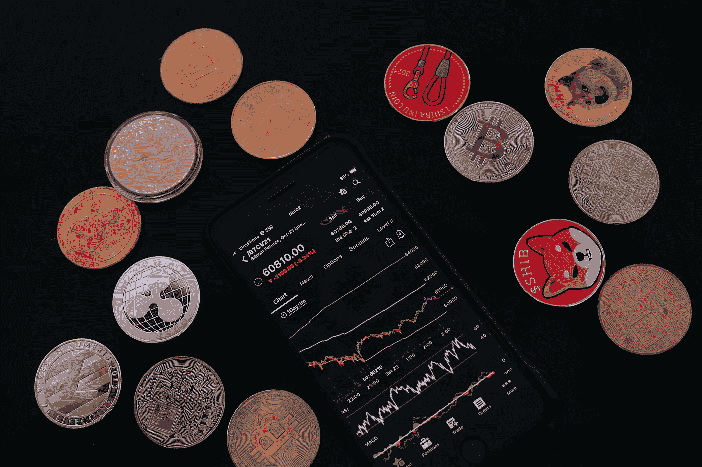

# 5 Cryptos 可能是下一件大事

> 原文：<https://medium.com/coinmonks/5-cryptos-that-could-be-the-next-big-thing-f7fa4f1de95f?source=collection_archive---------1----------------------->

Image by [Sergei Tokmakov Terms.Law](https://pixabay.com/users/sergeitokmakov-3426571/?utm_source=link-attribution&utm_medium=referral&utm_campaign=image&utm_content=6733767) from [Pixabay](https://pixabay.com/?utm_source=link-attribution&utm_medium=referral&utm_campaign=image&utm_content=6733767)

在开发的早期阶段，[这些潜在的加密项目值得仔细研究。](https://asedeyhotnaija.com/market-cap-for-cryptos/)

各种规模的投资者仍在涌向加密货币。

最近甚至有传言说议员和他们的家人在[加密货币](https://asedeyhotnaija.com/why-should-i-invest-in-bitcoin/)上下了数千美元的赌注。

这样做的主要原因是使用加密货币产生快速货币的可能性。

像迷因币和投机代币这样的投资项目存在很大的风险。

同样重要的是要注意，没有必要把钱投入到像 Dogecoin 或 Shiba Inu 这样的项目中去挣大钱。

从长远来看，有些举措具有坚实的基础和全新的理念，有可能获得丰厚的回报。

风险投资是一种对非投机性公司的早期投资。

即使有一个很棒的公司概念，风投们还是投资了数百家企业，其中大多数都失败了。

另一方面，成功的企业不仅仅弥补了失败的企业。

一些[加密货币](https://asedeyhotnaija.com/which-cryptocurrency-is-best/)初创公司有可能成为多重包客。

即使它们不是投机性的，我也会谨慎行事，为早期加密货币风险投资设立单独的投资组合。

子文件夹中的每个项目可能会分配到几百美元。即使只有一半的投资成功，整体利润仍然会很可观。

[CoinMarketCap](https://coinmarketcap.com/invite?ref=XQW6VFQN) 和 [CoinGecko](https://www.coingecko.com/) 有关于这些加密货币的更多信息。

> 另外，请看:[必读评论:Victory Crypto 是合法的还是骗局](https://asedeyhotnaija.com/a-must-read-review-is-victory-crypto-legit-or-a-scam/)

# 1.全球硬币研究(GCR)

谈到 web3， [Global Coin Research](https://coinmarketcap.com/currencies/global-coin-research/) 称自己为 ***“一个象征性的、分散的学习者和投资者社区。”***

想法、思想和趋势可以在时事通讯和项目材料中找到。已经有 30，000 多人订阅了这份时事通讯。

该项目在种子前期和种子资金阶段的大量交易的可用性是其最有趣的方面之一。

全球硬币研究成员已经进行了 30 多次交易。

在这个例子中，GCR 令牌的有用性被进一步显示。

要成为一级黄金会员，投资者必须拥有 400 个 GCR 代币。拥有这些代币可以获得与公司创始人会面的机会和特别优惠。

由于全球硬币研究，在早期阶段投资令人兴奋的新项目现在是可行的。

由于投资回报平均为 16 倍，对一级会员的需求预计会增加。

这也是一个有利因素，因为该项目的令牌组学对我很有吸引力。只有 1000 万枚 GCR 代币在流通。

由于越来越多的投资者购买 GCR 代币进行早期交易，预计代币价格将在未来几个月上涨。

GCR 硬币目前的交易价格约为 11 美元，比历史最高价低了 80%以上。

如果明年再次检测到类似的浓度，我不会感到震惊。

> 此外，请参见:[2022–2023 年国内可开采的 5 种有利可图的加密货币](https://www.sammaiyaki.com/5-profitable-cryptocurrencies-to-mine-at-home-2022-2023-592a5e5102b?source=user_profile---------4-------------------------------)

# 2.缓冲令牌(IBFR)

[随着期权交易在加密领域变得更加流行，IBFR 代币](https://www.coingecko.com/en/coins/ibuffer-token)值得考虑。

换句话说，这是一次非常冒险的冒险。

然而，根据已经提供的功能和计划中的功能，机组人员似乎可以胜任。

硬币预测游戏和替代品现在可以在 iBuffer 的平台上使用。

在该网站上，投资者还可以交易某些股票的期权。

金银贸易现在在商品市场上进行。

iBuffer 是 BNB 的一个连锁项目，计划发展壮大。

另一方面，Avalanche 已经实现了第一次跨链扩展。

Polygon 和 Nervos Network 将很快包括在内(CKB-美元)。

预计在未来几个月开业的 NFT 市场是另一个令人兴奋的新特色。

作为 NFT，投资者将能够交易他们的预测。

2022 年第一季度，项目拟上市一家或多家集中交易所。会增加它的知名度。

在平台上，代币持有者也可以选择参与收益分成。

期权和预测游戏交易利润现在按项目对半分。现在有一个 10.6%的收入分享年利率。

由于 token 的市值不到 200 万美元，我不会投入太多资金。

然而，投资组合中最显著的变化可能是在小盘股领域。

即使对这一已经显示出令人鼓舞的结果的倡议进行少量投资也是有意义的。

> 另请参见: [5 个必须知道的加密机制](https://www.sammaiyaki.com/5-must-know-crypto-mechanisms-ac179eddd72c?source=user_profile---------5-------------------------------)

# 3.太阳能明(太阳能)

[Solarmine](https://www.coingecko.com/en/coins/solarmine) 是另一个可能会考虑进行一些投资的微市值项目。

马拉松数字(Marathon Digital)和 Riot Blockchain (RIO)等矿业公司是投资者所熟知的。

一个去中心化世界的比特币矿工是 Solarmine 的目标。

该倡议仅运行了几个月，但它已经开始收购矿商。

一旦比特币开采开始，太阳能预计将升值。

该项目的独特之处在于代币持有者将获得所有生产的比特币的 25%。

币安(BNB-美元)货币将作为奖品。

生产出来的比特币将用剩下的 25%购买更多的矿工。

如果随着时间的推移，硬币继续升值，投资者应该会期待他们在 BNB 的投资会有更大的回报。

作为 Solarmine 项目的一部分，预计还将推出 NFTs。

网站上会随机生成一个号码。一旦采矿作业开始，NFT 的持有者将获得以太坊的奖励。

市场价值不到 200 万美元的太阳能硬币有很多让人喜欢的地方。

如果这些计划如期实施，代币有可能返回数倍于其初始值的价格。

> 另外，请看: [5 项重要的加密费用&它们是如何让你付出代价的](https://www.sammaiyaki.com/5-significant-crypto-fees-how-they-cost-you-ff177de58aac?source=user_profile---------6-------------------------------)

# 4.加里网络(Gari)

印度使用加密货币的人数是世界上最多的。

印度政府最近宣布对加密货币收入征收 30%的税。

这可能是美国监管加密货币行业的第一步。

因此，印度似乎不会在短期内宣布加密货币为非法。

看来，[加里](https://coinmarketcap.com/currencies/gari/)这种新上市的币，上涨潜力巨大。简而言之，加里就是字节跳动的 Tik Tok。

Web 3.0 社交网络应用也是增长最快的应用之一。

估计现在有 7000 万人使用这项服务。

有了加里代币，内容制作者可以因为创造他们独特的艺术作品而获得奖励，包括视频和音频记录。

由于这一举措，创作者可以获得平台收入的 30%。

加里网络在 2021 年 12 月通过首次发行 DEX 获得了资金。(IDO)。股票发行又净赚了 1500 万美元。

加里打算在 2022 年第二季度扩展到拉丁美洲和非洲。

此外，预计 2023 年在欧美发售。

因此，加里网络工程的发展前景是看好的。

> 另请参见:[选择加密货币钱包前需要注意的 5 个重要方面](https://www.sammaiyaki.com/5-crucial-areas-to-note-before-selecting-a-cryptocurrency-wallet-c3c9ac2676f?source=user_profile---------7-------------------------------)

# 5.Ideamarket(海事组织)

Web 3.0 最近受到了很多关注，人们关注的焦点是它将如何带来更开放、更智能的网站。

我很欣赏 [Ideamarket](https://www.coingecko.com/en/coins/ideamarket) 背后的理念，那就是为创意创造一个市场。

硬币、代币和不可替换代币不在 Ideamarket (NFTs)上列出。因此，它更像是一个创意市场。

Ideamarket 允许用户列出某些网址和 Twitter 账户。

它们因其提供的信息而被交换和估价，这就是为什么这些概况和联系存在的原因。

例如，在 Ideamarket 上，埃隆马斯克的 Twitter 账户被列出，交易价格为 3.12 美元。

随着越来越多的人存钱下注，这份档案的价值也会上升。

从投资者的角度来看，有两个好处。

随着时间的推移，投资于包含重要信息的个人资料或 URL 可能会带来金钱上的收益。

就目前而言，存款一个月的年利率为 383%，三个月的年利率为 4600%，这是一个可观的回报。IMO 代币用于支付利息。

作为一项努力，Ideamarket 仍处于起步阶段。

截至目前，这笔交易已经锁定了 100 多万美元。

可以想象的是，TVL 将上升，作为低存款利率的结果。国际海事组织令牌的价值将上升。

> 参见:[评估加密项目的 7 种可靠方法？](https://www.sammaiyaki.com/7-solid-ways-to-evaluate-a-crypto-project-acd7775b4291?source=user_profile---------9-------------------------------)

# 简单地说

为了在 2022 年前实现 100 倍的价值增长，crypto 必须有一个令人信服的使用案例。

[高市值的现有加密货币](https://asedeyhotnaija.com/market-cap-for-cryptos/)必须是其市场中的主导者，并在竞争中拥有强大的技术优势，以保持其地位。

他们需要一个坚实的价值主张，解决现有市场竞争对手无法为新的低资本计划解决的问题。

如果你认为你的项目具备成为下一个大项目的条件，你就更有可能成功。

预计未来几年情况不会有太大变化。

对于一个实现 100 倍回报的项目，在投资者看来，它一定是下一件大事。

至于它能否兑现承诺，则是另一回事了。

一个项目的价值可能会在短时间内上涨 100 倍，但也会以同样快的速度暴跌近 90%。

能够把握市场时机，在价格大幅下跌前退出头寸的投资者能够获得最佳回报。

**财务免责声明**

本文内容仅供参考，您不应将任何此类信息或其他材料理解为法律、税务、投资、财务或其他建议。

此处包含的任何内容都不构成购买或出售任何证券或其他金融工具的请求、推荐、认可或要约。

投资加密货币构成了相当大的风险，在投资加密货币之前做好你的研究。

> 加入 Coinmonks [电报频道](https://t.me/coincodecap)和 [Youtube 频道](https://www.youtube.com/c/coinmonks/videos)了解加密交易和投资

# 另外，阅读

*   [印度的加密交易所](/coinmonks/bitcoin-exchange-in-india-7f1fe79715c9) | [比特币储蓄账户](/coinmonks/bitcoin-savings-account-e65b13f92451)
*   [OKEx vs KuCoin](https://coincodecap.com/okex-kucoin) | [摄氏替代品](https://coincodecap.com/celsius-alternatives) | [如何购买 VeChain](https://coincodecap.com/buy-vechain)
*   [币安期货交易](https://coincodecap.com/binance-futures-trading)|[3 comas vs Mudrex vs eToro](https://coincodecap.com/mudrex-3commas-etoro)
*   [如何购买 Monero](https://coincodecap.com/buy-monero) | [IDEX 评论](https://coincodecap.com/idex-review) | [BitKan 交易机器人](https://coincodecap.com/bitkan-trading-bot)
*   [CoinDCX 评论](/coinmonks/coindcx-review-8444db3621a2) | [加密保证金交易交易所](https://coincodecap.com/crypto-margin-trading-exchanges)
*   [红狗赌场评论](https://coincodecap.com/red-dog-casino-review) | [Swyftx 评论](https://coincodecap.com/swyftx-review) | [造币厂评论](https://coincodecap.com/coingate-review)
*   [Bookmap 评论](https://coincodecap.com/bookmap-review-2021-best-trading-software) | [美国 5 大最佳加密交易所](https://coincodecap.com/crypto-exchange-usa)