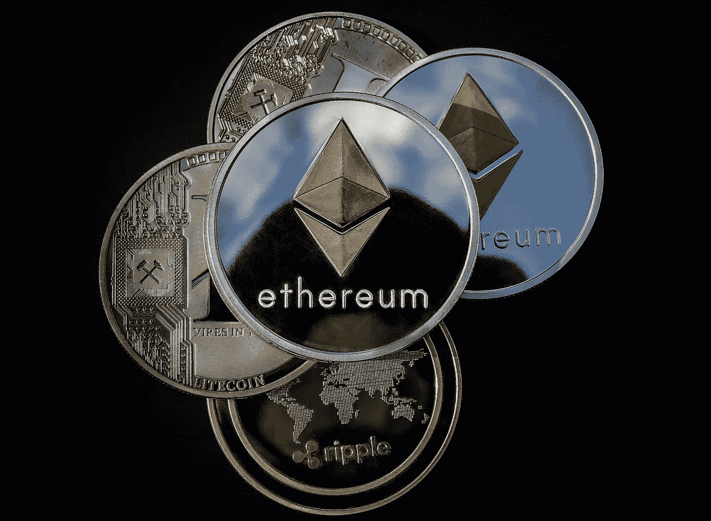

# 2022 年你不能错过的 5 个密码

> 原文：<https://medium.com/coinmonks/5-cryptos-you-cant-afford-to-miss-in-2022-bcf75944d2c0?source=collection_archive---------3----------------------->

Following promises that the sector’s market capitalization already contained the pessimism, [cryptos fell even more](https://asedeyhotnaija.com/which-cryptocurrency-is-best/).

正如几个月前一样，[的加密货币价格预测](https://asedeyhotnaija.com/best-cryptocurrency-to-invest-in-2022/)正在社交媒体网站上进行，并带有疯狂的上涨预期。

当美联储接手，以及一系列其他挑战，如当前的冠状病毒疫情，这个行业的热情破灭了。

在承诺该行业的市值已经包含了悲观情绪之后， [cryptos 跌得更厉害。](https://asedeyhotnaija.com/which-cryptocurrency-is-best/)

Coinmarketcap.com 12 月 14 日的黑客攻击、故障，或者不管是什么，也许是虚拟货币领域当前时代精神的具体表现。

我们希望看到加密货币的总市值达到 5.5 万亿美元。

不幸的是，事实并非如此。然而，额外的阻力对所有金融市场都是坏消息，比如东欧危机的深化。

另一方面，加密货币的支持者并不担心。

因此，对该行业的反向看涨观点并不像乍看上去那样疯狂。

所有加密货币的市值在 2021 年 11 月达到平价。

虚拟货币在去年 12 月贬值了 16%以上。

数字资产在最低点暴跌 15%后，今年 1 月迄今已下跌 10%。

Cryptos 可能已经触底或即将触底，即使数据是可疑的。因此，现在可能是购买的好时机。

你可以在 [coinmarketcap](https://coinmarketcap.com/invite?ref=XQW6VFQN) 上找到关于这些密码的更多细节。

> 参见:[必读评论:Victory Crypto 是合法的还是骗局](https://asedeyhotnaija.com/a-must-read-review-is-victory-crypto-legit-or-a-scam/)

# 1.以太坊

就像是在暗示一样，[以太坊](https://coinmarketcap.com/currencies/ethereum/)在比特币的价值预计将大幅上涨的任何时候，都是一个自然和合乎逻辑的下游受益者。

基本数字货币 ETH-USD 创造了有机利益，成为基于区块链的实用应用的支柱。

作为市值第二大的加密货币，无论走到哪里，ETH-USD 都会跟随 BTC-USD。

> 又见:[以太坊抛出了暴胀理论](https://wire.insiderfinance.io/ethereum-has-thrown-out-the-inflation-theory-281b03f88f22?source=user_profile---------2-------------------------------)

以太坊的基调也发生了重大转变。

为了保持总体积极的趋势，目前徘徊在 3000 美元左右的 ETH-USD 需要突破 4000 美元关口。

否则，ETH-USD 和大多数其他加密货币可能会受到外部担忧的严重影响，如美联储宣布的激进货币政策。

> 另请参见:[2022 年投资 5 种医疗保健密码](https://www.sammaiyaki.com/5-healthcare-cryptos-to-put-your-money-in-2022-7b31c83a2517?source=user_profile---------10-------------------------------)

# 2.卡尔达诺

由于技术(图表分析)表现不佳，[卡尔达诺](https://coinmarketcap.com/currencies/cardano/)在上周大幅上涨。

在撰写本文时，ADA-USD 是过去七天中十大加密货币中性能最高的加密货币。

排名前十的数字资产都增长了 13%以上。

如果实现了这种水平的技术支持，ADA 就会跌到低价股的水平。

近期市场走强的另一个突出迹象是，Cardano 已连续多日在 50 日均线(DMA)下方交易。

雪上加霜的是，ADA 的 50 DMA(现在为 1.34 美元)也明显低于其 200 DMA(1.82 美元)，这是长期市场弹性的信号。

在跌至目前的 1.39 美元之前，Cardano 的交易价格约为 1.63 美元，因此它的表现相当不错。另一方面，投资者应该避免变得过于自信。

在 ADA 重新控制其 200 天移动平均线(DMA)之前，牛市故事不会完全恢复。

> 参见: [NFT 骗局:如何避免它们](/coinmonks/nft-scams-how-to-avoid-them-f52fc7152242?source=user_profile---------12-------------------------------)

# 3.涟漪(XRP)

自首次亮相以来，cryptos 的法律地位一直是 cryptos 最迫切的问题之一。

局外人可能会对这些代币的合法性感到困惑，这些代币的特征类似于股票和大宗商品等传统资产，但在一个前所未有的去中心化数字平台上运行，此前曾有过去中心化货币。

事实上，你发现密码是个人清晰的来源是令人惊讶的。

似乎连专家都对这种情况感到困惑。

> 另外，请看:[涟漪 XRP 硬币:新手快速指南](https://www.sammaiyaki.com/ripple-xrp-coin-a-quick-guide-for-newbies-ede83b1b73bd?source=user_profile---------9-------------------------------)

对于那些不知道的人，美国证券交易委员会已经对 Ripple 提起诉讼，该公司负责创造[XRP-美元](https://coinmarketcap.com/currencies/xrp/)加密货币。

整个局势的一个问题是，Ripple 和一些内部人士利用 XRP-美元赚了很多钱，这是雄心勃勃的公司的首席执行官的惯例。

简而言之，XRP 兑美元正在挣扎，需要立即夺回 90 美分的水平，以恢复急需的信任。

> 另见:[2022 年 5 种虚拟房地产代币将升值](/cryptostars/5-virtual-real-estate-to-grow-in-value-in-2022-46f25b5f14bb?source=user_profile---------0-------------------------------)

# 4.比特币(BTC)

当谈到加密技术时，只需要几个月的时间，故事就发生了根本性的转变——简单地回想一下 2013 年的[比特币](https://coinmarketcap.com/currencies/bitcoin/)感觉。

许多在线专家预测，随着 BTC 兑美元汇率在 11 月份接近创纪录高位，该汇率将迅速升至 10 万美元。

就疯狂的 BTC 兑美元价格预测而言，这是最神圣的一次，现在已经不那么疯狂了。

由于这些预期没有实现，最近关于 BTC 兑美元汇率从调整性下跌中反弹的说法应该持保留态度。

说到密码还是一样的垃圾:

> *涨了就涨，跌了就涨，横了就涨。*

换句话说，这是有害乐观主义的表现。

因为比特币不支付股息(在常规意义上)，我认为这种停留在 40，000-50，000 美元左右的区域会适得其反。

这意味着，如果我们短期内看不到上涨势头，那么再次下跌就不足为奇了。

> 另见:[2022 年 5 大收益的创业板密码](https://wire.insiderfinance.io/5-gem-cryptos-for-massive-gains-in-2022-4920a38a2cf0?source=user_profile---------4-------------------------------)

# 5.系绳(USDT)

与比特币、以太坊和绝大多数其他加密货币不同，Tether 不是投机者的目标，因为它是一种与美元价值挂钩的稳定货币或数字资产。

Tether 的主要使命是为其消费者提供快速而简单的流动性，这是有争议的。

在 stablecoins 出现之前，希望保护自己比特币收益的投资者被迫清算他们持有的法定货币。

后来，如果他们想回来，他们将不得不花法定货币购买 BTC 美元。

可以肯定的是，这是一个耗时且昂贵的过程，而且它可以提醒当局注意可疑的活动。

系绳，如果你愿意，把事情留在家里。

> 另见: [7 台 Cryptos 将于 2022 年暴涨](/cryptostars/7-cryptos-set-to-skyrocket-in-2022-470c28dbdc0a?source=user_profile---------5-------------------------------)

# 总结一下

由于这两种资产类别之间的历史联系，一些传统专家认为，股市低迷最终会拖累加密技术，加剧当前的加密热潮。

最后，淘汰任何弱势玩家将解放虚拟货币市场，让它只接受乐观的热情。

尽管如此，我对此仍有疑问。在此期间，数字资产的总价值从高点到低点下跌了 36%。

然而，这是一个重大的调整，并没有超出该地区的标准。不要抱太大希望。

## 财务免责声明

*内容仅供参考，您不应将任何此类信息或其他材料理解为法律、税务、投资、财务或其他建议。我们的文章中所包含的任何内容都不构成 HII 或任何第三方服务提供商在该司法管辖区或任何其他司法管辖区购买或出售任何证券或其他金融工具的邀约、建议、认可或要约，在这些司法管辖区，此类邀约或要约根据该司法管辖区的证券法是非法的。*

> 加入 Coinmonks [电报频道](https://t.me/coincodecap)和 [Youtube 频道](https://www.youtube.com/c/coinmonks/videos)了解加密交易和投资

## 另外，阅读

*   [AscendEX 审查](/coinmonks/ascendex-review-53e829cf75fa) | [OKEx 交易机器人](/coinmonks/okex-trading-bots-234920f61e60) | [OKEx 交易机器人](/coinmonks/okex-trading-bots-234920f61e60)
*   [火币交易机器人](https://coincodecap.com/huobi-trading-bot) | [如何购买 ADA](https://coincodecap.com/buy-ada-cardano) | [Geco。一次回顾](https://coincodecap.com/geco-one-review)
*   [币安 vs 比特邮票](https://coincodecap.com/binance-vs-bitstamp) | [比特熊猫 vs 比特币基地 vs Coinsbit](https://coincodecap.com/bitpanda-coinbase-coinsbit)
*   [如何购买 Ripple (XRP)](https://coincodecap.com/buy-ripple-india) | [非洲最好的加密交易所](https://coincodecap.com/crypto-exchange-africa)
*   [非洲最佳密码交易所](https://coincodecap.com/crypto-exchange-africa) | [胡交易所评论](https://coincodecap.com/hoo-exchange-review)
*   [eToro vs robin hood](https://coincodecap.com/etoro-robinhood)|[MoonXBT vs Bybit vs Bityard](https://coincodecap.com/bybit-bityard-moonxbt)
*   [风暴增益评论](https://coincodecap.com/stormgain-review) | [普罗比特评论](https://coincodecap.com/probit-review) | [北海巨妖评论](/coinmonks/kraken-review-6165fc1056ac)
*   [如何在势不可挡的域名上购买域名？](https://coincodecap.com/buy-domain-on-unstoppable-domains)
*   [印度的秘密税](https://coincodecap.com/crypto-tax-india) | [altFINS 审查](https://coincodecap.com/altfins-review) | [Prokey 审查](/coinmonks/prokey-review-26611173c13c)
*   [Blockfi vs 比特币基地](https://coincodecap.com/blockfi-vs-coinbase) | [BitKan 评论](https://coincodecap.com/bitkan-review) | [期货交易机器人](/coinmonks/futures-trading-bots-5a282ccee3f5)
*   [南非的加密交易所](https://coincodecap.com/crypto-exchanges-in-south-africa) | [BitMEX 加密信号](https://coincodecap.com/bitmex-crypto-signals)
*   如何在 WazirX 上购买柴犬(SHIB)硬币？
*   [MoonXBT 副本交易](https://coincodecap.com/moonxbt-copy-trading) | [阿联酋的加密钱包](https://coincodecap.com/crypto-wallets-in-uae)
*   [MoonXBT vs Bybit vs 币安](https://coincodecap.com/bybit-binance-moonxbt) | [硬件钱包](/coinmonks/hardware-wallets-dfa1211730c6)
*   [雷米塔诺评论](https://coincodecap.com/remitano-review)|[1 英寸协议指南](https://coincodecap.com/1inch)
*   [十大最佳加密货币博客](https://coincodecap.com/best-cryptocurrency-blogs) | [YouHodler 评论](https://coincodecap.com/youhodler-review)
*   [KuCoin vs 币安](https://coincodecap.com/kucoin-vs-binance) | [Bitrue 点评](https://coincodecap.com/bitrue-review) | [Jet-Bot 点评](https://coincodecap.com/jet-bot-review)
*   [买 PancakeSwap(蛋糕)](https://coincodecap.com/buy-pancakeswap)|[matrix export Review](https://coincodecap.com/matrixport-review)