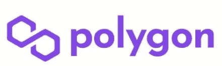

# 在这次下跌中，你可以考虑投资 5 枚 DeFi 硬币！

> 原文：<https://medium.com/coinmonks/5-defi-coins-to-consider-investing-in-during-this-dip-5d3d0f96b724?source=collection_archive---------8----------------------->

**去中心化金融( *DeFi* )** 是一种新兴的金融技术，它基于类似于加密货币所使用的安全分布式分类账。

不管你喜不喜欢，熊市已经来临。但对于像我这样的长期爱好者和狂热的密码爱好者来说，这次下跌提供了一个相当有吸引力的购买机会。以下是我认为值得长期购买和持有的 5 种 DeFi 币。

1.  **月神(Terra)**

Stablecoins 也许是目前被更广泛的加密投资人群所忽视的一项技术。由于固定在 1 美元，它们为加密投资组合提供了一定程度的稳定性和缓冲。它们在 DeFi 中用途广泛，并将继续成为投资领域的主要产品。

Terra 是一个公共区块链协议，部署了一套算法分散的稳定核心，支撑着一个蓬勃发展的生态系统，为大众带来 DeFi。Terra 创造了两种硬币——一种是 UST，一种有意与美元挂钩的稳定硬币。与其他由美元支持的稳定货币不同，UST 的价值由 Terra 的另一种加密货币 Luna 支持。简而言之，如果 UST 相对于美元贬值，那么投资者可以卖出 UST 换取美元来赚钱。出售 UST 会烧掉这些代币，减少供应量，支撑 UST 的价值回到与美元一致的水平。如果 UST 的价值过高，投资者可以用卢纳代币交换 UST(存在一对一的关系)，并通过这种方式赚钱。但是用卢娜代币交换 UST 会产生新的 UST 代币，增加 UST 的供应量，使其价值回落到与美元一致的水平。这就是 UST 的价值保持在 1 美元的原因。随着对 UST 的需求增加，LUNA 也将增加，它可能会在熊市后受益。

作为一个稳定的货币，UST 相对于 USDT 的优势之一是它现在有更大的赌注价值；它之前在火币首次亮相时有 200%的诱人 APY(我之前在我的[视频](https://youtu.be/rJeblgT9RYI)中报道过)，目前在 28 天的赌注期内降至 25%的 APY，这仍然相对高于 USDT 提供的利率。点击[此处](https://www.huobi.com/en-us/topic/double-invite/register/?invite_code=5t5jb&name=Banshee&avatar=4)如果您想查看 Huobi，这是一个非常受欢迎的加密货币交易所，支持大量用于交易、下注、期货合约等的硬币。

截至 23/1/22，Luna 的交易价格为 67 美元，从昨天 62 美元的低点反弹了不少。尽管如此，它仍比 100 美元的 ATH 低了 33%。它是前一年增长最快的硬币之一。

**2。MATIC(多边形)**

Polygon 是一个以太坊兼容的区块链解决方案，与以太坊网络臭名昭著的高额油费相比，交易费用更低，仅为几美分。多边形网络吸引了大量的用户。事实上，我们可以在 Polygon scan 的 [Polygon 区块链浏览器](https://polygonscan.com/)上看到，Polygon 现在每天有大约 200 万笔交易。该网络正在发展，并为 ERC20 令牌提供了良好的效用。它有一个不断构建其产品的记录，不仅允许用户更快地进行交易，还允许选择不同的扩展解决方案。

截至 2012 年 1 月 23 日，Polygon 的交易价格为 1.6 美元，较其 ATH 的 2.87 美元下跌了 44%。

**3。AVAX(雪崩)**

Avalanche 是一个去中心化的开源区块链，具有智能合约功能和多个实用程序。AVAX 是平台的原生加密货币，是周围的 DeFi 巨头之一。它承诺以环保的低成本实现惊人的交易处理速度。它兼容以太坊 dApps，可以即时确认交易，每秒处理数千笔交易，远远超过当今任何去中心化的区块链平台。它还允许启动私人或公共的定制区块链。AVAX 可以以有吸引力的利率进行投资，以帮助处理交易并进一步保护平台。

截至 2012 年 1 月 23 日，AVAX 的交易价格为 63 美元，比其 ATH 的 135 美元下跌了 53%——事实上，它现在的折扣很大。

**4。AAVE**

有趣的事实:Aave 在芬兰语中翻译为 ghost(这解释了它的标志)。

Aave 于 2017 年推出，是一种分散式金融协议，允许用户借出和借入 crypto。贷方通过将数字资产存入专门创建的流动性池来赚取利息。然后，借款人可以用他们的密码作为抵押，利用这种流动性获得快速贷款。

Aave 的旗舰产品之一是“快速贷款”，它被称为 DeFi 领域的第一个无抵押贷款选项。

另一个大卖点是，那些通过 Aave 借款的人可以在固定利率和可变利率之间交替。虽然固定利率可以在加密市场波动时提供一定的成本确定性，但如果借款人认为价格将在不久的将来下跌，可变利率就可以派上用场。

截至 23/1/22，AAVE 股价为 152 美元，比去年 5 月短暂的 ATH 下跌了 76%。

**5。DFI**

DFI 可能是最被低估的 DeFi 项目之一。

DFI 于 2019 年推出，是一个区块链平台，旨在最大限度地发挥比特币生态系统中 DeFi 的全部潜力。该软件平台由分布式计算机网络支持，旨在促进快速透明的交易。它是一个分散的平台，提供通常由商业银行提供的大量金融服务，包括借款、贷款、投资和存储资金，主要区别在于分散化。所有的行动都支持整个网络，并且该过程的参与者接收 DFI 令牌。

DeFiChain 最初的功能和产品包括:借贷、代币包装、定价神谕、交易所、资产代币化、红利分配等等。它有一个活跃的电报社区，你可以通过[Telegram:Contact @ defi block chain](https://t.me/defiblockchain)加入

截至 2012 年 1 月 23 日，DFI 股价为 2.47 美元，较其 ATH 价 5.47 美元下跌了 55%。

去年大部分时间都跑赢了比特币。

[Cake DeFi](https://cakedefi.com/?ref=677920) 是一家总部位于新加坡的投资公司，建立在 DeFiChain 之上，提供一系列服务，包括赌注、流动性挖掘和贷款服务，年利率高达 200%。他们众多产品中令人兴奋的最新成员包括分散资产，它结合了投资传统股票(如特斯拉、谷歌、苹果、SPDR 的&P 500 ETF 信托基金等)和流动性挖掘的诱人利率这两个领域的优势。查看我下面的视频，了解更多关于分散资产的信息。

点击[这里](https://www.publish0x.com/smart-crypto-investments/earn-delicious-passive-cashflow-with-cake-defi-xxyxwem)了解更多关于蛋糕 DeFi 在我以前的职位；今天[注册](https://cakedefi.com/?ref=677920)就可以获得 30 美元的免费奖励！(在 2022 年 2 月 11 日之前，限时获得 8 英镑 DFI 奖金！)

**最终想法**

我上面列出的硬币清单肯定不是详尽无遗的；你心目中还有哪些值得投资的项目？请在下面的评论区留下你的想法。

在这个市场不确定的时期，建议在进行任何投资时谨慎。过去的表现不能代表未来的表现。

避免上述情况的一个建议是分批买入蘸酱——不要一次性全部投资。

*******************************************************************

*关注我，了解更多合法的投资技巧和诀窍！*

> 加入 Coinmonks [电报频道](https://t.me/coincodecap)和 [Youtube 频道](https://www.youtube.com/c/coinmonks/videos)了解加密交易和投资

# 另外，阅读

*   [AscendEx Staking](https://coincodecap.com/ascendex-staking)|[Bot Ocean Review](https://coincodecap.com/bot-ocean-review)|[最佳比特币钱包](https://coincodecap.com/bitcoin-wallets-india)
*   [霍比审核](https://coincodecap.com/huobi-review) | [OKEx 保证金交易](https://coincodecap.com/okex-margin-trading) | [期货交易](https://coincodecap.com/futures-trading)
*   [网格交易机器人](https://coincodecap.com/grid-trading) | [Cryptohopper 审查](/coinmonks/cryptohopper-review-a388ff5bae88) | [Bexplus 审查](https://coincodecap.com/bexplus-review)
*   [7 个最佳零费用加密交易平台](https://coincodecap.com/zero-fee-crypto-exchanges)
*   [氹欞侊贸易评论](https://coincodecap.com/anny-trade-review) | [霍比保证金交易](/coinmonks/huobi-margin-trading-b3b06cdc1519)