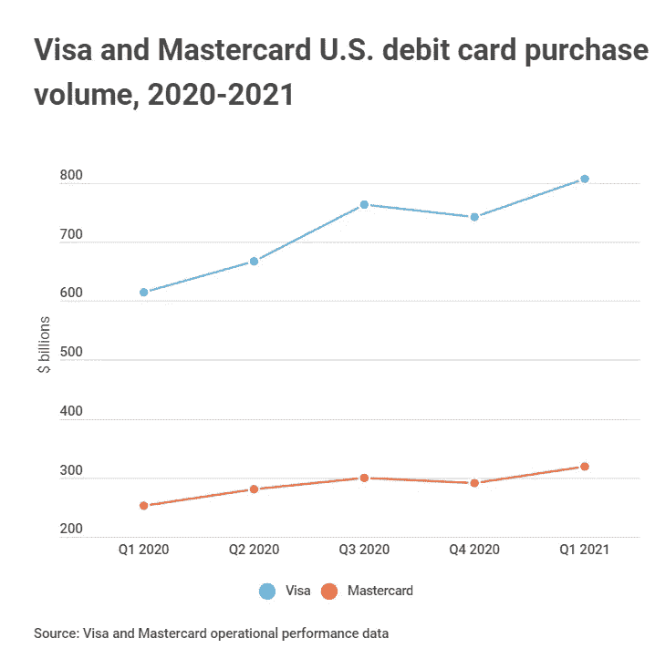
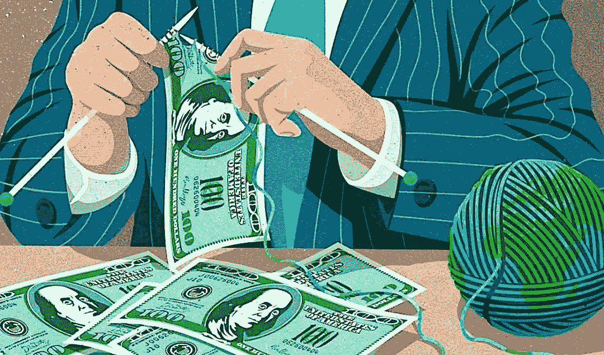

# #5:数字资产和获取金钱的途径

> 原文：<https://medium.com/coinmonks/5-digital-assets-access-to-money-67f5c4a5b308?source=collection_archive---------44----------------------->

消费主义在社会的各个方面都是真实的。如今，花钱和挣钱一样重要:如果你有孩子和/或家人，为你的习惯和爱好准备多余的资金——满足他们的习惯和爱好，以及能够适当地储蓄和投资未来。消费主义的一部分包括获得金钱和花钱的能力。

现在我们也有幸经历了通货膨胀。吃任何东西都要花 10 美元，和朋友“出去”要花 50 美元，不管你怎么切。

在美国和其他第一世界国家，我们认为这是理所当然的，因为当地货币通常是固定的，当地银行和机构积极向其公民提供托管服务，并且仅限于自然灾害或其他严重异常情况的可能性缩小到允许您公开信任系统，并利用这些机构服务来管理您的流动资产，并依赖这些服务来满足您的日常消费习惯。

让我们面对现实吧——在当今这个令人恐惧的社会中，我们经常听到像“如果银行没有我的钱怎么办”这样的制度性担忧，这让消费者担心在危机中他们将从哪里获得现金，或者甚至是最近的银行(农村社区)的物理限制。这些人也通过现金或支票支付账单，很少获得信贷，过着非常简单的生活。

不管你来自哪里，也不管你的情况如何，获得金钱/资本、消费习惯、预算和其他金融技能都会在你年轻的时候遗传给你。这主要通过两种方式之一发生:在年轻时通过同龄人和领导者观察金钱习惯，或从上述领导者、学校、其他金融机构或诸如此类的地方教育金钱习惯。

另一方面，有人像我一样依赖于社会的数字方面:五个月没有借记卡，基本上依赖系统进行交易等。

我不需要现金，除非我要买一些大麻或其他“交易受限”的零售商品。我可以用信用来支付我的债务，并通过收益记入借方，从而从信用系统中获得更多的“点数”。事实上，信用系统中的“点”让人们对自己的信用完全着迷，以至于他们经常忘记自己的资产结构。

虽然我认为现金/法定货币是允许隐私和个人管理的社会的一个方面，这有利于主权和一个经济体公民的整体权力？绝对的。然而，这使我成为一个伪君子，因为我没有参与社会的这一方面，许多类似社会的乡亲和我在同一条船上。从 2022 年 1 月起，我就没有借记卡了。我想这也反映了我成年后的一些更好的习惯——没有现金很难参加聚会或者去赌场！下图显示了通过借记卡支付，货币的“数字”使用正在上升。

那么，下一步是什么？除了社会中享有特权的数字消费者之外，在相反的光谱上，我们还有全球各地的社会成员，他们要么太过农村化，要么在全国范围内缺乏银行服务。在完全相同的人口统计中，人们在完全数字化的环境中工作，很少接触现金。对我来说，这很能说明消费主义和消费的未来——实体现金/纸币存在，而数字氛围完全消失的真实可能性有多大？

尽管反对现金的言论以及关于未来什么样的储备货币将服务于地球的困惑继续蔓延，但从估值角度来看，数字资产正在更广泛的市场上遭到屠杀。虽然不完全是该行业的错，但从价格行为的角度来看(除了房地产)，几乎所有非美元资产类别似乎都在直接对抗美元，毫无疑问，数字资产市场此时有一个巨大的放大镜。FUD 的文章层出不穷，包括 FTX 自己的 Sam Bankman-Fried，一个自称的加密爱好者，抨击比特币在数字支付领域维持未来的能力。

FTX CEO Sam Bankman-Fried has been openly critical about Bitcoin’s future as a competitor in the International Payments Sector.

顺便说一句，这绝对是真的！比特币交易速度慢，费用高，无法维持全球经济在任何特定时刻需要处理的交易量。

我经常在跑腿的时候思考这个概念；我可以在我自己的家乡大都市或世界任何地方访问，当我在路边遇到无家可归或经济困难的人并以物易物换取经济援助或任何援助时。在同样的情况下，我最近的第一个想法往往是我最后一个想法的同义词——在这个没有现金的社会里，我根本没有任何现金或零钱可以提供！即使我同意，我不仅认为帮助这些人和助长他们依赖的生活方式是错误的，而且如果我屈服了，我仍然没有办法帮助他们。我们该如何帮助这些人？他们的 Venmo/Zelle 或加密钱包需要二维码才能生存。他们以物易物和维持社会地位的方式的本质每天都在受到威胁。

总之，如果我今天必须投票决定我是否认为实体现金/法定货币世界将不复存在，或者数字货币生态系统将不复存在，我会 10 次中有 9 次投给实体货币。随着元宇宙和 Oculus 头戴设备的出现，很明显消费主义的未来是数字化的。拼图的各个部分都已展开，但数字生态系统的未来似乎是显而易见的。

> 加入 Coinmonks [电报频道](https://t.me/coincodecap)和 [Youtube 频道](https://www.youtube.com/c/coinmonks/videos)了解加密交易和投资

# 另外，阅读

*   [印度最佳 P2P 加密交易所](https://coincodecap.com/p2p-crypto-exchanges-in-india) | [柴犬钱包](https://coincodecap.com/baby-shiba-inu-wallets)
*   [8 大加密附属计划](https://coincodecap.com/crypto-affiliate-programs) | [eToro vs 比特币基地](https://coincodecap.com/etoro-vs-coinbase)
*   [最佳以太坊钱包](https://coincodecap.com/best-ethereum-wallets) | [电报上的加密货币机器人](https://coincodecap.com/telegram-crypto-bots)
*   [交易杠杆代币的最佳交易所](https://coincodecap.com/leveraged-token-exchanges) | [购买 Floki](https://coincodecap.com/buy-floki-inu-token)
*   [3Commas 对 Pionex 对 Cryptohopper](https://coincodecap.com/3commas-vs-pionex-vs-cryptohopper)|[Bingbon Review](https://coincodecap.com/bingbon-review)
*   [加密复制交易平台](/coinmonks/top-10-crypto-copy-trading-platforms-for-beginners-d0c37c7d698c) | [如何在 WazirX 上购买比特币](/coinmonks/buy-bitcoin-on-wazirx-2d12b7989af1)