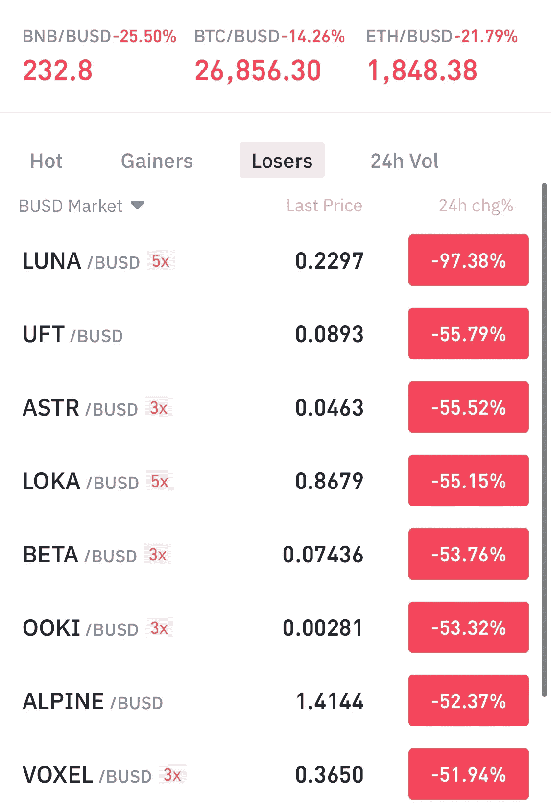
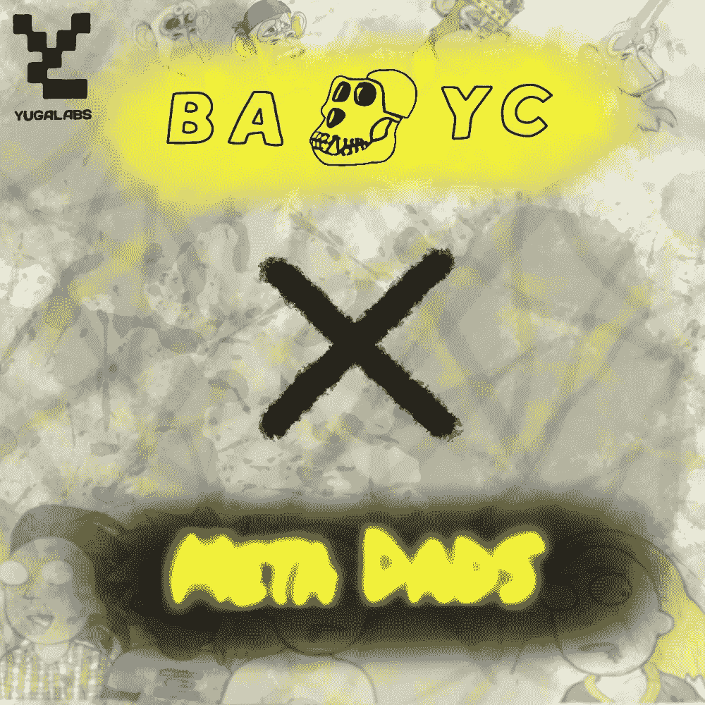

# Web3 的 5 个缺点👀

> 原文：<https://medium.com/coinmonks/5-downfalls-of-web3-cd5dc8ade4fd?source=collection_archive---------27----------------------->

当我们第一次进入 web3 领域时，我们可能甚至不知道我们在 web3 领域。(这里有一个关于 Web3 的详细情况的博客

当你开始听到“贝可这个”或“月鸟那个”…你可能来对地方了。

在这篇简短的博客文章中，我们将简要讨论体现 web3 现状的 5 个失败之处，或者说是严酷的事实。

如果你同意他们，或者你不同意，请在下面留下评论，我们可以在对话中分享。

# 1.毒性

可悲的是，如果你在 Twitter 上，大多数(如果不是全部的话)加密/NFT“德根”居住的地方，你会很快看到有人在摇摆他们的 BAYC 或类似的东西的 PFP 时发布一些关于其他项目的狗屎…

征服 web3 生态系统的普遍年轻、以自我为中心的人群对成熟的大多数人来说不是一个好的形象。

用他们的 NFT 个人资料照片(PFP)隐藏在互联网的面具后面，给了这些人批评和谴责其他人在德根空间缺乏归属感的信心。

我们需要处理掉这个。我们需要让人们振作起来，而不是让他们消沉。

我们一度都是菜鸟…

我们需要把这里变成一个安全的空间，从那些希望加入我们“如此神圣”的元宇宙的新手那里获得更多的收养和现金流。

# 2.缺乏收养

许多人还没有涉足 web3 领域，也没有使用/收集加密令牌或 NFT 令牌。

这主要是因为与传统的 web2 服务/实用程序相比，进入这一领域有更多的障碍。

你需要一个 web3 扩展([元掩码](https://metamask.io/)，或[幻影](https://phantom.app/))作为一个“钱包”，你可以轻松地存储 NFT 和加密令牌。他们还允许你在线或亲自使用 crypto 付款。

然而，你不需要任何 NFT 或密码来参与 web3。你可以跳上 web3 Twitter，开始加入 NFT 项目的 discords，学习这些 degens 的行话/行话，以更好地了解这个新空间是如何运作的，以便更好地为你准备好更多地进入 crypto 和 NFT 的时间做准备。

一旦我们有更多允许在智能手机上运行的 web3 用户友好应用，我相信我们会看到大规模采用。

当大品牌和游戏开始利用 NFT 的，甚至可能是他们自己的加密令牌时，我们会看到更多的采用。

想象一下《使命召唤》让每把枪都变成不同的 NFT…你可以通过收集他们自己的本地$COD 代币来购买新枪(也包括 NFT 的),这些代币是你通过玩游戏赚来的，玩得好会赚得更多…这就是大规模采用的时候。

我们在 web3 领域还没有达到这一步，但是数十亿美元正在努力使这成为现实。

# 3.规程

不管你是喜欢规则还是讨厌规则(像我一样)，它们对于主流采用 web3、crypto、NFT 和区块链的所有东西都是必不可少的

自从“现代时代”开始以来，所有的事物都由当权者管理和征税。

一方面，在监管方面，你必须支付更多的费用，通常你必须通过更多的法律漏洞才能获得你想要的结果，并更加遵守规则……但另一方面，这些监管可以为投资者提供更多的安全，增强买家的信心，以及对系统的整体信任。

截至目前(2022 年 5 月)，涉及到加密、NFT 和诸如此类的法规非常少。这可能是因为很难追踪每一笔交易的销售流向。

在未来几年中，我们很可能会看到更多关于加密和 NFT 交易的法规，但目前，它仍然像 web3 领域的狂野西部一样，因此高回报的机会是存在的，因为“先发优势”，但你也面临着投资被诈骗窃取或市场突然崩溃的风险…

# 4.“付费游戏”

尽管我讨厌这么说，但 web3 是一个艰难的游戏，除非你投入大量资金(10k 美元或更多)。

这个空间似乎是一个“付费游戏”，或者更确切地说，是一个“付费换权力”的游戏。

大多数加入 web3 空间的人没有足够的钱花 20 万美元买一张猴子的照片……然而拥有这些 BAYC JPEGS 的人似乎是 web3 空间中最强大、最有洞察力和最有影响力的成员。

这些 NFT 人有点像进入他们俱乐部的看门人。如果你拥有我们的一个 NFT，你可以成为我们俱乐部的一员，如果你没有我们的一个 NFT，那么他们真的不太关心你们所有人…

严峻的事实是，如果我是一个完全没有使用 Crypto 或 NFT 的经验的百万富翁，一天之内我就可以买一辆 BAYC NFT，开一个全新的 Twitter 账户，把我的新 BAYC 分享到# nft # apefollowape Twitter，似乎一夜之间就有了 1k+的粉丝，并发展了一个关注我的观众，仅仅因为我现在拥有这辆 NFT。

这个 web3 空间没有考虑到那些根本没有多余的“弹性”资金来购买这些“蓝筹股”NFT 的家伙(比如我自己)…然而，我们已经全职进入 web3 空间一年或更长时间了，我们已经完全致力于它，我们的观众增长甚微，因为我们不是这些独家俱乐部的一部分…

总是努力拥有 JPEG 格式的“灵活性”或幸运地拥有一个加密/NFT 项目是一种令人畏惧的感觉……这对大多数 web3 用户来说是一种精神/情感上的打击。

只有未来能告诉我们，它是否会像现在一样保持这种“为权力付费”的现状，或者它是否会改变为“普通人乔”将拥有与“花花公子百万富翁”相同的机会…

最后，我们都是为了权力、地位、关注、感情、喜欢，以及所有基于自我的东西…希望这也会改变。

# 5.“造假”

由于缺乏更好的词，密码、NFT、web3 空间在所有意义上都是假的。

想象一下，花一个月左右的时间参与一个 NFT 项目，并成为一个很酷的社区的一部分，最终花 800 美元铸造了 3 个 NFT，却发现在项目推出并销售一空后，所有者离开了，项目的所有未来愿景都随着项目的价值一起消失了…

同样的概念也适用于所有的网络 3。他们被称为“拉地毯”,目前他们碰巧喜欢这个领域 85%的项目。

这只是抢钱…

然而，从长远来看，有一定数量的人参与其中，他们努力把他们的社区带在身边。这些是你想支持的好人，因为他们最需要帮助。

很难区分好的和假的，即使是我们中最优秀的人有时也会被欺骗。

我们大多数人都喜欢 web3 空间的“新奇感”,并在旅途中建立了一些良好的联系，但事实上，我们大多数人都希望“撞大运”,最终拥有下一个 BAYC 或下一个 1000x 加密令牌，以改变我们的财务生活。这就是大多数 web3 人在这里的目的，地位的提高…

____________________

**结论:**
- Web3 仍然非常新
-我们需要更多的使用案例和技术
-法规很可能即将出台(这反过来将带来更多的主流采用)
-如果你已经很富有，你在 Web3 领域取得成功的机会更大……
-它的节奏非常快，可能会在情感/精神上耗尽或产生压力

___________________________________________________________________

**永远小心！！！**

我怎么强调都不为过！保持高度警惕，注意你点击的每一个链接，你做的每一笔交易，和你交往的每一个人，因为骗子在这个领域是大量存在的，最好的项目也会被取消。

*在点击所有链接之前，要再三检查，确保它们是你要找的官方链接。在把任何有价值的东西寄给别人之前，也要仔细检查所有的钱包地址。*

**跟随我们的加密/NFT/区块链/元宇宙之旅**

[*推特*](https://www.twitter.com/metadadsxyz)[*不和*](https://discord.gg/Cv8v2Ert8m)[*YouTube*](https://www.youtube.com/channel/UC7pbtSBs9nRJHK6coMhCR8g)[*抖音*](https://www.tiktok.com/@thedudescrypto)[*insta gram*](https://www.instagram.com/thedudescrypto/)[*Spotify 播客*](https://open.spotify.com/episode/5U8vXE9HDAsGbSbebw9p62?si=2rZIigw-Tw2pCxjxmkbYzQ)

*请将 Polygon Matic 发送到这个 Eth 地址，或 Eth 令牌:
0xb 53b 3978333 e 11 c 382 ab 619 f 02 f 469 A8 c 70750 af*

___________________________________________________________________

感谢阅读:]

干杯，
Ty 又名“纨绔子弟”

> 加入 Coinmonks [电报频道](https://t.me/coincodecap)和 [Youtube 频道](https://www.youtube.com/c/coinmonks/videos)了解加密交易和投资

# 另外，阅读

*   [TraderWagon 回顾](https://coincodecap.com/traderwagon-review) | [北海巨妖 vs 双子星 vs BitYard](https://coincodecap.com/kraken-vs-gemini-vs-bityard)
*   [如何在 FTX 交易所交易期货](https://coincodecap.com/ftx-futures-trading) | [OKEx vs 币安](https://coincodecap.com/okex-vs-binance)
*   [OKEx vs KuCoin](https://coincodecap.com/okex-kucoin) | [摄氏替代品](https://coincodecap.com/celsius-alternatives) | [如何购买 VeChain](https://coincodecap.com/buy-vechain)
*   [ProfitFarmers 回顾](https://coincodecap.com/profitfarmers-review) | [如何使用 Cornix 交易机器人](https://coincodecap.com/cornix-trading-bot)
*   [如何匿名购买比特币](https://coincodecap.com/buy-bitcoin-anonymously) | [比特币现金钱包](https://coincodecap.com/bitcoin-cash-wallets)