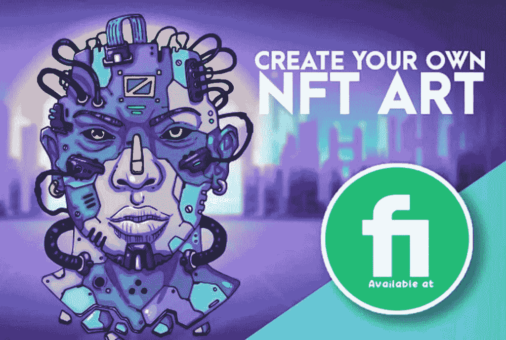

# 熊市中可以购买的比特币之外的 5 种加密货币

> 原文：<https://medium.com/coinmonks/5-great-cryptocurrencies-other-than-bitcoin-to-buy-in-a-bear-market-be3e9945d621?source=collection_archive---------5----------------------->

**5 great cryptocurrencies other than Bitcoin to buy in a bear market.**

比特币现在对密码世界产生了巨大的积极影响。如果你是像我一样的投资者或买家，并对今年的比特币替代品感到好奇，那么这篇文章就是为你准备的。你将通过扎实的项目深入了解加密货币。

# 🌟让我们找到 5 种除比特币之外的伟大加密货币，在熊市中购买🌟

# 1.莱特币

2011 年首次亮相的莱特币(LTC)是最早追随比特币脚步的加密货币之一，一直被戏称为“白银 vs 比特币黄金”。由查理·李设计，麻省理工学院毕业生和前谷歌开发人员。

Litecoin 基于一个去中心化、开源的全球支付网络，使用 scrypt 作为 PoW，可以使用消费级中央处理器(CPU)解密。虽然莱特币在许多方面与比特币相似，但它以更快的速度创建块，从而允许更快的交易确认。

除了开发商，越来越多的零售商接受莱特币。截至 2022 年 3 月，莱特币的市值为 70 亿美元，每枚代币价值约为 100 美元，是世界上第 21 大加密货币。

## 👉👉👉[购买莱特币](https://accounts.binance.com/en/register?ref=26723737)

# 2.以太坊

以太坊(ETH)是我名单上的第一个比特币替代品，它是一个去中心化的软件平台，允许智能合约和去中心化的应用程序运行，而不需要第三方宕机、欺诈、控制或干预。以太坊的目标是建立一套分散的金融商品，世界上的任何人，无论国籍、种族或信仰，都可以自由访问。

以太坊应用由平台的加密令牌 ether 提供支持。以太网(ETH)用于导航以太坊网络，主要由希望建立应用程序并在平台上运行的开发人员以及希望用 ETH 购买其他数字货币的投资者寻求。Ether 成立于 2015 年，是市值仅次于比特币的第二大加密货币，但距离占主导地位的加密货币还很远。以太市场的估值不到比特币的一半，截至 2022 年 3 月，每以太约为 2580 美元。

以太坊的共识方法在 2020 年 12 月由工作证明(PoW)改为利害关系证明(PoS)。(位置)。这一变化旨在让以太坊的网络以更少的能源和更快的交易速度运行，并创造一个更通缩的经济环境。

## 👉👉👉[购买以太坊(ETH)](https://accounts.binance.com/en/register?ref=26723737)

# 🌟[在 USDT 创建一个币安帐户并获得 100 美元奖金](https://www.binance.com/en/activity/referral/offers/claim?ref=CPA_00M6XWFUN3)🌟

**🌟** [**Create a Binance account and get 100$ Bonus in USDT**](https://www.binance.com/en/activity/referral/offers/claim?ref=CPA_00M6XWFUN3)**🌟**

# 🌟我有一个伟大的奖金给你:100 美元在币安注册后🌟

[**一旦您通过此链接**](https://www.binance.com/en/activity/referral/offers/claim?ref=CPA_00M6XWFUN3) 创建了您的币安，存款超过 50 美元，然后在到期前兑换您的 100 USDT 优惠券。

# 3.卡尔达诺

Cardano (ADA)是一种“大毒蛇赌注证明”加密货币，由工程师、数学家和加密专业人员使用基于研究的方法开发。作为以太坊的五个创始成员之一，查尔斯·霍金森是该项目的创始人之一。在一些关于以太坊发展方向的问题之后，他离开了以太坊，并最终帮助建造了卡尔达诺。

卡尔达诺区块链是由卡尔达诺团队通过广泛的测试和同行评议研究开发出来的。项目研究人员已经发表了 120 多篇关于区块链技术的研究论文，涵盖了广泛的问题。卡尔达诺的研究是其基础。

由于这种具有挑战性的方法，Cardano 似乎在 POS 同行以及其他重要的加密货币中脱颖而出。由于区块链被认为有更多的能力，卡尔达诺被贴上了“以太坊杀手”的标签另一方面，卡达诺还处于起步阶段。虽然在 PoS 共识方面已经超越以太坊，但是在 DeFi 应用方面还有很长的路要走。

Cardano 希望通过生产类似以太坊的 DeFi 产品，并为区块链互操作性、选民欺诈和法律合同跟踪等提供解决方案，成为世界金融操作系统。截至 2022 年 3 月，Cardano 的市值为 267 亿美元，ADA 约为 0.8 亿美元

## 👉👉👉[购买卡达诺(ADA)](https://accounts.binance.com/en/register?ref=26723737)

# 4.比特币现金(BCH)

比特币现金 BCH 是原始比特币最早也是最成功的硬分叉之一，在 altcoins 世界中有着重要的历史。比特币领域的分裂是由开发者和矿工之间的分歧和讨论引起的。由于数字货币的去中心化性质，有关代币或货币的代码的根本改变需要广泛的共识。

当各种团体不能达成一致时，数字货币就会被分割，原始链仍然忠于其原始代码，而新链则以先前硬币的新版本开始，充满了代码变更。

由于其中一次分裂，BCH 于 2017 年 8 月成立。可扩展性问题是导致 BCH 成立的争论的核心；比特币网络的块大小限制为 1 兆字节(MB)。BCH 的块大小从 1MB 增加到 8MB，概念是较大的块可以承载更多的事务，从而提高事务速度。

截至 2022 年 3 月，BCH 的市值约为 53 亿美元，每个代币的价值为 281.30.19 美元。

## 👉👉👉[购买](https://accounts.binance.com/en/register?ref=26723737) [比特币现金(BCH)](https://accounts.binance.com/en/register?ref=26723737)

# 5.波尔卡多(点)

Polkadot (DOT)是一种独特的 PoS 加密货币，旨在实现其他区块链之间的互操作性。它的协议旨在连接许可和非许可区块链以及 oracles，以允许系统在同一屋檐下协同工作。Polkadot 的核心组件是它的中继链，它允许不同网络的互操作性。对于特定的用例，它还允许使用 parachains，或与它们的本机令牌并行的区块链。

与以太坊不同，Polkadot 允许开发人员设计他们的区块链，同时仍然受益于 Polkadot 链提供的安全性。开发人员可以使用以太坊创建一个新的区块链，但他们必须实现他们的安全机制，这可能会使新的和小的项目容易受到攻击，因为区块链越大，越安全。共享安全是 Polkadot 这个想法的名字。

加文·伍德(Gavin Wood)是以太坊项目的另一位主要联合创始人，他对项目的未来有不同的看法，他推出了 Polkadot。截至 2022 年 3 月，Polkadot 的市值约为 166 亿美元，一个 dot 的价值为 16.7 美元

## 👉 👉👉[购买波尔卡多特(DOT)](https://accounts.binance.com/en/register?ref=26723737)

# 🌟投资者的红利:高风险🌟

# 柴犬(SHIB)

我不相信硬币，但是柴犬是一种诱人的投资，尤其是当它的价格持续上涨的时候。然而，它是一种非常危险的加密货币，预计未来将经历更大的波动。如果你意识到这些风险，就更容易做出明智的投资决策，并维持你的投资组合。

## 👉 👉👉[买下柴犬乌诺(SHIB)](https://accounts.binance.com/en/register?ref=26723737)

# 最终想法…

理想的加密货币是可以让你的生活变得更好的货币。除了比特币，熊市中可以购买的五大加密货币只是本月的第一份名单。很快会有另一个列表，所以确保 [**关注并订阅**](/@s.hanz) 以便在我将来发布新文章时受到关注。

最后，请做你自己的研究，这篇文章是我自己的观点，而不是投资建议。

# 🌟如果你不是设计师，想推出自己的 NFT 系列🌟

[**1。Gameartgiger**](https://go.fiverr.com/visit/?bta=182994&brand=fiverrcpa&utm_campaign=170222&landingPage=https%3A%2F%2Fwww.fiverr.com%2Fgameartgiger%2Fdesign-a-fabulous-t-shirt-design-or-a-tee-shirt-illustration%3F) 是一个有很多专业知识的二级卖家。他的表演获得了 200 多条评论。

[2**。Valiantgraphic 是一位才华横溢的数字艺术家**](https://www.fiverr.com/valiantgraphic/draw-a-head-turner-dog-art-in-our-popular-signature-style?) ，他绘制和生成 NFT 艺术收藏，并拥有 Etsy platform **等多个客户。你也可以考虑这个选择。**

**请** [**关注并订阅**](/@s.hanz) **，务必分享我的作品作为激励姿态。点击这里查看我的文章列表:**[【https://medium.com/@s.hanz】T21](/@s.hanz)

# 更多文章:

[**2022 年元宇宙最佳 5 个好项目加密币—清单 1**](/@s.hanz/best-5-metaverse-crypto-coins-with-good-projects-in-2022-list-1-687fedbe668e)

[***2022 年元宇宙最佳 5 个加密币好项目—榜单 2***](/@s.hanz/best-5-metaverse-crypto-coins-with-good-projects-in-2022-list-2-15af2f8f01d9)

[**2022 年最值得投资的 7 种元宇宙加密币—榜单 3**](/coinmonks/7-best-metaverse-crypto-coins-to-invest-in-2022-list-3-9e077f5c87ab)

[**需要钱的时候要做的事情快——新招**](/@s.hanz/things-to-do-when-i-need-money-fast-new-tricks-2b68ad24406b)

[**2022 年推广 NFT 项目的 7 种免费方式**](/coinmonks/7-free-ways-to-promote-nft-projects-in-2022-ccefc7f249e7)

[**2022 年 7 款最佳赌注硬币**](/@s.hanz/7-best-staking-coins-in-2022-70dbc31adcae)

[**五月六日 NFT 顶级艺人聘请**](/coinmonks/6-top-nft-artists-to-hire-on-fiverr-62ae1643eedc)