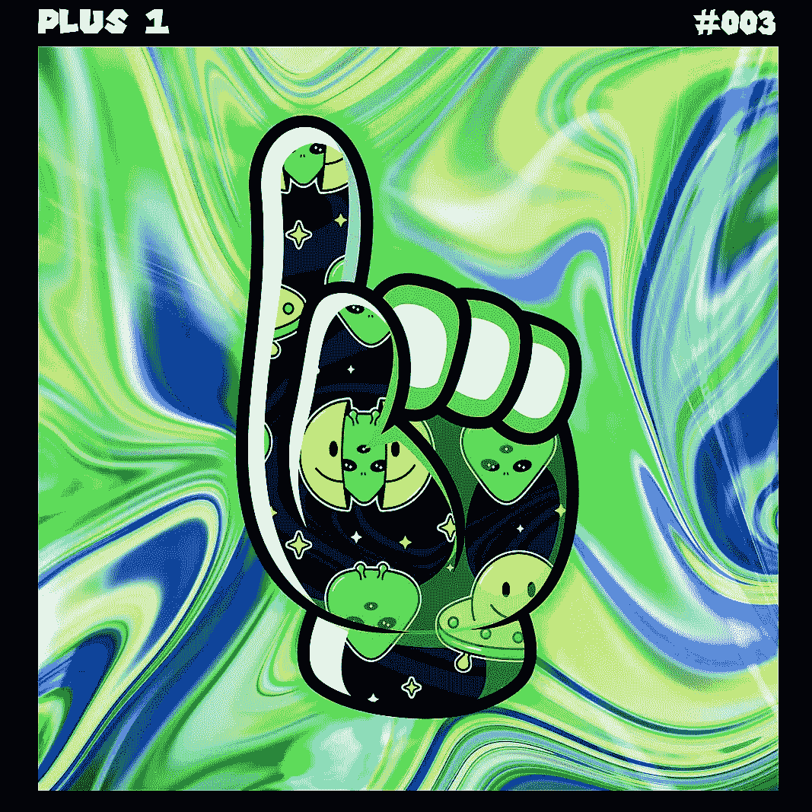
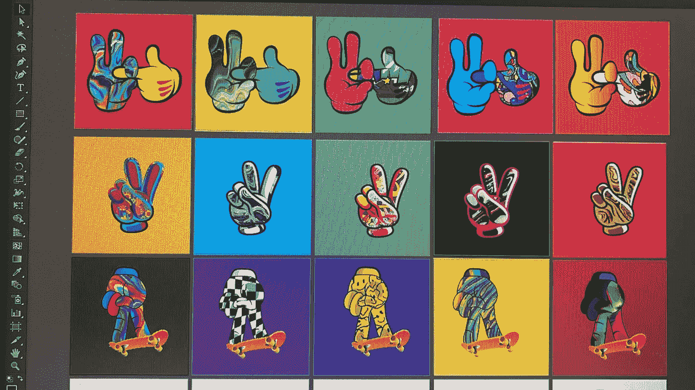

# 成功的 5 个关键(NFT/加密版)🔑

> 原文：<https://medium.com/coinmonks/5-keys-to-being-successful-nft-crypto-edition-608a834c8e4d?source=collection_archive---------47----------------------->

在任何行业取得成功都不容易…

这里有一些可以帮助你走向成功的小贴士，适用于所有行业…

# 1.DYOR

这意味着做你自己的研究。对于生活中的任何事情，你都应该做尽可能多的你认为必要的研究。有些人可能会花几个小时研究一些东西，而有些人可能只花 2 分钟，这取决于个人。

如果你打算在一些加密令牌或 NFT 上投资数千，甚至数百，你可能想看看这个项目。寻找他们正在解决的问题。看看谁是这个项目的幕后黑手。社区怎么样？都是炒作吗？

如果你基于炒作买入的 NFT 项目以失败告终，你不能责怪任何人投资这个项目。

# 2.一致性

> “成功并不总是意味着伟大。这是一致性的问题。持续的努力工作会带来成功。伟大终将到来。”
> ——道恩·强森

这在生活的任何方面都是真实的。你做得越多，你就做得越好。

你参与/互动/参与 NFT 和 Crypto 的时间越长，你就越能理解所有项目在做什么，也就能更好地理解这个项目是否有机会成功。

我们仍然非常幸运能够在加密/NFT 空间呆到现在，因为我们都还很早。

你可以从现在开始，在接下来的 1-3 年里成为该领域的专家。没有多少职业允许如此快速的增长。

# 3.连接

正如老话所说，重要的不是你知道什么，而是你认识谁…

我发现这在生活的任何方面都是正确的。

你应该试着和你选择的行业中尽可能多的“成功”人士联系和交流(甚至成为朋友)。对于区块链/加密/NFT 行业，这里有一些如何建立这些联系的例子…

上你的 LinkedIn、Twitter、IG、TT、YT……搜索你的话题标签，关注/联系行业内的顶级玩家。当这些主要玩家发帖时，尝试成为第一个发表有价值评论的人(如果你愿意，可以为他们打开通知)。坚持这样做，最终他们会成为某种“朋友”。

你也可能加入不和谐，与社区交往和互动。这是在网上建立“更深”联系的好方法。

但一如既往，你能建立的最好的联系将是人与人之间的互动。走出你的社区，结交一些朋友:]

# 4.智慧

这是一个显而易见的问题…
我们都应该在任何特定的选择领域中追求卓越，而获得卓越的一半战斗是通过知识进行的。知识+经验=智慧。

阅读与你的主题相关的所有书籍。观看所有信息丰富的 YouTube 视频。听所有的播客。跟着所有的大牌…

通过这样做，当你准备利用获得的知识时，你会用有价值的弹药武装自己

智慧只能随时间而来，所以这将与一致性携手并进。

你在 NFT 或加密令牌上做了错误的投资？很好！现在你对下一笔投资更明智了，你将参与(希望)DYOR

# 5.热情

如果你对你选择的主题没有真正的热情(至少在一定程度上)，你会很快消失。

你必须真正想要变得更好，做出更好的决定，成为你所在领域的专家，否则你会这样做几个月左右，让它成为废物。

当某人对一个主题充满热情时，你可以从他们的工作中看出，你可以从他们的声音中听出来，甚至从他们的外表中看出来…

有趣的是，激情是一种越做越强烈的东西。没有人真正是从对某件事充满热情开始的。你做得越多，它就越成长。一致性和激情携手并进。你做的事情越多，你就越想去做，你就越开始对做这件事充满热情。

# 号外:
6。创新ˌ革新

随着社交媒体的简单性使每个人都有发言权，并似乎在创纪录的时间里成为“专家”，我们必须努力在我们的信息中独一无二。要有自己的声音，不要简单的只是照搬别人在做的事情。你可以从其他帖子中获取一些内容/信息/价值，但是重新标记它，使它成为你自己的/

创新者是那些脱颖而出的人，那些从长远来看会成功的人，即使一开始他们会因为与众不同而受到审视。人们通常不喜欢他们不理解的东西，直到他们理解了…这是一个转折点。只要你始终如一，真实可信，那个临界点就会到来。

___________________________________________________________________

**时刻小心！！！**

*这一点我怎么强调都不为过！保持高度警惕，注意你点击的每一个链接，你做的每一笔交易，以及你接触的每一个人，因为骗子在这个空间里比比皆是，最好看的项目都被取消了。*

*在点击所有链接之前，要再三检查，确保它们是你要找的官方链接。在把任何有价值的东西寄给别人之前，也要仔细检查所有的钱包地址。*

**跟随我们的加密/NFT/区块链/元宇宙之旅**

[*推特*](https://www.twitter.com/metadadsxyz)[*不和*](https://discord.gg/Cv8v2Ert8m)[*YouTube*](https://www.youtube.com/channel/UC7pbtSBs9nRJHK6coMhCR8g)[*抖音*](https://www.tiktok.com/@thedudescrypto)[*insta gram*](https://www.instagram.com/thedudescrypto/)[*Spotify 播客*](https://open.spotify.com/episode/5U8vXE9HDAsGbSbebw9p62?si=2rZIigw-Tw2pCxjxmkbYzQ)

*请发送 Polygon Matic 到这个 Eth 地址或 Eth 令牌来支持我和我的新宝宝:
0xb 53b 3978333 e 11 c 382 ab 619 f 02 f 469 A8 c 70750 af*

___________________________________________________________________

感谢阅读:]

干杯，
Ty 又名“纨绔子弟”

> 加入 Coinmonks [电报频道](https://t.me/coincodecap)和 [Youtube 频道](https://www.youtube.com/c/coinmonks/videos)了解加密交易和投资

# 另外，阅读

*   [3 商业评论](/coinmonks/3commas-review-an-excellent-crypto-trading-bot-2020-1313a58bec92) | [Pionex 评论](https://coincodecap.com/pionex-review-exchange-with-crypto-trading-bot) | [Coinrule 评论](/coinmonks/coinrule-review-2021-a-beginner-friendly-crypto-trading-bot-daf0504848ba)
*   [莱杰 vs Ngrave](/coinmonks/ledger-vs-ngrave-zero-7e40f0c1d694) | [莱杰 nano s vs x](/coinmonks/ledger-nano-s-vs-x-battery-hardware-price-storage-59a6663fe3b0) | [币安评论](/coinmonks/binance-review-ee10d3bf3b6e)
*   [Bybit Exchange 评论](/coinmonks/bybit-exchange-review-dbd570019b71) | [Bityard 评论](https://coincodecap.com/bityard-reivew) | [Jet-Bot 评论](https://coincodecap.com/jet-bot-review)
*   [3 commas vs Cryptohopper](/coinmonks/3commas-vs-pionex-vs-cryptohopper-best-crypto-bot-6a98d2baa203)|[赚取加密利息](/coinmonks/earn-crypto-interest-b10b810fdda3)
*   最好的比特币[硬件钱包](/coinmonks/hardware-wallets-dfa1211730c6) | [BitBox02 回顾](/coinmonks/bitbox02-review-your-swiss-bitcoin-hardware-wallet-c36c88fff29)
*   [block fi vs Celsius](/coinmonks/blockfi-vs-celsius-vs-hodlnaut-8a1cc8c26630)|[Hodlnaut 审核](/coinmonks/hodlnaut-review-best-way-to-hodl-is-to-earn-interest-on-your-bitcoin-6658a8c19edf) | [KuCoin 审核](https://coincodecap.com/kucoin-review)