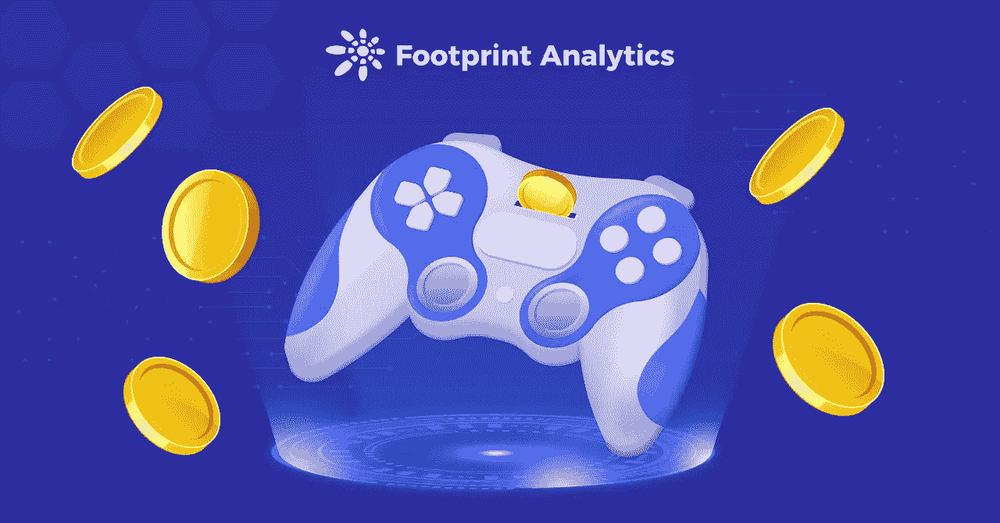
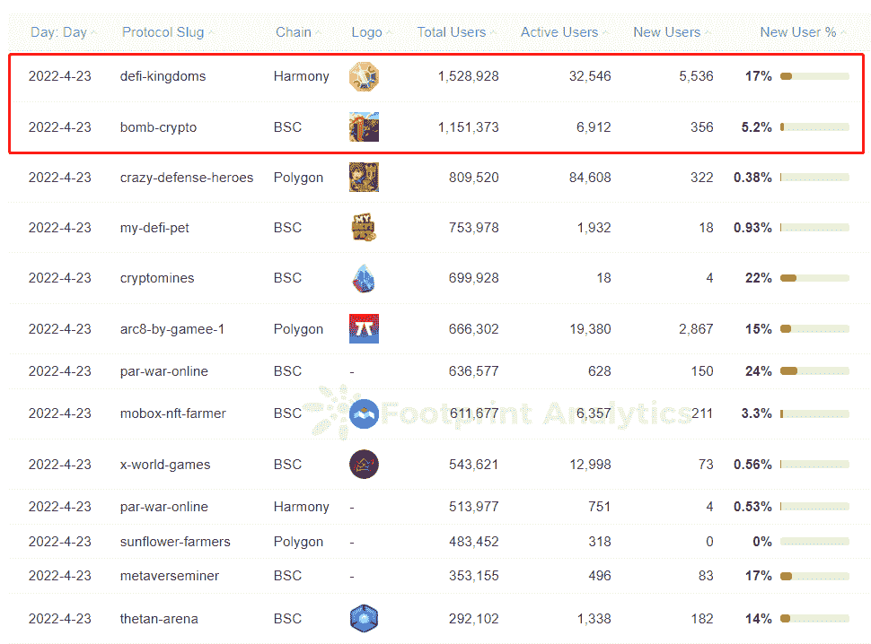
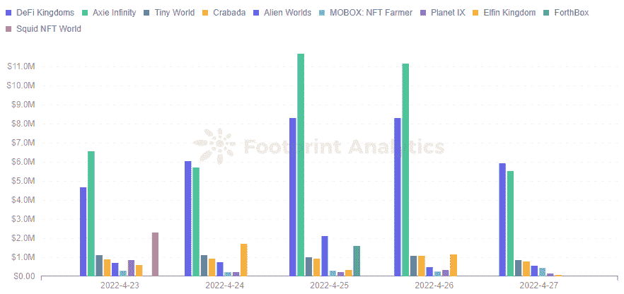
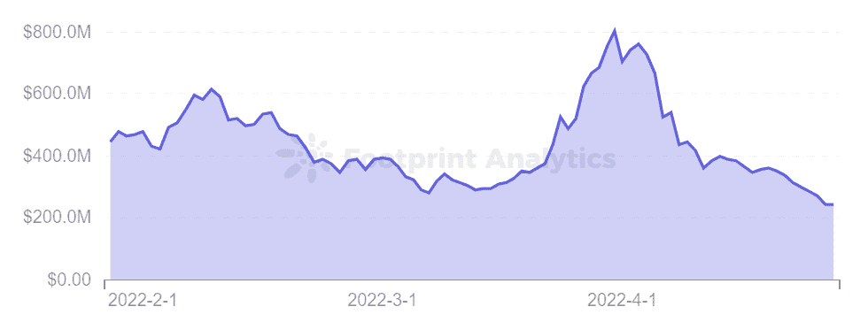
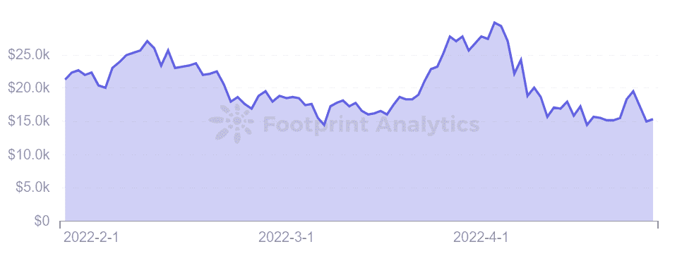
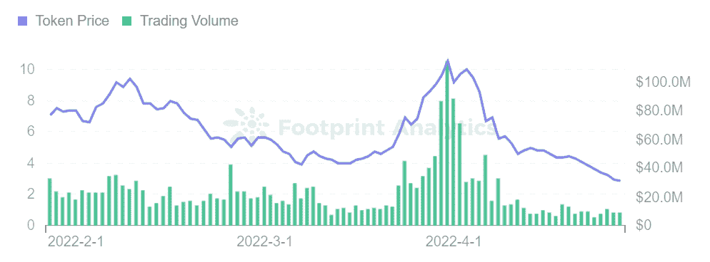
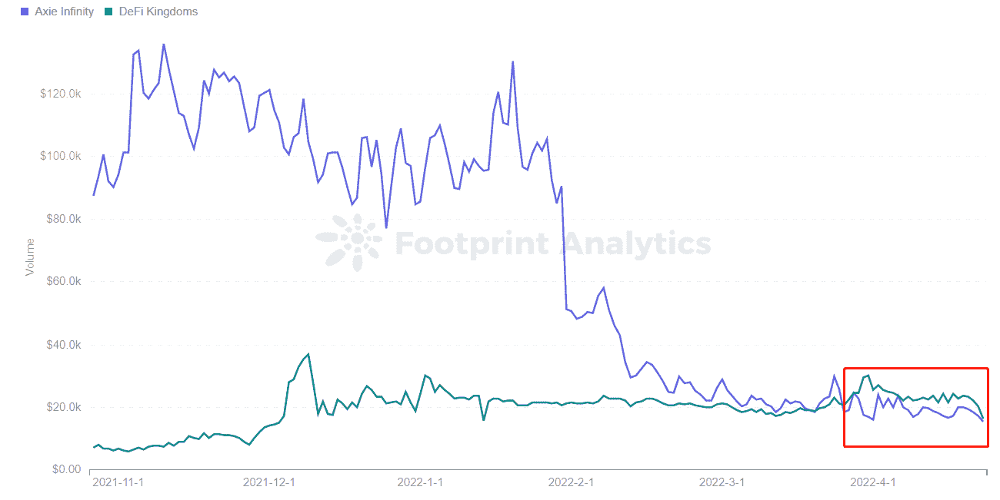

# 分析 P2E 奥运会的 5 个指标(用一个真实的例子)

> 原文：<https://medium.com/coinmonks/5-metrics-to-analyze-p2e-games-using-a-real-example-243105c00294?source=collection_archive---------31----------------------->

我们看 5 个指标来分析 P2E 游戏，并把它们应用到 DeFi 王国。

2022 年 4 月

数据来源:足迹分析— [DeFi 王国仪表板](https://www.footprint.network/@nsm/GameFi-DeFi-Kingdoms-Dashboard?day=past30days&game_name=DeFi%20Kingdoms&channel=EN-244)

随着今年早些时候 DeFi 市场的下滑，加密用户和投资者纷纷涌向 [GameFi](https://www.footprint.network/guest/chart/Number-of-GameFi-Protocols-by-Chains-fp-0c8a5390-59ba-402e-abfa-be97b460f145?channel=EN-244) 来增加他们的投资组合。随后，游戏项目数量从 693 个增长到 1，406 个，同比增长 103%。

在投资或参与之前，你应该如何评估一个项目？在这篇文章中，我们将概述 5 个最重要的指标，帮助你理解一个 [GameFi 项目的](https://www.footprint.network/guest/chart/GameFi-Users-Overview-(Latest)-fp-4f8399d9-edba-4d95-a5d6-9a6b85a07b38?channel=EN-244)长期潜力，并将这个框架应用到一个流行的游戏中。

# 评估 P2E 奥运会的 5 个重要指标

尽管 GameFi 游戏项目数量激增，但并不是所有项目都做得很好。所以用户在投资前要进行分析和尽职调查，筛选项目。以下是值得关注的内容:

**团队背景**

*   团队是否有长期发展规划和资金支持？
*   如果项目得到了知名风险投资公司的支持，可以为项目增加很多可信度。
*   创始人和团队是否有区块链经验也很重要，尤其是在游戏领域。

**融资**

*   好的领投人可以为项目带来流量和人气，参与项目经济模型的设计和迭代。还要看团队是否有成功构建和管理项目的经验。
*   关注融资的金额和时机。比如牛市或熊市，不同项目的融资金额也是不一样的。

[**记号组学**](https://cryptoslate.com/heres-how-the-token-economies-of-the-top-4-dexes-work/)

*   代币经济的设计至关重要，决定了游戏的机制能否长期稳定发展，承载大量用户的代币交易。
*   项目游戏内资金的流动性和稳定性可以通过项目使用的单币或双币模型来考察。

**项目商业模式**

*   项目盈利如何，直接体现在项目的代币价格和代币市值上。

**用户数量**

*   用户数量是 GameFi 生态系统健康运行的关键。体现了游戏项目在用户中的受欢迎程度。

# 将 5 个指标应用到一个真实的例子中

*Footprint Analytics — GameFi Users Overview (Latest)*

## DeFi 王国

[DeFi 王国](https://www.footprint.network/@nsm/GameFi-DeFi-Kingdoms-Dashboard?day=past30days&game_name=DeFi%20Kingdoms&channel=EN-244)于 2021 年 8 月 23 日推出，是一个基于和谐链的元宇宙项目，将 DeFi 收益农业活动融入到更多游戏化的游戏中。

**团队背景**

根据官网介绍，细分为 9 组团队成员，分别是后端开发、前端开发、游戏设计和绝杀美工、模型设计、社区、运营、商务等功能。由于团队成员基本匿名，很难判断他们的职业经历。

另一方面，该项目的白皮书路线图设计非常清晰，分为 6 个阶段。推出后不到 1 年，团队已经发展到第四阶段，并推出了 DFK 链。DeFi 王国以建立包括游戏、DEX、弹出池和 NFT 市场在内的王国而闻名。这款游戏的交易量一度超过了 Axie Infinity。

*Footprint Analytics — Top 10 Games Ranking by Volume*

可以看出，在很短的时间内，团队已经设法按计划推进开发和运营。

**融资**

截至 4 月 28 日，该项目尚无公开融资信息。相比之下，Axie Infinity 已经融资 5 轮，总融资 900 万美元。因此，DeFi 王国项目在融资方面略显落后。

然而，在 3 月 8 日，雪崩基金会启动了一项 2.9 亿美元的激励计划，以促进子网游戏项目的增长。而 DeFi Kingdoms 是第一个通过多元宇宙计划获得 1500 万美元奖励的项目，成为第一个主要的多链游戏。

**记号组学**

目前许多 GameFi 游戏都有多令牌模型，尽管单令牌模型对玩家来说更方便，对开发者来说难度更小。而多代币模式可以将代币价格波动对二级市场游戏的影响降到最低。

DeFi 王国使用多令牌模型来促进游戏内资金的流动性和稳定性。

*   $JEWEL 作为游戏中的主要价值令牌。用户可以在 Marketplace 上购买游戏$JEWEL，放入 Jeweler 进行单币入股，获得项目中的股权令牌和治理令牌$xJEWEL，可用于参与生态治理投票。
*   DeFi 王国最大的流动资金池是$JEWEL 和 Harmony 的本地 token ONE，用于在市场中形成 LP。在过去的几个月里，这张 LP 已经有了大约 300%到 400%的 APY，为用户带来了很高的收入。
*   为了保证$JEWEL 的长期稳定性，大部分从 LP 股权中获得的$JEWEL 都被系统设置临时锁定。锁定的令牌会逐渐解锁，也可以通过采矿任务加速解锁。

DeFi 王国的代币和高收入吸引了许多玩家。

请注意，由于在 Avalanche 上推出，游戏还包括了[$水晶令牌](https://www.footprint.network/@rogerD/Tokenomics-of-CRYSTAL?token_name=crystal&channel=EN-244)，其功能类似于该链上的$JEWEL。

**项目商业模式**

该项目的商业模式直接反映在其代币价格和代币市值上。截至 4 月 27 日，DeFi Kingdom 的市值为 2.41 亿美元，超过了 BSC 链上的顶级游戏[《异形世界》](https://www.footprint.network/@nsm/GameFi-Alien-Worlds-Dashboard-1832623319?day=past30days&game_name=Alien%20Worlds&channel=EN-244)。DeFi 王国整体市值走势与游戏参与用户数高度相关。

*Footprint Analytics — Market Cap*

*Footprint Analytics — Market Cap / Users*

就象征性价格趋势而言，美元珠宝价格存在一些波动。截至 4 月 27 日，价格为 2.86 美元。与目前拥有最多用户的 Splinterlands 令牌$SPS 相比，$JEWEL 更有优势。

*Footprint Analytics — Token Price & Trading Volume*

DeFi Kingdom 虽然没有 VC 融资，但是可以建立一个市值超过 2.41 亿美元，累计交易额超过 60 亿美元的平台。

**用户数量**

今年 3 月，DFK 的日活跃用户数超过了 Axie Infinity，平均每天约有 2 万名用户。通过他们的 Tokenomics 和团队对项目的策划和推动，DeFi Kingdom 的整体日增长相对稳定。

[*Footprint Analytics — Comparison of Users Axie Infinity and DeFi Kingdoms*](https://www.footprint.network/guest/chart/Comparison-of-users-Axie-Infinity-and-DeFi-Kingdoms-fp-4a39360a-252a-4937-aff9-9bde9f018309?channel=EN-244)

# 摘要

从以上五个维度可以看出，德菲王国目前处于前期，主要依靠 LP 来激励用户或散户进入市场，以维持稳定的生态系统。但基于其团队成员匿名且未获得融资的事实，玩家或投资人在玩赚和市场投资时也需要做安全检查。

这篇文章由[足迹分析](https://www.footprint.network/)社区提供。

Footprint 社区是一个世界各地的数据和加密爱好者相互帮助了解和获得关于 Web3、元宇宙、DeFi、GameFi 或区块链新兴世界任何其他领域的见解的地方。在这里，你会发现活跃的、不同的声音相互支持，推动着社区向前发展。