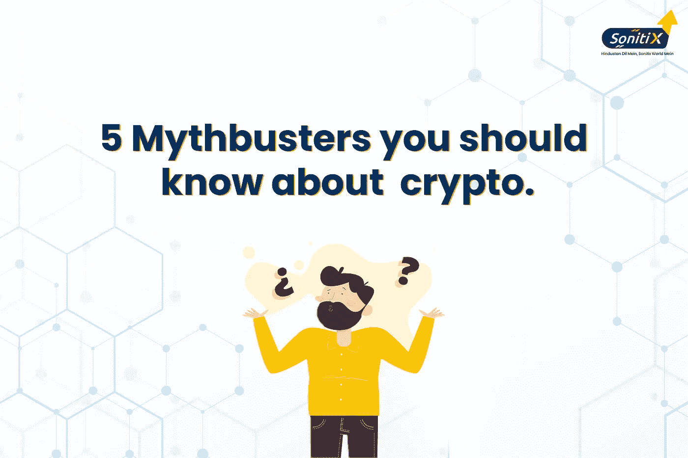

# 关于密码，你应该知道的 5 个流言终结者

> 原文：<https://medium.com/coinmonks/5-mythbusters-you-should-know-about-crypto-d4ef81c8bc75?source=collection_archive---------28----------------------->

5 MythBusters you should know about crypto

神话，如果从技术上定义的话，神话是对真相的误解或曲解。它们是在社会中传播的错误或消极的信念。

密码产业是目前最繁荣的产业之一。每个成长中的行业都有一些相关的事实和神话，这是可以理解的

用它。一些有趣的秘密产业的神话，人们应该知道的是:-

1.  神话。 #01 加密不安全:-被分散的加密货币被认为是“不那么安全”的类型。这些神话是由于对数字资产的了解较少而产生的。周围的人不了解加密货币顺利运行所涉及的技术。区块链技术据说是最安全的。它们是让黑客几乎无法入侵的数字账本。人们有这个问题，这是相当可观的，因为没有官方机构在这里工作。集中式系统拥有基于计算机网络的权限，并由密码保护。这实际上并没有使它免受欺诈，而是仍然有机会被黑客攻击。
2.  **神话。** #02 加密货币是非法的:——加密货币被去中心化，在某处资产背后的匿名性使其在受众看来是非法的。财政部长 TV Somananthan 在一次采访中说，密码不违法，但也不合法。政府对密码征税是考虑到密码是合法且有利可图的。关于加密的讨论仍在进行中，印度最高法院已经要求中央政府最终决定加密的合法化。
3.  **神话。** #03 加密资产没有价值:-如前所述，印度政府现在对加密货币征税，这在一定程度上使其变得有价值。对 crypto 的验证以及财政部长所说的认为它不违法的地方增加了对它的验证。
4.  **神话。数字资产会让你快速致富:-关于加密的一个主要神话是它们会让你快速致富。老实说，当价格上涨或下跌时，密码是非常不稳定的。他们肯定为你提供了一个轮廓，但为此，一个彻底的研究和足够公平的密码市场的知识是必须的。只有在这种情况下，数字资产才能盈利。**
5.  **MYTHNO。在所有常见的神话中，加密是一个骗局，有人称加密行业是一个骗局！密码行业是一个高度不稳定的行业，并且是密码市场中不可预测的定期波动，因为人们应该对市场、价格等有适当的了解。**

**结论:-**

密码产业是发展最快的产业之一。对于那些对行业传播没有像样知识的人来说，人们很清楚行业的盛衰

虚假信息和误解。对一个人来说，重要的是要明白到底是什么使它具有投资价值。理解神话和学习事实将使密码行业

盈利。

如果你想跟上加密货币行业的趋势，请加入我们在 [Discord](https://discord.gg/FStQ26T89J) 、 [Reddit](https://www.reddit.com/user/Sonitixexchange) 和 [Telegram](https://t.me/+JgmgBJTzvaA0NDBl) 的社区

> 加入 Coinmonks [电报频道](https://t.me/coincodecap)和 [Youtube 频道](https://www.youtube.com/c/coinmonks/videos)了解加密交易和投资

# 另外，阅读

*   [CoinFLEX 评论](https://coincodecap.com/coinflex-review) | [AEX 交易所评论](https://coincodecap.com/aex-exchange-review) | [UPbit 评论](https://coincodecap.com/upbit-review)
*   [AscendEx 保证金交易](https://coincodecap.com/ascendex-margin-trading) | [Bitfinex 赌注](https://coincodecap.com/bitfinex-staking) | [bitFlyer 点评](https://coincodecap.com/bitflyer-review)
*   [Bitget 回顾](https://coincodecap.com/bitget-review)|[Gemini vs block fi](https://coincodecap.com/gemini-vs-blockfi)cmd |[OKEx 期货交易](https://coincodecap.com/okex-futures-trading)
*   [AscendEx Staking](https://coincodecap.com/ascendex-staking)|[Bot Ocean Review](https://coincodecap.com/bot-ocean-review)|[最佳比特币钱包](https://coincodecap.com/bitcoin-wallets-india)
*   [霍比评论](https://coincodecap.com/huobi-review) | [OKEx 保证金交易](https://coincodecap.com/okex-margin-trading) | [期货交易](https://coincodecap.com/futures-trading)
*   [网格交易机器人](https://coincodecap.com/grid-trading) | [Cryptohopper 审查](/coinmonks/cryptohopper-review-a388ff5bae88) | [Bexplus 审查](https://coincodecap.com/bexplus-review)