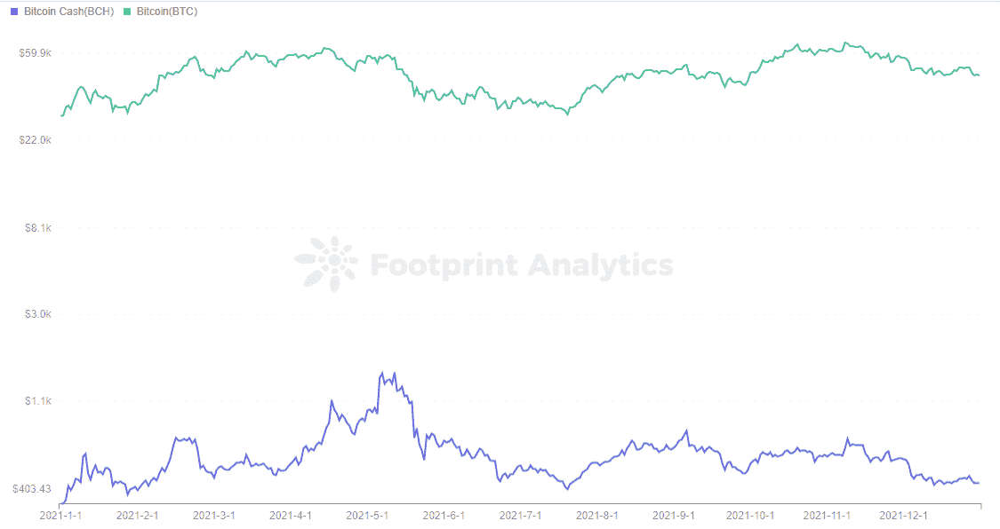
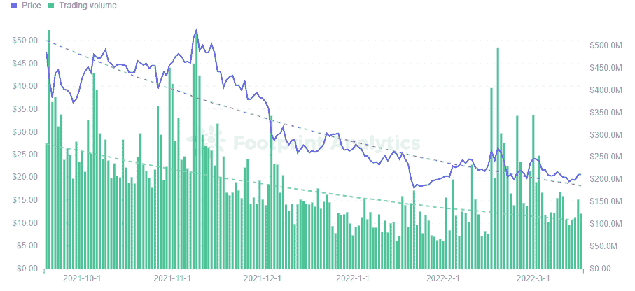

# 5 个“下一个比特币”

> 原文：<https://medium.com/coinmonks/5-next-bitcoins-that-werent-376962559af7?source=collection_archive---------94----------------------->

互联网电脑，比特币现金，以太经典，NEO，EOS 在 2018 年熊市没挺过来，2022 年还能再涨吗？

2022 年 3 月

数据来源:[足迹分析](https://www.footprint.network/dashboards?channel=ENG-212)

区块链世界有如此多的新项目，以至于人们很容易忘记那些失败的项目。

尽管每一个新的“[以太坊杀手](https://www.footprint.network/guest/dashboard/eth-burned-fp-2034aef0-d1dc-4214-b63b-d650eda157a0?channel=ENG-212)”都得到了关注，就像 HashOcean 和 BAS 这样的灾难项目一样，但重要的是及时回顾一些旧项目(这意味着超过 2 年以上，在 crypto 中)，这些项目产生了巨大的宣传，但从未转化为结果。

—不是骗局或彻底的失败，而是从来没有像他们宣传的那样成功的项目。

通过查看这些，你会想到，在一个新兴的、不稳定的行业中，如 crypto，即使是大的、高度期待的项目也不总是按计划进行。

# 比特币现金

[比特币现金](https://bitcoincash.org/)，或称 BCH，既是支付网络，也是加密货币。截至 3 月 9 日，市值排名第 27 位的加密货币。BCH 于 2017 年 8 月推出，是比特币区块链的硬分叉。

2017 年 12 月 23 日达到历史最高，为 3923 美元。它的价格基本上保持了与 BTC 类似的波动。

[*Footprint Analytics — Price of BTC and BCH*](https://www.footprint.network/guest/chart/price-of-btc-and-bch-fp-0f2c8b49-1af1-4e17-9d06-6291165dd4c1?channel=ENG-212#secret=7B554A7B0C6DB38967CD9093CF4EAFBC)

比特币现金被用于增加比特币的 100 万块限额，目前已达到最高 3200 万块。因此，每笔交易的处理速度比 BTC 高得多，而且交易费用也较低。但就市值而言，比特币现金目前无法击败 BTC。

## 为什么它不起作用

BCH 仍然是去中心化、跨境交易的主要密码，并继续作为价值储存手段发展。随着支付功能的消失，它现在已经变得类似于数字黄金。

数字黄金比支付手段更有价值。由于其定位，BCH 无法超越 BTC，因为铁不如黄金值钱。

BCH 也受到美联储加息、资产负债表缩减和美股下跌的影响。超越 BTC 的最佳时机已经错过。

随着新一轮熊市的到来和负面的政治因素，BTC 可能会面临新一轮的下行压力。

然而，BCH 仍然有一个活跃的社区，认为它可以反弹，成为下一个大事件，比特币现金的 Reddit 社区就证明了这一点。

# 以太坊经典

经常和 BTC 一起被提及的，还有它的姐妹，以太坊经典。尽管它是一个拥有 ETH 技术和 BTC 概念的网络，但它并没有动摇以太坊的地位。

以太坊的硬分叉发生在 2016 年 7 月，创始人 Vitalik Buterin 提出了硬分叉的想法。追回被黑客从 DAO 窃取的资产。最终以太坊分叉为以太坊和以太坊经典。

以太坊经典等，加密货币市值排名第 34 位。fork 保持了最初以太坊的愿景和理念，拥有更高程度的去中心化和社区自治，但只有 15%的 HashRate 支持。

现在无论是代币价格还是生态系统应用都远不如以太坊。

## 为什么它不起作用

从硬分叉开始，原来的以太坊创始人和团队离开去支持和领导现在的以太坊，而以太坊经典则被新的团队接手。

支持者方面，叉后有 85%的 HashRate 支持，以太坊的支持者远比以太坊经典多，需求也更高。

就生态系统的完整性而言，以太坊已经成为顶级的公共[连锁](https://www.footprint.network/guest/dashboard/chain-overview-fp-35dfdf0f-5c59-4504-9907-7374eae92981?date_filter=past90days) TVL，而以太坊 Classic 上部署的项目并不多。

因此，在许多方面，即使以太坊经典更加专注和分散，它最终也没有成为区块链世界的主导者。

# 新的

[NEO](https://migration.neo.org/) ，原名蚂蚁金服，由埃里克·詹(Erik Zhan)及其团队于 2014 年在中国推出，是一家公共连锁店。它是 2015 年 Github 上的一个开源项目，几个月后完成了 ICO 资本化。

[NEO](https://www.footprint.network/guest/dashboard/neo-dashboard-fp-e7bafca7-ccda-4977-b15b-20ec98a64288?channel=ENG-212) 支持开发自己的加密货币、数字资产和智能合约，每秒可实现数千笔交易。

Neo 的价格涨得很厉害。从推出时的 0.08 美元，到 2018 年 1 月 15 日达到 198.38 美元的历史新高，涨幅 2478.75%。

但这是短暂的，总体下降趋势在 [Footprint Analytics](https://www.footprint.network/dashboards?channel=ENG-212) 数据中显而易见，当前价格为 21.27 美元。

[*Footprint Analytics — Price & Trading Volume of Neo*](https://www.footprint.network/guest/chart/price-trading-volume-of-neo-fp-cd3e3c0f-603f-42c4-a272-b99bd04cebed?channel=ENG-212#secret=6C0C3A2A38F284746C01EC9BBC9872C6)

为什么它不起作用

曾经的 1000 倍币已经跌了，成为市值第 77 大币。这不是因为加密货币市场表现不佳等客观的场外因素，而是 NEO 本身。

*   近地天体的代码更新很弱
*   生态系统发展几乎停滞。
*   权力下放薄弱。只有 7 个投票节点，由 NEO 正式部署。

俗话说，基础不牢，地动山摇。如果 NEO 未能解决上述问题，它将继续在新的熊市中被超越。

# 黎明的女神

2017 年 5 月，block.one 推出了 [EOS](https://eos.io/) 作为智能合约平台和分布式操作系统。2018 年成为以太坊的有力竞争对手。

当时市场对以太坊持怀疑态度，原因是交易拥堵、高额燃气费，以及未能发布其分片技术。

在推出不到 6 个月的时间里，EOS——零费用和极快的交易速度——以单日 30000 笔的交易数，崩溃了以太坊不到 3000 笔的日常交易。伊奥斯是以太坊杀手。

## 为什么它不起作用

然而，年轻的协议最终未能实现其潜力。 [EOS](https://www.footprint.network/guest/dashboard/eos-dashboard-fp-c03d6da8-f7c6-4623-9580-aa7eabe38dd0?date=thisyear&chain=EOS&symbol=EOS) 极快的交易处理速度是以去中心化为代价的。

EOS 的共识机制有 21 个超级节点来处理事务，使得较小的节点运营商无法参与。超级节点是通过持有硬币选举产生的，隐含着贿赂的风险。

以太坊和比特币的 POW 共识机制效率很低，而 EOS 的委托股权证明(DPoS)共识机制效率很高。

然而，区块链的核心是去中心化，而 EOS 本质上更像是一个集中的链条。

目前，几乎所有活跃的顶级公共链都有令人印象深刻的应用程序，或者至少有支持公共链的协议。例如，[号将](https://www.footprint.network/dashboard/anchor-protocol-dashbord-fp-3006?channel=ENG-212)号锚定在泰拉链上。然而，EOS 没有。

尽管 EOS 官方一再表示支持生态系统建设，但截至 3 月 9 日，EOS 的链上生态系统看起来仍然像一片贫瘠的荒地。

# 有限/互联网计算机

Dfinity 是一个去中心化的云技术平台。成立于 2016 年，颇受风投青睐。它在 2018 年逆市而上，获得了 a16z 1.02 亿美元的融资，这是 a16z 当年最大的对外投资。

Dfinity 的愿景是创建一个比 AWS 更高效、更安全的公共云计算平台，将区块链网络置于分布式计算机网络的控制之下。

[互联网计算机](https://internetcomputer.org/)预计在 2018 年下半年或 2019 年上半年推出，但实际的 Alpha master 网络在 2020 年 12 月上线。

## 为什么它不起作用

Dfinity 从投入资金到交付产品已经花了两年多的时间，它并不是独一无二的。团队行动太慢。

在区块链 AWS 解决方案方面，针对 Web3 的区块链开发平台服务 Alchemy 成立于 2017 年，目前为全球大多数区块链公司提供支持。

对于源代码来说，Github 自 2008 年就已经存在，并且是托管当今绝大多数区块链协议的平台。

允许社区管理令牌的社区自治也已经在许多项目中实现。

虽然 Dfinity 的概念很有趣，但推迟发布导致该项目失去了吸引力。

***此片由*** [***足迹分析***](https://www.footprint.network/dashboards?channel=ENG-212) ***社区供稿。***

*Footprint 社区是一个世界各地的数据和加密爱好者相互帮助了解和获得关于 Web3、元宇宙、DeFi、GameFi 或区块链新兴世界任何其他领域的见解的地方。在这里，你会发现活跃的、不同的声音相互支持，推动着社区向前发展。*

> 加入 Coinmonks [电报频道](https://t.me/coincodecap)和 [Youtube 频道](https://www.youtube.com/c/coinmonks/videos)了解加密交易和投资

# 另外，阅读

*   [有哪些交易信号？](https://coincodecap.com/trading-signal) | [比特斯坦普 vs 比特币基地](https://coincodecap.com/bitstamp-coinbase)
*   [ProfitFarmers 回顾](https://coincodecap.com/profitfarmers-review) | [如何使用 Cornix Trading Bot](https://coincodecap.com/cornix-trading-bot)
*   [如何在势不可挡的域名上购买域名？](https://coincodecap.com/buy-domain-on-unstoppable-domains)
*   [印度的加密税](https://coincodecap.com/crypto-tax-india) | [altFINS 审核](https://coincodecap.com/altfins-review) | [Prokey 审核](/coinmonks/prokey-review-26611173c13c)
*   [赢取注册奖金——10 大最佳加密平台](https://coincodecap.com/earn-sign-up-bonus)