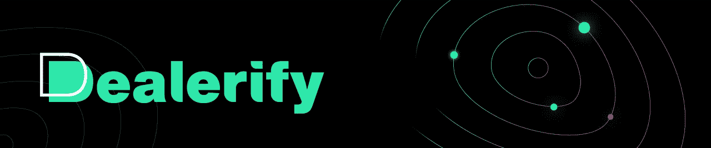

# 5 最佳密码本交易平台 2022

> 原文：<https://medium.com/coinmonks/5-of-the-best-copy-trading-platform-193fd9878b3b?source=collection_archive---------7----------------------->

## **介绍最佳文案交易平台**

复制交易允许金融市场的交易者自动复制另一个经验丰富的交易者开立的交易头寸。这种方法使交易者能够用他们想要的杠杆复制另一个专业交易的具体策略。

在复制交易中，交易者开始交易。投资者(你)然后复制交易者的交易。这个过程通常自动发生，不需要人工干预。这样，你就可以和你复制了其活动的交易者一起盈利或亏损。所以如果他们的地位提高了，你的地位也会提高。然而，相反的情况也可能发生。

1.  **祖鲁贸易**

ZuluTrade 支持 40 多家外汇经纪商，并允许在另一家经纪商拥有账户的投资者轻松将新账户与现有账户关联。这是最好的复制交易平台之一，受到外汇市场活跃交易者的高度评价。

**设施:**

-下载交易的能力

-免费会员

-复制其他投资者投资组合的能力

-追加保证金通知时的公告

-很多专业行业

**优点:**

-良好的用户界面

-为复制交易提供广泛的交易和交易商

-为有经验和无经验的投资者提供最佳的风险管理

-提供具有完全免费功能的试用帐户

**缺点:**

-需要过夜费

-不一致的交易者很常见

-不适合初学者

**2。造币学**

Coinmatics 是一个数字货币交易系统，于 2018 年推出。这个平台对新手和交易者来说都是很好的工具。简而言之，该服务允许投资者自动或手动复制加密货币。对于交易者来说，Coinmatics 是一个通过增加订户并从他们复制的交易中获利的机会。

此外，还有其他服务对有经验的交易者有用。包括:套利、股票提示和分析。如今，在这个平台上注册的交易员有 40 人，文案交易员有 3000 多人。

**优点:**

-无限制免费试用

-专业交易者的额外分析工具

-高效快速的支持

-两步认证保护账户

-面向数字货币初学者的简单直观的界面

**缺点:**

-缺乏平衡期货

-缺乏保证金交易

-无限制免费试用

-利润分享原则

**3。解除验证**

Dealerify 是一个数字货币自动交易的平台。为用户提供非常多样和重要的服务。事实上，Dealerify 平台旨在让数字货币世界中的交易变得愉快，并让任何级别的个人和交易者都能获利。

Dealerify 平台在进入本平台之初，为其所有用户提供了 7 天的免费设施，以便他们可以免费熟悉平台条件及其特性和优势。

对于专业交易者来说，Dealerify 的一个最好的功能是能够同时交易和管理 20 个用户账户，并且在一个非常简单实用的空间内访问一个账户而不是几个账户。对于想要管理多个账户的人来说，这其实是一个非常有用的功能。为了其用户的安全和方便，该平台无权访问您的 exchange 帐户或钱包，您只需将您的 exchange API 连接到该平台。所以你可以安全交易，确保你的资金在交易所里是安全的。

**设施:**

- 7 天免费使用所有功能

-您可以在一页上查看您的所有头寸，并尽快为每个头寸做出您想要的任何决定。

-可以同时交易和管理 20 个用户账户

——交易是在一个非常简单实用的空间里。

-轻松管理交易风险的能力

-您可以设置每个头寸的最小和最大资金

-警报功能，输入所需的配对及其价格条件

-您可以查看所有外汇账户的余额。

**优点:**

-专为新手设计的易用平台

-交易不会向您收取额外费用

API 密钥设置中没有撤销权限

-高度安全

-根据资本的数量，你不会支付更高的费用

-你的资金在建仓的时候没有被封锁，所以你可以想设多少就设多少

-能够一键平仓

-能够退出拷贝交易

-能够确定拷贝交易中使用的资本数量

-24 小时支持和响应

**缺点:**

-交流的次数有限

**Etoro**

Etoro 是一家成立于 2006 年的复制交易经纪商，目前有超过 120，000 名交易员在使用。这个副本交易平台允许用户交易股票、商品、外汇、差价合约、指数、加密货币、指数基金和交易所交易基金(ETF)。EToro 是最好的副本交易经纪人之一，是喜欢坚持简单应用程序的用户的理想选择。

**设施:**

-在不同市场投资和交易

-构建各种交易篮子的能力

-熟悉专业交易者

-使用基于网络的平台和移动应用程序

-账户类型包括小额账户、标准账户、伊斯兰账户和贵宾账户

-通过电话、聊天和电子邮件回复客户

-您的资金受到行业领先的安全协议的保护。

-未经许可，不得共享私人数据。

**优点:**

-多种多样的结构

-声誉良好且受监管的公司

-交易者保持博客的能力，以便与用户联系。

-复制交易+终端+机器人的可用性

**缺点:**

-闲置成本

-糟糕的客户支持

-适合初学者的复杂工具

-取款费

**AvaTrade**

AvaTrade 是位于爱尔兰的最好的副本交易平台之一，由欧洲的爱尔兰银行监管。Avatrade 为用户提供了广泛的复制交易平台，外汇价差在这个平台上是固定的。允许您立即自动从一个商业帐户复制到另一个帐户。该平台可直接从 Meta-Trader 5 操作系统获得。AvaTrade 提供服务的原则很简单。交易者提供金融市场交易的公共访问，同时允许其他用户订阅这些信号。

**设施:**

-提供免费和付费信号

-用 CFD 交易数字货币

-能够通过银行转账、信用卡和 PayPal 取款和存款

-通过电话、聊天和电子邮件回复客户

-能够在世界任何地方实施账户管理

-交易数字货币作为我们的合约，差价为 24/7

-提供灵活的支付系统:银行转帐、信用卡和 PayPal

**优点:**

-有有效的规章

-防止账户出现负结余

-向全球提供服务

**缺点:**

*   提供高额被动佣金会让一些有经纪人的常规交易者望而却步。

> 加入 Coinmonks [电报频道](https://t.me/coincodecap)和 [Youtube 频道](https://www.youtube.com/c/coinmonks/videos)了解加密交易和投资

## 另外，阅读

*   [有哪些交易信号？](https://coincodecap.com/trading-signal) | [Bitstamp vs 比特币基地](https://coincodecap.com/bitstamp-coinbase) | [买索拉纳](https://coincodecap.com/buy-solana)
*   [ProfitFarmers 点评](https://coincodecap.com/profitfarmers-review) | [如何使用 Cornix 交易机器人](https://coincodecap.com/cornix-trading-bot)
*   [十大最佳加密货币博客](https://coincodecap.com/best-cryptocurrency-blogs) | [YouHodler 评论](https://coincodecap.com/youhodler-review)
*   [MyConstant Review](https://coincodecap.com/myconstant-review) | [8 款最佳摇摆交易机器人](https://coincodecap.com/best-swing-trading-bots)
*   [MXC 交易所评论](/coinmonks/mxc-exchange-review-3af0ec1cba8c) | [Pionex vs 币安](https://coincodecap.com/pionex-vs-binance) | [Pionex 套利机器人](https://coincodecap.com/pionex-arbitrage-bot)
*   [我的加密副本交易经历](/coinmonks/my-experience-with-crypto-copy-trading-d6feb2ce3ac5) | [比特币基地评论](/coinmonks/coinbase-review-6ef4e0f56064)
*   [AscendEx Staking](https://coincodecap.com/ascendex-staking)|[Bot Ocean Review](https://coincodecap.com/bot-ocean-review)|[最佳比特币钱包](https://coincodecap.com/bitcoin-wallets-india)
*   [霍比评论](https://coincodecap.com/huobi-review) | [OKEx 保证金交易](https://coincodecap.com/okex-margin-trading) | [期货交易](https://coincodecap.com/futures-trading)
*   [Cloudbet 赌场评论](https://coincodecap.com/cloudbet-casino-review) | [点火赌场评论](https://coincodecap.com/ignition-casino-review)
*   [Godex.io 审核](/coinmonks/godex-io-review-7366086519fb) | [邀请审核](/coinmonks/invity-review-70f3030c0502) | [BitForex 审核](https://coincodecap.com/bitforex-review)
*   [Crypto.com 费用](/coinmonks/binance-fees-8588ec17965) | [僵尸加密审查](/coinmonks/botcrypto-review-2021-build-your-own-trading-bot-coincodecap-6b8332d736c7) | [替代品](https://coincodecap.com/crypto-com-alternatives)
*   [如何在 Bitbns 上购买柴犬(SHIB)币？](https://coincodecap.com/buy-shiba-bitbns) | [印度的币安](https://coincodecap.com/binance-in-india)