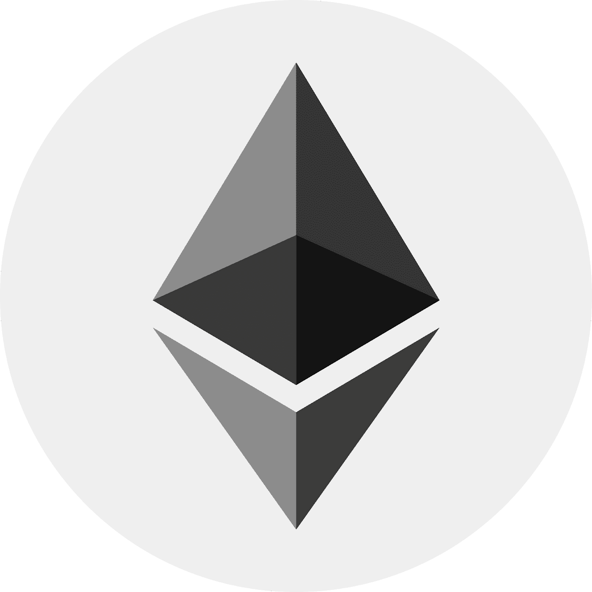
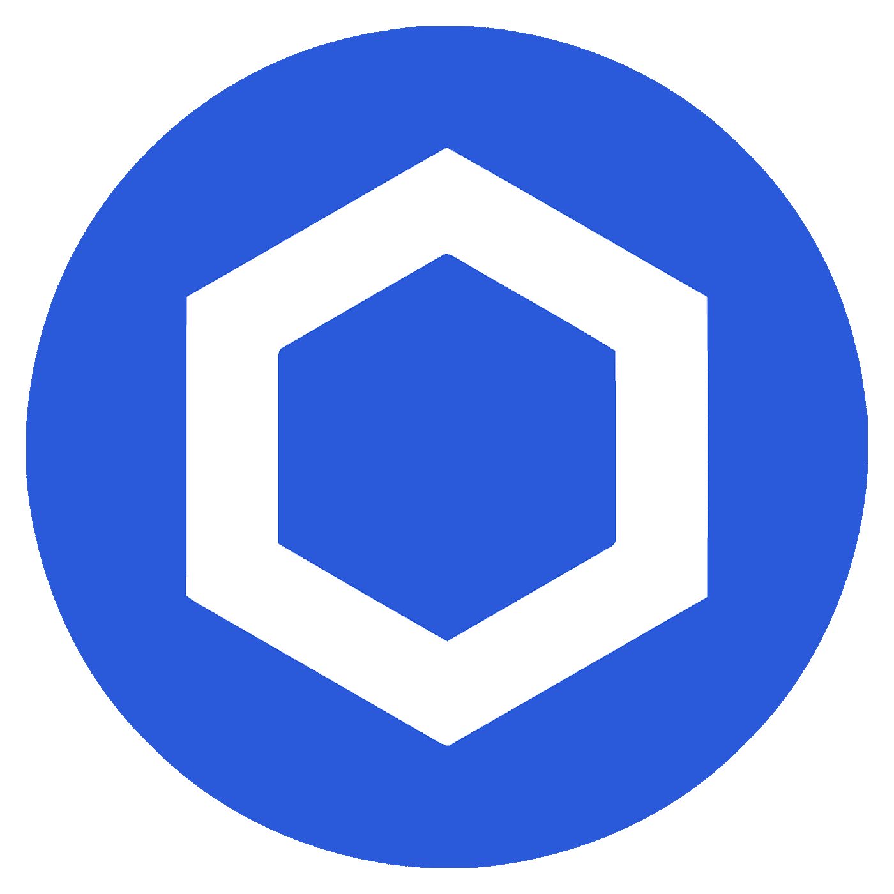

# 2022 年最值得购买的 5 种加密货币

> 原文：<https://medium.com/coinmonks/5-of-the-best-cryptocurrencies-to-buy-in-2022-a82de72c88f7?source=collection_archive---------11----------------------->

Cryptocurrency desktop Digital Art by Brandician

对于一些密码投资者来说，2021 年有点黯淡。许多分析师预测比特币将在年底前达到令人垂涎的 10 万美元大关，但当 2021 年结束时，价格远低于之前的历史高点，这让投资者失望。

不过，在过去的一年中，有几个项目继续受到欢迎。如果你投资了这些项目中的任何一个，在过去的一年里，当市场横向交易时，你可能已经获得了正的投资回报率。过去的表现并不意味着未来的结果，但在这篇文章中，我希望不仅解释哪些区块链将在 2022 年爆发，而且解释为什么他们可能击败竞争对手。

# 哪些加密货币即将起飞？

# 1.以太坊

Ethereum

以太坊一直在无情地上升，市值仅次于比特币。这一成功的原因可以归功于 Vitalik Buterin，以太坊的创始人和创造者，他被广泛认为是当今区块链理工大学最有影响力的人之一。

该项目托管了几乎所有知名的 NFT 项目和 DeFi 计划，考虑到其总价值仅次于比特币的第二名位置，这是有道理的。以太坊正从工作证明走向利益证明。目前，工作证明使用计算能力来保护网络，因此这一转向利害关系证明的举措将会让关注碳排放的人群兴奋不已。一些投资者一直回避以太坊，直到向 ETH 2.0 的转移完成。Vitalik Buterin 表示，ETH 2.0 的推出最早可能在 2022 年 6 月进行。

以太坊作为去中心化应用的平台有很大的潜力。这是因为以太坊为开发人员提供了一种构建基于区块链的应用程序的方法，世界上任何人都可以使用这种应用程序，而无需信任中央权威机构。这导致了许多创新的、新的应用建立在以太坊上，这继续推动了对货币的需求。

# 2.链环

Chainlink

Chainlink 是一项不错的投资，因为它为区块链技术提供了神谕。Oracles 对区块链技术非常重要，因为它们提供了执行智能合同所需的数据。

如果没有神谕，区块链将被限制在封闭的系统中，参与者只能通过预先编程的规则相互交流。Oracles 在区块链和外部世界之间架起了一座桥梁，允许智能合约与来自第三方来源的数据进行交互。这使得它们对于任何需要真实交互的应用程序来说都是必不可少的。

Chainlink 目前是区块链技术 Oracle 的领先提供商，其平台已被一些世界领先的公司使用，包括 SWIFT、Oracle 和 Google。目前，Chainlink 的市值为 19 亿美元。这使其进入了市值最高的 30 种加密货币之列。

# 3.索拉纳

Solana

索拉纳的市值是 254 亿美元。索拉纳是一个伟大的投资，因为它的交易速度。索拉纳的平均交易只需 1 秒钟确认，比其他区块链快得多。这使得它非常适合需要快速移动的应用程序，如支付或交易。

Solana 是一项不错的投资，因为它有每秒处理 10，000 笔交易的潜力。这大大超过了目前其他区块链技术所能处理的每秒 3-5 次交易。

此外，Solana 的设计使得每个节点只处理全部事务的一小部分，这与其他要求每个节点处理每个事务的区块链不同。这意味着 Solana 可以扩展到更大的规模，而不会遇到其他区块链面临的拥塞和可伸缩性问题。

阿纳托利·亚科文科赋予索拉纳生命，他在高通从事最优化问题的研究。Solana 还与 Chainlink、Ethereum Foundation 和 Web3 Foundation 等知名公司建立了合作伙伴关系。此外，Solana 的共识算法比其他主要的区块链平台更节能。所有这些因素使索拉纳成为区块链地区一个有吸引力的投资机会。

# 4.卡尔达诺

Cardano

以太坊的联合创始人之一查尔斯·霍斯金森是卡尔达诺的幕后黑手。他在业内有着良好的记录，并因其在以太坊和 Bitshares 方面的工作而闻名。

卡尔达诺团队也很有经验。他们有一大群全职从事这个项目的开发人员和工程师。这激发了他们按时发布更新和新特性的信心。Cardano 上已经构建了许多分散式应用程序(dApps ),这推动了对 ADA 令牌的需求。Cardano 最近推出了自己的分散交易平台，名为 Sundae Swap。这使得用户可以直接相互交易 ADA，而不必通过像币安或比特币基地那样的集中交易所。这使得 ADA 的交易更加容易和便宜，这也有助于其价值。

卡尔达诺正试图解决当今加密货币的一些最大问题。例如，他们正在开发一种新的共识算法，称为 Ouroboros，它比其他工作证明或利害关系证明算法更安全、更有效。Cardano 构建于 Haskell 之上，Haskell 是一种以安全性和稳定性著称的编程语言。此外，Cardano 背后的开发团队经验丰富，致力于持续改进。Cardano 有望成为加密货币领域的领先企业，因此投资者可能会考虑投资这一数字资产。

# 5.宇宙

Cosmos

宇宙是一个很好的加密货币投资，因为它是区块链的第一个互联网。Cosmos 将不同的区块链连接在一起，允许互操作性和原子交换。这使得在不需要集中交换的情况下在不同的区块链之间移动代币成为可能。此外，Cosmos 建立在 Tendermint 共识算法的基础上，该算法以其快速的终结时间而闻名。出于这些原因，对于希望在多个区块链中分散投资组合的投资者来说，Cosmos 是一个不错的选择。

ATOM 是宇宙网络的原生加密货币。ATOM 可以被标记，这有助于保护“全球中枢”，这是所有这些区块链的连接机制。目前，Cosmos network 管理着超过 1380 亿美元的数字资产。区块链间通信协议(IBC)连接了开发者友好的应用组件，并导致了宇宙生态系统的爆炸。

这是榜单上最小的区块链，目前市值 75 亿美元。这种加密技术也是比特币基地唯一可以保持兴趣的技术之一，对于那些可以忍受较小市值的人来说，这是一种诱人的工具。目前，持有 ATOM 将在比特币基地产生 5.00%的 APY。假设 ATOM 的价格继续保持目前的上升趋势，这对于密码爱好者来说可能是一个健康的投资选择。

# 外卖食品

那么，这一切对你来说意味着什么？简而言之，这意味着如果到 2022 年你还没有一些钱存进 crypto，你就会被甩在后面。比特币不再是镇上唯一的游戏——在接下来的一年里，还有许多其他的密码值得关注和研究。这些项目具有巨大的潜力，我们相信它们在未来几年将会有显著的增长。

GoldHorn Crypto on Iconomi platform Digital Art By Brandician

找到上述所有资产背后的风险和回报之间的完美混合投资组合的一种方法是关注 Goldhorn Crypto 策略提供商的 [ICONOMI](https://www.iconomi.com/register?ref=yF3A4) 副本交易平台。Goldhorn 加密策略团队研究市场，寻找不同加密资产之间的理想分配，以开发最受欢迎的组合解决方案。不同的投资组合已经建立，以适应您的投资目标，无论您喜欢积极的，保守的，或混合的方法。

通过在 [ICONOMI](https://www.iconomi.com/register?ref=yF3A4) 上拥有一个账户并关注 Goldhorn Crypto 策略提供商，您可以简单地逐个复制策略和/或投资组合，并在每次市场发生变化时自动重新平衡您的账户。复制交易从未如此简单！金角湾有 8 种不同的[成熟策略](https://www.goldhorn-crypto.com/strategies/overview)解决方案，适合任何人的投资主题。关注我们的 [ICONOMI](https://www.iconomi.com/register?ref=yF3A4) ，今天就找到你的复制交易策略！

> 加入 Coinmonks [电报频道](https://t.me/coincodecap)和 [Youtube 频道](https://www.youtube.com/c/coinmonks/videos)了解加密交易和投资

# 另外，阅读

*   [如何在 Uniswap 上交换加密？](https://coincodecap.com/swap-crypto-on-uniswap) | [A-Ads 审查](https://coincodecap.com/a-ads-review)
*   [WazirX vs CoinDCX vs bit bns](/coinmonks/wazirx-vs-coindcx-vs-bitbns-149f4f19a2f1)|[block fi vs coin loan vs Nexo](/coinmonks/blockfi-vs-coinloan-vs-nexo-cb624635230d)
*   [本地比特币评论](/coinmonks/localbitcoins-review-6cc001c6ed56) | [加密货币储蓄账户](https://coincodecap.com/cryptocurrency-savings-accounts)
*   什么是融资融券交易
*   [支持卡审核](https://coincodecap.com/uphold-card-review) | [信任钱包 vs 元掩码](https://coincodecap.com/trust-wallet-vs-metamask)