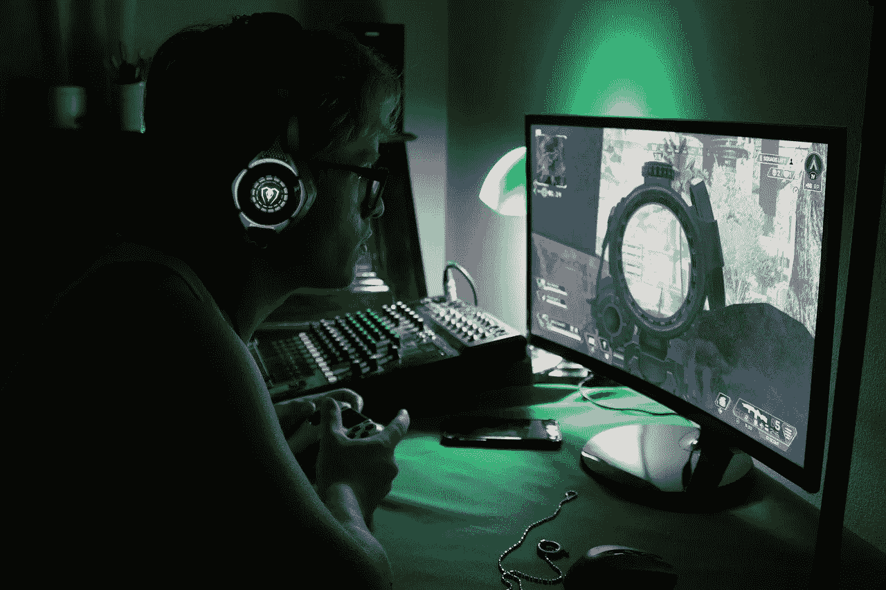
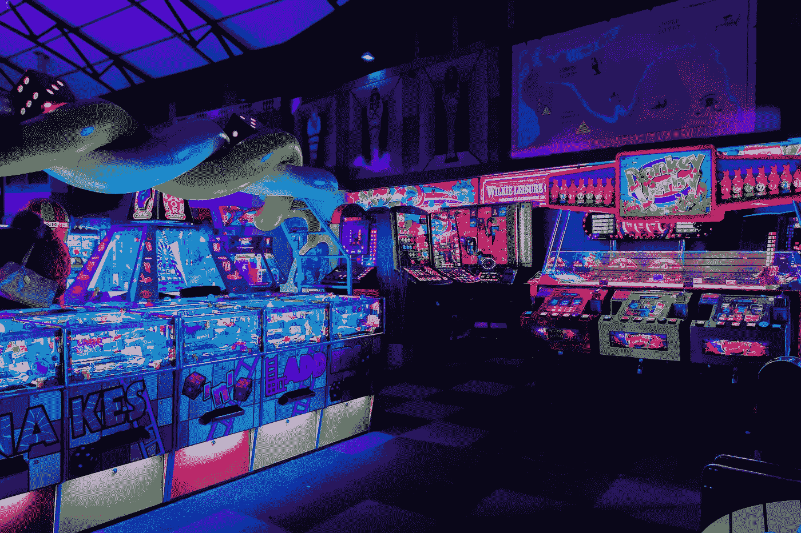
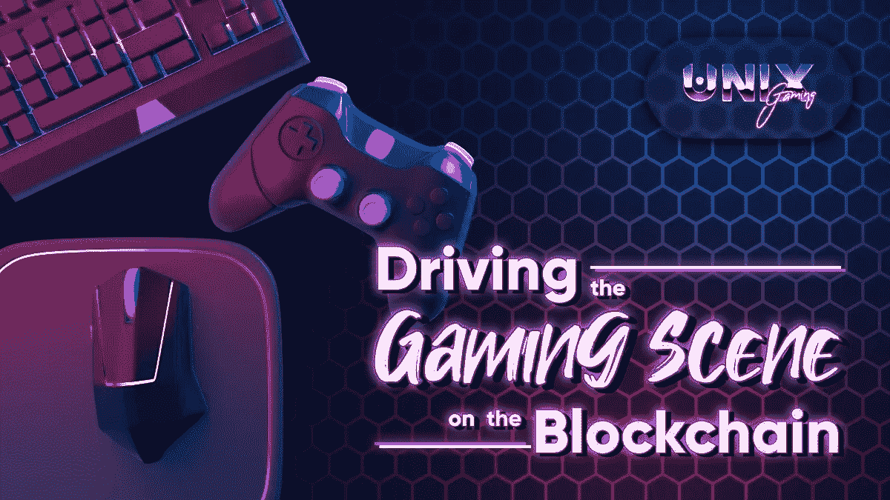
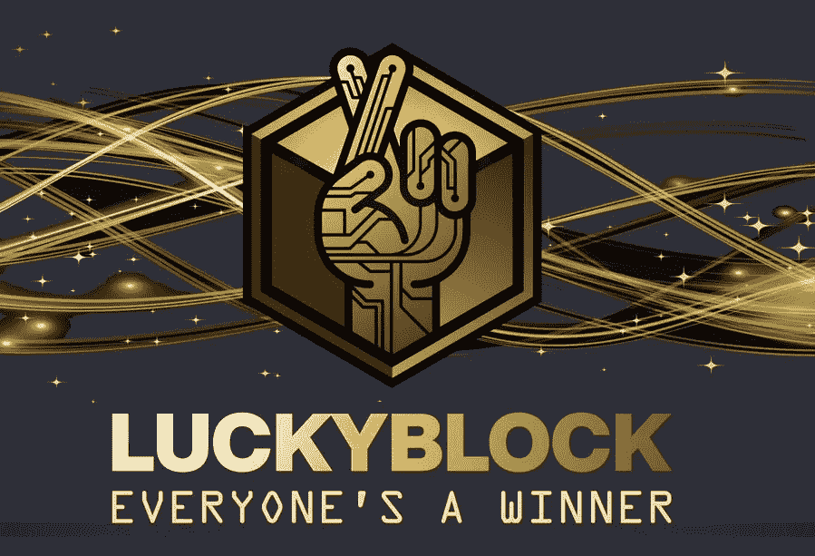
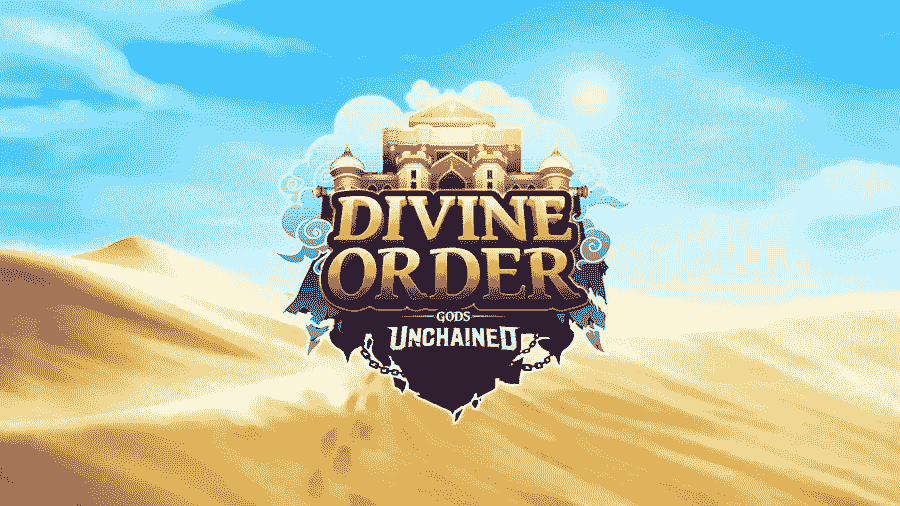

# 5 参加游戏，赢取将在 2022 年 Q2 举办的盛大游戏。

> 原文：<https://medium.com/coinmonks/5-play-to-earn-games-that-will-blow-up-in-q2-2022-33585b1e2a7e?source=collection_archive---------5----------------------->

Source: Pixabay.com

**玩赚取游戏说明**

在娱乐的同时赚取加密货币是像 Axie Infinity 这样的玩赚游戏如此受欢迎的主要原因之一。

玩赚游戏大多是视频游戏，玩家可以获得现实世界价值的奖励，如加密货币和 NFT。它们是利用密码来奖励玩家在现实和虚拟世界中有价值的东西的游戏。

这些奖励可能会以 NFT 的形式出现，NFT 代表游戏中的资产，如虚拟工具或武器。一旦获得，这些物品可以用来交换游戏中的其他物品，或者在 NFT 市场上卖真钱。

> **亦见:** [**以太坊可能过渡到 8 月份的股权证明。**](/coinmonks/ethereum-may-transition-to-proof-of-stake-in-august-b1908ee99df7)

P2E(付费游戏)使用区块链技术来奖励玩家的时间投入，现在已经成为主流，几乎可以在每个元宇宙平台上找到。

在一些国家，这些“玩赚”游戏使游戏玩家能够通过玩视频游戏谋生，奖学金计划和学院如雨后春笋般出现，以帮助玩家导航这个新世界。

**5 玩游戏赚取将在 2022 年 Q2 举办的盛大游戏**

Source: Unsplash.com

以下是将于 2022 年第二季度爆发的 5 款 P2E 游戏。

1.  **分散管理**

Source: google.com

虚拟现实平台 [**分散土地**](https://coinmarketcap.com/currencies/decentraland/) 允许玩家通过购买土地并在平台上开发来建造自己的 3D 世界。购买土地的玩家可以自由地在上面建造任何东西，从一个独立的游戏到一个准备营业的在线商店。当玩家不在线时，他们可以付钱给其他玩家来保护他们的土地。

你必须有一个以太坊钱包才能在分散地购买和储存平台的法力货币。之后，他们将能够开始参与平台活动。

法力令牌可以在受欢迎的交易所购买，比如币安。

**在这里阅读更多关于分散的土地:** [**欢迎来到分散的土地**](https://decentraland.org/) 。

**2。Unix 游戏(UNIX)**

Source: [Media Tweets by UniX Gaming (@UniXGamingGuild) / Twitter](https://twitter.com/UniXGamingGuild/status/1523577345646284800/photo/1)

[**Unix**](https://coinmarketcap.com/currencies/unix-gaming/)**Gaming 旨在弥合玩家与点对点(P2P)视频游戏之间的鸿沟。它建在一把刀上。**

**有了 UNIX 令牌和 DAO 保险库，用户可以通过使用各种实用程序获得高收益。Unix 最近宣布与元宇宙领先的游戏公司之一 Sandbox 合作，并筹集了 2800 万美元的资金。**

> ****参见:**[**Terra/Luna 会从崩溃中恢复吗？**](https://wire.insiderfinance.io/will-terra-luna-recover-from-the-crash-e9c304457f57)**

**由于激励措施、学术事件、活动和赚钱的努力，Unix 相信它仍然有望产生一个强大的社区。截至 2022 年 2 月，它拥有 20 万名社区成员，20 支电子竞技队和 1000 万名流媒体观众。**

****在这里了解更多关于 Unix 游戏的信息**:[Unix verse(unixgaming.org)](https://unixgaming.org/games)**

****3。猴子联盟****

****

**Source: [MonkeyLeague 🐵⚽♟️ (@TheMonkeyLeague) / Twitter](https://twitter.com/TheMonkeyLeague/status/1529437604512407552/photo/1)**

**索拉纳区块链技术、分散融资和不可替代的代币都被整合到 [**MonkeyLeague**](https://www.monkeyleague.io/) 中，创造了一个 P2E 足球游戏。可以在游戏平台上创建一个游戏内的作品集以及一系列专门的收藏品。**

**这款游戏被重新命名为 MonkeyBall，最近筹集了 300 万美元的资金。用户可以控制一个由四只猴子组成的团队，并与其他玩家竞争。可以通过购买竞技场和作为观众参加比赛来赢得 MBS 代币。**

****在这里了解更多猴子联盟** : [猴子联盟](https://www.monkeyleague.io/)**

****4。幸运积木****

****

**Source: [https://twitter.com/luckyblockcoin/status/1529711441015713792?s=20&t=0Vw8ZcQOdjT_SuUF-R0aQg](https://twitter.com/luckyblockcoin/status/1529711441015713792?s=20&t=0Vw8ZcQOdjT_SuUF-R0aQg)**

**在币安智能链(BSC)这一新的加密游戏平台上，幸运街区每天都为玩家提供赢得头奖的机会。幸运块的本地令牌 LBLOCK 用于支付这些累积奖金，因此奖金可以快速分配。**

**直到今年早些时候，LBLOCK 代币才开始在分散的交易所交易，代币销售的 12%的税收直接进入幸运区块的奖金池。因此，已经为 2022 年 5 月开始的抽奖预留了总计 220 万美元。每位获奖者将使用 VRF 链家服务随机抽取，以确保幸运街区遵守所有适用的法规。**

> ****参见:** [**Terra 的 LUNA 2.0 Testnet 现已上线。**](https://wire.insiderfinance.io/terras-luna-2-0-testnet-is-now-live-ec63bb60eff6)**

**幸运街区每日抽奖活动的门票可以用 5 美元购买。在 Lucky Block 网站上，用户可以用信用卡或借记卡购买 BNB，然后在几分钟内兑换成 LBLOCK。值得注意的是，将加密货币钱包连接到幸运区块平台的 LBLOCK 持有者还将获得每次每日抽奖的免费入场券。**

**幸运街区将提供额外的 P2E 功能，包括大量的数字和实物项目莱佛士和这些抽奖。还将有一个“游戏画廊”组件，包含地理定位的 P2E 游戏，让玩家有更多的机会赢得奖品。此外，幸运街区 NFT 的持有人将参加与平台主要抽奖同时进行的单独的每日抽奖，每天有两次中奖机会。**

**事实上，现在官方 Telegram group 中有超过 46，000 名成员，这表明 Lucky Block 平台的这些功能促成了大量的宣传。随着即将到来的抽奖，幸运块无疑是最好的游戏之一。**

****在这里查看更多关于幸运方块的信息:** [幸运方块官方——2022 年最佳加密游戏平台](https://luckyblock.com/)**

****5。被解放的神****

****

**Source: [https://twitter.com/GodsUnchained/status/1527182392125014017?s=20&t=OvAa6P-wdVxA7PrrWiBR_w](https://twitter.com/GodsUnchained/status/1527182392125014017?s=20&t=OvAa6P-wdVxA7PrrWiBR_w)**

**《被解放的神》是 2D·P2E 的一个平台，它利用区块链来支持流行的纸牌游戏世界。《被解放的上帝》将每张扑克牌构造成一张 NFT，这是这种策略的主要好处。这给了玩家卡片的“真正所有权”,并确保每张卡片的属性不能被改变。**

**《被解放的上帝》包含多种“玩到赚”的机制。第一种是玩游戏赚来的。玩家从每场排名赛中获得经验，增加他们的帐户等级。当玩家升级时，他们会得到一个核心卡包作为奖励。此外，玩家在玩游戏时赚取流量。复制的核心卡可以与 Flux 和$GODS 结合，创建一个带有陨石稀有物的核心卡，可以卖给其他玩家。**

**周末是第二个玩到赚的时间。从周五早上开始，每个周末《被解放的上帝》都会举办一场游戏内锦标赛。玩家根据他们在最初的 25 场比赛中赢得的比赛数量获得奖励。奖励由核心套装和最新资料片的套装组成。此外，在周末结束时，排名前十的神话级玩家将获得额外的奖励包。**

****了解更多关于被解放的上帝:**【https://godsunchained.com/】T2**

****有用链接****

**BXMI 提供了一个独特的机会来交易加密资产和享受一个活跃的加密社区的好处，无论你是新手还是有经验的交易者。**

**Bitxmi 交易者享受的好处包括最低交易费用、24/7 客户支持、闪电般的快速交易，以及每天高达 1500 美元的无 KYC 取款。**

**Bitxmi 的长期目标是不仅提供兑换服务，还教育人们如何交易和投资加密货币。**

**从这里开始:[https://www.bitxmi.com/en_US/register](https://www.bitxmi.com/en_US/register)**

**在这里加入我们的电报社区:[https://t.me/bitxmiexchange](https://t.me/bitxmiexchange)**

**在这里阅读我们的白皮书:[https://drive . Google . com/file/d/1 ptwx 8 rrepkwvvwj 8 psidb 1 pnz 5 uacx/view？usp =共享](https://drive.google.com/file/d/1PTWX8rRePkWVvjwJ8pSIdb1pPnZ5uacx/view?usp=sharing)**

> **加入 Coinmonks [电报频道](https://t.me/coincodecap)和 [Youtube 频道](https://www.youtube.com/c/coinmonks/videos)了解加密交易和投资**

# **另外，阅读**

*   **[如何获得自己的。XYZ 领域？](https://coincodecap.com/xyz-domain)**
*   **[最佳加密交换平台](https://coincodecap.com/best-crypto-swap-platforms) | [最佳加密交易所](https://coincodecap.com/crypto-exchange)**
*   **[购买比特币印度](/coinmonks/buy-bitcoin-in-india-feb50ddfef94) | [Pionex 评论](/coinmonks/pionex-review-exchange-with-crypto-trading-bot-1e459d0191ea) | [加密交易机器人](/coinmonks/crypto-trading-bot-c2ffce8acb2a)**
*   **[n 零复习](/coinmonks/ngrave-zero-review-c465cf8307fc) | [Phemex 复习](/coinmonks/phemex-review-4cfba0b49e28) | [PrimeXBT 复习](/coinmonks/primexbt-review-88e0815be858)**
*   **最佳[区块链分析](https://bitquery.io/blog/best-blockchain-analysis-tools-and-software)工具| [赚比特币](/coinmonks/earn-bitcoin-6e8bd3c592d9)**
*   **[Cloudbet 赌场评论](https://coincodecap.com/cloudbet-casino-review) | [点火赌场评论](https://coincodecap.com/ignition-casino-review)**
*   **[加密套利](/coinmonks/crypto-arbitrage-guide-how-to-make-money-as-a-beginner-62bfe5c868f6)指南| [如何做空比特币](/coinmonks/how-to-short-bitcoin-568a2d0b4ae5)**