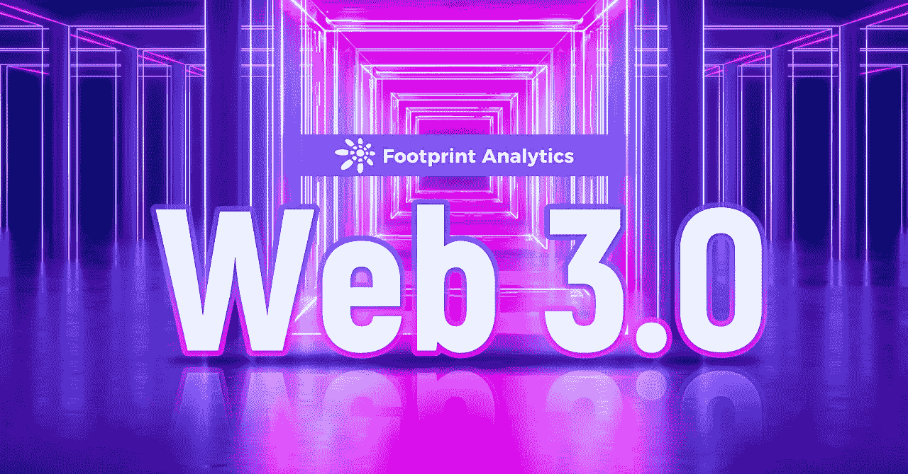
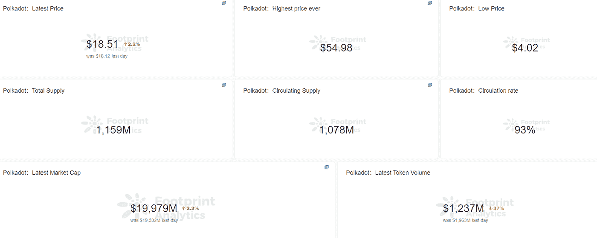

# 了解 Web3 的 5 个项目

> 原文：<https://medium.com/coinmonks/5-projects-to-understand-web3-4a0ec5d97ec?source=collection_archive---------16----------------------->

数据来源:[足迹分析](https://www.footprint.network/)

据路透社报道，2021 年， [Web3](https://www.footprint.network/guest/chart/monthly-fundraising-amount-in-2021-web-3-fp-0ab3d6eb-f157-4f57-a7a5-bae745d6af94?channel=u-DBc983) 成为年度[12 大科技流行语之一。](https://www.followthistrendingworld.com/post/reuters-today-selected-the-top-12-technology-hot-words-of-2021)

尽管 Web1 的用户参与度和互动度较低，但 Web2 是一个以创造者为中心的互联网，通常由科技巨头控制，用户的行为、数据和通信由中央机构控制和利用。

随着对信息控制不满的增长，下一代互联网的新愿景已经出现。

在本文中，我们将使用 6 个有代表性的项目来介绍 Web3。

# 什么是 Web3

Web3 基于区块链技术，其核心在于权力下放和移交给人民。用户可以控制自己的信息，而不是被科技公司控制。通过区块链技术，Web3 可以重新引入真正的所有权、可验证性，并重新开放互联网以确保点对点的交互。

# Web3 由哪些部分组成

Web3 是一个非常宽泛的概念，但总的来说，它正朝着一个以区块链为基础的分散式网络发展。建立一个 Web3 网络需要做很多工作。基于技术和应用的发展，Web3 现在已经有了初步的架构。

在分散的基础设施级别，需要最基本的网络架构、隐私保护、数据存储和 DAO 治理来运营项目。在去中心化应用层面，创作者经济平台、社交娱乐、游戏等项目将会涌现。

在本文中，我们将介绍 Web3 的五个代表性项目。

**1。波尔卡多**

在 Web3 时代，人们期望建立一个去中心化的互联网，但是目前的区块链信息是不可互操作的，不存在通信和互操作的可能性。换句话说，目前的区块链没有办法承载一个庞大、完整的网络。

Polkadot 成立于 2015 年，是一种异构、可扩展的多链协议。它的目标是允许独立的区块链互相通信，成为 Web3 的底层基础设施。

波尔卡多特网络有三个主要部分。

**并行链:**通过并行链横向扩展区块链的容量，负责数据操作和交易信息处理。

**中继链:**验证各并行链给出的块并给出最终的确定性证明，负责网络共享安全、一致性和跨链互操作。

**传送桥:**允许并行链和并行线程与以太坊、比特币等外部网络进行连接和通信。

*Footprint Analytics — Polkadot Stats*

[来自 Polkadot](https://www.footprint.network/guest/dashboard/polkadot-dashboard-fp-911d1533-624c-4d23-83e0-428c51d88bc2?channel=u-DBc983) 的数据显示，目前 Polkadot 连锁 token DOT 的流通率依然很高，显示了 Polkadot 的生命力。随着 Web3 概念的流行，Polkadot 上的项目数量现已达到 529 个，涵盖了工具、钱包、stablecoins、DeFi、基础设施等各个方面。

**2。ENS(以太坊名称服务)**

在传统网络中，web 域名一般以主题名称为前缀。com，。org 结尾，相对容易记住。但区块链世界的情况并非如此。区块链域名都是以 0x 开头的 2 位数字+字母的组合，非常不人性化。但是分散式域名系统解决了这个问题，它将长串地址转换成。eth 域。

ENS 作为 Web3 基础设施之一，具有帮助用户管理地址、简化链条上支付流程的功能，解决了 Web3 普及路上非常重要的用户体验问题，是 Web3 时代的重要项目。

*Footprint Analytics — ENS Token Price*

热度过后，分散域名的令牌价格稳步下降。Footprint Analytics 数据显示，ENS 令牌在过去 90 天内呈缓慢下降趋势，从目前的 74 美元高位降至 16 美元。因此，我们可以看到，在 Web3 网络的初级阶段，人们对分散域名的应用还不是很热情，而主要是为了投资。

在未来，当 Web3 网络进一步发展，人们更加关心其去中心化的身份证明时，去中心化的域名可能会重获生机。

**3。Arweave**

传统上，数据通常存储在集中式服务器上，但随着数据量的增加和大数据技术的发展，问题也逐渐显现出来。数据被利用，集中收费高，黑客攻击层出不穷。

此外，大多数区块链公司目前都将数据存储在自己的链上，这给项目所有者和用户带来了一定的技术困难，他们担心数据集中。因此，Arweave 具有巨大的市场空间潜力。

*Footprint Analytics — Arweave Trading Volume & Token price*

从[象征价格和交易量](https://www.footprint.network/guest/dashboard/arweave-fp-4c9dff09-7213-4022-9fe2-df0c0eccb88a?channel=u-DBc983)来看，Arweave 在 2021 年开始被关注。Web3 正在出现，但是分散存储的推广仍然需要社会共识和更分散的区块链协议的开发。然而，可以肯定的是，分散存储将是网络 3 时代的一个重要组成部分。

分散存储符合 Web3 时代开源透明和数据分散化的特点，分散服务必须有强大的分散数据存储基础。

**4 .分散土地**

Blockchain 游戏是一种让更多人可以访问 Web3 的应用程序。游戏作为一种信息丰富、交互性强、门槛低的 Web3 应用，必将对 Web3 的普及起到积极的作用。

Web3 游戏也将采用 DAO 的治理机制，优先考虑参与者的利益，以及一个由创作者、建设者、用户和投资者组成的开放生态系统。此外，网络 3 游戏和网络 2 游戏之间最大的区别在于获得收入的可能性，它的游戏赚钱模式和开放的生态使得网络 3 游戏非常有吸引力。

Decentraland 是 Ethereum 上的一个分散的虚拟世界平台，用户可以在这里购买和出售房产，参与社交，展示和出售 NFT 收藏品，以及其他活动。

*足迹分析-分散交易量&代币价格*

[数据显示](https://www.footprint.network/guest/dashboard/decentraland-dashbosard-fp-4da47c18-2d94-4ae7-a3e0-168680c0d88b?channel=u-DBc983)分散投资的代币价格受交易量的影响较大。这意味着对于分散的游戏，交易量非常重要。

**5。镜子**

Mirror 是一个建立在 Ethereum 上的分散式写作平台，通过为创作者提供令牌发布工具来帮助他们获得资金。

如上所述，网络 2 是创作者的时代，但网络 3 也需要创作者的参与。Web3 创作者平台的优势主要在于抵制审查和盈利。

Web3 creator 平台将内容记录在一个链上，使得内容不可能被中央机构审查。Mirror 的网站称，您不仅将成为 Mirror 的成员，还将成为平台的所有者，Mirror 是平台所有用户的总和。

许多人把镜像称为 Medium 的 Web3 版本，这足以看出它的重要性。

**什么是足迹分析**

足迹分析是一个一体化的分析平台，用于可视化区块链数据和发现见解。它清理和整合链上数据，因此任何经验水平的用户都可以快速开始研究令牌，项目和协议。凭借一千多个仪表板模板和一个拖放界面，任何人都可以在几分钟内构建自己的定制图表。发掘区块链数据，利用足迹进行更明智的投资。

*足迹网址:*[*https://www . Footprint . network*](https://www.footprint.network/)

*不和:*[*https://discord.gg/3HYaR6USM7*](https://discord.gg/3HYaR6USM7)

*推特:*[*https://twitter.com/Footprint_DeFi*](https://twitter.com/Footprint_DeFi)

*电报:*[*https://t.me/joinchat/4-ocuURAr2thODFh*](https://t.me/joinchat/4-ocuURAr2thODFh)

*Youtube:*[*https://www.youtube.com/channel/UCKwZbKyuhWveetGhZcNtSTg*](https://www.youtube.com/channel/UCKwZbKyuhWveetGhZcNtSTg)

> 加入 Coinmonks [电报频道](https://t.me/coincodecap)和 [Youtube 频道](https://www.youtube.com/c/coinmonks/videos)了解加密交易和投资

# 另外，阅读

*   [如何在印度购买比特币？](/coinmonks/buy-bitcoin-in-india-feb50ddfef94) | [瓦济克斯审查](/coinmonks/wazirx-review-5c811b074f5b)
*   [隐翅虫替代品](/coinmonks/cryptohopper-alternatives-d67287b16d27) | [HitBTC 审查](/coinmonks/hitbtc-review-c5143c5d53c2)
*   [CBET 评论](https://coincodecap.com/cbet-casino-review) | [库科恩 vs 比特币基地](https://coincodecap.com/kucoin-vs-coinbase)
*   [折叠 App 审核](https://coincodecap.com/fold-app-review) | [Kucoin 交易机器人](/coinmonks/kucoin-trading-bot-automate-your-trades-8cf0ca2138e0) | [Probit 审核](https://coincodecap.com/probit-review)
*   [如何匿名购买比特币](https://coincodecap.com/buy-bitcoin-anonymously) | [比特币现金钱包](https://coincodecap.com/bitcoin-cash-wallets)
*   [币安 vs FTX](https://coincodecap.com/binance-vs-ftx) | [最佳(SOL)索拉纳钱包](https://coincodecap.com/solana-wallets)
*   [比诺莫评论](https://coincodecap.com/binomo-review) | [斯多葛派 vs 3Commas vs TradeSanta](https://coincodecap.com/stoic-vs-3commas-vs-tradesanta)
*   [Capital.com 评论](https://coincodecap.com/capital-com-review) | [香港的加密借贷平台](https://coincodecap.com/crypto-lending-hong-kong)
*   [如何在 Uniswap 上交换加密？](https://coincodecap.com/swap-crypto-on-uniswap) | [A-Ads 审查](https://coincodecap.com/a-ads-review)
*   [WazirX vs coin dcx vs bit bns](/coinmonks/wazirx-vs-coindcx-vs-bitbns-149f4f19a2f1)|[block fi vs coin loan vs Nexo](/coinmonks/blockfi-vs-coinloan-vs-nexo-cb624635230d)