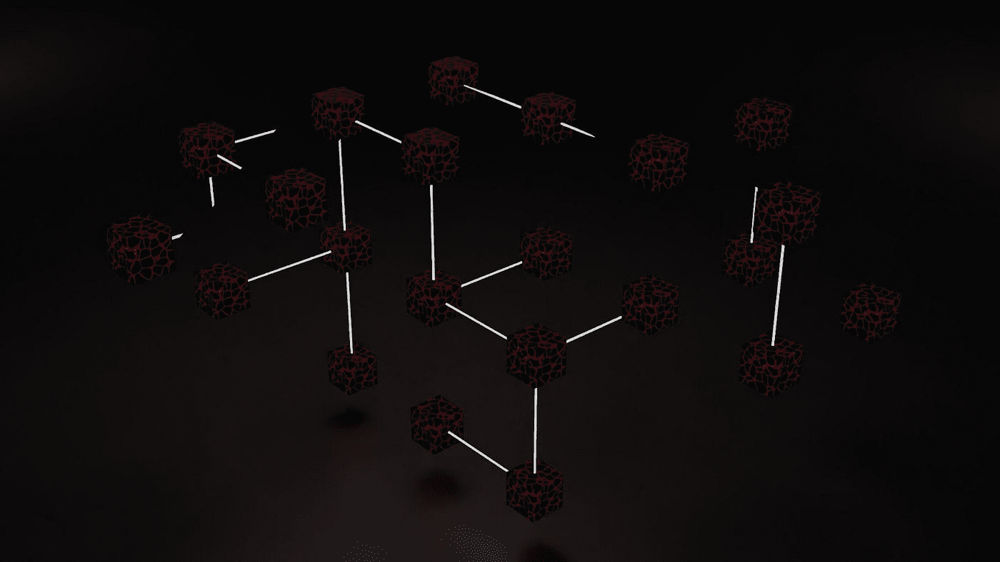
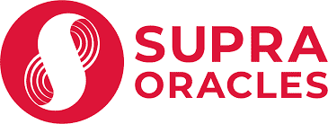
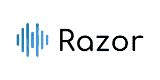
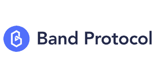
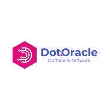

# 2022 年 5 个有前途的去中心化预言

> 原文：<https://medium.com/coinmonks/5-promising-decentralized-oracles-in-2022-d7ae10fa24c2?source=collection_archive---------15----------------------->

[https://unsplash.com/](https://unsplash.com/)

尽管具有不同的优势，但区块链技术的能力有限，因为它无法与现实世界的数据进行交互。赋予区块链权力的智能合同只有在满足特定条件时才会被执行，但它如何获得条件何时完成的信息呢？

神谕被比作分散金融的发电站，因为它们是现实世界和区块链之间的中间人。Oracles 是外部实体，它将来自现实世界的信息提供给智能合约，使它们能够按照约定执行条件。智能合同本身没有与现实世界互动的能力；神谕使这成为可能。

尽管甲骨文提供了巨大的好处，但似乎有一个甲骨文的挑战。区块链的目标是促进权力下放，取消中央权力机构的权力。如果一个甲骨文垄断了向区块链提供信息的机会，那就打败了区块链的本质，因为这个甲骨文可以向区块链提供错误的信息，而智能合约可以根据这些信息采取行动。简单提醒一下，区块链上的交易是不可逆的，错误一旦执行就无法逆转。

区块链甲骨文可以是集中式的，也可以是去中心化的。虽然集中式 Oracle 由一个单独的主体提供支持，并且信息是从一个单独的源获得的，但是分散式 Oracle 则使用多个独立的数据源。这对保持区块链技术的目标是理想的。

当前的 oracles 设计存在漏洞，导致大量利用来自不同 DeFi 协议的令牌。缺乏问责制、透明度、价格延迟和偏差也是大多数 DeFi 协议的问题。

这里有 5 个分散的区块链，为这些严峻的挑战提供解决方案。

## 1.QED

[QED](https://qed.network/) 是一个去中心化的 Oracle 协议，它连接多个区块链、智能合约平台和链外数据源。其硬外部抵押品和经济激励模型优化抵押品回报，以维持一个健康的系统和分散。它通过向历史上准确的参与者倾斜费用分配，自然淘汰了表现不佳的先知。对于 QED，oracle 资本效率与实时数据的准确性直接相关，因此对可靠的 Oracle 产生了生存偏差。核心的 QED 智能合约在 UX 网络上运行，这是一个每秒能够处理超过 2 万笔交易的区块链。

QED Oracle 软件已经作为 DelphiOracle 运行了两年多。它的战斗考验是“黑色星期四”——发生在 2020 年 3 月，尽管市场状况不佳，它仍在满负荷运转。同样重要的是要注意，QED 的设计使得任何 Oracle 软件最终都可以按照用户或 Oracle 的喜好插入到经济模型中。

2.神谕

SupraOracles 专门提供跨链互操作性、3-5 秒终结性和尖端加密技术——所有这些都有数千小时的研发和模拟支持。它的使命是建立最高性能的区块链基础设施，为世界价值交换提供动力。

SupraOracles 引以为豪的是它的分散性，因为节点从多个来源提取数据，并结合了对节点的激励，可扩展性，因为单个节点并行存在于多个分布式密钥生成配置中，以随机网络拓扑组织，超快和安全的性质，因为它的架构允许通过强大的密码原语进行并行处理，快速终结。它更快，提供 3-5 秒的链上刷新率和跨链&互操作性，并兼容许多区块链，如以太坊，索拉纳，多边形等。

SupraOracles 团队已经获得了超过 1，000，000 美元的巨额资助、信贷和奖励。

## 3.剃刀网络

[Razor Network](https://razor.network/) 是一个强大且经济安全的分散式 oracle，专注于使用利益相关者网络为智能合同提供数据。它的核心特性包括完全去中心化、高安全性、可伸缩性、利害关系证明和快速性。Razor 网络由端到端的分散式 oracles 组成，没有集中式瓶颈。

它能抵抗共谋、贿赂和审查攻击。它可以部署在可扩展的网络上，并且是区块链。它由一个有效的利益证明网络保护，并对不当行为进行严厉处罚。它有一个在不影响安全性的情况下获取数据的自动化流程。

## 4.波段协议

[Band Protocol](https://bandprotocol.com/) 是一个跨链数据 oracle 平台，它将真实世界的数据和 API 聚合并连接到智能合约。

其灵活的 oracle 设计允许开发人员使用任何数据。它还允许他们使用 WebAssembly 创建定制的 oracles，在几分钟内将智能合同与传统的 web APIs 连接起来。

它由 BandChain 组成，旨在兼容所有智能合约平台和区块链开发框架。BandChain 可以从外部来源提取数据，将其聚合并打包成一种易于使用的加密验证格式，跨越多个区块链。

## 5.点甲骨文

[Dot Oracle](https://dotoracle.network/) 是一个去中心化的 Oracle 和跨链流动性网络，旨在提供实时数据，以模糊 Polkadot 生态系统和非 Dot 世界之间的边界。

除了数据供应，DotOracle 还旨在创建一个流动性网络层，在 Polkadot 和其他智能合约平台(尤其是以太坊)之间来回转移数字资产。

DotOracle 是第一个分散、非托管的流动性桥接网络，旨在以快速、分散、安全的方式在 MoonBeam Polkadot 和以太坊之间来回转移数字资产。

它的核心特性包括非托管的分散式网桥、带有 slashing 的绑定网络、实时离点数据提供者、拜占庭容错共识、高可用性网络和完全分散化。

使用 DotOracle，用户可以在将资产从/Dot 转移到/转移出其他区块链网络的过程中完全控制自己的资产。为了建立绑定网络，所有的点 Oracle 节点都必须向点 Oracle 智能合约存放一定数量的 DTO 令牌。在违反协议的情况下，该节点存放的令牌被烧毁。为了允许推送数据快速到达 MoonBeam，DotOracle 结合了 PBFT 和椭圆曲线(EC)多重签名方案。只要有 2/3 的网络节点在线，DotOracle 就可以提供服务。

> 加入 Coinmonks [电报频道](https://t.me/coincodecap)和 [Youtube 频道](https://www.youtube.com/c/coinmonks/videos)了解加密交易和投资

# 另外，阅读

*   [如何购买 Monero](https://coincodecap.com/buy-monero) | [IDEX 评论](https://coincodecap.com/idex-review) | [BitKan 交易机器人](https://coincodecap.com/bitkan-trading-bot)
*   [CoinDCX 评论](/coinmonks/coindcx-review-8444db3621a2) | [加密保证金交易交易所](https://coincodecap.com/crypto-margin-trading-exchanges)
*   [红狗赌场评论](https://coincodecap.com/red-dog-casino-review) | [Swyftx 评论](https://coincodecap.com/swyftx-review) | [CoinGate 评论](https://coincodecap.com/coingate-review)
*   [Bookmap 点评](https://coincodecap.com/bookmap-review-2021-best-trading-software) | [美国 5 大最佳加密交易所](https://coincodecap.com/crypto-exchange-usa)
*   [如何在 FTX 交易所交易期货](https://coincodecap.com/ftx-futures-trading) | [OKEx vs 币安](https://coincodecap.com/okex-vs-binance)