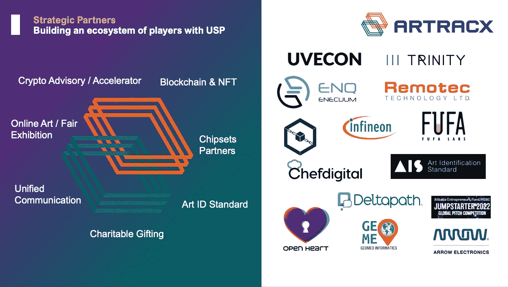
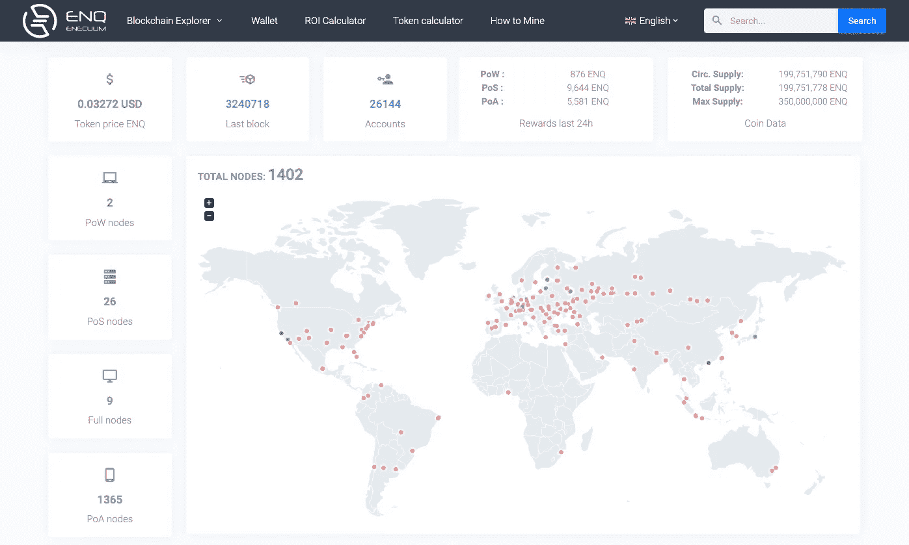

# ARTRACX 与 Enecuum (ENQ)区块链网络合作追踪艺术品和收藏品市场来源的 5 个原因

> 原文：<https://medium.com/coinmonks/5-reasons-why-artracx-partner-with-enecuum-enq-blockchain-network-for-tracking-provenance-in-art-38dd242e34f0?source=collection_archive---------23----------------------->

2022 年 3 月 24 日(首次发表于 [Articulate_HK](/@articulatehk)

丹尼尔·陈

大家好，我是 ARTRACX 的创始人兼首席执行官，我一直在寻找各种区块链用于我的艺术技术项目。虽然我是一名特许工程师，一名 30 年前的电脑程序员。找出什么对我们最有利并不是一件简单的事情。这需要大量的学习和实验。有许多区块链解决方案，当谈到建立智能合同的分销商分类帐。首先，有太多的区块链可供选择——包括最初的比特币、以太坊、像 Polygon 这样的第二层链、像 Solana 这样的基于 PoS 的、提供第一层和第二层的 Algorand([链接)](https://www.algorand.com/resources/blog/algorand-smart-contract-architecture)还有 Linux 基金会的 Hyperledger，它们提供不同系列的 DLT 产品。我们在香港的一个本地合作伙伴叫做 [InnoBlock](https://www.innoblocktech.com/) 事实上提供了一个使用 Hyperledger 面料的 TT 连锁店。

ENQ 交易所虽然不像交易量排名前十的区块链交易所那样受欢迎，但它有一些独特的特点让我感兴趣。Enecuum 已经上线，你可以在这里查看资源管理器([链接](https://pulse.enecuum.com/))中的 mainnet 节点。testnet 也可以在这里获得([链接](https://testnet.enecuum.com/))

资料来源:电子网络节点(PoS、PoW、PoA)

Enecuum (ENQ)基于 PoA 算法，结合了 PoW 和 PoS。这种混合提供了高度的网络去中心化，同时显著提高了网络安全级别及其执行速度。每秒钟的事务显然达到了一百万 TPS。

至于我们的艺术项目，我们参与了基于 W3C DID 标准的艺术品识别和自我认证的去中心化——通过添加连接到区块链的高度安全的芯片组。这种艺术作品的自我认证、验证和出处的机制(由艺术家自己或艺术交易商)为这些利益相关者成为我们生态系统的一部分创造了机会。这有助于打破顶级拍卖行和画廊主导的艺术生态系统的上层梯队和金字塔。Enecuum 的 PoA masternodes / wallet 可以支持艺术市场的真正民主化。

ARTRACX 项目可以在这里找到 [https://Artracx.io](https://artracx.io/) ，作为一个新项目——我们必须集成和测试不同的场景。我们的 DevOps 已经使用我们的 ARTRAC.id 创建了智能合同，该合同为艺术家的作品或杰作提供真品证书(CoA)。通过坚持新的 DID 标准，从一个名为 artidstandard.org 的联盟，我们可以处理我们的智能合同在 ENQ，这已经在电子测试网测试。有了这样的保证，我们得出结论，以下 5 个原因将是我们选择这个 PoA 共识链作为我们在区块链的合作伙伴的原因。

> 交易新手？试试[密码交易机器人](/coinmonks/crypto-trading-bot-c2ffce8acb2a)或者[复制交易](/coinmonks/top-10-crypto-copy-trading-platforms-for-beginners-d0c37c7d698c)

**原因#1-环境友好**-混合共识提供了规模和可持续性，因为 PoA 在全球范围内使用非常少的计算能力运行，因此效率和功耗都很低。

**原因#2 —低交易费用** —跟踪和追踪需要在区块上写入关键信息，与以太坊等其他第 1 层连锁店的高油价相比，Enecuum 的交易费用较低

**原因#3 —安全性** —高度分散也意味着网络可以抵御各种类型的攻击；随着 SHARNELL 智能合约在 Enecuum 平台上运行的开发，Enecuum 的安全性得到了进一步增强

**原因 4——使用移动设备** — Eneccum 允许开发各种物联网集线器和网关(可能是 5G 路由器/网状路由器),以成为 PoA 主节点/dapp 的一部分，用于堆叠/验证——这可能会导致全球范围内的艺术家大量采用，这些艺术家作为艺术家获得收入，并成为支持 PoA 的节点的一部分。关于这一点，我们来自印度的技术领导也是一个网状 Wi-Fi 项目的创始人，这个项目可以用 Enecuum 来完成。看看这个([https://geomeoinformatics.com](https://geomeoinformatics.com/))

**原因#5-规模** —我们正在为全球的艺术家和艺术经销商建立一个生态系统，自然我们希望我们的 dApps 能够轻松地参与进来，成为 PoA 共识的一个节点——艺术家可以运营一个 ENQ 主节点，并获得奖励。

现在你知道了，我们选择 Enecuum 作为我们在区块链的主要合作伙伴，并在当前的全球艺术市场中建立未来，有一些战略考虑

ARTRACX 的愿景是分散当今跟踪、追踪和交易艺术品的权力，让人们买得起。

ARTRACX 是我们 10 年激情项目“OpenHeart.hk”的延伸项目，你可以通过访问我们的网站和 telegram 社区([t.me/artracxcommunity](http://t.me/artracxcommunity))了解更多信息

**关于 ARTRACX**

ARTRACX 是一个新的平台市场，将使用高度安全的芯片组和 Enecuum 区块链网络来部署艺术品和收藏品来源的跟踪和追踪功能。

ARTRACX 社交链接和网站
[电报](https://t.me/artracxcommunity) [推特](https://twitter.com/artracx) [Linkedin](https://www.linkedin.com/company/artracx/) [媒体](https://artracx.medium.com/) [Artracx.io](https://artracx.io/)

**关于电子货币**

白皮书[https://enecuum.com/pdf/pp_en.pdf](https://enecuum.com/pdf/pp_en.pdf)

商品名称: 商品名称: 商品名称: 商品名称: 商品名称: 商品名称: 商品名称: 商品名称: 商品名称: 商品名称: 商品名称: 商品名称: 商品名称: 商品名称: 商品名称: 商品名称: 商品名称: 商品名称: 商品名称: 商品名称: 商品名称: 商品名称: 商品名称: 商品名称: 商品名称: 商品名称: 商品名称: 商品名称: 商品名称: 商品名称: 商品名称: 商品名称: 商品名称: 商品名称: 商品名称: 商品名称: 商品名称: 商品名称: 商品名称: 商品名称:在?ref=bookmarks[*【HTTPS://t.me/Enecuum_EN*](https://t.me/Enecuum_EN)[*topic=2939909.0;topicseen*](https://bitcointalk.org/index.php?topic=2939909.0;topicseen)[*WEB WEB WEB WEB WEB WEB WEB WEB WEB WEB WEB WEB WEB WEB WEB WEB WEB WEB WEB WEB WEB WEB WEB WEB WEB WEB WEB*](https://www.linkedin.com/company/enecuum-limited/)