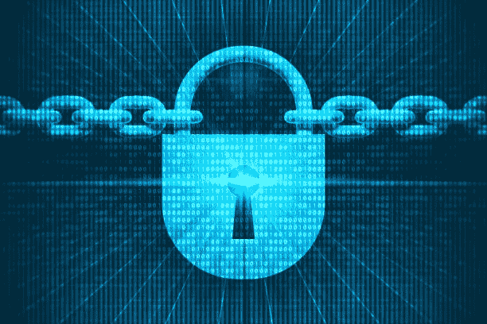

# 加密货币如此受欢迎的 5 个原因

> 原文：<https://medium.com/coinmonks/5-reasons-why-cryptocurrency-is-so-popular-b5ba50a11804?source=collection_archive---------43----------------------->

**Cryptocurrency**

[***过去几年，加密货币***](https://bit.ly/3xKlx7k) 在全球范围内都是一个大问题。大多数人都听说过加密货币，尤其是比特币。事实上，比特币在加密货币排名中名列前茅。

如果你不确定为什么加密货币会在全世界流行起来，那么你来了一个完美的地方。在本帖中，我们将探讨这种新的**现金**如此受欢迎的五个原因。继续阅读以了解更多信息。

## 1.低交易费用

**Low Transaction Fee**

近年来加密货币价值上升的主要原因之一是因为交易费用低。不管你使用传统的支付方式，你都必须支付一大笔交易费用。

另一方面，如果你使用加密货币进行支付，你只需支付少量交易费用。因此，使用这种新型现金在线支付你选择的商品和服务是有意义的。

## 2.没有政府监管

**No Government Regulation**

许多人相信加密货币的另一个原因是它们不受任何权威机构的管理。因此，无论哪个国家的政府掌权，货币的价值都会保持稳定。

此外，一些个人希望通过投资加密货币来保护他们的钱。换句话说，加密货币比传统货币安全得多，这使得它们现在很有吸引力。

## 3.巨大的利润潜力

**Great Potential For Profit**

加密货币是一个很好的选择的另一个奇妙的原因是它们有很大的盈利潜力。如果你在价格低的时候购买比特币，当比特币的价值再次上升时，你可能会赚很多钱。

在过去的几年里，投资者赚了很多钱。因此，如果你正在考虑投资一种加密货币，可能性是存在的。

## 4.更易于使用

**Easier To Use**

随着时间的推移，利用加密货币变得越来越容易。原因是越来越多的互联网企业开始接受这种现金支付。在不久的将来，几乎每个企业都将接受流行的加密货币作为支付方式。

随着世界各地越来越多的人开始使用比特币，获取比特币并进行在线支付将变得更加容易。

## 5.整体安全性

**Cryptocurrency Security**

你的钱和身份极其宝贵。今天，你可能面临的最紧迫的问题之一是网络安全。因此，使用加密货币进行在线支付远比使用传统支付方式安全。

因此，如果你担心**进行在线支付**，我们建议你尝试加密货币。换句话说，个人出于各种原因使用加密货币。

## 定论

总之，比特币在全球如此受欢迎，有五个**原因**。你现在要做的就是**选择一种**领先的加密货币。将你的血汗钱投资于一种没有增长潜力的货币是一个糟糕的决定。

有兴趣用**加密货币**赚钱吗？如果有，你应该看一看[***CRYPTO QUANTUM LEAP 课程***](https://rebrand.ly/crypto-earning) ，里面提供了所有有价值的、趋势性的知识。

## [**快点！**](https://bit.ly/3xKlx7k) 限时特价

> 加入 Coinmonks [电报频道](https://t.me/coincodecap)和 [Youtube 频道](https://www.youtube.com/c/coinmonks/videos)了解加密交易和投资

# 另外，阅读

*   [3 商业评论](/coinmonks/3commas-review-an-excellent-crypto-trading-bot-2020-1313a58bec92) | [Pionex 评论](https://coincodecap.com/pionex-review-exchange-with-crypto-trading-bot) | [Coinrule 评论](/coinmonks/coinrule-review-2021-a-beginner-friendly-crypto-trading-bot-daf0504848ba)
*   [莱杰 vs n rave](/coinmonks/ledger-vs-ngrave-zero-7e40f0c1d694)|[莱杰 nano s vs x](/coinmonks/ledger-nano-s-vs-x-battery-hardware-price-storage-59a6663fe3b0) | [币安评论](/coinmonks/binance-review-ee10d3bf3b6e)
*   [Bybit Exchange 评论](/coinmonks/bybit-exchange-review-dbd570019b71) | [Bityard 评论](https://coincodecap.com/bityard-reivew) | [Jet-Bot 评论](https://coincodecap.com/jet-bot-review)
*   [3 commas vs Cryptohopper](/coinmonks/3commas-vs-pionex-vs-cryptohopper-best-crypto-bot-6a98d2baa203)|[赚取加密利息](/coinmonks/earn-crypto-interest-b10b810fdda3)
*   最好的比特币[硬件钱包](/coinmonks/hardware-wallets-dfa1211730c6) | [BitBox02 回顾](/coinmonks/bitbox02-review-your-swiss-bitcoin-hardware-wallet-c36c88fff29)