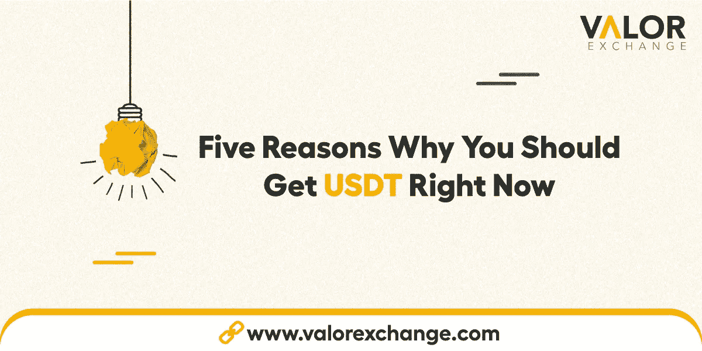

# 你应该马上去 USDT 的 5 个理由。

> 原文：<https://medium.com/coinmonks/5-reasons-why-you-should-get-usdt-right-now-d4971f28cbad?source=collection_archive---------61----------------------->

5 Reasons Why You Should Get USDT Right Now by ValorExchange.

加密行业有不同种类的货币。还有 alt 币，meme 币等。，但在本文中，我们将专注于一个稳定的硬币，即系绳(USDT)。稳定硬币是一种加密货币，旨在无论市场波动如何都保持标准价格。

USDT 是业内第三大加密货币 Tether 的象征。可以看看我们之前关于[稳币](https://valorexchange.com/blog/post?slug=what-is-a-stable-coin-a-beginners-guide)或者[系绳(USDT)](https://valorexchange.com/blog/post?slug=what-is-tether-and-how-does-it-work) 的文章。在那些文章中，我们更多地讨论了稳定硬币的历史、意义和用途。

这篇文章将集中在为什么你应该马上买 USDT 的五个理由上。我们将给出可行的建议，告诉你如何让你的硬币发挥最大价值。

# 你猜怎么着！

我们在这篇文章的某个地方添加了一个秘密的[链接](https://t.me/valorexchangecommunity)，它将带你进入我们的在线社区。在我们的社区中，您可以获得最好的安全提示、特别奖金和具体的可操作步骤，以对冲 covid 后的通货膨胀。找到链接并加入社区。

# 它稳定可靠。

稳定硬币的理念是，无论加密市场如何波动，价格都会保持稳定。这枚硬币的设计方式是，你看到的每一枚系绳硬币都有一张美钞锁在某个地方以保持其价值。这确保了你昨天看到的系绳价格与你明天看到的价格相同。你现在可以在 [ValorExchange 上购买并保留泰瑟 USDT。](https://account.valorexchange.com/)

# 您的交易没有转账限制。

通常，在尼日利亚的传统银行，你不能在一天内取出特定数量的钱。然而，你可以去银行申请一个更大的转账差额。您必须遵循提交表格和凭证的流程来完成此操作。

这意味着你将不得不排队等待客服人员来接待你，并祈祷你有所有必要的文件来处理这个案件，否则，你将不得不再次经历这一切。

然而，在 [ValorExchange](https://t.me/valorexchangecommunity) 上，一旦你在平台上创建了一个账户，你就可以将你的法定货币兑换成尽可能多的 USDT。您可以任意多次转账 [USDT](https://valorexchange.com/blog/post?slug=what-is-tether-and-how-does-it-work) ，如果两个账户都在 [ValorExchange 平台上，](https://account.valorexchange.com/)每次转账都是免费的。

# 流动性不是问题

目前世界上最重要的货币是科威特第纳尔、BHD 和 OMR。如果你注意到你国家的货币不在列表上，那也没什么。然而，全球最大的加密货币是 BTC、瑞士联邦理工学院和 USDT。当你使用世界上交易量最大的三种货币之一时，流动性不是问题。

你可以在 [ValorExchange 上买卖比特币、以太或 USDT。](https://account.valorexchange.com/)上平台，创建账号，入门。

# 它是无国界的

你可以在纽约、多伦多或伦敦，这都没关系。只要您在我们这里有一个有效的加密账户，您所需要考虑的就是您想兑换多少以及您想什么时候兑换。就这么简单。

# 没有假货

所有的加密货币都存在于区块链上，它是加密网络中所有交易的分类账。因此，每一枚现存的系绳硬币在区块链都有记录。

在 [ValorExchange](https://account.valorexchange.com/) 上，我们尽力确保在我们平台上进行的每一笔交易都是防欺诈的。

# 结论

稳定的硬币是伟大的，但没有一个胜过系绳。你可以在 ValorExchange 上快速安全地买卖或交换 USDT。[试试看。](https://account.valorexchange.com/)