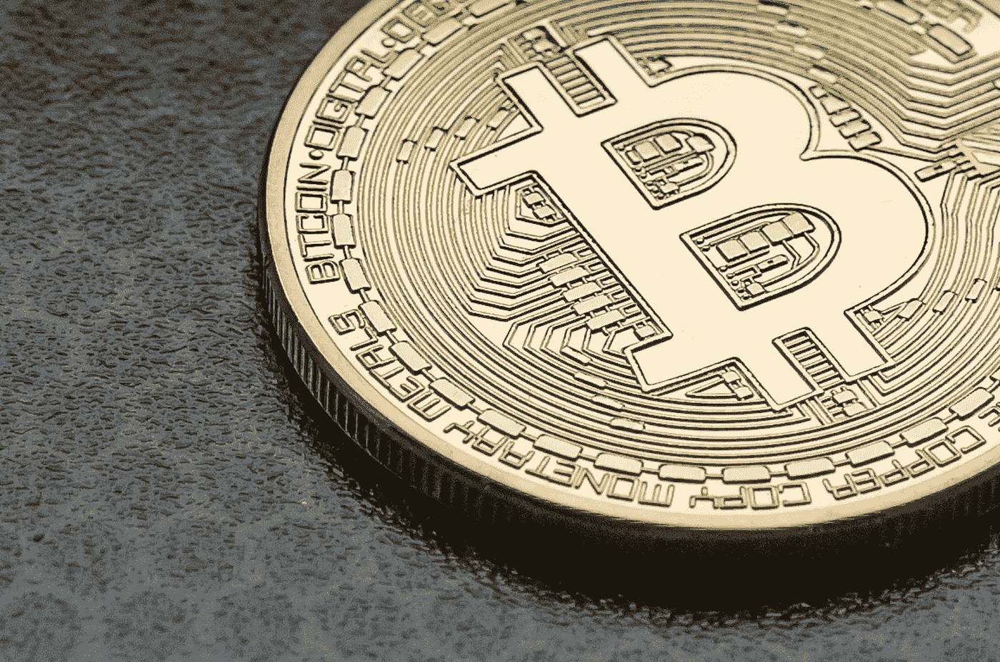

# 5 项重要的加密费用&它们是如何花费你的

> 原文：<https://medium.com/coinmonks/5-significant-crypto-fees-how-they-cost-you-ff177de58aac?source=collection_archive---------6----------------------->

There is a cost associated with [trading cryptocurrency](https://asedeyhotnaija.com/best-cryptocurrency-to-invest-in-2022/). Image by [Eivind Pedersen](https://pixabay.com/users/eivindpedersen-5084872/?utm_source=link-attribution&utm_medium=referral&utm_campaign=image&utm_content=3341347) from [Pixabay](https://pixabay.com/?utm_source=link-attribution&utm_medium=referral&utm_campaign=image&utm_content=3341347)

交易加密货币需要成本。

然而，了解这些成本将确保你下次交易你的密码时不会损失比你预期的更多的钱。

如果你拥有加密货币，你无疑会利用交易所或类似的[。](https://asedeyhotnaija.com/why-should-i-invest-in-bitcoin/)

个人可以在这种平台上购买、交易和下注，这种平台非常受欢迎，也非常有益。

值得注意的是，大多数加密平台不是免费使用的，他们收取各种费用。

换句话说， ***与加密货币相关的最普遍的收费是什么？***

> 另请参见:[2022–2023 年最令人兴奋的 5 个加密货币项目](https://www.sammaiyaki.com/5-most-exciting-cryptocurrency-projects-for-2022-2023-d50700317db4?source=user_profile---------1-------------------------------)

# 1.加密费 1 号:汽油费

大多数人都将燃气费与以太坊联系在一起，尽管这种区块链被各种加密货币和服务广泛使用，所以如果你使用它，你可能会遇到它们。

对于处理和验证以太坊区块链交易所需的计算机功率，用户必须支付 ***【燃气费】*** (或交易处理费用)。

本质上，它补偿了保持区块链运转所需的能量。

由于运行以太坊大小的区块链需要巨大的计算能力，用户可以预期支付这些费用的一小部分。

在几种情况下，你可能会被收取油费。

如果您希望利用基于以太坊的交易或贷款平台(如 Uniswap 或 Aave)来代表您执行交易，您可能会被收取汽油费。

但是煤气费用并不是以太坊区块链的专利。

不过，相比以太坊的燃气费，其他像 Solana 和 Avalanche 这样的网络费用要便宜得多。

许多人被以太坊高昂的天然气价格吓跑了，这是区块链的一个主要问题(仅一次交易就可能高达数百美元)。

> 另请参见:[评估加密项目的 7 种可靠方法？](https://www.sammaiyaki.com/7-solid-ways-to-evaluate-a-crypto-project-acd7775b4291?source=user_profile---------2-------------------------------)

# 2.加密费 2 号:取款和存款费用

从交易所、贷款网站或任何其他类型的平台提取加密货币是可能的。

你可能认为消除你的现金总是免费的，但这并不总是正确的。

从 [CEX.io.](https://cex.io/r/0/up144881932/0/) 等交易所提取加密货币可能会收取费用

这一费用的数额根据你提取的加密货币的种类而有很大的不同。

值得一提的是，在收取提现费用的平台上，某些货币(通常不太受欢迎和有价值)可能会免费提现。

在转移你的钱之前，检查一下你要提取的货币是否收费。

像 [Bitxmi](https://www.bitxmi.com/en_US/register?inviteCode=QWVGHWLA) 和[比特币基地](https://www.coinbase.com/join/jacob_38g)这样的交易所都不收取款费，不管转账的货币是什么，如果你想完全避免的话。

另一方面，押金费用并不像我们所考察的其他费用那样普遍，但它们仍然存在。

例如，一些平台向你的账户中存入加密硬币收取费用，但费用本身会根据你存入的种类而有所不同。

> 另外，请看:[卡尔达诺占上风的 3 个原因](https://www.sammaiyaki.com/3-reasons-cardano-has-an-upper-hand-4f44cf0d02e?source=user_profile---------5-------------------------------)

# 3.加密费 3 号:赌注费

在过去的几年里，赌注已经成为各种交易平台上一个非常流行的功能。

简而言之，赌注就是把你的一部分钱作为抵押品放在股权证明或委托股权证明过程中，这反过来让你产生被动收入。另一方面，赌注并不总是免费的。

赌注费用通常从您的赌注赢款中扣除，而不是作为用户的额外费用。

根据被下注的代币，这些费用在平台上可能相同或不同。

然而，某些平台，如[币安](https://accounts.binance.me/en/register?ref=45361926)，不收取任何赌注费用。

> 另外，请看:[看看 Opera 的新加密浏览器](/technical-excellence/take-a-look-at-operas-new-crypto-browser-4507e7659326?source=user_profile---------8-------------------------------)

# 4.加密费 4 号:传播费

如果没有采用做市商收取费用的结构，交易所通常会收取差价费用。

通过从用户为获得或出售代币而支付或被支付的金额中减去代币(如 BTC 或 ETH)的成本来计算价差费用。

就平均利差而言，它们的范围从 0.5%到 1%。

然而，一些密码交易所对进行交易和传播交易收取费用。

即使这不是典型的，如果你不知道你选择的交易所收费是多少，你可能最终会付出巨大的代价。

比特币基地是这方面的典型代表。

虽然有些交易所只收取做市商/接受者费用或差价费用，但如果你选择避开同时收取这三种费用的平台，你会有很多选择。

> 另请参见:[在当前熊市中最大化的 5 种加密货币](/coinmonks/5-cryptocurrencies-to-maximise-in-the-current-bear-market-835fb7bce78c?source=user_profile---------9-------------------------------)

# 5.加密费第 5 号:制造者和接受者费用

在包括交易所在内的几个最大的加密平台上，收取佣金是很常见的。

## a.制作者(加密)费

创客费，顾名思义，是一种强加在平台创客身上的平台交易成本。

在大多数情况下，制造商在订单簿中下订单，由另一方在以后完成。

简单来说，他们创造了一个交易环境，其他交易者可能从中受益。

由于该平台依赖于生产者的流动性，他们是理想的用户。

一项资产兑换成美元或英镑等传统货币的能力被称为其**T5“流动性”**

对于一个交易所来说，这是盈利的关键。做市商费用往往低于接受者费用，而一些交易所对两者保持相同的费率。

## b.接受者(加密)费用

举个例子，币安和比特币基地的制造者和接受者的成本是一样的，然而，Bitxmi 收取更高的接受者费用(尽管两者之间的差异通常不是那么大)。

如果一个交易平台有很多买家和卖家，买家就不是一件好事。

当订单簿中的订单被接受者接受时，流动性被消耗或消除。

当订单簿中的一个订单立即与另一个用户下的另一个订单匹配时，就会出现这种情况。

交换系统奖励创造者而不是接受者。

平台更有可能向消除流动性的交易者收取更高的费用。

> 另外，请看:[熊市的 5 种拯救迷因币](https://wire.insiderfinance.io/5-rescue-meme-coins-for-the-bear-markets-8ab154cd91a?source=user_profile---------7-------------------------------)

# 最后，我要说:

在进行任何类型的交易之前，熟悉与您选择的平台相关的各种成本通常是一个好主意。

以这种方式进行你的研究可能会节省你的钱，并为各种不同的平台打开大门，这些平台收费要低得多，或者根本不收费！

> 加入 Coinmonks [电报频道](https://t.me/coincodecap)和 [Youtube 频道](https://www.youtube.com/c/coinmonks/videos)了解加密交易和投资

# 另外，阅读

*   [最佳比特币保证金交易](/coinmonks/bitcoin-margin-trading-exchange-bcbfcbf7b8e3) | [萝莉点评](/coinmonks/lolli-review-e6ddc7895ad8) | [比特币保证金交易](https://coincodecap.com/bityard-margin-trading)
*   [创造并出售你的第一个 NFT](https://coincodecap.com/create-nft) | [密码交易机器人](https://coincodecap.com/best-crypto-trading-bots)
*   [如何在 CoinDCX 上购买柴犬(SHIB)币？](https://coincodecap.com/buy-shiba-coindcx)
*   [CBET 评论](https://coincodecap.com/cbet-casino-review) | [库科恩 vs 比特币基地](https://coincodecap.com/kucoin-vs-coinbase)
*   [折叠 App 回顾](https://coincodecap.com/fold-app-review) | [LocalBitcoins 回顾](/coinmonks/localbitcoins-review-6cc001c6ed56) | [Bybit vs 币安](https://coincodecap.com/bybit-binance-moonxbt)
*   [加密保证金交易交易所](/coinmonks/crypto-margin-trading-exchanges-428b1f7ad108) | [赚取比特币](/coinmonks/earn-bitcoin-6e8bd3c592d9) | [Mudrex 投资](https://coincodecap.com/mudrex-invest-review-the-best-way-to-invest-in-crypto)
*   [WazirX vs coin dcx vs bit bns](/coinmonks/wazirx-vs-coindcx-vs-bitbns-149f4f19a2f1)|[block fi vs coin loan vs Nexo](/coinmonks/blockfi-vs-coinloan-vs-nexo-cb624635230d)
*   [比斯勒评论](https://coincodecap.com/bitsler-review)|[WazirX vs coin switch vs coin dcx](https://coincodecap.com/wazirx-vs-coinswitch-vs-coindcx)
*   [7 大副本交易平台](https://coincodecap.com/copy-trading-platforms) | [买币点评](https://coincodecap.com/buycoins-review)